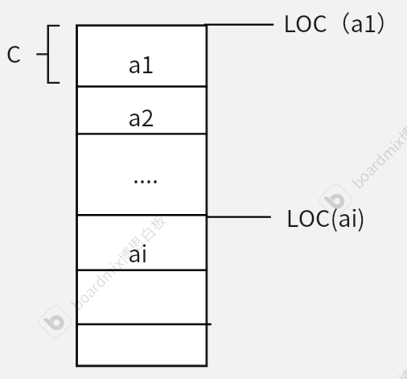
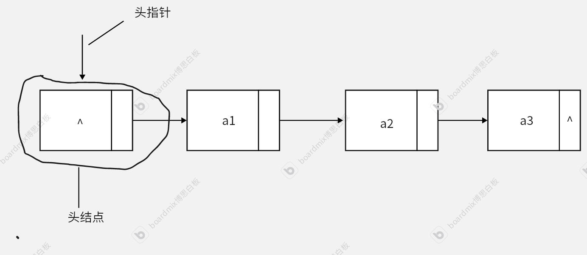
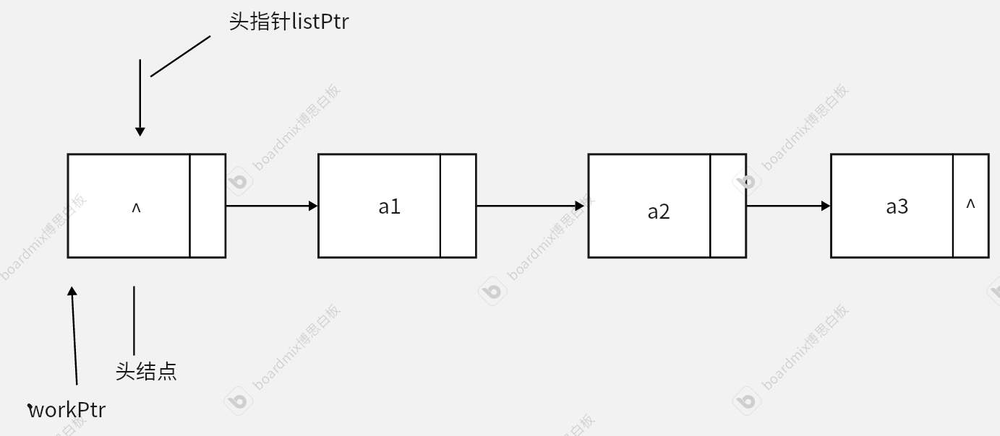
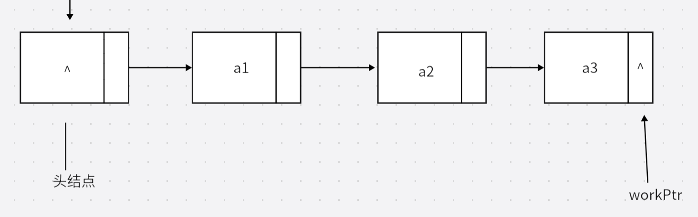
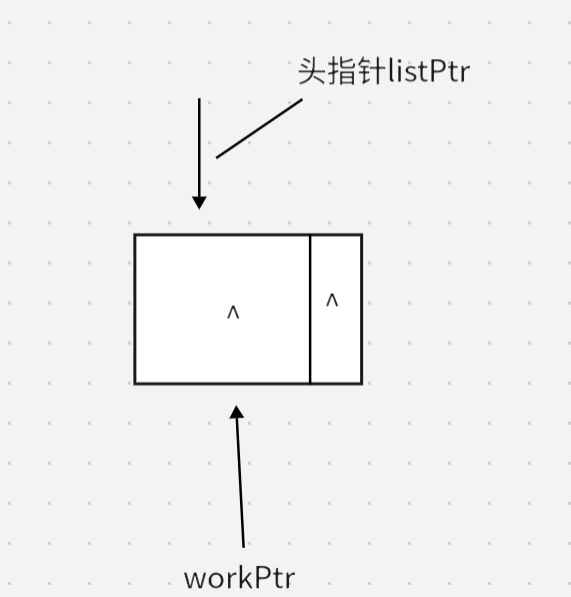
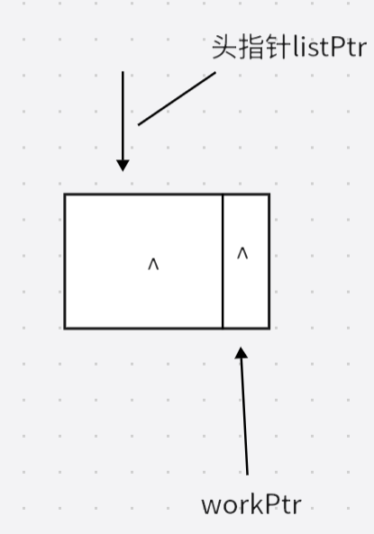
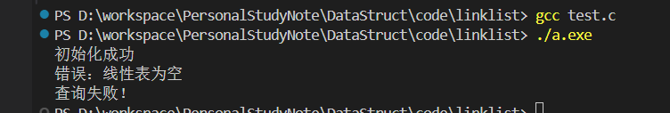
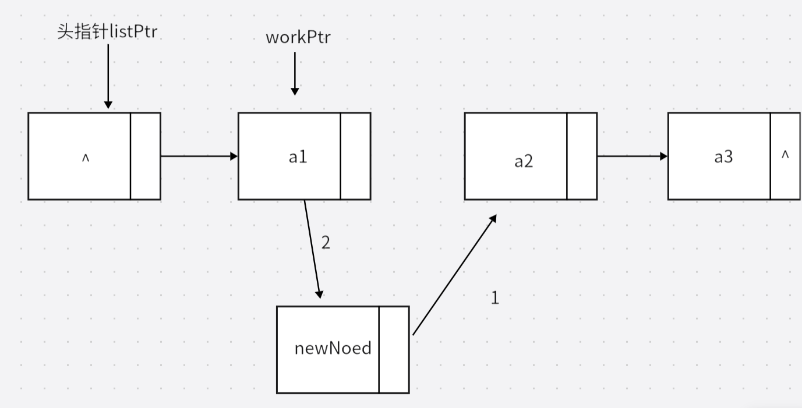
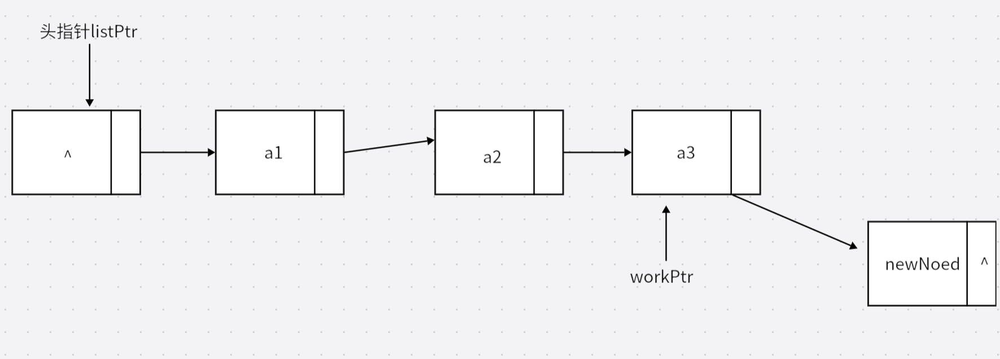
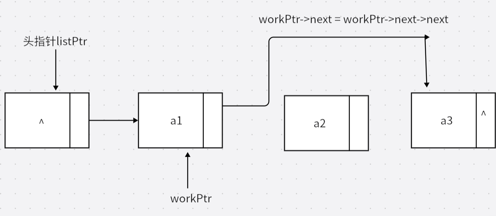

# 数据结构与算法

## 第一章 数据结构绪论

### 1.1 数据结构起源

数据结构是一门研究非数值计算的程序设计问题中的操作对象，以及它们之间的关系和操作等相关问题的学科

1968年，高德纳编写《计算机程序设计艺术》标志数据结构这门学科的正式诞生

程序设计 = 数据结构+算法

### 1.2基本概念和数据

#### 1.2.1数据

数据：描述客观事物的符号，是计算机中能操作的对象，是能被计算机识别并输入给计算机进行处理的符号集合。

数据—-就是符号，并且：

- 可以输入到计算机
- 可以被计算机程序处理
- 数据可以大的分为：
	- 数值型：整型、实型等，计算机可以对这些数据进行数值计算
	- 非数值型：典型的字符型数据（常见的图像、视频等可以转换成字符型数据），计算机需要对这些数据进行非数值处理。

#### 1.2.2 数据元素

数据元素：组成数据的，有一定意义的基本单位，在计算机中通常作为整体处理，也被称为记录（联想数据库表中的一行）

#### 1.2.3 数据项

一个数据元素可以由若干数据项组成，比如，将人作为数据元素考虑，可以包含：

- 眼睛
- 手
- 耳朵
- 。。。

也可以包含：

- 姓名
- 职业
- 身份证号
- 。。。。

具体要有哪些数据项，应该由你的系统来决定。

数据项是不可分割的最小单位。

#### 1.2.4 数据对象

数据对象：是性质相同的数据元素的集合，是数据的子集。

性质相同：指数据元素具有相同数量和类型的数据项。（小明：学号，性别，年龄

​												小红：学号，性别，年龄					）

​												小明小红等的组合，构成了学生这一数据对象

数据对象是数据的子集，有时可以把数据对象简称为数据											

#### 1.2.5 数据结构

结构—-即是关系

不同的数据元素之间不是独立存在的，而是存在一定的关系，这种关系称为结构。

数据结构：相互之间存在一种或多种特定关系的数据元素的集合

### 1.3 逻辑结构与物理结构

逻辑结构：数据对象中数据元素之间的相互关系，包括：

1. 集合结构：
	- 集合结构中的元素除了属于同一集合外，没有其他关系。
	- 集合中每个元素都是平等的。
2. 线性结构：
	- 元素之间的关系是一对一的
3. 树形结构：
	- 元素之间存在1对多的层次关系
4. 图形结构:
	- 元素之间是多对多的关系

物理结构：

- 也成为存储机构，指数据的逻辑结构在计算机中的存储形式
- 数据结构的存储结构主要是在内存上实现的，外村上一般使用文件结构来存储数据

1. 顺序存储结构：
	- 把数据元素存放在==地址连续的存储单元==，其存储的数据元素之间的逻辑结构和物理位置保持一致
	- 典型的顺寻存储结构：数组，计算机在内存中开辟固定大小且连续的内存单元来存储数组
2. 链式存储结构：
	- 把数据元素存储在==任意的存储单元==。数据元素的存储关系不能反应其逻辑关系。
	- 依靠指针存放有逻辑关系的数据元素的地址

逻辑结构是面向问题的，存储结构是面向计算机的。物理结构的主要目的就是将数据和数据的逻辑结构正确的存储到计算机内存中。

### 1.4数据类型

数据类型：

- 一组性质相同的==值==的集合以及定义在此集合上的一些==操作==的总称。

- 数据类型按照值的不同进行划分。

- 数据类型说明了变量（或表达式）的取值范围以及能进行的操作。

- 例如：c语言中声明变量：

~~~c
int a,b;
~~~

- 说明了：给a和b赋值时不能超出int型的取值范围，a和b之间只能进行int类型允许的运算。

不同的计算机有不同的硬件系统，这些硬件系统对数据类型的具体实现可能存在差别。

但在设计计算机程序，研究数据结构时，这些具体实现并不重要，而应该专注于数据的逻辑上的含义。

抽象—取出事物具有的普遍性的本质

抽象数据类型 ——ADT：

- 一个数学模型和定义在该模型上的一组操作。

- 抽象数据类型的定义仅取决于它的一组逻辑特性，与计算机内部的表示和实现无关

- 抽象数据类型体现了程序设计中问题分解、抽象、和信息隐藏的特性。

- ADT标准格式：

- ~~~
	ADT 抽象数据类型名
	Data
		数据元素之间的逻辑关系的定义
	Operation
		操作1
			初始条件
			操作结果描述
		操作2
		    .。。。
		操作n
		    。。。。
	endADT
	~~~

## 第二章 算法

算法与数据结构是不可分割的，单纯研究数据结构不去考虑算法，没有意义。

### 2.1 算法定义

算法：解决特定问题的求解步骤的描述，在计算机中变现为指令的有限序列，每个指令表示一个或多个操作。

### 2.2算法的特性

算法有5个基本特性：输入、输出、有穷性、确定性和可执行性

- 输入输出
	- 算法可以有零个多个输入
	- 但算法至少有1个或多个输出
- 有穷性：
	- 算法会在执行有限的步骤后自动结束不陷入无限循环
	- 在实际设计算法时，不止是数学上的有穷性，更应该是可接受、合理的边界
- 确定性：
	- 算法的每一步骤都有确定的含义，不会有二义性。
- 可执行性：
	- 算法的每一步都必须是可执行的，也就是每一步都能通过有限的执行次数完成

### 2.3 算法设计的要求

一个好的算法，应该满足：正确性、可读性、健壮性、时间效率高和存储量低

- 正确性：算法的正确性分为几个层级：
	1. 算法程序没有语法错误
	2. 算法程序对于合法输入数据，能够产生满足需求的输出结果
	3. 对于非法的输入数据，能够得到满足规格说明的结果
	4. 对于各种测试数据都能有满足要求的结果
- 可读性：算法的设计应该便于阅读、理解和交流
- 健壮性：好的算法能够对不合法数据输入有合理的处理
- 时间效率高和存储量需求低：
	- 时间效率高指的是算法的执行时间
	- 存储量需求指的是算法在执行过程中需要的最大存储空间

### 2.4 算法的度量方法

一般来讲算法提高效率都是提高时间效率

#### 2.4.1 事后统计方法

所谓事后统计方法指的是：通过设计好的测试程序和数据，对不同算法编制的程序的运行时间进行比较，从而确定算法效率的高低。

这种方法有很大的缺陷:

- 必须依赖事先编写好程序，如果要测试的算法本身就很糟糕，这种行为就没有意义
- 时间的比较依赖计算机硬件和软件等因素影响，并不可靠
- 完全可行、中立的测试数据设计比较困难

因此，评价算法效率时不适用这种方法

#### 2.4.2 事前分析估算方法

定义：在计算机程序编写前，依据统计方法对算法进行评估。

一个高级程序语言编写的程序在计算机上运行所消耗的时间取决于以下因素：

- 算法采用的策略
- 编译产生的代码质量
- 问题的输入规模
- 机器执行指令的速度

忽略掉与计算机软件、硬件相关的因素，一个程序运行时间的长短，从本质上来说，依赖于算法的好坏和问题的输入规模（输入量的多少）。

例：两种求和算法：

~~~c
int i = 0,sum = 0, n = 100;        /*执行1次*/
for(i=1;i<=100;i++)                /*执行n+1次*/ 
{
    sum+=i;                         /*执行n次*/
}
print("%d",sum);                   /*执行1次*/
~~~

这个程序执行总次数T： T=1+n+1+n+1=2n+3次

第二种：

~~~c  
int i = 0, sum = 0, n = 100;      /*执行1次*/
sum = (n+1)*n/2;                  /*执行1次*/
print("%d",sum);                   /*执行1次*/
~~~

这个程序总执行次数T=1+1+1=3次

可见，测定运行时间最可靠的方法就是计==算对运行时间有消耗的基本操作的执行次数==。

因此，在分析程序的运行时间时，最重要的就是把程序看作独立于程序设计语言的一系列步骤

### 2.5 函数的渐近增长

定义：给定两个函数 f(n),g(n)，若存在一个正整数N，当n>N时，总有f(n)>g(n)，则称f(n)的增长渐近快于g(n)

例如：假设两个算法的输入规模都是n,算法A要做2n+3次操作，算法B要做3n+1次操作。

| 次数  | 算法A 2n+3 | 算法A* 2n | 算法B 3n+1 | 算法B* 3n |
| ----- | ---------- | --------- | ---------- | --------- |
| n=1   | 5          | 2         | 4          | 3         |
| n=2   | 7          | 4         | 7          | 6         |
| n=3   | 9          | 6         | 10         | 9         |
| n=10  | 23         | 20        | 31         | 30        |
| n=100 | 203        | 200       | 301        | 300       |

-  当n>3时，算法A的次数总是小于算法B的，因此算法B的渐进增长快于算法A
- 随着n的值越来越大，算法A与A*、B与B\*之间的由常数项造成的差距相对来说影响越来越小，可以说，我们最终可以忽略这些加法常数。

实际上，不止是常数项，随着规模的进一步扩大，最高次项的系数的影响也越来小。

可以认为，最高次的指数越大，函数随着n的增长也会越来越快

==判断一个算法的效率时，函数中的常数项和其他次数项都可以忽略，只需要关注最高阶项的阶数。==

### 2.9 时间复杂度

定义：在算法分析中，语句的总执行次数T(n)是关于问题规模n的函数，算法的时间复杂度，就是算法的时间度量，记作：

T（n）=*O(f(n))*

表示：随问题规模n的增大，算法执行时间的增长率和*f(n)*的增长率相同

可以把*f(n)*理解成：关键语句执行次数，而*O(n)*是这个函数的增长率的一种表示方法。

推导大O阶*O(n)*:

1. 将*f(n)*中的所有常数项替换为1
2. 只保留最高阶项
3. 将最高阶项系数改为1
4. 得到大O阶。

大O阶推导：

1. 常数阶

	~~~c
	int i = 0, sum = 0, n = 100;      /*执行1次*/
	sum = (n+1)*n/2;                  /*执行1次*/
	print("%d",sum);                   /*执行1次*/
	~~~

	执行次数函数：*f(n)* = 3

	按照推导大O阶的方法推导：

	1. 把常数项转成1 \=\==\==\=\=\===>*O（f(n)）*=1

	2. 得到大O阶

		因此，若执行次数函数为常数函数，那么无论具体的常树值为多少，时间复杂度都为*O(1)*

2. 对数阶

	~~~c
	int count = 1;
	while(count<n){
	    count = count *2;
	}
	~~~

	分析这个程序的执行次数函数：

	| 次数 | count     |
	| ---- | --------- |
	| 1    | 2*1=2     |
	| 2    | 2*2=4     |
	| 3    | 2\*2\*2=8 |
	| …    | …         |
	| i    | 2^i^      |

	假设当n=x(次数)时count = n,即:

	​						*2^x^=n   x=log~2~n*

	​						所以，

	​						*f(n) = log~2~n*

	故，*O（f(n)）=log~n~*

 	

类似的，通过对循环语句的分析，推导出程序的执行次数函数，从而推导出程序的时间复杂度。

常见的大O阶(时间复杂度)：

*O(1)\<O(log~n~)\<O(n)<O(nlog~n~)<O(n^2^)<O(n^3^)<O(2^n^)<O(n!)<O(n^n^)*

#### 2.10 最坏情况与平均情况

假设一个顺序存储的数组，我们去查找这个数组时有可能第1个元素就是我们需要的情况，这时算法时间复杂度为*O(1)*,也有可能到最后一个元素才找到，这时，算法时间复杂度就为*O（n）*，此时被称为最坏情况。

一般算法中提到的运算时间都指的是最坏情况运行时间。

平均运行时间：从概率的角度看，数组的元素储存遵循顺序分布，元素被找到的概率都为*1/n*，

此时，平均查找时间(查找次数，可以理解为if(a[i]==n)的执行次数)也就是期望：

​				X：查找次数的随机变量，取值{1，2，3，。。。。。n-1}

​				*E(X) = 1/n \*Σx~i~=(1+2+3+4+….+n-1)/n=1/2n*

此时的时间复杂度称为平均时间复杂度*=O(1/2n) = O(n)*

研究平均时间复杂度很有意义，因为它是期望运行时间。

但一般情况没有特别说明时，我们求得都是最坏时间复杂度。

#### 2.11 算法空间复杂度

有时，算法可以做到用空间换时间，例如：

问题是判断一个年份是否是闰年：

- 每次给定一个年份→利用计算判断是否是闰年
- 建立一个大数组，数组中按下标对应很长一段时间的年份，如果该年是闰年数组元素计为1，其余记为0，这样，判断一个年份是否是闰年只用取出数组对应年份的元素就好。

这样以空间换取时间的设计方法是否优异，要根据具体情况具体分析。

算法的空间复杂度 ：

​					*S(n) = O(f(n))*：

- n:问题的规模
- *f(n)*:算法关于n所占据存储空间的函数

大部分情况如果不明确指代，”算法复杂度“都指的是时间复杂度。

## 第三章  线性表

线性表：数据结构中最常用和最简单的一种结构。

#### 3.1 线性表的定义

定义：线性表是零个多个数据元素的有限序列。

数学语言描述线性表：

若将线性表记为(a1,a2,…an)，则表中ai-1领先于ai,ai领先于ai+1。

- 称ai-1是ai的直接前驱元素，ai+1是ai的直接后继元素；

- 当i=1,2,…n-1时，ai有且仅有一个直接后继；
- 当i=2,3,…n时，ai有且仅有一个直接前驱；
- 元素个数n>=0，称为线性表的长度，当n等于0时，称为空表

以上的定义可以看出：

- 线性表的元素是有限的，在计算机程序设计中无法讨论数学上无限的情况
- 线性表中头元素和尾元素比较特殊，因为它们的属性(只有一个前驱或只有一个后继)与别的元素有区别，但是计算机程序设计中循环是非常重要的一个步骤，因此在实现线性表时，对于头尾元素这样属性与一般元素有区别的元素，可能需要更多的考虑
- 作为一种序列，线性表中的元素之间存在顺序、
- 线性表中的元素种类应该是一致的，或者说，线性表用来描述同一类型的数据
	- 就像一组学生名单，却加入了一个老师的信息，那么这个名单的设计就不够合理，也很难设计对这个表单的一系列操作

综合来看，非常多的实例都体现了线性表结构，比如花名册等表单类型数据、计算机程序中的数组、列表等

#### 3.2 线性表的抽象数据类型

对于一种数据类型，不止要考虑数据本身的组织方式，还要考虑针对这种结构应该具有哪些操作

- 首先，任何一种数据结构，应该有初始化或者说，创建的方法
- 对应的，应该有针对这种数据结构的删除、清空操作
- 其次，作为元素的集合，应该有查询特定的元素是否存在的功能
- 对于一个集合，应该考虑如何向集合中增加或删除元素
- 由于线性表的结构是一对一的，且存在顺序，因此，能够自然想到根据元素次序获得元素的操作。
	- 就像导游第一次带一队游客，导游不需要知道每个游客具体的姓名，只要游客排成一排，导游就能说“排在第5个的游客，请你买东西”之类的操作

线性表抽象数据类型定义：

~~~
ADT 线性表（List）
Data
	线性表的数据对象集合为{a1,a2,...,an},每个元素的类型均为DataType。除第一个元素a1外，每一个元素有且仅有一个直接前驱元素；除最后一个元素an外，每个元素有且仅有1个直接后继元素。元素之间是1对1的关系
Operation
	InitList(*L):初始化操作，建立一个空的线性表
	ListEmpty(L):若线性表为空，返回true;否则返回false
	ClearList(*L):将线性表清空
	GetElem(L,i,*e):将线性表中的第i个元素值返回给e
	LocateElem(L,e):在线性表L中查询与给定值e相等的元素。若查找陈功，返回该元素在表中的序号；否则返回0表示失败
	ListInsert(*L,i,e):在线性表L中的第i个位置插入新元素e
	ListDelete(*L,i,*e):删除线性表中第i个位置的元素,并用e返回删除的值
	ListLength(L):返回线性表L的元素个数
EndADT
~~~

考虑完线性表的抽象数据类型后，就需要去思考线性表的具体实现，而计算机中，有两种存储结构，顺序存储和随机存储。无论选择哪一种，最重要的是将数据存储的同时存储数据之间的逻辑关系(可以理解为如何用程序设计语言实现抽象数据类型定义的功能)。

#### 3.3 线性表的顺序存储结构

##### 3.3.1线性存储定义

线性表的顺序存储结构，指的是用一段地址连续的存储单元依次存储线性表的数据元素。

地址：存储器中，每个存储单元都有自己的编号，这个编号称为地址。

可以想象一栋每个房间一样大的公寓，每个房间都有自己的门牌号。

##### 3.3.2顺序存储方式

为了实现顺序存储：

- 想象班主任带学生们旅游订酒店，那么：
	- 酒店必须要知道一共要开多少房间  ——在内存中占据多大的空间，即最大存储容量
	- 从哪个房间开始住学生(抽象讨论，不纠结现实情况) ——占据的空间的起始位置
	- 也许有学生先到，实际入住当天要来多少人 ——线性表的长度（动态变化，不超出最大范围）

可以总结出，描述顺寻存储结构需要的三个属性：

- 存储空间的起始位置
- 线性表的最大存储容量
- 线性表的当前长度

根据以上特征，可以比较容易的考虑到，利用数组这一数据类型来实现线性表的顺序存储。数组非常符合上述的种种条件。

~~~c
/**
 * 文件名：sqlist.h
 * 描述：对顺序线性表的抽象数据类型的实现
 */

#ifndef SQLIST_H
#define SQLIST_H

#include<stdio.h>
#include<stdlib.h>

#define OK 1
#define ERROR 0           
#define MAXSIZE 20
#define true 1
#define false 0

typedef int Status;  /*表示状态*/
typedef int ElemType; /*代表数据元素的具体值*/

typedef struct sqList
{
    int data[MAXSIZE];
    int listlength;
}sqList;

Status InitList (sqList** list);                       /*初始化操作，建立一个空的线性表 */
int ListEmpty(sqList list);                         /*若线性表为空，返回true,否则返回false */
Status ClearList(sqList* list);                         /*清空线性表 */
Status GetElem(sqList list,int localtion,ElemType* e);  /*将线性表List中第localtion个元素值返回给e*/
int LocateElem(sqList list,ElemType e);                  /*查找List线性表中是否有e元素，如果成功返回e元素的位置，如果失败返回0*/
Status ListInsert(sqList* list,int localtion,ElemType e);/*在线性表List中的localtion位置插入元素e*/
Status ListDelete(sqList* list,int localtion,ElemType* e);/*删除线性表list中的第localtion个元素，并将值返回给e*/
int ListLength(sqList list);                              /*返回线性表L的元素个数*/

#endif
~~~

 解释：

- c语言中没有boolean类型，虽然也可以用整数1和0表示真和假，但为了代码更加清晰，我还是定义了两个宏true和false
- 像插入、删除等函数相比返回值，更重要的是操作的实现，但我还是设计了用来表示状态的返回值,主要考虑到能够对失败的情况多一些处理
- 用数组来实现顺序存储的线性表，需要给定数组的最大长度，这个长度是固定的；而线性表的长度是动态变化的，表的长度应该<=数组最大范围

##### 3.3.3地址计算方法与随机存取

根据顺序存储结构是连续空间的特点，又由于每个元素的类型一致，所以每个数据元素占据的空间大小也是相同的。

因此，能够得到：

设LOC（ai）为顺序存储结构线性表任意元素的地址，可以得到：

​	*LOC（a~i~）=LOC(a~i-1~)+C = LOC(a~1~)+(i-1)\*C*

其中，C是每个数据元素占据存储空间的固定大小

而计算机程序对存储空间中的数据进行操作，都必须要知道这个数据的地址

跟具上述的公式，线性表中的任意元素，只要知道了首元素地址和元素固定大小，都能通过1次计算获得它的地址具体值

这种读取数据的操作，从时间复杂度的角度来看，时间复杂度为O(1)。

同时，这种存储结构也被称为随机存取结构。==(因为允许通过索引访问任意元素不需要依次去读取，所以称为随机存取)==

##### 3.3.4顺序存储结构线性表的插入与删除

想象一群人按照次序排成一队，每个人占据的范围是固定的。

此时，若要在队伍中的任意一个位置加入一人，那么，如果加入这个人没有让表长超出上限，那么这个位置后的每一个人都必须要依次向后退一步。

由于插入每个位置的概率都是相等的，可以得知：

设X：向后退的人数（执行后退操作的步骤） ，X取值{1,2,3,…n-1}

​		E(X) = 1/nΣ（X） =   n-1/2

时间复杂度  = O(n)

删除也是的思路，当去掉队伍中任意一个人或者说元素时，为了保证元素都能有直接前驱和直接后继，被删除的位置之后的元素，都需要向前一步，最终可以发现，时间复杂度也是O(n)。

##### 3.3.5顺序存储结构线性表的具体C语言实现

~~~c
#include "sqlist.h"

/**功能：创建一个空的顺序线性表，将创建好的线性表用List返回
 * 参数：List:用于接收创建好的线性表
 * 返回值：表示创建是否成功的状态
 */
Status InitList(sqList** list)
{
   // printf("test in InitList Function\n");
    *list = (sqList*)malloc(sizeof(sqList));
   // printf("成功分配内存\n");
    if(*list == NULL)
    {
        printf("内存分配失败");
        return ERROR;
    }
    (*list)->listlength = 0;
    return OK;
}

/**功能：若线性表为空返回true，否则返回false
 * 参数： list：要判断的线性表
 * 返回值： 若list为空返回true，否则返回false
 */
int ListEmpty(sqList list)
{
   
    return list.listlength == 0 ? true:false;

}

/**功能：清空整个线性表
 * 参数：list:要被清空的线性表
 * 返回值：成功返回OK失败返回ERROR
 */
Status ClearList(sqList* list)
{
    if(list == NULL)
    {
        printf("使用了空指针！");
        return ERROR;
    }
    
    free(list);
    list = NULL;
    return OK;
}

/**功能：将线性表中第localtion个位置的元素返回给e
 * 参数：   list:查找的线性表
 *          localtion:需要返回的元素的位置
 *          e:接收被返回的元素
 * 返回值： 成功返回OK，否则返回false
 */
Status GetElem(sqList list, int localtion, ElemType *e)
{
    if(ListEmpty(list) == true)
    {
        printf("错误：列表为空！\n");
        return ERROR;
    }
    if(localtion<1 || localtion>list.listlength)
    {
        printf("错误：查找的元素超出范围\n");
        return ERROR;
    }

    *e = list.data[localtion-1];
    return OK;
}

/**功能：查找list线性表中是否有e元素，如果有返回e所在的位置，如果没有返回false
 * 参数：list:查找的线性表
 *       e:查找的目标元素
 * 返回值：成功返回e所在位置，失败返回false
 */
int LocateElem(sqList list, ElemType e)
{
    if(ListEmpty(list)==true)
    {
        printf("错误：线性表为空\n");
        return false;
    }

    int length = list.listlength;
    for(int i=0;i<length;i++)
    {
        if (e == list.data[i])
        {
            return i+1;
        }
    }
    return false;

}

/**功能：在list线性表的localtion位置插入元素e
 * 参数： list :要插入的线性表
 *        localtion: 要插入的位置，从1开始
 *        e: 要插入的元素
 * 返回值：成功插入返回OK，否则返回ERROR
 */
Status ListInsert(sqList *list, int localtion, ElemType e)
{
    if(list == NULL)
    {
        printf("错误：使用空指针\n");
        return ERROR;
    }
    if(localtion<1 || localtion>list->listlength+1)   //考虑如果插入末尾的情况允许location=listlength+1
    {
        printf("错误：试图在%d位置插入元素\n",localtion);
        return ERROR;
    }
    if (list->listlength==MAXSIZE)
    {
        printf("错误:线性表已满\n");
        return false;
    }
   // printf("location=%d,length=%d\n",localtion,list->listlength);
    //只有不在最后一个位置插入元素时才对前面的元素进行移动,取向等是因为等于时正好插入到最后一个位置，也必须把原来位置的最后一个元素移走
    if(localtion <= list->listlength)
    {
        for(int k =list->listlength-1;k>=localtion-1;k--)    //保证localtion位置上原来的元素也被移动，所以这里是>=
        {
            list->data[k+1] = list->data[k];//向后移动数组
        }
       
    }
    list->data[localtion-1] = e;
    list->listlength++;
    return OK;
}

/**功能:删除线性表list中localtion位置的元素
 * 参数：list:要操作的线性表List
 *       localtion:要删除的元素的为hi
 *       e:接收被删除的元素
 * 返回值：成功返回true，失败返回false
 */
Status ListDelete(sqList* list,int localtion,ElemType* e)
{
    if(list == NULL)
    {
        printf("错误：使用空指针\n");
        return ERROR;
    }
    
    if(ListEmpty(*list) == true)
    {
        printf("错误，删除空表\n");
        return false;
    }

    if(localtion<1 || localtion>list->listlength)
    {
        printf("错误：操作位置越界\n");
        return false;
    }

    *e = list->data[localtion-1]; 
    if(localtion<list->listlength) //若不是最后一个元素
    {
        for(int i=localtion-1;i<list->listlength-1;i++)//向前移动数组
        {
            list->data[i] = list->data[i+1];
        }
    }
    list->listlength--;
    return OK;
}

/**功能：返回线性表元素的个数
 * 参数；list:要被查询的线性表
 * 返回值：线性表长度
 */
int ListLength(sqList list)
{
    return list.listlength;
}
~~~

解释：

- 在插入和删除的函数中，我都事先进行了一个判断：只有要操作的元素不是列表最后一个元素，再进行移动元素的操作，可以避免最好情况发生时浪费资源
- 插入是所有元素向后移动，所以是把当前元素移动到后继元素的位置，插入的数组下标是从线性表末尾开始向前递减到(插入位置-1)
	- 如果从插入位置开始递增的向后便利的话，当执行a[i+1] = a[i]之后，a[i+1]上原本的内容就被覆盖掉了
- 删除时所有元素向前移动，是后继元素向前移动，下标是从删除位置开始，递增向后直到列表末尾

##### 3.3.6顺序存储结构线性表的优缺点

优点：

- 不需要为了实现数据结构的逻辑关系而增加额外的存储空间，物理空间本身就能反应元素之间的逻辑关系
- 可以快速的对任意位置的元素进行访问，实现随机存取

缺点：

- 插入和删除需要移动大量的元素
- 当线性表长度变化较快时，难以确定存储空间的容量

#### 3.4 线性表的链式存储结构

顺序存储的最大缺点就是，对于每一次插入或者删除操作，都必须要经历O(n)的操作

这是因为顺序存储必须保证元素之间物理位置是连续的，才能实现数据结构的逻辑关系

为了解决这个问题，可以采用链式存储结构。

##### 3.4.1线性表链式存储结构定义

链式存储结构中，每个元素的物理地址是随机的，可以连续，也可以不连续

就像餐馆的拿号排队，只要你拿到了排队号，人就可以随意走动，你也能知道什么时候该你进餐厅吃饭

可见，对于餐馆排队这个模型，最重要的就是得拿到一个表示顺序的排队号码

抽象到数据元素层面，为了实现链式存储结构，每个数据元素除了存储本身的值的数据域以外，还需要一个存储直接后继元素信息的指针域。

定义：n个结点（结点=元素值+指针域信息）连接成一个链表，即为线性表（a1,a2,…,an）的链式存储结构

每个结点只有一个指针域，所以也称为单链表

###### 头指针与头结点

头指针：链表中第一个结点的存储位置

规定线性链表的最后一个元素的指针域为空

头结点：设计中，可以在线性表的第一个元素之间再增加一个结点，称为头结点。

头结点中并不存放线性表的具体信息，只是为了操作上的便捷，头结点的指针域指向线性表的第一个元素

| 头指针                                               | 头结点                       |
| ---------------------------------------------------- | ---------------------------- |
| 一个指针变量                                         | 一个结点(c语言中的结构体)    |
| 指向链表的第一个结点，如果链表有头结点，就指向头结点 | 指针域指向链表第一个元素     |
| 用来标志整个链表                                     | 主要用来简化插入和删除等操作 |
| 是链表必须的                                         | 不是必须的                   |

~~~c
linklist listPtr = (linklist)malloc(sizeof(Node));
       这可以是头指针           这是头结点
~~~

##### 3.4.2 链式存储线性表的代码描述

###### 指针变量

实现链表的最关键在于指针变量。指针变量也是一种变量，存储的值是存储单元的地址(通常是一个十六进制数)，指针变量存的值是哪个变量的地址，就代表了指向这个变量。

指针变量的类型格式可以简单的理解为 基本数据类型+\*,如：

~~~c
int* char* struct Node * .....
~~~

可以牢记一个简单的原则：凡是希望在函数中修改变量的值，我们就传递指针变量

单链表的C语言实现:

~~~c
#ifndef LINKLIST_H
#define LINKLIST_H

#include <stdio.h>
#include<stdlib.h>

#define OK 1
#define ERROR 0
#define HEAD_NUMBER -1
#define true 1
#define false 0
typedef int ElemType;
typedef int Status;

typedef struct Node
{
    ElemType data;
    struct Node* next;
}Node;

typedef struct Node* LinkList;

Status InitList (LinkList* doubleListPtr);                       /*初始化操作，建立一个空的线性表 */
int ListEmpty(LinkList listPtr);                         /*若线性表为空，返回true,否则返回false */
Status ClearList(LinkList* doubleListPtr);                         /*清空线性表 */
Status GetElem(LinkList listPtr,int localtion,ElemType* e);  /*将线性表List中第localtion个元素值返回给e*/
int LocateElem(LinkList listPtr,ElemType e);                  /*查找List线性表中是否有e元素，如果成功返回e元素的位置，如果失败返回0*/
Status ListInsert(LinkList* doubleListPtr,int localtion,ElemType e);/*在线性表List中的localtion位置插入元素e*/
Status ListDelete(LinkList* doubleListPtr,int localtion,ElemType* e);/*删除线性表list中的第localtion个元素，并将值返回给e*/
int ListLength(LinkList list);                              /*返回线性表L的元素个数*/

#endif
~~~

解释：

- 在初始化、插入、删除等函数，传递的参数都是LinkList* 类型，相当于Node的双重指针。可以这么理解：
	- 在这些函数中，我们希望,指向链表在函数中被修改(粗略的把指针LinkList理解成代表链表)，所以传递它的指针类型

###### 链表的读取与遍历

不同于顺序结构，程序可以通过一次计算就能得到任意元素的具体地址，为了找到链式存储结构中的任一元素，我们只能依靠它的逻辑关系，依次遍历的去访问每一个元素，直到目标元素

设X：到目标元素需要遍历的次数，X取值{1，2，…n-1},遍历每个位置都是等可能的

所以，E(X) = 1/nΣX = n-1/2   => 时间复杂度取O(n)

具体实现：

~~~c
/**
 * 功能：获取第localtion个元素，并将其指传递给e
 * 参数：listPtr:要查询的线性表
 *      localtion:要查询的元素的位置 从1开始
 *      e:接收查到的结果
 * 返回值：成功返回OK，失败返回ERROR
 */
Status GetElem(LinkList listPtr,int localtion,ElemType* e){
    if (ListEmpty(listPtr)==true)
    {
        printf("错误：线性表为空\n");
        return ERROR;
    }
    LinkList workPtr = listPtr;
    int pointOfworkPtr = 0;
    
    while (workPtr != NULL && pointOfworkPtr < localtion)   //从头结点开始遍历，直到到达定位的位置或者workPtr为空时退出循环
    {
        workPtr = workPtr->next;
        pointOfworkPtr++;
    }
    
    if(workPtr == NULL)   //如果workPtr =null 证明移动到了链表的末尾的next域，否则即使localtion指定链表最后一个元素workPtr也停在最后一个元素
    {
        return ERROR;
    }

    *e = workPtr->data;
    return OK;
}
~~~

假设链表中有三个元素和一个头结点，我们去查询第四个位置：

​                                             **while(workPtr!=null && pointOfworkPtr<localtion)**

​                                             localtion = 4

|                | 开始前 | 第一次 | 第二次 | 第三次 | 第四次 |
| -------------- | ------ | ------ | ------ | ------ | ------ |
| workPtr指向    | 头结点 | a1     | a2     | a3     | ^      |
| pointOfworkPtr | 0      | 1      | 2      | 3      | 4      |

**if(workPtr==null)**

当第四次循环结束，不满足循环条件，此时退出循环，且workPtr == null,函数成功返回ERROR

~~~c
int main(){
    LinkList list = NULL;
    ElemType e = 3;
    int result=0;
    LinkList printPre;
  
    if (InitList(&list)==OK)
    {
        printf("初始化成功\n");
        printList(list);  
    }
    for(int i =0;i<3;i++)
    {
        ListInsert(&list,i+1,i);
    }
    printf("插入3次后,线性表结果:\n");
    printList(list);
    printf("#########\n");
    result = GetElem(list,4,&e);
    if (result == OK)
    {
        printf("第4个元素是%d\n",e);
    }else{
        printf("查询失败");
    }
    
    free(list);
}
~~~

考虑当链表为空而试图查询位置1的情况：

​	                                              **while(workPtr!=null && pointOfworkPtr<localtion)**

​                                                                                  localtion =1	

|                | 初始化 | 第一次 |
| -------------- | ------ | ------ |
| workPtr        | 头结点 | ^      |
| pointOfworkPtr | 0      | 1      |

**if(workPtr==null)**

当执行一次循环体后，workPtr=NULL，退出循环，函数正常返回ERROR

~~~c
int main(){
    LinkList list ;
    int result = InitList(&list);
    if (result == OK)
    {
        printf("初始化成功\n");
    }

    int e = 0;
    result = GetElem(list,1,&e);
    if (result == OK)
    {
        printf("第1个元素是%d\n",e);
    }else{
        printf("查询失败！");
    }
    
    
}
~~~

可见，正是由于头结点的存在，我们用相同的循环控制条件和越界判断条件，都实现了对整个链表的控制，无需额外去思考链表为空的情况。

在判断链表是否为空时，只需要统一的if（listPtr->next == null）就能实现判断的逻辑。

##### 3.4.3 链式存储结构线性表的插入与删除

对于链表这种链式存储结构，无论是插入、删除还是查询，凡是要对具体位置进行操作的，都需要类似的遍历步骤到达需要的位置

由此，也体现除了头节点的优势:在遍历的过程中，并不需要对空链表的情况做出额外的处理，用统一的设计即可完成对链表的操作。

否则，都需要在操作开始前，具体分析链表是否为空的情况。

###### 插入

- 当工作指针到达指定位置时：

	1. 将插入位置的后继信息交给新的节点

	2. 让插入位置的前驱指向新的节点

		

要注意的是这个顺序一定不能取反，否则，如果直接让前驱元素指向新的结点，那么原本的所有后继元素都会丢失了。

(因为所有元素都只有一个后继，先让前面的元素后继变成了新节点，那么原本后继信息自然就被覆盖了)

~~~c
/**
 * 功能：在线性表的第localtion位置插入元素e
 * 参数：dobuleListPtr:指向要插入的线性表指针的指针
 *      localtion:要插入的元素的位置，从1开始
 *      e：要插入的元素
 * 返回：成功返回OK，否则返回ERROR
 */
Status ListInsert(LinkList* dobuleListPtr,int localtion,ElemType e){
    if (dobuleListPtr == NULL)
    {
        printf("错误:传递了空指针\n");
        return ERROR;
    }
    
   // printf("进入插入函数\n");
    LinkList listPtr = *dobuleListPtr;
    LinkList workPtr = listPtr; //从头节点开始遍历
    int pointOfworkPtr = 0;                  //代表了workPtr的位置，由于头结点认为是0位置，所以从0开始

    /*这里workPtr去判断而不是workPtr->判断，实现了允许在已有位置后面一位插入*/
    while (workPtr != NULL && pointOfworkPtr< localtion-1)  //workPtr移动到localtion-1的位置，因为是要在localtion位置插入数据而不是localtion后插入数据
    {
        workPtr = workPtr->next;  //移动workPtr
        pointOfworkPtr++;
    }
    
    if (workPtr == NULL )//由于头结点的存在，所以即使插入第一个位置也不会有区别
    {
        printf("错误，位置超过长度\n");
        return ERROR;
    }

    LinkList newNode = (LinkList)malloc(sizeof(Node));
    newNode->data= e;
    newNode->next= workPtr->next;        //首先让新节点连接上插入位置前一个元素的后继
    workPtr->next = newNode;
    return OK;
}
~~~

解释：

- 实际上这里遍历让workPtr指向的位置是要插入位置的前一个元素(pointOfworkPtr<localtion-1)，因为要求是实现插入到localtion位置，如果希望的功能是插入到localtion之后的位置，那么应该让workPtr指向要插入位置的元素

- 这里的越界判断是workPtr==null，因此，实际上，可以在线性表实际长度之后(即最后一个元素之后)的第一个位置插入元素，具体分析如下：

	- 假设线性表中有3个元素，而我们试图在第4个位置插入新结点：

	- 

	- while(workPtr != null && pointOfworkPtr<localtion-1)

	- localtion=4

	- |                | 初始化 | 第一次 | 第二次 | 第三次 |
		| -------------- | ------ | ------ | ------ | ------ |
		| workPtr        | 头结点 | a1     | a2     | a3     |
		| pointOfworkPtr | 0      | 1      | 2      | 3      |

	- 

	- 当第三次循环结束时，workPtr=a3,并不会触发越界条件(if(workPtr==null))，可以用同样的代码实现插入操作

	- 但是，如果试图在list.length+1之后的范围插入元素，就会因为workPtr==null触发越界，让程序按照逻辑的返回ERROR

- 这样的操作不符合设计初衷(插入链表中任意位置，在末尾之后的一个位置理论上不属于线性表)，但是比较符合直觉

- 如果要严格遵守设计，应该让越界条件置为if(workPtr->next != null)

###### 删除

由于链式存储结构的所有结点都是由malloc()函数申请的，因此必须使用free()函数释放内存

即使试图删除整个链表，光是删除头结点或第一个结点，也并没有意义，因为头结点(或第一个元素)之后的结点占据的空间仍然存在，它们并不会自动的被释放。

一般的变量存储在栈中，随着进程的结束，会被自动销毁。

但是malloc函数开辟的空间在堆上，并不会消失

现代操作系统(windows、Linux等)会在程序终止后，自动回收该进程分配的所有内存，包括：

- 堆上的malloc()分配的内存
- 进程的栈空间
- 代码段、数据段等

这对于短时间运行的程序是有意义的，但是，有一些程序会长期运行(比如服务器)，对于这一类程序，如果不用free（）函数去释放内存，就会导致这一片内存无法使用，造成内存泄漏。不仅可能降低效率，导致系统内存不足，还可能让操作系统意外的自动终止进程(linux的OOM killer机制)

因此，应该养成一种习惯，不管程序运行环境是否有自动垃圾回收等系统，凡是动态开辟内存，都应该对内存的最终释放保持警惕。

具体到对于链表中任一个结点的删除：

- 首先，需要遍历到需要删除的位置
- 之后，将删除位置的后继交给它的前驱元素，保证信息不会丢失
- 最后，对要删除的结点调用free()

~~~c
/**
 * 功能：删除第location个位置的元素
 * 参数：doubleListPtr:指向要删除元素的线性表的指针
 *      localtion:要删除的元素的位置
 *      e:用来接收要删除的元素
 * 返回值：成功返回OK，失败返回ERROR
 */
Status ListDelete(LinkList* doubleListPtr,int localtion,ElemType* e){
    if (doubleListPtr == NULL)
    {
        printf("错误，传入了空指针\n");
        return ERROR;
    }
    if (localtion < 1)
    {
        printf("错误，试图删除小于1的位置\n");
        return ERROR;
    }
    LinkList listPtr = *doubleListPtr;
    LinkList deletePtr,frountPtr;
    frountPtr = listPtr;
    int pointOffrountPtr = 0;  //从头节点开始
    
    //移动到要删除的元素的前一个元素位置
    while (deletePtr != NULL && pointOffrountPtr < localtion-1)
    {
        frountPtr = frountPtr->next;
        pointOffrountPtr++;
    }
    
    //删除的位置超出了最后一位置的元素
    if (frountPtr == NULL)
    {
        return ERROR;
    }
    
    deletePtr = frountPtr->next;  //指向真正要删除的元素   
    frountPtr->next = deletePtr->next;  //将要删除的元素的后继交给它的前驱
    *e = deletePtr->data;
    free(deletePtr);
    return OK;
}
~~~

解释：

- 和插入操作类似，要求是删除位于localtion位置的元素，因此让工作指针遍历到删除元素之前一个的位置(实际代码中我的工作指针命名为frontPtr)
- 由于存在头结点，即使删除第一个元素也不会有任何区别，使用同一套代码即可，否则，还需要单独讨论删除第一个元素的情况

#### 3.5 单链表结构与顺序存储结构的区别

由于每一次插入删除之前，都需要对工作指针进行遍历，所以，如果只进行一次插入或删除操作，单链表的时间复杂度仍然是O(n)

但是，假设不止插入1个元素，而是m个元素到任意位置：

- 对于顺序存储结构，每一次插入或删除，都要n-1/2次移动元素的操作，那么总的时间复杂度就是O(m*n)
- 对于链式存储结构，只要遍历到了需要的位置，那么无论插入(删除)多少个元素，时间复杂度都是O(1),总的来说，时间复杂度保持在O(n)

由此，可以得出以下结论：

1. 如果是需要频繁查询(读写)操作，而很少需要插入和删除的线性表，应该考虑顺序存储结构。
	- 比如用户注册的个人信息，很少需要对个人信息加一项或减少一项，而是修改或读取的操作很多
2. 如果是需要大量插入和删除的线性表，应该使用链式存储。
	- 比如购物车购物清单(假设用线性表实现)，需要用户多次的增加或减少数据元素
3. 对于元素个数变化比较大或者不明知元素的个数时，因该使用链式存储。