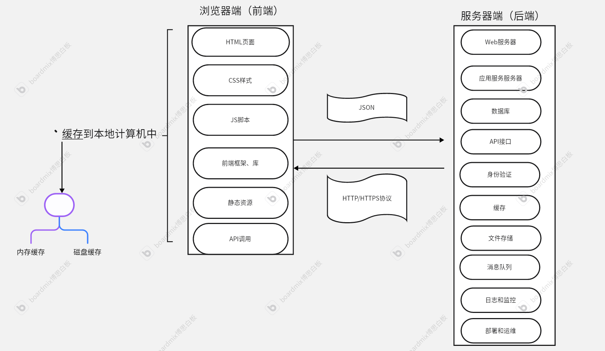
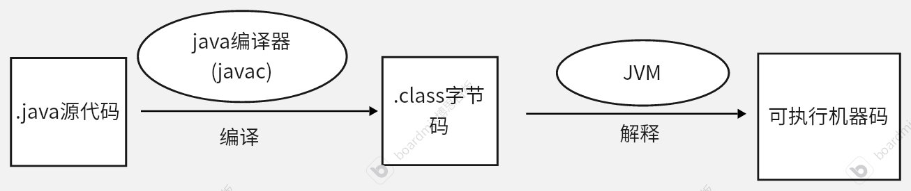
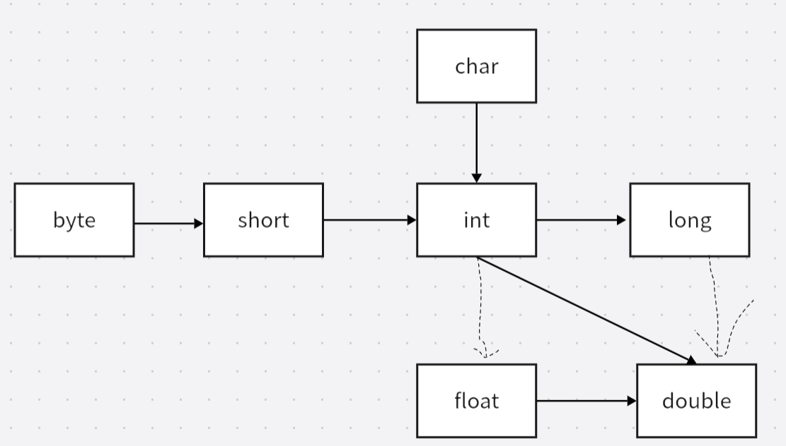
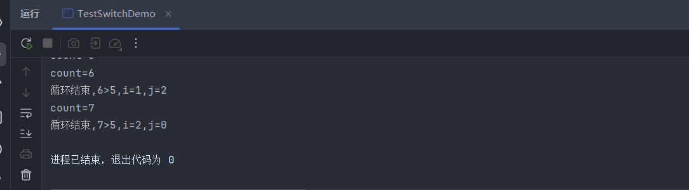
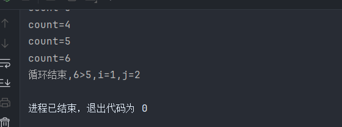
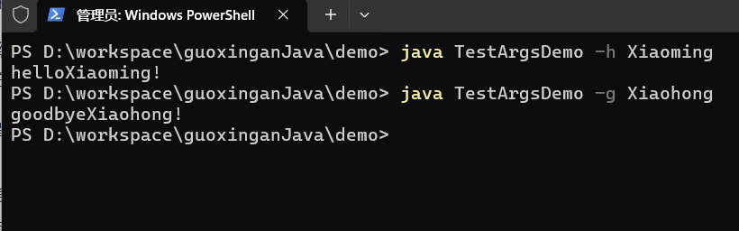
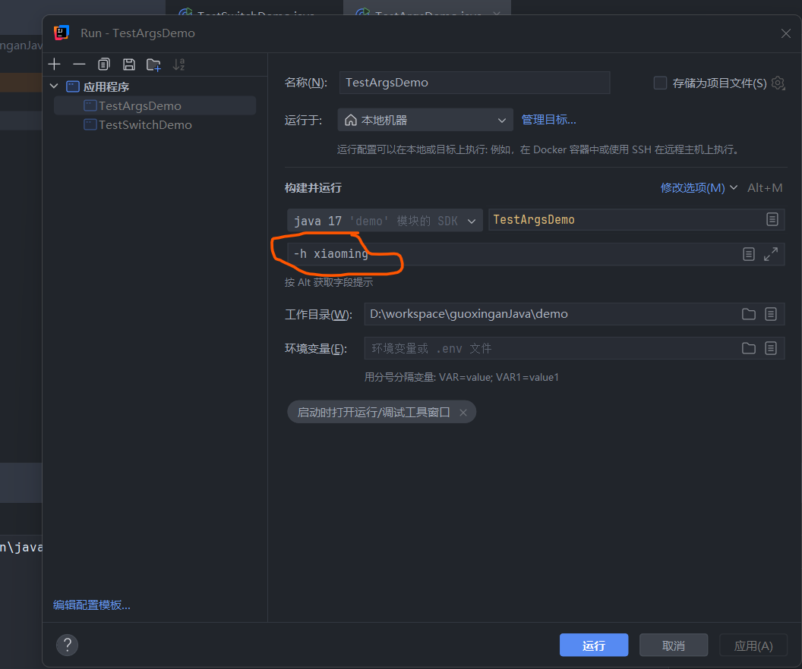

# java SE 学习

## 前言.软件开发基本知识

### 软件

#### 软件的基本知识

软件的定义：一系列指令和数据的集合，用于控制计算机执行特定的任务。

软件的构件：

- 程序
- 数据
- 文档

软件的存储：

- 存储设备

软件的运行：

- 加载到内存，由CPU执行

####  软件的现代构成

1. 程序代码

	- 源代码：高级编程语言编成的代码

	- 编译/解释：机器码或字节码

2. 数据

	- 输入数据

	- 输出数据
	- 配置文件

3. 库和框架

	- 库：提供特定功能的代码集合

	- 框架：提供开发基础结构和工具

4. 运行时环境

	- 解释器/虚拟机

	- 依赖管理

5. 用户界面

	- 命令行界面——CLI

	- 图形界面——GUI

6. 数据库

7. 网络通信

	- API：用于不同软件模块或系统之间的通信

	- 协议：如HTTP、WebSocket等

8. 文档

	- 用户文档

	- 开发者文档

9. 测试和调试工具

17. 部署和运维工具

#### 软件的典型架构

- 单体架构

​	所用功能模块集中在一个应用程序中，适合于小型项目

- 分层架构

	一般包含三个层：

	- 表现层：用户界面
	- 业务逻辑层：核心功能
	- 数据访问层：与数据库交互

- 微服务架构

​	将应用程序拆分为多个独立服务，每个服务负责特定功能，适合大型复杂系统

- 事件驱动架构

​	基于事件触发，适合实时数据处理和异步任务

- 云原生架构

	基于云计算平台，一般包含：

	- 容器

	- 微服务

	- DevOps工具

#### 两个典型的例子

##### 一个本地游戏

包含：

- 游戏程序文件
	- 可执行文件（exe等）
	- 动态链接库
- 游戏资源文件
	- 图形
	- 音频
	- 视频
	- 配置文件
- 游戏引擎和运行时环境
	- 游戏引擎
		- 游戏的核心框架，负责渲染、物理模拟、音频处理等，如Unity、Unreal Engine
	- 运行时环境
		- 游戏运行时需要的库或框架
- 用户界面文件
- 脚本和数据库
- 安装和卸载程序
- 文档和帮助助手
- 更新和补丁文件
- 存档和日志文件
- 其他文件

##### Web程序——一个购物网站

Web程序：

- 一种基于浏览器/客户端与服务器交互的应用程序。
- Web程序可以在任何支持web浏览器的设备上运行，无需独立安装。
- Web程序基于HTTP/HTTPS协议通信
- 通常采用前端+后端+数据库架构
- 一切动态网站都是web程序
- 典型的web程序：
	- 社交网站：Facebook、微博、知乎
	- 电子商务网站：淘宝、京东、亚马逊
	- 在线工具：Google，chatGPT
	- 企业管理系统：OA办公系统、ERP、CRM

现代Web程序一般分为前端（浏览器端）后端（服务器端）两个部分。

- 前端
  - HTML:定义网页结构和内容
  - CSS：控制网页的样式和布局
  - JavaScript脚本：实现动态交互（如点击按钮、加载数据等）
  - 前端资源、库：
  	- 作用：简化开发，提供组件化和状态管理、构建动弹用户界面
  	- 例子：React、Vue.js、Angular
  - 静态资源：图片、文字、图标等
  - 浏览器缓存：
  	- 缓存静态资源以提高加载速度
  	- 例如：localStrong:缓存用户偏好设置
  - API调用：通过HTTP请求于服务器端交互

- 服务器端

	- Web服务器
		- 作用：接收HTTP请求并返回响应
		- 例子：
			- Nginx(音：因金克斯)、Apache(音：阿帕奇):用于静态文件服务和反向代理
			- Node.js、Django、Flask:用于动态请求处理

	- 应用服务器：执行业务逻辑
	- 数据库：存储和管理数据
	- API接口：提供与前端交互的接口
	- 身份验证和授权：管理用户登录和权限控制
	- 缓存：提高数据访问速度，例如Redis缓存热门商品数据
	- 文件存储：存储用户上的文件
	- 消息队列：处理异步任务
	- 日志和监控：记录系统运行状态和错误信息
	- 部署和运维：管理赢得部署和运行

- 前后端交互

	- 通信方式：通过HTTP/HTTPS协议通信
	- 数据格式：通常使用JSON格式传输数据

- 浏览器端的缓存：

	- 当用户打开一个网页，浏览器会将HTML文件、CSS样式表、JS脚本以及图片、字体、视频等资源下载到本地计算机的缓存中。
	- 浏览器按以下顺序进行缓存
		1. HTML文件
			- 浏览器下载HTML文件并解析其中内容
			- HTML代码通常可以通过“查看网页源代码”查看
		2. CSS样式表（.css）
			- 通常作为独立的文件下载并储存在缓存中
			- 可以通过浏览器的“开发者工具”查看
		3. JS脚本（.js）
			- 通常也会被下载到本地缓存，并在本地执行
			- 有些JS脚本是动态加载的，可能不会全部存储在本地
			- 部分JS代码可能经过混淆或压缩，使直接查看变得困难
		4. 图片、字体、视频等资源
	- 以上内容缓存在本地计算机缓存目录，不同浏览器缓存路径不同
	- 浏览器的缓存系统会根据资源的类型和大小，采取不同的存储方式：
		- 内存缓存：
			- 一些短时间内频繁访问的资源（小型JS文件、HTML、CSS）会直接缓存在RAM——内存中
			- 当刷新页面时，浏览器会优先从内存缓存中读取数据而不是重新请求服务器
			- 关闭浏览器后，内存缓存会被清空

		- 磁盘缓存：
			- 绝大多数网页资源（HTML、CSS、JS、图片、字体、视频等）会存储到计算机的缓存设备（HDD/SSD）上
			- 浏览器关闭后这些资源仍然存在
			- 下一次访问时，浏览器会从磁盘缓存读取资源而不是重新下载


​	

​                                                          Web程序架构示意图




### web服务器简介

- Apache:主要用于静态资源服务,不支持Java servelet 和JSP
- Tomcat：一个Java Servelet容器+Web服务器，运行Java编写的应用程序，是Java EE规范的一部分

Apache与Tomcat既可以独立工作，也可以结合使用，Apache作为前端服务器，Tomcat作为后端服务器

Apache+Tomcat模式：

- Apache：
	- 处理静态资源包括图片、CSS、视频等
	- 实现负载均衡——将请求分发到多个Tomcat实例
- Tomcat:
	- 处理java动态内容，主要是Servelet、JSP
- 两者之间通过AJP或HTTP反向代理实现通信。

- 新的前端服务器——Nginx
- Nginx与Apache的对比：

| 特性         | Nginx                                  | Apache                               |
| ------------ | -------------------------------------- | ------------------------------------ |
| 架构         | 事件驱动、非异步阻塞                   | 多进程/多线程；基于线程处理请求      |
| 性能         | 高并发性能优异，适合静态资源和反向代理 | 并发性能较弱但处理动态能力较强       |
| 资源占用     | 内存和CPU占用较低                      | 内存和CPU占用较高                    |
| 配置方式     | 基于文件的配置，语法简洁               | 基于文件的配置，支持.htacess动态配置 |
| 模块化       | 核心功能内置，模块徐编译加载           | 高度模块化，支持动态加载模块         |
| 静态资源处理 | 性能优异、适合高并发静态资源服务       | 性能较好，但不如Nginx                |
| 动态内容处理 | 需通过FastCGI、uWSGI等协议与后端合作   | 内置PHP、Python等动态处理内容        |
| 使用场景     | 高并发静态资源服务，反向代理，负载均衡 | 动态内容处理                         |


- Nginx+Tomcat:
	- 通常Nginx作为前端服务器，Tomcat作为后端服务器
	- 协作内容包括：
		- 反向代理：Nginx接收客户端请求，之后将动态请求转发至Tomcat
		- 负载均衡：Nginx将请求分发到多个Tomcat实例，提高系统性能和可用性
		- 静态资源处理：Nginx直接处理静态资源，减轻Tomcat负担
		- SSL/TLS终止：Nginx处理HTTPS的加密和解密，Tomcat只需要处理HTTP请求
	- 协作的优势：
		- 高性能
		- 可扩展性
		- 安全性
		- 灵活性

Tomcat+Nginx是现代Web应用的常见模式

- Nginx+Tomcat与Apache+Tomcat比较：
	- 若Web应用主要是Java Web应用且需要高并发性能和低资源占用，Nginx+Tomcat是更好的选择
	- 若应用需要处理多种动态内容（如PHP、Python），或需要复杂的模块化支持，Apache+Tomcat是更好的选择

## 第一章 Java程序设计概述

### 1.1 java程序设计平台

java,不只是一种计算机语言，更是一个完整的开发平台，包括：

- 庞大的库
- 执行环境，特点在于：
	- 安全性
	- 跨操作系统的可移植性
	- 自动垃圾收集

### 1.2 Java白皮书关键术语

java白皮书——用于解释设计初衷和完成情况，总结了java语言的11种特性。

1. 简单性
	- java语法相比于c++语法更简洁，没有头文件、指针、结构、联合、操作符重载、虚基类
	- 另外一点是java体积足够小
2. 面向对象
	- java严格符合面向对象思想，但相比c++ Java中没有多重继承，而是用接口替代了这个功能
3. 分布式
	- java对HTTP协议、FTP协议等TCP/IP协议能良好处理
	- java程序能通过URL打开和访问网络上的对象
4. 健壮性
	- java编辑器足够强大，可以检查到很多语言在执行时才能发现的错误
5. 安全性
	- java从设计上避免一些攻击，包括：
		- 运行堆栈溢出
		- 破坏进程外的内催
		- 未经授权读取文件
6. 体系结构中立
	- java的基本数据类型的大小和有关运算都是明确的
		- 二进制数据：固定格式
		- 字符串：Unicode格式
	- 除用户界面有关部分，java其他库能良好的支持平台独立性
7. 解释性
	- java解释器可以在任何移植了解释器的机器执行java字节码。
	- java代码解释过程：

 		



8. 可移植性
	- 正是由于字节码文件与平台无关，只要安装了JVM的计算机都能正确的解释.class文件并获得可执行机器码，因此java具有良好的可移植性
9. 高性能
	- 现目前，利用即时编译技术，使java的执行速度可以媲美传统编译语言。
	- 即使编译：
		- 将执行最频繁字节码转换成机器码
		- 消除函数调用—称为内联
10. 多线程
	- 现目前，摩尔定律快要失效，不再追求更快的处理器而是更多的处理器并让它们保持忙碌
	- 多线程技术能够带来更好的交互响应和实时行为
	- Java能出色的实现并发程序设计
11. 动态性
	- java库能够自由地添加新方法和实例，不会对客户端造成影响

### 1.3 java applet

applet:

- 在网页中运行的java程序
- 需要一个启用java的浏览器来执行字节码
- 目前不再流行

### 1.4 Java发展简史

| 版本 | 年份 | 新语言特性                                           | 类与接口数量 |
| ---- | ---- | ---------------------------------------------------- | ------------ |
| 1.0  | 1996 | java诞生                                             | 211          |
| 5.0  | 2004 | 泛型类 foreach循环 可变参数 自动装箱 元数据          | 3279         |
| 7    | 2011 | 基于字符串的Switch语句 二进制字面量 异常处理增强     | 4024         |
| 8    | 2014 | Lambda表达式 包含默认方法的接口 流 日期/时间库       | 4240         |
| 17   |      | Switch表达式 文本块 instance of 模式匹配 记录 密封类 |              |


从2018年开始，java每6个月发布一个版本，每过一段时间选定一个长期支持版本。

目前最新的长期支持版本是java 17


### 1.5 关于java的常见误解

- 目前的java的即时编译技术使java运行速度与c++相差无几，有些时候能更快
- JavaScript与java没有关系

## 第二章 Java编程环境

### 2.1 安装java开发工具包

Oracle公司提供最新、最完整工具包

不同公司提供了许多OpenJDK构建版本

#### 2.1.1 下载jdk

通过国内国外渠道下载jdk

目前长期支持版本：java 17

​                                  java常见术语

| 术语                    | 解释                                     |
| ----------------------- | ---------------------------------------- |
| JDK                     | 编写java程序的软件                       |
| JRE(Java运行时环境)     | 用来运行java的软件                       |
| SE                      | 用于桌面应用或简单服务器应用的java平台   |
| ME                      | 用于小型设备的Java平台                   |
| EE(现更名为 Jakarta EE) | Java企业级开发平台，应用于大型分布式应用 |
| OpenJDK                 | Java SE的开源实现                        |
| LTS                     | 长期支持版本                             |


- Java SE 与 Java EE
	- Java EE:
		- java企业级开发平台，用于大型分布式应用
		- 如Web应用、企业级应用、微服务
		- Java EE提供了一系列API和规范，包括：
			- Web组件（Servlet、JSP、JSF）
			- 企业服务（EJB、JMS）
			- 数据持久化（JPA、JDBC）
			- 安全性（JAAS）
			- Web服务（JAX-RS、JAX-WS）
			- 依赖注入（CDI）
		- Java EE需要 Java EE服务器（Tomcat、Wildfly等）来运行
	- Java SE:
		- Java标准版，用于开发桌面应用、基础java库、工具类程序
		- 是java语言的基础，包括：
			- Java核心库（java.lang、java.util、java.io等）
			- 集合框架（List、Set、Map）
			- 多线程
			- I/O操作（文件处理、网络编程）
			- JVM和JDK
			- 基础GUI
	- Java SE不包含企业级的Web组件
	- 但Java EE基于 Java SE，开发Java EE应用程序必须安装java SE,因为Java EE运行时环境建立在java SE之上
	- Java EE在语法上和java SE没有区别，包括：
		- 基本语法（变量、数据类型、运算符）
		- 面向对象编程OOP（类、继承、封装、多态、接口）
		- 异常处理
		- 多线程
		- Lambda表达式、Stream API
		- 泛型、注解、反射

​                                            java SE 与 Java EE的区别

| 特性                       | java SE | Java EE                  |
| -------------------------- | ------- | ------------------------ |
| 基本Java语法               | 支持    | 支持                     |
| 集合框架（List、Map、Set） | 支持    | 支持                     |
| I/O操作（文件、网络）      | 支持    | 支持                     |
| 多线程                     | 支持    | 支持                     |
| GUI                        | 支持    | 一般不用于企业开发       |
| JDBC(数据库连接)           | 支持    | 支持，但Java EE更推荐JPA |
| JPA(持久化API)             | 不支持  | 支持                     |
| Servelet(Web开发)          | 不支持  | 支持                     |
| JSP(动态网页)              | 不支持  | 支持                     |
| EJB(企业级Java Bean)       | 不支持  | 支持                     |
| JMS(消息队列)              | 不支持  | 支持                     |
| JAX-RS/JAX-WS(Web服务)     | 不支持  | 支持                     |
| CDI(依赖注入)              | 不支持  | 支持                     |


java SE程序示例：

```java
public class HelloWorld {
    public static void main(String[] args) {
        System.out.println("Hello, Java SE!");
    }
}
```

Java EE程序示例：

~~~java
import java.io.IOException;
import java.io.PrintWriter;
import javax.servlet.ServletException;
import javax.servlet.annotation.WebServlet;
import javax.servlet.http.HttpServlet;
import javax.servlet.http.HttpServletRequest;
import javax.servlet.http.HttpServletResponse;

@WebServlet("/hello")
public class HelloServlet extends HttpServlet {
    protected void doGet(HttpServletRequest request, HttpServletResponse response) 
            throws ServletException, IOException {
        response.setContentType("text/html");
        PrintWriter out = response.getWriter();
        out.println("<h1>Hello, Java EE!</h1>");
    }
}
~~~


上述 Java SE程序是普通的控制台应用

Java EE程序是Web应用，需要服务器运行。


JDK包含：

- java工具：
	- javac
	- java
	- jdb
	- ……
- JRE(JRE中包含JVM)


#### 2.1.2 设置jdk

安装时：

- windows系统：注意路径不要包含空格
- Linux系统：把.tar.gz解压缩

配置可执行文件：

- 将jdk的bin目录添加到*可执行路径*中

- 可执行路径：操作系统查找可执行文件时所遍历的目录

- windows配置可执行路径：

	1. 找到设置
	2. 搜索框查找 environment
	3. 选择Edit environment variables for your account(编辑用户的环境变量)
	4. 找到 Environment variables 对话框
	5. 找到 Users Variables(用户变量)列表
	6. 选择path变量，单击edit
	7. 增加一个变量，值为jdk的bin目录

- liunx系统：

	- 在\~/.bashrc或~/.bash-profile文件的最后一行添加：

		export PATH = jdk路径/bin:$PATH

### 2.2 使用命令行工具

利用命令行工具使用jdk是一种基本技能，可以方便检查jdk时候安装正确。

主要用到两个工具：

- javac:编译器，将源代码编译为字节码.class文件
- java：启动JVM，将字节码解释为可执行文件

==注意==：

- java区分大小写，而java规范要求公共类类名第一个字母必须大写，.java文件名必须与公共类名相同
- 编译器编译时需要添加后缀.java，而使用java运行时不需要后缀
- windows系统注意源代码不要添加隐藏后缀.txt

### 2.3 集成开发环境（边学边记）

使用IDEA

快捷操作：

- ctrl+D:将当行复制粘贴到下一行
- 选中字符后，shfit+F6:重构，修改整个项目中出现的选中的内容
- ctrl+alt+shfit+J:多重选择
- ctrl+/:将选中的内容集体注释

### 2.4 Jshell

在java 9中引进，一种使用java的程序。

工作模式：

读取（读取java表达式）→评估（评估输入）→打印（打印输出并再次开始读取）

- shell:
	- 一种特定的应用程序
	- 核心功能：
		- 解释和执行用户输入的命令，并管理进程、文件系统等操作系统资源
		- 支持脚本编写，能够自动执行任务

| 特性       | shell                        | 一般应用程序                   |
| ---------- | ---------------------------- | ------------------------------ |
| 主要功能   | 解释和执行命令，管理系统资源 | 提供特定功能如编辑文本、浏览等 |
| 交互方式   | 命令行界面CLI                | 图形界面GUI或CLI               |
| 运行环境   | 用户空间，直接与内核交互     | 用户空间，通过API与系统交互    |
| 自动化能力 | 强大的脚本支持               | 有限的脚本或宏支持             |

==注：并非只有Linux才有shell==

不同操作系统的典型shell：

- Linux和类Unix系统：
	- Bash(默认使用)、Zsh、Fish、ksh、Tcsh….
- windows：
	- 传统shell:
		- cmd.exe(命令提示符)：类似于早期的DOS的命令行工具，功能较为基础
		- Power Shell:功能强大，支持脚本和对象操作，适用于系统管理和自动化
	- 新shell:
		- windows Terminal:现代化终端，支持多标签和多种shell
		- WSL:允许在windows上运行Linux发行版及其shell（如Bash）

- 脚本Script:

	- 脚本与应用程序都是用于执行特定任务的软件。但在实现方式、运行环境、用途上有显著区别。

	| 特性     | 脚本                                  | 应用程序                         |
	| -------- | ------------------------------------- | -------------------------------- |
	| 运行方式 | 由解释器逐行解释执行                  | 编译为二进制文件直接运行         |
	| 文件形式 | 纯文本文件                            | 二进制文件                       |
	| 开发速度 | 开发快速，适合小型任务                | 开发周期长，适合复杂任务         |
	| 依赖     | 需要安装解释器                        | 通常独立运行，无需额外依赖       |
	| 用户界面 | 通常为CLI                             | 可以是CLI也可以是GUI             |
	| 典型用途 | 自动化任务，快速原型开发，系统管理    | 大型软件，图形化工具，高性能计算 |
	| 示例     | shell脚本，python脚本，JavaScript脚本 | 浏览器，文本编辑器，游戏         |


## 第三章 Java的基本程序设计结构

### 3.1 Java程序要素

以下是一个简单的JavaSE程序，但是里面包含的内容会在Java所有程序中出现。

~~~java
public class FirstProgram{
    public static void main(Strng[] args){
        System.out.println("goodbye,world!");
    }
}
~~~

- Java区分大小写
- 开头的关键字public称为访问修饰符，用于控制程序的其他部分对这段代码的访问级别
- 关键字class表示这是一个类，Java是一种偏向工程的语言，一切代码都包含在类中。这里可以把类看作程序逻辑的一种容器
- class后面的紧跟着类名，Java的类名必须以字母开头，后面可以跟字母或数字，没有长度限制，但是不能使用Java保留字
	- 但是有标准命名约定：类名采用大写字母开头的名词，之后的每个单词首字母也大写,称为驼峰命名法
	- 源代码文件的命名必须与公共类名相同，用.java作为扩展(使用javac命令需要添加后缀)
	- 当编译器完成编译后，得到的字节码文件后缀为.class，Java编译器会将.class文件放到与.java文件同一个目录结构中（使用java命令不用后缀）
- 当运行已经编译好的程序时，JVM总是从main方法开始执行，Java语言规范约定main方法必须声明为public
- Java中函数也被称为方法
- 方法的程序都属于一对{}，Java中方法的所有代码都必须用{}包裹
	- 大括号的风格怎样都行， Java编译器会忽略空白行
- static表明是静态的，main 方法总是静态的
- void表明main方法没有返回值，不需要return 0
- System.out是一个对象，调用了他的println()方法，Java中的调用语法是 ： *对象.方法名();*
- Java语句必须以分号结束
- println()方法接收一个字符串参数，并将其输出到控制台，之后自动换行
- 除了println(),还有一个print()方法，这个方法不会自动换行，此外，Java还有与c语言中几乎一样的printf()方法用来实现格式控制
- Java的方法可以没有参数，也可以用一个或多个参数

### 3.2 注释

Java有三种注释：

~~~java
//这是一种注释，只能注释这一行后面的内容
/*这也是一种注释，可以包括较长的字符，
也可以跨行*/

/**
*这种注释用来自动生成文档
*/

~~~

注意：/**/不能嵌套使用，也就是在/\*\*/不能再加入/\*或\*/。


### 3.3 数据类型

Java是一种强类型的语言，意味着每一个变量声明时都必须给出它的数据类型

Java有8种基本数据类型：4种整型、2种浮点型、1种布尔型和1种字符类型char

注：

- String字符串不是不是基本类型，而是String类的实例
- Java种有一种类 big number，它的对象可以表示任意精度，但是不是基本类型

#### 3.3.1 整型

| 类型  | 存储需求 | 大致范围                |
| ----- | -------- | ----------------------- |
| byte  | 1字节    | -128~127                |
| short | 2字节    | -32768~32767            |
| int   | 4字节    | 大约超过一点-20亿~+20亿 |
| long  | 8字节    | 在10^18^数量级          |

Java中，数据类型的取值范围与平台无关，只要安装了JVM的机器，在执行Java字节码时，各种类型范围固定，得到的结果也是相同的

能更好的实现跨越平台

长整型数值后有后缀L或l，如4000000L。

十六进制数有前缀0X或0x。如0xFFFF

八进制数前缀是0，如010，这是八进制的8.这很容易混淆，一般不用八进制。

二进制有前缀0B或0b，如0b1001=9。

Java中没有无符号形式的int、short、long、byte等类型

但是，如果非常希望处理无符号数，比如想计算0\~225范围无符号数，可以使用Byte.toUnsignedInt(b)方法，这个方法会得到0\~

225的int值，然后把它转会byte型。

Inter类，Long类都提供了类似的方法来处理无符号数


#### 3.3.2 浮点类型

| 类型   | 存储需求 | 大致范围         |
| ------ | -------- | ---------------- |
| float  | 4字节    | 大约7位有效数字  |
| double | 8字节    | 大约15位有效数字 |

有效数字：从第一个非零数字开始，到最后一个具有实际意义的数(包括0，但不包括前导0或尾随的无意义0)

定点数中：

- 0.000456 三位有效数字 456

- 123.450   6位有效数字 123450

- 1.23000   5位有效数字12300

浮点数中：

例如，132456789.0

- 单精度可能会存储为1.234568*10^8^实际有效数字只有7个

- 双精度可能存储为1.234567890123456*10^15^保持16位有效数字

由于float的有效数字太少，一般需要用浮点数时我们都使用double型

float型有一个后缀f或F，如果没有后缀的小数，一般都默认为double型

有三个比较特别的浮点数值表示溢出出错的情况：

Double.POSITITIVE_INFINITY:正无穷大

Dobule.NEGTIVE_INFITY:负无穷大

Dobule.NaN：不是数

一个整数除以0会得到正无穷大

计算0/0或负数的平方根会得到Double.NAN

注：不能用if(x == Double.NaN)检测一个结果是否为NaN。

因为每个NaN都被设计成不相同的

如果是金融计算等不能接收误差的业务，就不能使用浮点型，而应该使用BigDecimal类


#### 3.3.3 char类型

char类型：存储空间是2字节

最初设计时，希望一个char类型能够表示1个Unicode编码的字符，但随着Unicode发展，2字节16位的空间可能无法表示一个Unicode字符了。

###### 码点与代码单元

码点：

- 字符在Unicode中的唯一编号，表示为U+xxxx形式，如：

	- A 的码点是U+0041

	- ‘中’的码点是U+4E2D
	- 😊（笑脸）的码点是 `U+1F60A`

代码单元：

- UTF-16使用16位，2个字节作为基本存储单位，称为代码单元。
- 基本多语言平面 BMP:
	- 码点范围：U+0000~U+FFFF
	- BMP的字符都可以用一个16位代码单元存储，也就是一个char变量
- 辅助平面：
	- 码点范围：U+10000~U+10FFFF
	- 这些字符必须使用一对代码单元(称为代理对)存储
	- 如：
	- 😊（U+1F60A）的 UTF-16 编码是 **两个代码单元**：
		- 高代理项（High Surrogate）：0xD83D
		- 低代理项（Low Surrogate）：0xDE0A

###### Java中char类型与码点、代码单元的关系

单个char存储BMP中的字符：

~~~java
char ch1 = 'A';
char ch2 = '中';
~~~

对于辅助平面的字符，必须用一对char类型(代理对)存储：

~~~java
char ch3 = '\uD83D'; 
char ch4 = '\uDE0A';
String emoji = "\uD83D\uDEOA"; //存储了😊字符
~~~

总结:

| 概念           | 说明                                      | 例子                                               |
| -------------- | ----------------------------------------- | -------------------------------------------------- |
| 码点 CodePoint | Unicode字符的唯一编号                     | A：U+0041                                          |
| 代码单元       | UTF-16存储字符的基本单位                  | A只要一个代码单元，😊需要两个代码单元               |
| char类型       | Java的16位字符单元，存储UTF-16的代码单元  | char ch = ‘A’;char[] emjoe = {{'\uD83D', '\uDE0A'} |
| 码点和char     | 码点是Unicode编号，而char是UTF-16存储单元 | char不能直接表示U+1F60A,必须使用char代理对         |


可见，char类型只能表示一个UTF-16的代码单元，而String类字符串可以处理完整的字符。所以，最好处理字符时不适用char而使用字符串。或者使用int类型变量存储字符的码点。

(可以用codePointAt()获取Unicode码点)

#### 3.3.4 boolean类型

boolean类型变量只有两种取值true和false。Java中的布尔类型不能转换成整型的1或0


### 3.4 变量与常量

与所有程序设计语言一样，Java使用变量存储值，而常量，就是值不变的变量。

#### 3.4.1 变量声明

在Java中，每个变量都有一个类型，声明时，先指定类型，再指定变量名。

~~~java
int a;
char ch;
boolean isStundent;
~~~

声明必须用;结束

变量名区分大小写

变量名可以是字母数字货币符号和标点连接符(主要是__)组成。

注：

- 这里的字母不止是拉丁文字母，也可以是希腊字母、德语字母等
- 货币符号也不只美元\$,也包括￥、€等
- 但最好不要在自己代码中使用\$作为变量名，因为java编译器或其他工具生成的名字会用这个符号
- 单独的\_是Java保留字，也不可以做变量名

声明可以声明一个变量，也可以声明多个变量，但不推荐一次声明多个变量的风格。

#### 3.4.2 变量初始化

变量声明后，必须要用赋值语句初始化才能使用。

~~~java
int a;
a = 0;
~~~

赋值语句：

变量名 = 表达式或值;

可以把声明和初始化放在同一行：

~~~java
int a = 2;
~~~

Java的变量声明可以放在代码中任何地方，但建议靠近第一次使用变量的位置。

Java不区分变量的声明和定义。

c和c++中：

~~~c++
int i = 10;  //变量的定义
extern int i; //变量的声明
~~~

##### var

从Java 10开始，对于局部变量，如果能从变量的初始值推断出它的数据类型，可以使用var关键字而不用指定数据类型：

~~~java
var age = 12;       //整型
var name = "小明";  //字符串
~~~


#### 3.4.3 常量

Java中使用关键字final指示常量

~~~java
final double CM_PRE_INCH = 2.54;
~~~

final表示这个变量在初始化后不能再赋值了

习惯上常量名全部用大写

在Java中可以创建一个常量以便在一个类中的多个方法中使用，这种常量称为类常量。

~~~java
public class Example{
    final static double CM_PRE_INCH = 2.54;
    public static void main(String[] args){
        double a = CM_PRE_INCH *3;
    }
}
~~~

类常量需要在方法外声明，这样类中其他方法也可以使用这个常量

如果一个常量被声明位public，那么其他类的方法也可以使用这个常量

注：const是Java保留字，但目前没有使用


#### 3.4.4 枚举类型

枚举是一种特殊的数据类型，用以定义一组命名的常量。

枚举可以提高代码的可读性、安全性和可维护性。

Java中使用enum声明枚举类型

~~~java
enum Day{MONDAY,TUESDAY,WEDNESDAY,THURSDAY,FRIDAY,SATURDAY,SUNDAY}
~~~

##### 枚举的优势

1.提高代码可读性

​	枚举可以给常量赋予有意义的名称，使代码更好理解，避免了常量命名不清晰的问题

~~~java
// 使用枚举
enum Day {
    MONDAY, TUESDAY, WEDNESDAY, THURSDAY, FRIDAY, SATURDAY, SUNDAY
}

Day today = Day.MONDAY;

// 使用整数常量
int today = 1; // 1 代表星期一

// 使用字符串常量
String today = "MONDAY";
~~~

2.增强类型安全

   编译器会自动检查枚举值的有效性，避免无效赋值

~~~java
Day today = Day.MONDAY; //正确
today = 1;//编译错误：类型不配
~~~

3.简化代码逻辑

枚举类型可以把相关的常量组织在一起，并提供方法或属性操作这些常量

~~~java
enum Day {
    MONDAY, TUESDAY, WEDNESDAY, THURSDAY, FRIDAY, SATURDAY, SUNDAY;

    public boolean isWeekend() {
        return this == SATURDAY || this == SUNDAY;
    }
}

Day today = Day.SATURDAY;
System.out.println(today.isWeekend()); // 输出: true
~~~

4.支持高级特性

枚举可以定义方法、实现接口、添加字段等，使其功能更强大

5.避免重复定义

枚举将常量集中在一个地方，避免了重复定义和分散管理

6.支持遍历

枚举可以用foreach遍历

~~~java
for(Day day :Day.values()){
    System.out.println(day);
}
~~~

7.工具和框架支持

许多现代框架如Spring和工具如JUnit都支持枚举类型

8.避免硬编码

枚举可以减少代码中的硬编码，使代码更易于维护和扩展

~~~java
enum Status {
    PENDING, APPROVED, REJECTED
}

Status status = Status.PENDING;
~~~

当需要添加新状态时，只用修改枚举定义，并不会影响到使用枚举的其他代码

9.枚举线程安全

枚举是线程安全的，因为在JVM中是单例的。

10.枚举支持序列化

枚举内置了序列化机制，不需要额外实现Serializable接口，使得枚举在网络传输或持久化时更加方便

### 3.5 运算符

运算符用于连接值。

3.5.1算术运算符

算术运算符包括+  -   \*和\以及取模运算%

对于\：

只有当两个操作数都是整数时，表示整数除法，否则都会变成浮点数除法

#### 3.5.1取模运算

作用：计算两个数相除后的余数

###### 1.定义

a%b = r,其中：

- a:被除数
- b:除数
- r:余数，满足0<=r<b

###### 2.取模运算的作用

利用取模运算的特性，可以运用于计算机程序设计的多种场合：

- 判断奇偶性

	- 通过取模运算可以快速判断奇偶

	- ~~~java
		int number = 7;
		if(number%2==0){
		    .......
		}
		~~~

- 遍历循环

	- 只要除数不变，即使被除数变化，取模运算的结果也总是保持0到除数-1的循环，利用这个机制，可以实现循环索引

	- ~~~java
		int[] array = {1, 2, 3, 4, 5};
		for (int i = 0; i < 10; i++) {
		    int index = i % array.length; // 循环索引
		    System.out.println(array[index]);
		}
		~~~

- 限制范围

	- 取模运算可以把一个数限制在某个范围

	- ~~~java
		int value = 15;
		int range = 10;
		int result = value % range; // 将 15 限制在 0 到 9 之间
		System.out.println(result); // 输出: 5
		~~~

- 哈希函数

	- 取模运算常用于哈希函数中，将大范围的数映射到固定范围

- 时间计算

	- 取模运算可以用于时间单位的转换，例如将秒转换成分钟:秒格式

	- ~~~java
		int totalSeconds = 125;
		int minutes = totalSeconds / 60; // 分钟
		int seconds = totalSeconds % 60; // 秒
		System.out.println(minutes + " 分钟 " + seconds + " 秒"); // 输出: 2 分钟 5 秒
		~~~

- 周期性操作

	- 取模运算可以运用于处理周期性操作，例如队列的实现

- 加密算法

	- 取模运算在加密算法（如RSA）中也有很多应用

###### 3.特性

取模的结果始终保持0~b-1(b是除数)

负数取模：当被除数为负数，取模的结果取决于编程语言的实现。Java中，结果的符号与被除数一致。

~~~java
System.out.println(-10 % 3);  // 输出: -1
System.out.println(10 % -3);  // 输出: 1
System.out.println(-10 % -3); // 输出: -1
~~~

(注：从数学上来讲，取模运算的结果应该与除数一致，而取余运算才是符号与被除数一致。所以严格来说Java实现的其实是取余运算)

0%任意非零数 = 0

任意数% 0 是未定义的除零行为，会报错

#### 3.5.2 数学函数与常量

在Java中，大部分可能会使用的数学函数都属于Math类。

想使用Math类中的方法，用两种格式：

~~~java
double x =4;
double y = Math.sqrt(x);
~~~

或者直接在源文件中引入Math类：

~~~java
import static java.lang.Math.*;

double x = 4;
double y = sqrt(x);
~~~

注：Math类中的方法大部分是静态方法，不处理任何对象

常见的Math方法：

- sqrt(x):计算x的平方根并返回
- pow(x,a):计算x的a次幂(x^a^)，Java中没有幂运算运算符，必须用这个方法
- 常见的三角函数：
	- Math.sin
	- Math.cos
	- Math.tan
	- Math.atan
	- Math.atan2
- 常见的对数和指数函数：
	- Math.exp
	- Math.log
	- Math.log10
- 表示Π和e的常量：
	- Math.PI
	- Math.E

注：

1. Math中涉及到除法的方法都使用的是浮点除法，如果希望实现完全准确的结果，应该使用StrictMath类，这个类能确保在所有平台得到完全相同的结果。
2. 使用Math.multiplyExact()等方法也可以计算加减乘除等，同时能在发生溢出时抛出异常，而直接使用运算符则不会，例如若使用int型计算10亿\*3,只会把溢出导致的错误结果存回变量中，这种错误编译器无法发现。

#### 3.5.3 数值类型之间的转换



实线代表了可以实现没有精度损失的转换

而虚线代表了可能会造成精度损失

原则上来说，存储要求小的数据类型转到存储要求大的不会有损失，反之则可能造成损失，这很好理解，就像小孩子可以睡大人床，但成年人不能谁的下婴儿床。

但是要注意：虽然int和float存储要求都是4个字节，但是从int转向float会有精度损失。因为float只有7位有数字，但Int的范围要超过20亿也就是9位有效数字。long转换成double也是类似的道理。

在进行二元运算时，首先会自动把两个操作数转换成相同数据类型，再进行计算，转换的原则是：

- 如果有一个操作数是double，都转换成double类型；
- 否则，如果有一个操作数是float类型，都转换成float类型；
- 否则，如果有一个操作数是long类型，都转换成long类型；
- 否则，都转换成int类型。

#### 3.5.4 强制类型转换

如果确实需要将一种大范围的数据类型转换成小范围的话，就需要强制类型转换。

语法：

~~~java
double x =5.99;
int nx = (int)x ;     //nx = 5
~~~

当把浮点数转换成整型时，会舍弃所有小数部分

如果希望按照舍入的规则进行转换，可以使用Math.round方法

~~~java
double x = 9.97;
int nx = (int)Math.round(x);  //此时nx=10
~~~

要注意的时Math.round()方法返回的对象也是double型，需要再对结果进行一次强制类型转换

#### 3.5.5 赋值

赋值语句本身就是一种表达式，因此赋值语句本身也会有一个值，这个值就等于=右边的值

~~~java
int a,b;
a=(b=4);        //这里"b=4"这个式子值为4，所以a的值也赋成了4
~~~

逻辑上与数学的连等差不多，但是赋值表达式和数学的等式是完全不同的，数学上不存在x=x+1这种表达，赋值表达式完全可以

在赋值语句中，可以使用二元运算，比如+= -=  \*=  /=  %= …

比如 ：

~~~java
x+=1;     //等价于 x=x+1
~~~

#### 3.5.6 自增自减运算

Java中也支持使用++或-\-表示自增自减，规则也是同样的：

前缀时表示先自增自减再参与其他运算；

后缀时表示先参与其他运算再自增自减

~~~ java
int m =7;
int n =2;
int result = m*++n;   //result = 21
int result2 = m*n++;  //result2 = 14
~~~

但这种写法降低代码可读性，容易引起他人误解，并不推荐

#### 3.5.7 关系运算和boolean运算

| 符号 | 解释                                       |
| ---- | ------------------------------------------ |
| ==   | 两边的式子的值是否相等                     |
| !=   | 两边的式子的值是否不相等                   |
| &&   | 两边的式子都为真时表达式为真，否则都为假   |
| \|\| | 两边的式子都为假时表达式为假，否则取值为真 |

&& 和 ||采用了短路策略：

- &&左边的式子如果为假就不再运算右边的式子直接取值false
- ||左边的式子如果为真就不再运算右边的式子直接取值为true
- 可以利用这个策略避免计算/0等，比如： if(y!=0 &&x/y>3)….这样只要y=0就不会再去计算右边x/y

#### 3.5.8 条件运算符

java提供了 *条件？ ：* 运算符，也成为三目运算符。

格式：

条件？表达式1 ： 表达式2

当条件为真时，整个运算取值为表达式1的值，否则取值为表达式2的值

#### 3.5.9 switch 表达式

switch表达式是java14引进的，当我们需要在多个值做出选择时，可以用这种表达式。

要注意的是switch表达式功能和结构与switch语句类似，但是switch表达式的本质是一种表达式，是有值的，而switch语句是一种控制语句，只能执行代码。

语法:

~~~java
int seasonCode = 1;
String seasonName = switch(season){
        case 0 -> "Spring";
        case 1 -> "Summer";
        case 2 -> "Fall";
        case 3 -> "Winter";
        default -> "???";
}
~~~

case标签除了整型外还可以是字符串字面量或者枚举常量

case标签后可以提供多个值，用,分隔

~~~java
int numbers = switch(condition){
        case 1,2,3 -> 6;
        case 4 -> 100;
        default -> 999;
}
~~~

如果case标签后是枚举常量，不需要设计default，同时也不需要给出枚举名，但如果是整型或字符串，必须设计default，因为switch表达式必须有一个值

~~~java
enum Size {"SMALL","MINDIM","LARGE","EXARE_LARGE"};
Size item = ...;
String label = switch(item){
        case SMALL -> "s";  //这里的枚举常量不需要写成Size.SMALL形式
        case MINDIM -> "m";
        case LARGE -> "L";
        case EXARE_LARGE -> "XL";
        //不需要default
}
~~~

#### 3.5.10 位运算符

Java中实现的位运算：

| 运算符 | 名称        | 功能描述                                                     |
| ------ | ----------- | ------------------------------------------------------------ |
| &      | 按位与 AND  | 两个操作数对应位都是1时，结果位1，否则为0                    |
| \|     | 按位或 OR   | 两个操作数对应位有一个是1时，结果为1，否则为0                |
| ^      | 按位异或XOR | 两个操作数对应位不同时结果为1，否则为0                       |
| ~      | 按位取反NOT | 将操作数每一位取反                                           |
| <<     | 左移        | 将左操作数的二进制位向左移动，移动右操作数指定的位数，低位补0 |
| >>     | 带符号右移  | 将左操作数的二进制位向右移动，移动右操作数指定的位数，高位补符号位(正数补1负数补0) |
| >>>    | 无符号右移  | 将左操作数二进制位向右移动，高位补0                          |

位运算的典型应用

- 权限控制

	- 用二进制位表示权限，如读、写、执行，通过位运算高效组合和校验权限

	- ~~~java
		// 定义权限标志
		int READ = 1 << 0;   // 0001
		int WRITE = 1 << 1;  // 0010
		int EXECUTE = 1 << 2;// 0100
		
		// 组合权限
		int userPermissions = READ | WRITE; // 0011（可读可写）
		
		// 检查权限
		boolean canRead = (userPermissions & READ) != 0; // true
		boolean canExecute = (userPermissions & EXECUTE) != 0; // false
		~~~

- 数据压缩与优化

	- 用位运算代替乘除，提升性能，比如x<<3 = x*8

	- 想象十进制中，一个数1234，把小数点向有移动两位

	- 变成了123400，相当于1234*100

	- 相对于小数点来说，数字向左移动了，所以叫做左移

	- ~~~java
		int x = 5;
		int result1 = x << 3; // 相当于 5 * 8 = 40
		int result2 = x >> 1; // 相当于 5 / 2 = 2（向下取整）
		~~~

- 网络协议解析

	- 解析二进制协议时，可以用位运算提取特定字段，如IP地址、报文头等

	- ~~~java
		int packetHeader = 0xABCD1234;
		
		// 提取高 16 位
		int version = (packetHeader >> 16) & 0xFFFF; // 0xABCD
		
		// 提取低 16 位
		int data = packetHeader & 0xFFFF; // 0x1234
		~~~

- 高效存储状态

	- 用整数的二进制位表示多个布尔状态，可以节省内存

	- ~~~java
		// 用 4 位表示 4 个开关状态
		int switches = 0;
		
		// 打开第 2 个开关（从右往左数，索引从 0 开始）
		switches |= 1 << 1; // 0010
		
		// 关闭第 3 个开关
		switches &= ~(1 << 2); // 1111 -> 1011
		~~~

- 哈希算法与加密

	- 位异或常用于哈希计算或简单加密

注意：

1. 位运算只能用于整型
2. 移位操作受到数据类型的位数限制，比如int，右操作数的范围是0~31(4个字节只有32位，1位用来表示符号)
	- 当超过这个范围时，就要对32做取模运算
	- 如 1<<35 就等同于 1<<3
3. 右移>>保留符号位，而>>>始终在高位补0
4. 位运算会降低代码可读性，需要添加注释说明逻辑

位运算直接操作二进制位，比常规运算更快，适用于：

- 高频计算，如实时数据处理
- 内存敏感场景，如嵌入式系统或大规模数据处理

#### 3.5.11 括号与运算符优先级

| 优先级 | 运算符                                              | 结合性   |
| ------ | --------------------------------------------------- | -------- |
| 1      | []  .   ()                                          | 从左向右 |
| 2      | ! ~ ++ -\- +(表示正)  -（表示负）(强制类型转换) new | 从右向左 |
| 3      | \* /  %                                             | 从左向右 |
| 4      | +  -                                                | 从左向右 |
| 5      | << >> >>>                                           | 从左向右 |
| 6      | ==  !=                                              | 从左向右 |
| 7      | &                                                   | 从左向右 |
| 8      | ^                                                   | 从左向右 |
| 9      | \|                                                  | 从左向右 |
| 10     | &&                                                  | 从左向右 |
| 11     | \|\|                                                | 从左向右 |
| 12     | ？:                                                 | 从右向左 |
| 13     | = += -= \*= /= %= &= \|= ^= <<= >>= >>>=            | 从右向左 |

总结：

优先级最高的是方法调用、括号

之后是一元运算符(包括表示正负的+-)

之后是算术运算 乘除>+-

之后是移位运算

之后是判断相等

之后是位运算  与>异或>或

之后是逻辑运算 与>或

之后是三目运算

最后是赋值运算


### 3.6 字符串

从概念上讲，字符串就是Unicode字符的集合

从本质上讲，字符串是Java预定义类String的实例对象,String类属于Java标准库，不需要在源文件中额外引入

每个双引号括起来的内容都是String的实例

不能讲String理解成char的数组，如果从c语言角度思考，Java的字符串更像是：

~~~c
char * str = "字符串";
~~~

#### 3.6.1 子串

String类的subString()可以从一个大的字符串中提取子串：

~~~java
String greeting = "Hello";
String s = greeting.subString(0,3); //s = "Hel"
~~~

subString方法：

- String subString(int beginIndex)
- String subSrting(int beginIndex,int endIndex)
- 返回一个新的字符串，这个字符串包含从beginIndex到字符串末尾，或者endIndex-1的所有代码
- 这个方法很容易得到字符串长度，length = endIndex-beginIndex

#### 3.6.2 拼接

Java语言使用+来来连接两个字符串，用于组成一个新的字符串

新的字符串完全按照拼接时的顺序：

~~~java
String str = "Woshi";
String name = "Xiaoming";
String introduce = str+name; //introduce = "WoshiXiaoMing"
~~~

可以讲任意一个非字符串的值与字符串使用+拼接，会自动转换成字符串

实际上，任何一个Java对象都可以转换成字符串

如果希望连接多个字符，并增加一个分割符，可以使用静态的String.join()方法

~~~java
String all = String.join("/","S","M","L","XL");//all = "S/M/L/XL"
~~~

在 Java 11中，有一个动态repeat方法用来重复字符串

~~~java
String repeated = "Java".repeat(3); //repeted = "JavaJavaJava"
~~~

#### 3.6.3 字符串不可变

String类没有提供任何方法来对字符串进行修改，但可以修改字符串变量的值

例：

~~~Java
 String str = “Hello” ;//字符串“Hello”就一定没有办法修改
 str  = str.subString(0,3)+"p!"； //str = "Help!"
~~~

点类似于c语言中的指针与结构体的关系，可以让指针指向不同的结构体，但作为字符串的那一块结构体java不允许修改

~~~c
//java 中修改字符串变量类似于以下操作：
char* greeting = "Hello";
char* temp = (char*)malloc(sizeof(char)*6);
strncpy(temp,greeting,3);
strncpy(temp+3,"p!",3);
greeting = temp;
~~~

#### 3.6.4 检测字符串是否相等

可以使用equals方法检测两个字符串是否相等

s.equals(t);

相等返回true,否则返回false

这里的s和t可以是字符串变量，也可以是字符串字面量，如“hello”.equals(str)

如果希望检查两个字符串是否相等并且忽略大小写，可以使用equalsIgnoreCase方法，如”Hello“.equalsIgnoreCase(“hello”);

不能使用 ==运算符检测两个字符串是否相等

因为 == 不会比较字符串是否存储在同一个位置，而不是去比较字符串的内容

如果字符串真的在同一位置上，那么理论上它们确实相等

但是JVM中，只会共享字符串字面量，不会共享+或subString（）等生成的新字符串

也就是说：

~~~java
String greeting = "Hello";
if(greeting == "Hello")...     //这个有可能是真的
if(greeting.subString(0,3) == "Hel")   //这个判定很可能并不能通过
~~~

这样的Bug是编译器无法检查的

因此，Java中判断字符串相等应该始终调用equals方法

（还有一个compareTo方法，类似于c语言中的strcmp方法）

~~~java
if(greeting.compaerTo("Hello") == 0)
//按照字典顺序，如果greeting位于"Hello"之前，返回一个负数，如果在"Hello之后返回一个正数，如果相等返回0"
~~~

虽然这个方法也能判断字符串相等，但看起啦确实不如equals清晰

#### 3.6.5 空串与null

空串也是一种字符串，有它的长度0，和内容（空）

但是，String类变量可以存储一个特殊值null，表示这个变量目前不与任何对象关联，不能在null值上调用方法

检测一个字符串是否是null，可以使用 ==

if(str == null)

但是，如果希望检测一个字符串既不是null也不是空串，就要配合equals方法：

if(str != null && !str.equals(“”))

#### 3.6.6 字符串长度与代码单元与码点

Java字符串是char类型的值的序列

char类型变量存储的是Unicode的代码单元，BMP字符只需要一个代码单元，而辅助平面的字符需要两个char类型，也就是两个代码单元

==String的length方法返回的也是是字符串代码单元个数==

想要得到严格意义上的字符个数，也就是码点的个数，需要调用codePointCount方法

~~~java
int cpCount = greeting.codePointCount(0,greeting.length());//返回0到greeting.length()-1之间的码点个数
~~~

想得到第i个码点，可以使用以下语句：

~~~java
int index = greeting.offsetByCodePoints(0,i);//返回从0开始，i个码点后的码点索引
int cp = greeting.codePointAt(index);//返回给定位置的码点
~~~

如果希望得到一整个字符串的码点，可以使用codePoints方法，它会生成一个int值的流，每一个int值对应一个码点，然后使用toArray()转换成数组

~~~java
int[] codePoints = str.codePoints().toArray();

//反过来也可以把一个码点数组转换成字符串
String str2 = new String(codePoints,0,codePoints.length);
~~~

总之，要始终牢记一个原则，对于字符类型的数据，都建议用String类型处理而不是char类型。

#### 3.6.7 构建字符串

有时，如果需要多次的用短的字符串构建新的字符串，例如，按键或者从文件中读取单词

使用拼接的方法效率比较低，每次拼接都会创造一个新的字符串对象

可以使用StringBuilder (称为字符串构建器)类来处理需要频繁修改的情况：

~~~java
StringBuilder builder = new StringBuilder();    //先构建一个新的字符串构建器
//当每次需要添加时，调用append方法
builder.append(ch);   //可以添加单个字符
builder.append(str);  //可以添加字符串
//当构建完成时，需要调用toString()方法将StringBuilder类对象转换成String对象
String result = builder.toSting();
~~~


注：Sting类和StringBulider类都有很多方法，有些比较常用，有些可能不经常用但关键的时候可能非常需要这些方法。

死记硬背没有意义，要多查阅Java的API解释文档


#### 3.6.8 文本块

Java 15新增加了文本块机制

主要用来实现跨越多行的字符串

语法：

~~~java
String text = """
Hello
world
""";
~~~

使用一对三个双引号标记。

文本块开头三个双引号后需要换行，这个换行符不计入字符串的内容，之后的换行符都会被视作字符串的真实内容

最终，text的值具体为：“Hello\nworld\n”

文本块比较适合编写其他语言的代码如SQL或者HTML

常规字符串中的转义序列在文本块中也能使用

文本块有一个单独的转义序列\，表示忽略掉这个换行符

比如：

~~~java
"""
Hello \
goodebye.
""";
~~~

等同于“Hellogoodebye”

文本块会标准化结束符，删除末尾的空白符，并把windows系统的\r\n换行符简化为\n

对于缩进，也就是放在文字前面的空白符，文本块会删除公共空白符(就是作为一个语句本身的缩进)然后保留内部的


### 3.7 输入与输出

#### 3.7.1读取输入

在Java中，将输出打印到标准输出流(控制台窗口)非常简单，只需要调用System.out.println

但读取标准输入流System.in稍微要复杂一些

~~~java
//首先，要创建一个与标准输入流关联的Scanner对象
Scanner in = new Scanner(System.in);
//然后，使用Scanner的各种方法读取输入

String name = in.nextLine();  //读取一行输入
String firstName = in.next(); //读取一个单词，以空格作为分隔
int age = in.nextInt(); //读取一个整数
double monery = in.nextDouble();//读取一个浮点数
~~~

注：Scanner类属于java.util包，并不在Java标准库，使用Scanner类需要先用import引入

Scanner类的输入是可见的，所以不适合从控制台读取密码

想要读取密码，可以使用Console类

~~~java
Console cons = System.console();
String username = cons.readLine("User name:");
char[] passwd = cons.readPassword("Password:");
~~~

为了安全起见，将密码存储在char数组中而不是字符串中，完成对密码处理后，应该马上用一个填充数组覆盖数组元素

使用Console对象处理输入不如Scanner类对象方便，Console对象必须一次读取一行输入，而且没有办法读取单个单词或者整数等

#### 3.7.2 格式化输出

为了控制字符的输出格式，Java中也实现了printf方法，用法与c语言中基本一致，都是用格式说明符占位，然后跟参数的形式

~~~java
System.out.printf("Hello,%s",name);
~~~

格式说明符格式：

%+参数索引(可选)+\$(可选)+标志+宽度(可选)+.+精度+转换字符

参数索引：

在printf方法中，可以使用\$指定参数的位置，即参数索引，这样即使参数顺序不同，也可以按照指定的顺序进行格式化

~~~java
public class PrintfExample {
    public static void main(String[] args) {
        System.out.printf("%2$d, %1$d, %3$d%\n", 10, 20, 30);
    }
}
//输出： 20，10，30
~~~

%2$d→ 输出**第二个**参数（20）

%1$d → 输出**第一个**参数（10）

%3$d → 输出**第三个**参数（30）

如果不使用\$，参数会按照默认顺序依次替换格式说明符

标志：

| 标志                    | 作用                 | 示例        |
| ----------------------- | -------------------- | ----------- |
| +                       | 打印正负号           | +333.3      |
| 空格                    | 在正数前面加一个空格 | \|  333.3\| |
| 0                       | 增加前导0            | 00333.3     |
| -                       | 字段左对齐           | \|333.3  \| |
| (                       | 将负数包在括号里     | (333.3)     |
| ,                       | 增加分组分隔符       | 3,333.33    |
| #(对于定点浮点数格式)   | 总是包含一个小数点   | 3333.       |
| #(对于十六进制或八进制) | 总是包含前缀0X或0    | 0XCAF1      |
| \$                      | 指定参数索引         |             |
| <                       | 重复使用上一个参数   |             |

<标志：重复使用上一个参数

例如：

~~~java
public class PrintfExample {
    public static void main(String[] args) {
        System.out.printf("%d, %<o, %<x", 16);
    }
}
//输出： 16,20,10
~~~

说明：

%d   =>以十进制格式输出16

%<0    => 以八进制格式重复上一个参数 16  结果是 20

%<x    =>  以十六进制格式重复上一个参数 16  结果是 10


转换字符：

| 转换字符 | 类型                              | 示例       |
| -------- | --------------------------------- | ---------- |
| d        | 十进制整数                        | 159        |
| x或X     | 十六进制整数                      | 9f         |
| 0        | 八进制整数                        | 237        |
| f或F     | 定点浮点数                        | 25.6       |
| e或E     | 指数浮点数                        | 1.59e+01   |
| g或G     | 通用浮点数 (输出e和f中较短的情况) |            |
| a或A     | 十六进制浮点数                    | 0x1.fccdp3 |
| s或S     | 字符串                            | hello      |
| c或C     | 字符                              | H          |
| b或B     | 布尔                              | true       |
| h或H     | 散列码                            | 42628b2    |
| %        | 百分号                            |            |

可以多个标志组合控制，例如

~~~java
System.out.printf("%,.2f",1000.0/3.0)
//输出 3,333.33
~~~


#### 3.7.3 文件输入与输出

可以使用Scanner对象读取一个文件

~~~java
Scanner in = new Scanner(Path.of("mytext.txt"),StandardCharsets.UTF_8);
~~~

这里第一个参数指定文件的路径，必须要用Path.of来包含路径，否则Scanner会把输入的路径理解成一个字符串而不是你想读取的文件

第二个参数指定读取文件的编码标准

之后就可以用Scanner类的方法读取文件了

想要写入文件，需要构造一个PrintWriter对象。

~~~java
PrintWriter out = new PrintWriter("myfile.txt",StandardCharsets.UTF_8);
~~~

构造时需要提供文件名和字符编码

如果文件不存在，会创建这个文件。

PrintWriter同样有print,println,printf方法


### 3.8 控制流程

Java可以使用条件语句和循环结构来确定控制流程

#### 3.8.1 块作用域

块 block ：由若干条Java语句组成，并用一对大括号括起来，块的主要作用是确定变量的作用域

一个块中可以嵌套另一个块

~~~java
public static void main(String[] args){
    int n;   //作用域是整个mian方法
    {
        int k;     //k的作用域只在这个大括号中
    }
}
~~~

注意：Java中不允许重定义变量，也就是说，内层块里面不不能声明和外层块中同名的变量。(c++中是可以的，内层定义会覆盖外层定义)

可以在Java程序结构中原本只能放一条语句的地方放置块语句

#### 3.8.2 条件语句

Java中，条件语句的格式为：

if(条件)语句

条件必须用小括号括起来，当条件的值为true时，执行这个语句，这个语句也可以是块语句

if常常搭配else

if(条件){

 ….

}else{

 …..

}

else表示if中条件不成立时才能执行的语句或块

即使有多个if，else也只与最近的if组成一组

~~~java
if(x<=0)if(x==0) sign = 0; else sign =-1;
~~~

else与第二个if配对，只有x<0时sign才等于-1

最好使用大括号让代码更加清晰

也可以反复使用多个 if…else if …

~~~java
if(age >= 5){
    ...
}
else if(age <5 && age >1){
    ...
}
else if (age =<1){
    .....
}
~~~

注意，多个else if之间的条件应该是互斥的


#### 3.8.3 循环

while(条件) 语句

while会在条件为真时执行语句，这里的语句可以是代码块

每一次while循环都是先判断条件再执行，当条件变为false就会退出；如果一开始条件就是false，那么while一次也不会执行

如果希望至少执行一次，可以使用do 语句 while(条件)

do while 会先执行代码再进行循环

#### 3.8.4 确定性循环

for循环是支持迭代的一种通用结构循环

Java中for循环语法差异不大

格式：

for(计数器初始化;循环条件;如何更新计数器){

​		循环体

}

注意：只有当循环体执行完后才更新计数器

Java允许在for循环的各个部分放置任意表达式

但是一般规定3个部分应该保证对同一个计数器进行初始化、判断和更新

注：

1. 判断循环条件时应该格外注意判断浮点数相等的情况 

~~~java
for(double x = 0;x!=10;x+=0.1)......
~~~

  由于舍入误差和浮点数特性这很有可能变成一个死循环

  因为二进制无法准确的表达0.1

   所以x可能从9.999998突然变成10.000009

2. 在循环体中声明的变量作用域只在循环体内部，因此如果希望在循环体之外使用循环计数器最终值等，就应该确保在循环体之外进行声明


事实上，for循环只是while循环的简化形式，理论上，任何一个for循环都可以转换成while循环

~~~java
for(int i =0;i<10;i++){
    System.out.println("hello");
}
//完全等价于
int i = 0;
while(i<10){
    System.out.println("hello");
    i++;
}
~~~


例：利用for循环计算组合数：

(组合数C（m,n）= m!/n!\*(m-n)!;排列P(m,n)=m!/(m-n)!)

从1~50，50个数字中抽6个数抽奖：

(50\*49\*48\*47\*46\*45)/(1\*2\*3\*4\*5\*6)

步骤：

1. 分析数学表达式

2. 抽象出迭代原理  ：n个数抽K： n \* (n-1)\*…..\*(n-k+1)/1\*2\*.…*k

3. 利用for循环计数器进行替代

	~~~java
	int result = 1;
	for(int i=1;i<=k;i++){
	    result = result*(n-i+1)/i;
	}
	~~~

#### 3.8.5 多重选择：switch语句

在处理一个表达式可能产生多个值时，使用ifelse控制有些笨拙，可以考虑switch语句，以及Java 14 引进的swtich表达式

经典switch语句：

~~~java
int choice = ...;
switch(choice){
    case 1 :
        ...;
        break;
    case 2:
        ...;
        break;
    default:
        ....;
        break;
}
~~~

switch语句从与选项值匹配的case执行，知道遇到一个break，或者执行到语句结束；

如果没有匹配的case，则执行default标签

如果我们担心自己遗漏了break导致多个case被执行，可以在编译代码时添加-Xlint:fallthing选项：

~~~cmd
javac -Xlint:fallthing wenjian.java
~~~

这样，如果某个分支缺少break语句，编译器就会给出警告

这种不加break标签让多个case标签执行的行为，我们也称为直通行为 

如果在编译器添加了上述选项，又确实希望某些switch语句执行这种直通行为，可以给外围方法添加一个@SuppressWarnings(“fallthing”)注解

注解：为编译器或者处理Java源文件或类文件的工具提供信息的一种机制。

在Java14中，引入了新的switch形式–switch表达式

语法：

~~~java
int result = switch(xuanze){
        case "Spring" -> 1;
        case "Summer" ->2;
        default -> 0;
}
~~~

switch表达式不需要使用break就能避免直通行为发生

不能在一个switch表达式中混用->和:

switch表达式每一个分支都必须要产生一个值，如果希望在标签后不直接赋值而执行多条语句，就要使用{}和yield标签

~~~java
// switch 表达式中的代码块
int num = 2;
String result = switch (num) {
    case 1 -> "One";
    case 2 -> {
        System.out.println("Processing...");
        yield "Two";  // 需要用 yield 返回值
    }
    default -> "Unknown";
};
System.out.println(result);

~~~

这里，也并不是说必须显式的写出yield，只要确保{}里的语句能够产生一个具体的值，比如赋值语句

例：

~~~java
switch(xuanze){
        case "tiaojian1" ->{
            System.out.println("tiaojian1对应的输出内容");
            number = 1;
        }
    	case "tiaojian2","tiaojian3"->
            number=2;
        default ->
            	number = -1;
}
~~~

虽然上述的写法理论上没有错误，但是如果是每一个分支都是为一个变量赋值或方法调用然后计算值之类的，我们就应该把它优化成使用switch表达式对这个变量赋值

~~~java
int number = switch(xuanze){
        case "tiaojian1" ->1;
        case "tiaojian2","tiaojian3" ->2;
        default -> -1;
}
~~~

这样的写法代码更清晰，易读性更强

同时，可以在switch表达式中抛出一个异常:

~~~java
default -> throw new IllegalArgumentException("异常的原因");
~~~

一般如果能实现switch表达式的环境，我们都应该使用switch表达式，switch表达式语法更清晰能避免遗漏break导致的直通行为。

#### 3.8.6 Java中断控制流程语句

Java中goto是保留字，但是Java不支持goto，不过Java支持一种带标签的break语句用来跳出嵌套循环。

##### break

break本身的作用是用于退出循环或者case语句

但是不带标签的break只能跳出离break最近的一层循环

~~~java
public class TestBreakDemo {
    public static void main(String[] args) {

        int num = 5;
        int result = 0;
        int count = 0;
        for (int i = 0; i < 3; i++) {
            for (int j = 0; j < 3; j++) {
                count++;
                System.out.println("count=" + count);
                result++;
                if (result > num) {
                    System.out.printf("循环结束,%d>%d\n", result, num);
                    break;
                }
            }
        }
    }

~~~

分析：

- 如果break能退出最外层循环，那么最终输出的结果应该是“循环结束，6>5”；
- 如果break只退出最能层循环，那么当输出一次“循环结束，6>5”之后，外层循环还没有结束，i=1，会再次进入，count=7后，再次退出，i=2，最后退出循环
- 

由此证明了break只能跳出离自己最近的一层循环。

但是Java中支持给break添加标签的用法，可以跳出嵌套循环

标签必须紧跟在想跳出的最外层循环之前，并且紧跟一个冒号：

~~~java
public class TestBreakDemo {
    public static void main(String[] args) {

        int num = 5;
        int result = 0;
        int count = 0;
        good_bye:
        for (int i = 0; i < 3; i++) {
            for (int j = 0; j < 3; j++) {
                count++;
                System.out.println("count=" + count);
                result++;
                if (result > num) {
                    System.out.printf("循环结束,%d>%d\n", result, num);
                    break good_bye;
                }
            }
        }
    }
~~~



###### continue

与break类似，continue也会中断循环，但continue不会退出循环，而是回到最近的循环开始的位置

### 3.9 大数

如果基本的整数和浮点精度不满足需求，可以使用java.math包中的两个类BigInteger和BigDecimal

这两个类可以处理包含任意长度数字 序列的数值

BigInteger实现任意精度的整数运算

BigDecimal实现任意精度的浮点数运算

转换：

使用静态的valueOf方法可以将一个普通的数转换为大数

~~~java
BigInteger a = BigInteger.valueOf(100);
~~~

对于更长的数，可以使用带字符串参数的字符串

~~~java
BigInteger reallyBig = new BigInteger("1111421232412353124342");
~~~

注：BigDecimal类应该始终使用带字符串的构造器，但是BigDecimal类的构造器会发生舍入误差，

~~~java
BigDecimal a = new BigDecimal(0.1);
//可能得到一个值0.1000000000000321124678
~~~

不能使用常规的运算符操作大数对象

需要内置的方法

加法: add

乘法：multiply

~~~java
BigDecimal c = a.add(b);  //c = a+b
BigInteger d = c.multiply(b.add(BigInteger.valueOf(2))); // d = c*(b+2)
~~~


### 3.10 数组

数组用来存储相同类型值的序列。

#### 3.10.1 数组的声明

数组是一种数据结构，存储同一类型的值，通过一个整型索引可以任意访问数组中的值

声明时，需要指出数组类型，即元素类型+[]，然后再加上数组名

int[] a;

上述的语句只是声明了一个int[]类型的变量a

想要真正的得到一个数组，应该使用new操作符初始化一个数组

~~~java
int[] a = new int [100];
~~~

这里的长度并不要求是常量，可以是变量

数组的长度是不可变的，如果要经常改变数组的大小，就应该使用另一种数据结构——数组列表 array list。

注：

声明时可以写int[] a; 也可以写 int a[] ; 推荐第一种写法，这样可以将数据类型和变量名较为清晰的分开

Java中，有创建并初始化数组的简写形式：

~~~java
int[] a = {1,2,3,4,5,6};
~~~

这种语法不需要使用new，也不需要指出数组的长度，同时最后一个元素也可以再加一个逗号，方便以后再添加新元素

还可以声明匿名数组：

~~~java
new int[] {2,4,6,8,10};
~~~

这种语法主要用于重新初始化一个数组或者传递参数

JVM仍然会为匿名数组分配内存空间(堆中)，当使用匿名数组的方法执行完毕后，JVM会自动回收它的内存空间

~~~java
a=new int[] {1,3,5,7,9};
~~~

Java中允许长度为0的数组

比如编写一个结果为数组的方法，碰巧结果为空，可以构造一个长度为0的数组，这并不同于null

#### 3.10.2 访问数组元素

数组元素编号从0开始

最后一个合法索引的值=数组长度-1

想要获得数组长度，即元素个数，可以直接调用array.length

想要打印数组中所有值，可以使用Arrays类的toString方法，这个方法会返回一个包含数组元素的字符串，这些元素会包括在[]中并被逗号分隔

例：

~~~java
int[] a = {2,4,6,8,10};
String strArray = Arrays.toString(a);
//strArray="[2,4,6,8,10]"
~~~


当创建一个数值类型数组时，所有元素都会初始化为0；boolean型数组初始化为false;对象类型的数组则直接初始化为null

例如：

~~~java
String[] names = new String[10];
~~~

创建一个可以包含10个字符串的数组，每个字符串当前都是null

如果希望是空串而不是null,则必须为元素提供空串:

~~~java
for(int i =0;i<names.length;i++){
    names[i] = "";
}
~~~

#### 3.10.3 foreach 循环

foreach循环用来依次处理数组，或任何其他元素集合中的每一个元素，而不必去考虑索引值

Java中实现了这种循环，但是没有使用foreach关键字，直接是for关键字，具体格式为:

for(变量：集合)语句

这里的集合必须是一个数组或者实现了Iterable接口的类对象

比如：

~~~java
int[] a = {2,4,6,8,10};
for(int elem :a){
    System.out.println(e);
}
~~~

会输出a中的每一个元素

注意：foreach循环处理的是集合中所有元素，如果不想遍历全部元素，还是必须使用for循环

理论上foreach循环可以转换成for循环，但对于这种需要遍历集合中每一个元素的情况，foreach更加简洁，不需要关注起始和终止条件

#### 3.10.4 数组拷贝

如果直接将一个数组变量赋值给另一个数组变量，会让两个数组变量指向同一个数组

~~~java
int[] a = {1,2,3,4,5};
int[] b = a;
b[0] = 100;
//此时a[0] = 100，a和b实际上都是表示的同一个数组
~~~

如果确实希望将一个数组的所有值拷贝到一个新的数组中，应该使用Arrays类的copyOf方法

~~~java
int[] a = {1,2,3,4,5};
int[] copya = Arrays.copyOf(a,a.length);
~~~

其中，第二个参数是新数组的长度。

这个操作可以用来扩大数组的大小，当新数组更长时：

- 如果新数组是数值型，新的元素会填入0
- 如果是boolean类型，会填入false
- 如果新数组更短，就只会拷贝前面的值

Java中的数组比起C中的数组，更类似于C中的数组指针

但是Java中没有指针运算，不饿能用数组名+1这种写法得到下一个元素

#### 3.10.5 命令行参数

main方法中的String[] args参数，会接收一个字符串，就是命令行上指定的参数

~~~java
public class TestArgsDemo {
public static void main(String[] args) {
    if(args.length == 0 || args[0].equals("-h")) {
        System.out.print("hello");
    }else if(args[0].equals("-g")) {
        System.out.print("goodbye");
    }
    for(int i = 1; i < args.length; i++) {
        System.out.printf("%s",args[i]);
    }
    System.out.println("!");
}

}
~~~



注：

如果希望在idea中运行Java类时添加命令行参数，可以使用快捷键alt+shift+f10，选择编辑配置，打开后在应用程序的实参(Program arguments)字段中输入参数




以上可以看出，args里面的元素按照空格分隔保存每一个参数

Java中程序名并不存储在args数组中


#### 3.10.6 数组排序

数组排序可以调用Arrays类的sort方法

~~~java
int[] a = new int [100];
...
Arrays.sort(a);
~~~

这个方法使用了优化的快速排序算法，对于大多数数据集都很高效(这个方法没有返回值)

同时，可以使用binarySearch方法对数组查找:

~~~java
static int binarySearch(xxx[]a,xxx v)
static int binarySearch(xxx[]a,int start,int end,xxx v)
~~~

这个方法会使用二分法查找a中是否有元素v,如果找到返回，返回元素的索引，否则返回一个负数r，-r-1是元素v按照原本顺序应该插入的位置

#### 3.10.7 多维数组与不规则数组

多维数组使用多个索引访问一个数组元素，主要用于存储表格等较复杂的排列方式

例如，二维数组，也称矩阵的声明：

~~~java
int[][] magicSquare = {
    {1,2,3,4,5},
    {6,7,8,9,10},
    {11,12,13,14,15}
};
~~~

同样，每个维度的索引都是从0开始计数

但是实际上，Java并没有严格意义的二维数组，它的本质其实是一种元素为数组的一维数组

构造这种数组时并没有要求每一个数组的长度必须一致。

例如，存储这样的结构：

1，

1，2

1，2，3

1，2，3，4

声明这样的数组时首先需要明确指出行数

~~~java
int[][] odds = new int[4];
~~~

之后，分别分配每一行

~~~java
for(int row=0;row<4;row++){
   	for(int column=0;colum<odds[row].length;colum++){
        odds[row][column] = colum+1;
    }
}
~~~

完成创建后，可以直接利用索引来访问任意元素 odds[1]\[1]会输出第二行第二个元素


## 额外补充 正则表达式

### 一.正则表达式简介

正则表达式也是一种工具，用来解决特定的问题

正则表达式是一种特殊的字符串，用来匹配和处理文本核心作用是：

- 查找特定的信息
- 查找到信息后替换

正则表达式的语法并不是很复杂，但更困难的问题是该如何构造足够正确的表达式尽量满足需求

应用程序大多通过菜单选项和对话框来使用正则表达式

程序设计语言一般利用函数、类等提供正则表达式的功能

### 二.匹配单个字符

#### 1.直接匹配

最简单的正则表达式就是你需要什么文本就直接构造什么要的正则表达式

例子：

- 查询文本：“Hello,my name is Ben,my father’s name  also is Ben.”
- 正则表达式，也称为模式:Ben
- 结果：“Hello,my name is ==Ben==,my father’s name  also is Ben.”

正则表达式会循环的匹配文本中所有字符，但一般都默认返回第一个匹配的文本

不过大部分程序设计语言都实现了返回所有匹配结果的方式，比如JavaScript中的g(global)，会返回一个包含所有匹配结果的数组

正则表达式区分大小写，所以Ben无法匹配ben或BEN

#### 2.匹配任意单个字符

利用正则表达式中的一种特殊字符，也称为元字符——.这个字符代表匹配任意的字符(不包括空白符)

例子：

- 文本：“sal1.xls  sat.xls   sbl2.xls  scl.xls”
- 模式：s.l
- 结果:“==sal==1.xls  sat.xls   ==sbl==2.xls  ==scl==.xls”
- 解释：
	- 正则表达式不会匹配完整的字符串，只会匹配符合要求的部分
	- 这里使用的模式意思是：以s开头+任何字符+l结束的字符串

如果希望匹配“.”等元字符本身，需要在模式中使用转义符\。

### 三.匹配一组字符

#### 1.匹配多个字符中的某一个

使用[]来包括我们希望匹配的摸一个字符可能出现的结果，[]称为字符集合

例子：

- 文本:“Java is good,javascript is good too.”
- 模式：[Jj]ava
- 结果：“==Java== is good,==java==script is good too.”
- 解释：
	- 利用[Jj]表示希望匹配到Java或者java字符串
	- 字符集合中是一种或者的关系，并不需要匹配每一个

#### 2.范围匹配

利用这种字符集合，我们可以针对一段范围内的字符进行匹配

例如：

- [0-9] 就等价于 [0123456789] 表示匹配任意一个数字
- [a-z]匹配ASCⅡ中在a到z之间任意一个字符
- 同理：[A-Z]匹配ASCⅡ中在A到Z之间任意一个字符
- 注：一般不用[A-z]匹配任意字母，因为在ASCⅡ中，从A到z不止有字母，还包含了一些其他字符

#### 3.排除

 有时候我们不希望正向的去构造应该匹配哪些字符，而是希望反过来不匹配哪些字符

语法：

[^要排除的字符范围]

比如：[\^a-zA-Z0-9]表示匹配一个不在0-9、a-z、A-Z范围的字符

注意：^是一个元字符，它只有在字符集合中且处于最左边的时候才代表排除，如果在不同的位置，这个元字符会代表其他含义

### 四.元字符

正则表达式中的元字符有些类似printf方法中的格式控制符，它们会发挥特殊的作用，如果希望使用它们本身，就需要对他们进行转义

常用的元字符:

| 元字符 | 说明                                         |
| ------ | -------------------------------------------- |
| \f     | 匹配换页符                                   |
| \n     | 匹配换行符                                   |
| \r     | 匹配回车符                                   |
| \t     | 匹配制表符                                   |
| \s     | 匹配任何一个空白符(包括上面所述)             |
| \S     | 匹配任何一个不能被\s匹配的字符               |
| \d     | 匹配任何一个数字字符(0到9)                   |
| \D     | 匹配任何一个非数字字符,等价于[\^0-9]         |
| \w     | 匹配任何一个字母(大小写都有)、数字或者下划线 |
| \W     | 匹配任何一个不能被\w匹配的字符               |

注意，元字符区分大小写，一般大写的和小写的意思取相反

例子：

- 文本：”12345  123456 a1b2c3 AABCE 7788CE“
- 模式：\w\d\w\d\w\d
- 结果：”12345  123456 ==a1b2c3== AABCE 7788CE“

### 五.重复匹配

#### 1.指定匹配次数

前面提到的模式实际上都只能匹配一次

假设我们希望匹配邮箱格式，比如123456GG@example.com

设计模式 ：\w@\w\\.com

最终,我们什么也匹配不到。因为按照上面设计的模式，它实际能匹配到的内容只能是 a@b.com这种格式，\w只会匹配一个任意符合标准的字符

如果希望匹配多次，可以使用{至少匹配次数，至多匹配次数}跟在需要多次匹配的正则表达式后面，指定匹配次数

如\w{1,3}会匹配1到3次(也就是1到3个)符合标准的字符

而{1,}格式表示匹配至少一次；{,5}表示最多匹配5次，最少可以是0次。

或者也可以明确指定希望匹配多少次，比如[0-9]{6}表示匹配一个数字字符6次

注意指定的重复匹配次数只作用于紧跟的正则表达式，不会影响到其他字符

例子：

文本：body{

​	background-color: #fefbd8;

}

模式：#[A-Fa-f0-9]{6}

结果：body{

​	background-color: ==#fefbd8==;

}

这里利用正则表达式成功的从CSS样式表中选择到了颜色的具体编号

#### 2.表示匹配次数的元字符

有一些特殊的元字符用来简化匹配次数

+: 表示匹配至少1次，等价于{1,}

\*:表示匹配0次或多次，等价于{0,}

?:表示匹配0次或1次，等价于{0,1}

利用重复匹配，我们可以实现选择性的匹配字符

比如linux操作系统中换行符是\n，而winodws系统中换行符是\r\n

我们不确定收到的文本来自linux系统还是winodws系统，但为了使用一种模式来匹配不同的情况，可以这么设计

模式：\r?\n

表示换行符\n之前的\r可以不出现，也可以出现，最多出现0次。

注：这些元字符被称为量词，这些量词在默认情况下，是贪心的，也就是说，它们会尽可能的匹配满足的结果

比如：

文本：\<p>这是一段文本\</p> \<p>这是另一段文本\</p>

我们希望分别匹配每一段p标签的内容，设计模式：

<[Pp]>.\*</[Pp]>

最终我们会得到的结果是：

==\<p>这是一段文本\</p> \<p>这是另一段文本\</p>==

可以发现，匹配结果超出了我们的预期，正是因为\*会尽可能多的匹配满足.的字符，把所有在\<p>和\</p>之间的文本都匹配了

如果我们希望尽可能少的满足匹配，应该使用懒惰型量词

| 贪婪型量词 | 懒惰型量词 |
| ---------- | ---------- |
| \*         | \*?        |
| +          | +?         |
| {n,}       | {n,}?      |

例如，修改上面的模式：

<[Pp]>.\*?</[Pp]>

得到的结果就会是：

==\<p>这是一段文本\</p>==    ==\<p>这是另一段文本\</p>==

### 六.位置匹配
