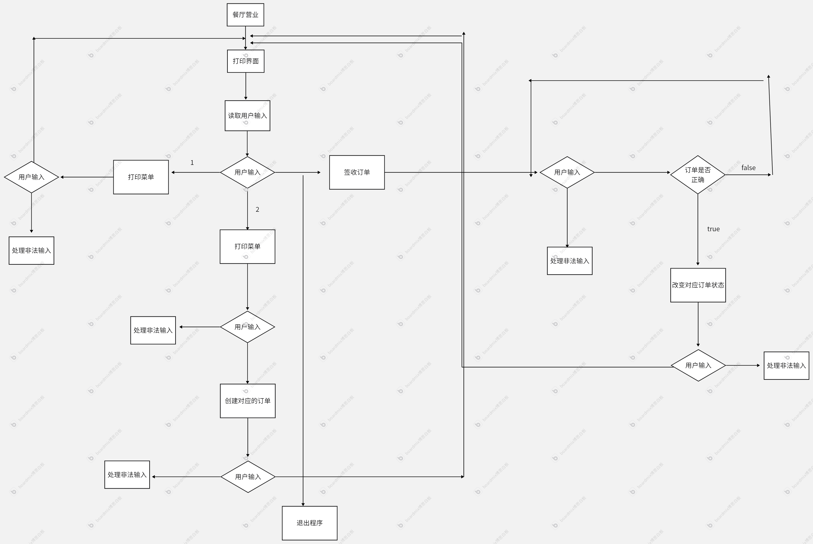
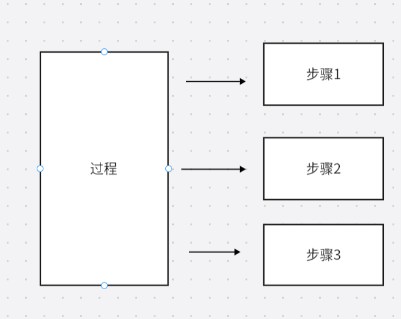
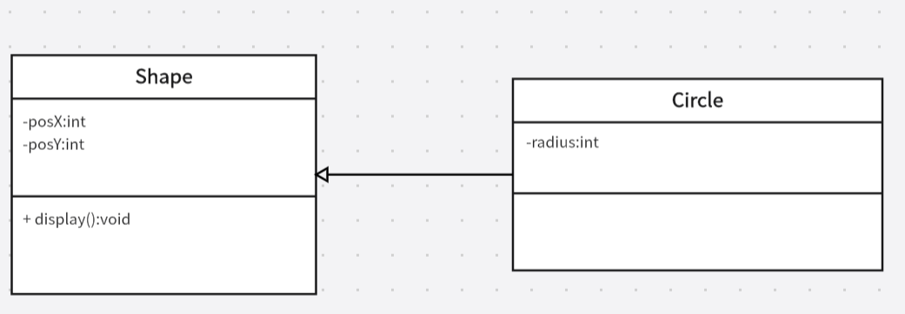
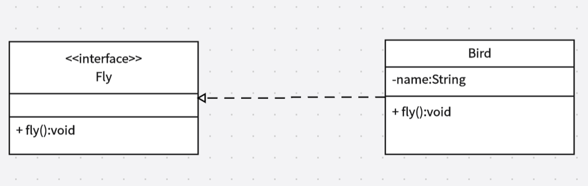
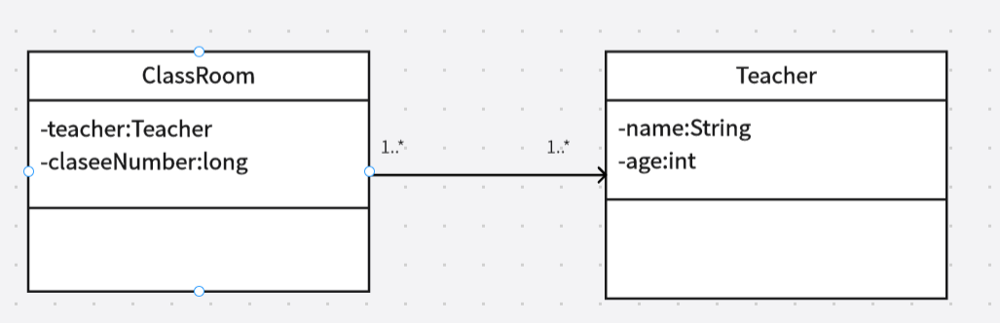
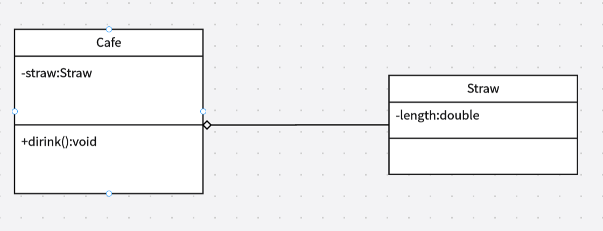
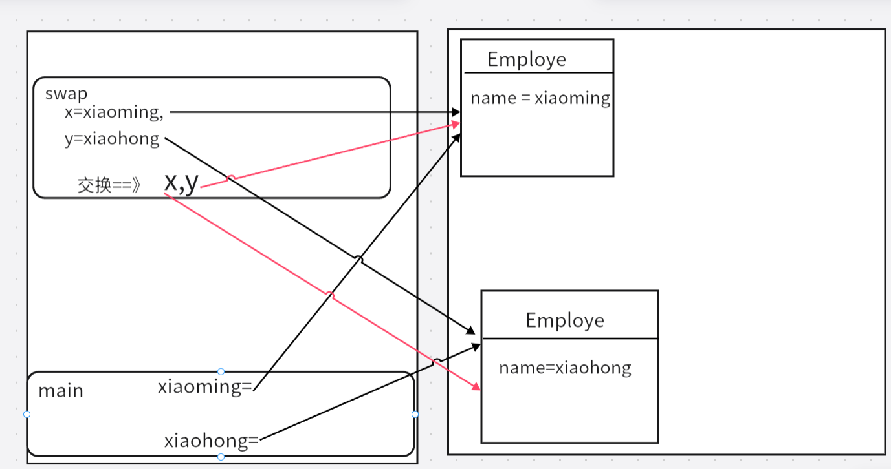
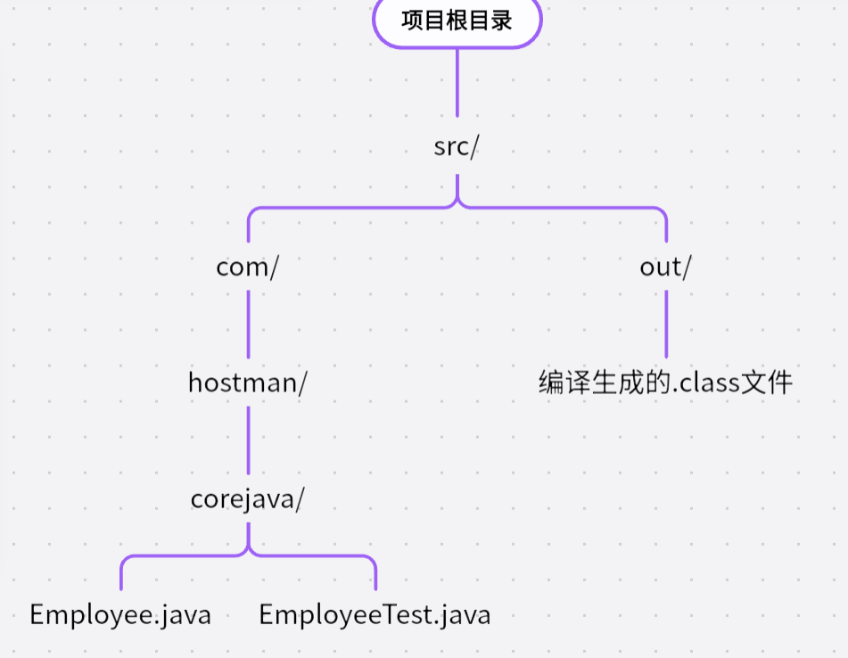
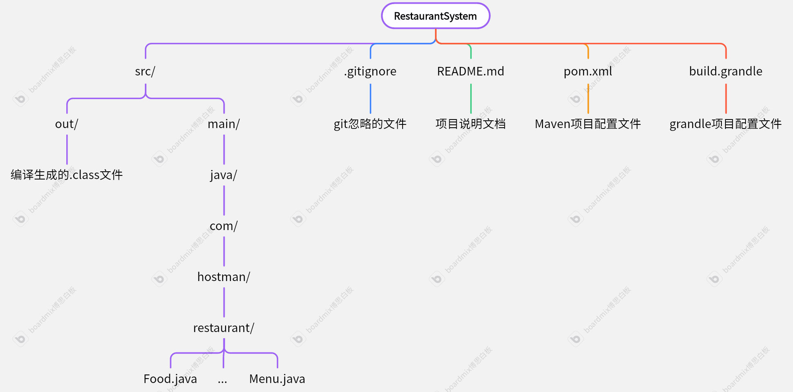

# java SE 学习

## 前言.软件开发基本知识

### 软件

#### 软件的基本知识

软件的定义：一系列指令和数据的集合，用于控制计算机执行特定的任务。

软件的构件：

- 程序
- 数据
- 文档

软件的存储：

- 存储设备

软件的运行：

- 加载到内存，由CPU执行

####  软件的现代构成

1. 程序代码

	- 源代码：高级编程语言编成的代码

	- 编译/解释：机器码或字节码

2. 数据

	- 输入数据

	- 输出数据
	- 配置文件

3. 库和框架

	- 库：提供特定功能的代码集合

	- 框架：提供开发基础结构和工具

4. 运行时环境

	- 解释器/虚拟机

	- 依赖管理

5. 用户界面

	- 命令行界面——CLI

	- 图形界面——GUI

6. 数据库

7. 网络通信

	- API：用于不同软件模块或系统之间的通信

	- 协议：如HTTP、WebSocket等

8. 文档

	- 用户文档

	- 开发者文档

9. 测试和调试工具

17. 部署和运维工具

#### 软件的典型架构

- 单体架构

​	所用功能模块集中在一个应用程序中，适合于小型项目

- 分层架构

	一般包含三个层：

	- 表现层：用户界面
	- 业务逻辑层：核心功能
	- 数据访问层：与数据库交互

- 微服务架构

​	将应用程序拆分为多个独立服务，每个服务负责特定功能，适合大型复杂系统

- 事件驱动架构

​	基于事件触发，适合实时数据处理和异步任务

- 云原生架构

	基于云计算平台，一般包含：

	- 容器

	- 微服务

	- DevOps工具

#### 两个典型的例子

##### 一个本地游戏

包含：

- 游戏程序文件
	- 可执行文件（exe等）
	- 动态链接库
- 游戏资源文件
	- 图形
	- 音频
	- 视频
	- 配置文件
- 游戏引擎和运行时环境
	- 游戏引擎
		- 游戏的核心框架，负责渲染、物理模拟、音频处理等，如Unity、Unreal Engine
	- 运行时环境
		- 游戏运行时需要的库或框架
- 用户界面文件
- 脚本和数据库
- 安装和卸载程序
- 文档和帮助助手
- 更新和补丁文件
- 存档和日志文件
- 其他文件

##### Web程序——一个购物网站

Web程序：

- 一种基于浏览器/客户端与服务器交互的应用程序。
- Web程序可以在任何支持web浏览器的设备上运行，无需独立安装。
- Web程序基于HTTP/HTTPS协议通信
- 通常采用前端+后端+数据库架构
- 一切动态网站都是web程序
- 典型的web程序：
	- 社交网站：Facebook、微博、知乎
	- 电子商务网站：淘宝、京东、亚马逊
	- 在线工具：Google，chatGPT
	- 企业管理系统：OA办公系统、ERP、CRM

现代Web程序一般分为前端（浏览器端）后端（服务器端）两个部分。

- 前端
  - HTML:定义网页结构和内容
  - CSS：控制网页的样式和布局
  - JavaScript脚本：实现动态交互（如点击按钮、加载数据等）
  - 前端资源、库：
  	- 作用：简化开发，提供组件化和状态管理、构建动弹用户界面
  	- 例子：React、Vue.js、Angular
  - 静态资源：图片、文字、图标等
  - 浏览器缓存：
  	- 缓存静态资源以提高加载速度
  	- 例如：localStrong:缓存用户偏好设置
  - API调用：通过HTTP请求于服务器端交互

- 服务器端

	- Web服务器
		- 作用：接收HTTP请求并返回响应
		- 例子：
			- Nginx(音：因金克斯)、Apache(音：阿帕奇):用于静态文件服务和反向代理
			- Node.js、Django、Flask:用于动态请求处理

	- 应用服务器：执行业务逻辑
	- 数据库：存储和管理数据
	- API接口：提供与前端交互的接口
	- 身份验证和授权：管理用户登录和权限控制
	- 缓存：提高数据访问速度，例如Redis缓存热门商品数据
	- 文件存储：存储用户上的文件
	- 消息队列：处理异步任务
	- 日志和监控：记录系统运行状态和错误信息
	- 部署和运维：管理赢得部署和运行

- 前后端交互

	- 通信方式：通过HTTP/HTTPS协议通信
	- 数据格式：通常使用JSON格式传输数据

- 浏览器端的缓存：

	- 当用户打开一个网页，浏览器会将HTML文件、CSS样式表、JS脚本以及图片、字体、视频等资源下载到本地计算机的缓存中。
	- 浏览器按以下顺序进行缓存
		1. HTML文件
			- 浏览器下载HTML文件并解析其中内容
			- HTML代码通常可以通过“查看网页源代码”查看
		2. CSS样式表（.css）
			- 通常作为独立的文件下载并储存在缓存中
			- 可以通过浏览器的“开发者工具”查看
		3. JS脚本（.js）
			- 通常也会被下载到本地缓存，并在本地执行
			- 有些JS脚本是动态加载的，可能不会全部存储在本地
			- 部分JS代码可能经过混淆或压缩，使直接查看变得困难
		4. 图片、字体、视频等资源
	- 以上内容缓存在本地计算机缓存目录，不同浏览器缓存路径不同
	- 浏览器的缓存系统会根据资源的类型和大小，采取不同的存储方式：
		- 内存缓存：
			- 一些短时间内频繁访问的资源（小型JS文件、HTML、CSS）会直接缓存在RAM——内存中
			- 当刷新页面时，浏览器会优先从内存缓存中读取数据而不是重新请求服务器
			- 关闭浏览器后，内存缓存会被清空

		- 磁盘缓存：
			- 绝大多数网页资源（HTML、CSS、JS、图片、字体、视频等）会存储到计算机的缓存设备（HDD/SSD）上
			- 浏览器关闭后这些资源仍然存在
			- 下一次访问时，浏览器会从磁盘缓存读取资源而不是重新下载


​	

​                                                          Web程序架构示意图


### web服务器简介

- Apache:主要用于静态资源服务,不支持Java servelet 和JSP
- Tomcat：一个Java Servelet容器+Web服务器，运行Java编写的应用程序，是Java EE规范的一部分

Apache与Tomcat既可以独立工作，也可以结合使用，Apache作为前端服务器，Tomcat作为后端服务器

Apache+Tomcat模式：

- Apache：
	- 处理静态资源包括图片、CSS、视频等
	- 实现负载均衡——将请求分发到多个Tomcat实例
- Tomcat:
	- 处理java动态内容，主要是Servelet、JSP
- 两者之间通过AJP或HTTP反向代理实现通信。

- 新的前端服务器——Nginx
- Nginx与Apache的对比：

| 特性         | Nginx                                  | Apache                               |
| ------------ | -------------------------------------- | ------------------------------------ |
| 架构         | 事件驱动、非异步阻塞                   | 多进程/多线程；基于线程处理请求      |
| 性能         | 高并发性能优异，适合静态资源和反向代理 | 并发性能较弱但处理动态能力较强       |
| 资源占用     | 内存和CPU占用较低                      | 内存和CPU占用较高                    |
| 配置方式     | 基于文件的配置，语法简洁               | 基于文件的配置，支持.htacess动态配置 |
| 模块化       | 核心功能内置，模块徐编译加载           | 高度模块化，支持动态加载模块         |
| 静态资源处理 | 性能优异、适合高并发静态资源服务       | 性能较好，但不如Nginx                |
| 动态内容处理 | 需通过FastCGI、uWSGI等协议与后端合作   | 内置PHP、Python等动态处理内容        |
| 使用场景     | 高并发静态资源服务，反向代理，负载均衡 | 动态内容处理                         |


- Nginx+Tomcat:
	- 通常Nginx作为前端服务器，Tomcat作为后端服务器
	- 协作内容包括：
		- 反向代理：Nginx接收客户端请求，之后将动态请求转发至Tomcat
		- 负载均衡：Nginx将请求分发到多个Tomcat实例，提高系统性能和可用性
		- 静态资源处理：Nginx直接处理静态资源，减轻Tomcat负担
		- SSL/TLS终止：Nginx处理HTTPS的加密和解密，Tomcat只需要处理HTTP请求
	- 协作的优势：
		- 高性能
		- 可扩展性
		- 安全性
		- 灵活性

Tomcat+Nginx是现代Web应用的常见模式

- Nginx+Tomcat与Apache+Tomcat比较：
	- 若Web应用主要是Java Web应用且需要高并发性能和低资源占用，Nginx+Tomcat是更好的选择
	- 若应用需要处理多种动态内容（如PHP、Python），或需要复杂的模块化支持，Apache+Tomcat是更好的选择

## 第一章 Java程序设计概述

### 1.1 java程序设计平台

java,不只是一种计算机语言，更是一个完整的开发平台，包括：

- 庞大的库
- 执行环境，特点在于：
	- 安全性
	- 跨操作系统的可移植性
	- 自动垃圾收集

### 1.2 Java白皮书关键术语

java白皮书——用于解释设计初衷和完成情况，总结了java语言的11种特性。

1. 简单性
	- java语法相比于c++语法更简洁，没有头文件、指针、结构、联合、操作符重载、虚基类
	- 另外一点是java体积足够小
2. 面向对象
	- java严格符合面向对象思想，但相比c++ Java中没有多重继承，而是用接口替代了这个功能
3. 分布式
	- java对HTTP协议、FTP协议等TCP/IP协议能良好处理
	- java程序能通过URL打开和访问网络上的对象
4. 健壮性
	- java编辑器足够强大，可以检查到很多语言在执行时才能发现的错误
5. 安全性
	- java从设计上避免一些攻击，包括：
		- 运行堆栈溢出
		- 破坏进程外的内催
		- 未经授权读取文件
6. 体系结构中立
	- java的基本数据类型的大小和有关运算都是明确的
		- 二进制数据：固定格式
		- 字符串：Unicode格式
	- 除用户界面有关部分，java其他库能良好的支持平台独立性
7. 解释性
	- java解释器可以在任何移植了解释器的机器执行java字节码。
	- java代码解释过程：

 		


8. 可移植性
	- 正是由于字节码文件与平台无关，只要安装了JVM的计算机都能正确的解释.class文件并获得可执行机器码，因此java具有良好的可移植性
9. 高性能
	- 现目前，利用即时编译技术，使java的执行速度可以媲美传统编译语言。
	- 即使编译：
		- 将执行最频繁字节码转换成机器码
		- 消除函数调用—称为内联
10. 多线程
	- 现目前，摩尔定律快要失效，不再追求更快的处理器而是更多的处理器并让它们保持忙碌
	- 多线程技术能够带来更好的交互响应和实时行为
	- Java能出色的实现并发程序设计
11. 动态性
	- java库能够自由地添加新方法和实例，不会对客户端造成影响

### 1.3 java applet

applet:

- 在网页中运行的java程序
- 需要一个启用java的浏览器来执行字节码
- 目前不再流行

### 1.4 Java发展简史

| 版本 | 年份 | 新语言特性                                           | 类与接口数量 |
| ---- | ---- | ---------------------------------------------------- | ------------ |
| 1.0  | 1996 | java诞生                                             | 211          |
| 5.0  | 2004 | 泛型类 foreach循环 可变参数 自动装箱 元数据          | 3279         |
| 7    | 2011 | 基于字符串的Switch语句 二进制字面量 异常处理增强     | 4024         |
| 8    | 2014 | Lambda表达式 包含默认方法的接口 流 日期/时间库       | 4240         |
| 17   |      | Switch表达式 文本块 instance of 模式匹配 记录 密封类 |              |


从2018年开始，java每6个月发布一个版本，每过一段时间选定一个长期支持版本。

目前最新的长期支持版本是java 17


### 1.5 关于java的常见误解

- 目前的java的即时编译技术使java运行速度与c++相差无几，有些时候能更快
- JavaScript与java没有关系

## 第二章 Java编程环境

### 2.1 安装java开发工具包

Oracle公司提供最新、最完整工具包

不同公司提供了许多OpenJDK构建版本

#### 2.1.1 下载jdk

通过国内国外渠道下载jdk

目前长期支持版本：java 17

​                                  java常见术语

| 术语                    | 解释                                     |
| ----------------------- | ---------------------------------------- |
| JDK                     | 编写java程序的软件                       |
| JRE(Java运行时环境)     | 用来运行java的软件                       |
| SE                      | 用于桌面应用或简单服务器应用的java平台   |
| ME                      | 用于小型设备的Java平台                   |
| EE(现更名为 Jakarta EE) | Java企业级开发平台，应用于大型分布式应用 |
| OpenJDK                 | Java SE的开源实现                        |
| LTS                     | 长期支持版本                             |


- Java SE 与 Java EE
	- Java EE:
		- java企业级开发平台，用于大型分布式应用
		- 如Web应用、企业级应用、微服务
		- Java EE提供了一系列API和规范，包括：
			- Web组件（Servlet、JSP、JSF）
			- 企业服务（EJB、JMS）
			- 数据持久化（JPA、JDBC）
			- 安全性（JAAS）
			- Web服务（JAX-RS、JAX-WS）
			- 依赖注入（CDI）
		- Java EE需要 Java EE服务器（Tomcat、Wildfly等）来运行
	- Java SE:
		- Java标准版，用于开发桌面应用、基础java库、工具类程序
		- 是java语言的基础，包括：
			- Java核心库（java.lang、java.util、java.io等）
			- 集合框架（List、Set、Map）
			- 多线程
			- I/O操作（文件处理、网络编程）
			- JVM和JDK
			- 基础GUI
	- Java SE不包含企业级的Web组件
	- 但Java EE基于 Java SE，开发Java EE应用程序必须安装java SE,因为Java EE运行时环境建立在java SE之上
	- Java EE在语法上和java SE没有区别，包括：
		- 基本语法（变量、数据类型、运算符）
		- 面向对象编程OOP（类、继承、封装、多态、接口）
		- 异常处理
		- 多线程
		- Lambda表达式、Stream API
		- 泛型、注解、反射

​                                            java SE 与 Java EE的区别

| 特性                       | java SE | Java EE                  |
| -------------------------- | ------- | ------------------------ |
| 基本Java语法               | 支持    | 支持                     |
| 集合框架（List、Map、Set） | 支持    | 支持                     |
| I/O操作（文件、网络）      | 支持    | 支持                     |
| 多线程                     | 支持    | 支持                     |
| GUI                        | 支持    | 一般不用于企业开发       |
| JDBC(数据库连接)           | 支持    | 支持，但Java EE更推荐JPA |
| JPA(持久化API)             | 不支持  | 支持                     |
| Servelet(Web开发)          | 不支持  | 支持                     |
| JSP(动态网页)              | 不支持  | 支持                     |
| EJB(企业级Java Bean)       | 不支持  | 支持                     |
| JMS(消息队列)              | 不支持  | 支持                     |
| JAX-RS/JAX-WS(Web服务)     | 不支持  | 支持                     |
| CDI(依赖注入)              | 不支持  | 支持                     |


java SE程序示例：

```java
public class HelloWorld {
    public static void main(String[] args) {
        System.out.println("Hello, Java SE!");
    }
}
```

Java EE程序示例：

~~~java
import java.io.IOException;
import java.io.PrintWriter;
import javax.servlet.ServletException;
import javax.servlet.annotation.WebServlet;
import javax.servlet.http.HttpServlet;
import javax.servlet.http.HttpServletRequest;
import javax.servlet.http.HttpServletResponse;

@WebServlet("/hello")
public class HelloServlet extends HttpServlet {
    protected void doGet(HttpServletRequest request, HttpServletResponse response) 
            throws ServletException, IOException {
        response.setContentType("text/html");
        PrintWriter out = response.getWriter();
        out.println("<h1>Hello, Java EE!</h1>");
    }
}
~~~


上述 Java SE程序是普通的控制台应用

Java EE程序是Web应用，需要服务器运行。


JDK包含：

- java工具：
	- javac
	- java
	- jdb
	- ……
- JRE(JRE中包含JVM)


#### 2.1.2 设置jdk

安装时：

- windows系统：注意路径不要包含空格
- Linux系统：把.tar.gz解压缩

配置可执行文件：

- 将jdk的bin目录添加到*可执行路径*中

- 可执行路径：操作系统查找可执行文件时所遍历的目录

- windows配置可执行路径：

	1. 找到设置
	2. 搜索框查找 environment
	3. 选择Edit environment variables for your account(编辑用户的环境变量)
	4. 找到 Environment variables 对话框
	5. 找到 Users Variables(用户变量)列表
	6. 选择path变量，单击edit
	7. 增加一个变量，值为jdk的bin目录

- liunx系统：

	- 在\~/.bashrc或~/.bash-profile文件的最后一行添加：

		export PATH = jdk路径/bin:$PATH

### 2.2 使用命令行工具

利用命令行工具使用jdk是一种基本技能，可以方便检查jdk时候安装正确。

主要用到两个工具：

- javac:编译器，将源代码编译为字节码.class文件
- java：启动JVM，将字节码解释为可执行文件

==注意==：

- java区分大小写，而java规范要求公共类类名第一个字母必须大写，.java文件名必须与公共类名相同
- 编译器编译时需要添加后缀.java，而使用java运行时不需要后缀
- windows系统注意源代码不要添加隐藏后缀.txt

### 2.3 集成开发环境（边学边记）

使用IDEA

快捷操作：

- ctrl+D:将当行复制粘贴到下一行
- 选中字符后，shfit+F6:重构，修改整个项目中出现的选中的内容
- ctrl+alt+shfit+J:多重选择
- ctrl+/:将选中的内容集体注释

### 2.4 Jshell

在java 9中引进，一种使用java的程序。

工作模式：

读取（读取java表达式）→评估（评估输入）→打印（打印输出并再次开始读取）

- shell:
	- 一种特定的应用程序
	- 核心功能：
		- 解释和执行用户输入的命令，并管理进程、文件系统等操作系统资源
		- 支持脚本编写，能够自动执行任务

| 特性       | shell                        | 一般应用程序                   |
| ---------- | ---------------------------- | ------------------------------ |
| 主要功能   | 解释和执行命令，管理系统资源 | 提供特定功能如编辑文本、浏览等 |
| 交互方式   | 命令行界面CLI                | 图形界面GUI或CLI               |
| 运行环境   | 用户空间，直接与内核交互     | 用户空间，通过API与系统交互    |
| 自动化能力 | 强大的脚本支持               | 有限的脚本或宏支持             |

==注：并非只有Linux才有shell==

不同操作系统的典型shell：

- Linux和类Unix系统：
	- Bash(默认使用)、Zsh、Fish、ksh、Tcsh….
- windows：
	- 传统shell:
		- cmd.exe(命令提示符)：类似于早期的DOS的命令行工具，功能较为基础
		- Power Shell:功能强大，支持脚本和对象操作，适用于系统管理和自动化
	- 新shell:
		- windows Terminal:现代化终端，支持多标签和多种shell
		- WSL:允许在windows上运行Linux发行版及其shell（如Bash）

- 脚本Script:

	- 脚本与应用程序都是用于执行特定任务的软件。但在实现方式、运行环境、用途上有显著区别。

	| 特性     | 脚本                                  | 应用程序                         |
	| -------- | ------------------------------------- | -------------------------------- |
	| 运行方式 | 由解释器逐行解释执行                  | 编译为二进制文件直接运行         |
	| 文件形式 | 纯文本文件                            | 二进制文件                       |
	| 开发速度 | 开发快速，适合小型任务                | 开发周期长，适合复杂任务         |
	| 依赖     | 需要安装解释器                        | 通常独立运行，无需额外依赖       |
	| 用户界面 | 通常为CLI                             | 可以是CLI也可以是GUI             |
	| 典型用途 | 自动化任务，快速原型开发，系统管理    | 大型软件，图形化工具，高性能计算 |
	| 示例     | shell脚本，python脚本，JavaScript脚本 | 浏览器，文本编辑器，游戏         |


## 第三章 Java的基本程序设计结构

### 3.1 Java程序要素

以下是一个简单的JavaSE程序，但是里面包含的内容会在Java所有程序中出现。

~~~java
public class FirstProgram{
    public static void main(Strng[] args){
        System.out.println("goodbye,world!");
    }
}
~~~

- Java区分大小写
- 开头的关键字public称为访问修饰符，用于控制程序的其他部分对这段代码的访问级别
- 关键字class表示这是一个类，Java是一种偏向工程的语言，一切代码都包含在类中。这里可以把类看作程序逻辑的一种容器
- class后面的紧跟着类名，Java的类名必须以字母开头，后面可以跟字母或数字，没有长度限制，但是不能使用Java保留字
	- 但是有标准命名约定：类名采用大写字母开头的名词，之后的每个单词首字母也大写,称为驼峰命名法
	- 源代码文件的命名必须与公共类名相同，用.java作为扩展(使用javac命令需要添加后缀)
	- 当编译器完成编译后，得到的字节码文件后缀为.class，Java编译器会将.class文件放到与.java文件同一个目录结构中（使用java命令不用后缀）
- 当运行已经编译好的程序时，JVM总是从main方法开始执行，Java语言规范约定main方法必须声明为public
- Java中函数也被称为方法
- 方法的程序都属于一对{}，Java中方法的所有代码都必须用{}包裹
	- 大括号的风格怎样都行， Java编译器会忽略空白行
- static表明是静态的，main 方法总是静态的
- void表明main方法没有返回值，不需要return 0
- System.out是一个对象，调用了他的println()方法，Java中的调用语法是 ： *对象.方法名();*
- Java语句必须以分号结束
- println()方法接收一个字符串参数，并将其输出到控制台，之后自动换行
- 除了println(),还有一个print()方法，这个方法不会自动换行，此外，Java还有与c语言中几乎一样的printf()方法用来实现格式控制
- Java的方法可以没有参数，也可以用一个或多个参数

### 3.2 注释

Java有三种注释：

~~~java
//这是一种注释，只能注释这一行后面的内容
/*这也是一种注释，可以包括较长的字符，
也可以跨行*/

/**
*这种注释用来自动生成文档
*/

~~~

注意：/**/不能嵌套使用，也就是在/\*\*/不能再加入/\*或\*/。


### 3.3 数据类型

Java是一种强类型的语言，意味着每一个变量声明时都必须给出它的数据类型

Java有8种基本数据类型：4种整型、2种浮点型、1种布尔型和1种字符类型char

注：

- String字符串不是不是基本类型，而是String类的实例
- Java种有一种类 big number，它的对象可以表示任意精度，但是不是基本类型

#### 3.3.1 整型

| 类型  | 存储需求 | 大致范围                |
| ----- | -------- | ----------------------- |
| byte  | 1字节    | -128~127                |
| short | 2字节    | -32768~32767            |
| int   | 4字节    | 大约超过一点-20亿~+20亿 |
| long  | 8字节    | 在10^18^数量级          |

Java中，数据类型的取值范围与平台无关，只要安装了JVM的机器，在执行Java字节码时，各种类型范围固定，得到的结果也是相同的

能更好的实现跨越平台

长整型数值后有后缀L或l，如4000000L。

十六进制数有前缀0X或0x。如0xFFFF

八进制数前缀是0，如010，这是八进制的8.这很容易混淆，一般不用八进制。

二进制有前缀0B或0b，如0b1001=9。

Java中没有无符号形式的int、short、long、byte等类型

但是，如果非常希望处理无符号数，比如想计算0\~225范围无符号数，可以使用Byte.toUnsignedInt(b)方法，这个方法会得到0\~

225的int值，然后把它转会byte型。

Inter类，Long类都提供了类似的方法来处理无符号数


#### 3.3.2 浮点类型

| 类型   | 存储需求 | 大致范围         |
| ------ | -------- | ---------------- |
| float  | 4字节    | 大约7位有效数字  |
| double | 8字节    | 大约15位有效数字 |

有效数字：从第一个非零数字开始，到最后一个具有实际意义的数(包括0，但不包括前导0或尾随的无意义0)

定点数中：

- 0.000456 三位有效数字 456

- 123.450   6位有效数字 123450

- 1.23000   5位有效数字12300

浮点数中：

例如，132456789.0

- 单精度可能会存储为1.234568*10^8^实际有效数字只有7个

- 双精度可能存储为1.234567890123456*10^15^保持16位有效数字

由于float的有效数字太少，一般需要用浮点数时我们都使用double型

float型有一个后缀f或F，如果没有后缀的小数，一般都默认为double型

有三个比较特别的浮点数值表示溢出出错的情况：

Double.POSITITIVE_INFINITY:正无穷大

Dobule.NEGTIVE_INFITY:负无穷大

Dobule.NaN：不是数

一个整数除以0会得到正无穷大

计算0/0或负数的平方根会得到Double.NAN

注：不能用if(x == Double.NaN)检测一个结果是否为NaN。

因为每个NaN都被设计成不相同的

如果是金融计算等不能接收误差的业务，就不能使用浮点型，而应该使用BigDecimal类


#### 3.3.3 char类型

char类型：存储空间是2字节

最初设计时，希望一个char类型能够表示1个Unicode编码的字符，但随着Unicode发展，2字节16位的空间可能无法表示一个Unicode字符了。

###### 码点与代码单元

码点：

- 字符在Unicode中的唯一编号，表示为U+xxxx形式，如：

	- A 的码点是U+0041

	- ‘中’的码点是U+4E2D
	- 😊（笑脸）的码点是 `U+1F60A`

代码单元：

- UTF-16使用16位，2个字节作为基本存储单位，称为代码单元。
- 基本多语言平面 BMP:
	- 码点范围：U+0000~U+FFFF
	- BMP的字符都可以用一个16位代码单元存储，也就是一个char变量
- 辅助平面：
	- 码点范围：U+10000~U+10FFFF
	- 这些字符必须使用一对代码单元(称为代理对)存储
	- 如：
	- 😊（U+1F60A）的 UTF-16 编码是 **两个代码单元**：
		- 高代理项（High Surrogate）：0xD83D
		- 低代理项（Low Surrogate）：0xDE0A

###### Java中char类型与码点、代码单元的关系

单个char存储BMP中的字符：

~~~java
char ch1 = 'A';
char ch2 = '中';
~~~

对于辅助平面的字符，必须用一对char类型(代理对)存储：

~~~java
char ch3 = '\uD83D'; 
char ch4 = '\uDE0A';
String emoji = "\uD83D\uDEOA"; //存储了😊字符
~~~

总结:

| 概念           | 说明                                      | 例子                                               |
| -------------- | ----------------------------------------- | -------------------------------------------------- |
| 码点 CodePoint | Unicode字符的唯一编号                     | A：U+0041                                          |
| 代码单元       | UTF-16存储字符的基本单位                  | A只要一个代码单元，😊需要两个代码单元               |
| char类型       | Java的16位字符单元，存储UTF-16的代码单元  | char ch = ‘A’;char[] emjoe = {{'\uD83D', '\uDE0A'} |
| 码点和char     | 码点是Unicode编号，而char是UTF-16存储单元 | char不能直接表示U+1F60A,必须使用char代理对         |


可见，char类型只能表示一个UTF-16的代码单元，而String类字符串可以处理完整的字符。所以，最好处理字符时不适用char而使用字符串。或者使用int类型变量存储字符的码点。

(可以用codePointAt()获取Unicode码点)

#### 3.3.4 boolean类型

boolean类型变量只有两种取值true和false。Java中的布尔类型不能转换成整型的1或0


### 3.4 变量与常量

与所有程序设计语言一样，Java使用变量存储值，而常量，就是值不变的变量。

#### 3.4.1 变量声明

在Java中，每个变量都有一个类型，声明时，先指定类型，再指定变量名。

~~~java
int a;
char ch;
boolean isStundent;
~~~

声明必须用;结束

变量名区分大小写

变量名可以是字母数字货币符号和标点连接符(主要是__)组成。

注：

- 这里的字母不止是拉丁文字母，也可以是希腊字母、德语字母等
- 货币符号也不只美元\$,也包括￥、€等
- 但最好不要在自己代码中使用\$作为变量名，因为java编译器或其他工具生成的名字会用这个符号
- 单独的\_是Java保留字，也不可以做变量名

声明可以声明一个变量，也可以声明多个变量，但不推荐一次声明多个变量的风格。

#### 3.4.2 变量初始化

变量声明后，必须要用赋值语句初始化才能使用。

~~~java
int a;
a = 0;
~~~

赋值语句：

变量名 = 表达式或值;

可以把声明和初始化放在同一行：

~~~java
int a = 2;
~~~

Java的变量声明可以放在代码中任何地方，但建议靠近第一次使用变量的位置。

Java不区分变量的声明和定义。

c和c++中：

~~~c++
int i = 10;  //变量的定义
extern int i; //变量的声明
~~~

##### var

从Java 10开始，对于局部变量，如果能从变量的初始值推断出它的数据类型，可以使用var关键字而不用指定数据类型：

~~~java
var age = 12;       //整型
var name = "小明";  //字符串
~~~


#### 3.4.3 常量

Java中使用关键字final指示常量

~~~java
final double CM_PRE_INCH = 2.54;
~~~

final表示这个变量在初始化后不能再赋值了

习惯上常量名全部用大写

在Java中可以创建一个常量以便在一个类中的多个方法中使用，这种常量称为类常量。

~~~java
public class Example{
    final static double CM_PRE_INCH = 2.54;
    public static void main(String[] args){
        double a = CM_PRE_INCH *3;
    }
}
~~~

类常量需要在方法外声明，这样类中其他方法也可以使用这个常量

如果一个常量被声明位public，那么其他类的方法也可以使用这个常量

注：const是Java保留字，但目前没有使用


#### 3.4.4 枚举类型

枚举是一种特殊的数据类型，用以定义一组命名的常量。

枚举可以提高代码的可读性、安全性和可维护性。

Java中使用enum声明枚举类型

~~~java
enum Day{MONDAY,TUESDAY,WEDNESDAY,THURSDAY,FRIDAY,SATURDAY,SUNDAY}
~~~

##### 枚举的优势

1.提高代码可读性

​	枚举可以给常量赋予有意义的名称，使代码更好理解，避免了常量命名不清晰的问题

~~~java
// 使用枚举
enum Day {
    MONDAY, TUESDAY, WEDNESDAY, THURSDAY, FRIDAY, SATURDAY, SUNDAY
}

Day today = Day.MONDAY;

// 使用整数常量
int today = 1; // 1 代表星期一

// 使用字符串常量
String today = "MONDAY";
~~~

2.增强类型安全

   编译器会自动检查枚举值的有效性，避免无效赋值

~~~java
Day today = Day.MONDAY; //正确
today = 1;//编译错误：类型不配
~~~

3.简化代码逻辑

枚举类型可以把相关的常量组织在一起，并提供方法或属性操作这些常量

~~~java
enum Day {
    MONDAY, TUESDAY, WEDNESDAY, THURSDAY, FRIDAY, SATURDAY, SUNDAY;

    public boolean isWeekend() {
        return this == SATURDAY || this == SUNDAY;
    }
}

Day today = Day.SATURDAY;
System.out.println(today.isWeekend()); // 输出: true
~~~

4.支持高级特性

枚举可以定义方法、实现接口、添加字段等，使其功能更强大

5.避免重复定义

枚举将常量集中在一个地方，避免了重复定义和分散管理

6.支持遍历

枚举可以用foreach遍历

~~~java
for(Day day :Day.values()){
    System.out.println(day);
}
~~~

7.工具和框架支持

许多现代框架如Spring和工具如JUnit都支持枚举类型

8.避免硬编码

枚举可以减少代码中的硬编码，使代码更易于维护和扩展

~~~java
enum Status {
    PENDING, APPROVED, REJECTED
}

Status status = Status.PENDING;
~~~

当需要添加新状态时，只用修改枚举定义，并不会影响到使用枚举的其他代码

9.枚举线程安全

枚举是线程安全的，因为在JVM中是单例的。

10.枚举支持序列化

枚举内置了序列化机制，不需要额外实现Serializable接口，使得枚举在网络传输或持久化时更加方便

### 3.5 运算符

运算符用于连接值。

3.5.1算术运算符

算术运算符包括+  -   \*和\以及取模运算%

对于\：

只有当两个操作数都是整数时，表示整数除法，否则都会变成浮点数除法

#### 3.5.1取模运算

作用：计算两个数相除后的余数

###### 1.定义

a%b = r,其中：

- a:被除数
- b:除数
- r:余数，满足0<=r<b

###### 2.取模运算的作用

利用取模运算的特性，可以运用于计算机程序设计的多种场合：

- 判断奇偶性

	- 通过取模运算可以快速判断奇偶

	- ~~~java
		int number = 7;
		if(number%2==0){
		    .......
		}
		~~~

- 遍历循环

	- 只要除数不变，即使被除数变化，取模运算的结果也总是保持0到除数-1的循环，利用这个机制，可以实现循环索引

	- ~~~java
		int[] array = {1, 2, 3, 4, 5};
		for (int i = 0; i < 10; i++) {
		    int index = i % array.length; // 循环索引
		    System.out.println(array[index]);
		}
		~~~

- 限制范围

	- 取模运算可以把一个数限制在某个范围

	- ~~~java
		int value = 15;
		int range = 10;
		int result = value % range; // 将 15 限制在 0 到 9 之间
		System.out.println(result); // 输出: 5
		~~~

- 哈希函数

	- 取模运算常用于哈希函数中，将大范围的数映射到固定范围

- 时间计算

	- 取模运算可以用于时间单位的转换，例如将秒转换成分钟:秒格式

	- ~~~java
		int totalSeconds = 125;
		int minutes = totalSeconds / 60; // 分钟
		int seconds = totalSeconds % 60; // 秒
		System.out.println(minutes + " 分钟 " + seconds + " 秒"); // 输出: 2 分钟 5 秒
		~~~

- 周期性操作

	- 取模运算可以运用于处理周期性操作，例如队列的实现

- 加密算法

	- 取模运算在加密算法（如RSA）中也有很多应用

###### 3.特性

取模的结果始终保持0~b-1(b是除数)

负数取模：当被除数为负数，取模的结果取决于编程语言的实现。Java中，结果的符号与被除数一致。

~~~java
System.out.println(-10 % 3);  // 输出: -1
System.out.println(10 % -3);  // 输出: 1
System.out.println(-10 % -3); // 输出: -1
~~~

(注：从数学上来讲，取模运算的结果应该与除数一致，而取余运算才是符号与被除数一致。所以严格来说Java实现的其实是取余运算)

0%任意非零数 = 0

任意数% 0 是未定义的除零行为，会报错

#### 3.5.2 数学函数与常量

在Java中，大部分可能会使用的数学函数都属于Math类。

想使用Math类中的方法，用两种格式：

~~~java
double x =4;
double y = Math.sqrt(x);
~~~

或者直接在源文件中引入Math类：

~~~java
import static java.lang.Math.*;

double x = 4;
double y = sqrt(x);
~~~

注：Math类中的方法大部分是静态方法，不处理任何对象

常见的Math方法：

- sqrt(x):计算x的平方根并返回
- pow(x,a):计算x的a次幂(x^a^)，Java中没有幂运算运算符，必须用这个方法
- 常见的三角函数：
	- Math.sin
	- Math.cos
	- Math.tan
	- Math.atan
	- Math.atan2
- 常见的对数和指数函数：
	- Math.exp
	- Math.log
	- Math.log10
- 表示Π和e的常量：
	- Math.PI
	- Math.E

注：

1. Math中涉及到除法的方法都使用的是浮点除法，如果希望实现完全准确的结果，应该使用StrictMath类，这个类能确保在所有平台得到完全相同的结果。
2. 使用Math.multiplyExact()等方法也可以计算加减乘除等，同时能在发生溢出时抛出异常，而直接使用运算符则不会，例如若使用int型计算10亿\*3,只会把溢出导致的错误结果存回变量中，这种错误编译器无法发现。

#### 3.5.3 数值类型之间的转换


实线代表了可以实现没有精度损失的转换

而虚线代表了可能会造成精度损失

原则上来说，存储要求小的数据类型转到存储要求大的不会有损失，反之则可能造成损失，这很好理解，就像小孩子可以睡大人床，但成年人不能谁的下婴儿床。

但是要注意：虽然int和float存储要求都是4个字节，但是从int转向float会有精度损失。因为float只有7位有数字，但Int的范围要超过20亿也就是9位有效数字。long转换成double也是类似的道理。

但是虽然有可能造成精度损失，float本身采用科学计数法，能够表示的范围能到10^38^左右，范围远比int大，所以int到float仍然能自动类新版转换。

在进行二元运算时，首先会自动把两个操作数转换成相同数据类型，再进行计算，转换的原则是：

- 如果有一个操作数是double，都转换成double类型；
- 否则，如果有一个操作数是float类型，都转换成float类型；
- 否则，如果有一个操作数是long类型，都转换成long类型；
- 否则，都转换成int类型。

#### 3.5.4 强制类型转换

如果确实需要将一种大范围的数据类型转换成小范围的话，就需要强制类型转换。

语法：

~~~java
double x =5.99;
int nx = (int)x ;     //nx = 5
~~~

当把浮点数转换成整型时，会舍弃所有小数部分

如果希望按照舍入的规则进行转换，可以使用Math.round方法

~~~java
double x = 9.97;
int nx = (int)Math.round(x);  //此时nx=10
~~~

要注意的时Math.round()方法返回的对象也是double型，需要再对结果进行一次强制类型转换

#### 3.5.5 赋值

赋值语句本身就是一种表达式，因此赋值语句本身也会有一个值，这个值就等于=右边的值

~~~java
int a,b;
a=(b=4);        //这里"b=4"这个式子值为4，所以a的值也赋成了4
~~~

逻辑上与数学的连等差不多，但是赋值表达式和数学的等式是完全不同的，数学上不存在x=x+1这种表达，赋值表达式完全可以

在赋值语句中，可以使用二元运算，比如+= -=  \*=  /=  %= …

比如 ：

~~~java
x+=1;     //等价于 x=x+1
~~~

#### 3.5.6 自增自减运算

Java中也支持使用++或-\-表示自增自减，规则也是同样的：

前缀时表示先自增自减再参与其他运算；

后缀时表示先参与其他运算再自增自减

~~~ java
int m =7;
int n =2;
int result = m*++n;   //result = 21
int result2 = m*n++;  //result2 = 14
~~~

但这种写法降低代码可读性，容易引起他人误解，并不推荐

#### 3.5.7 关系运算和boolean运算

| 符号 | 解释                                       |
| ---- | ------------------------------------------ |
| ==   | 两边的式子的值是否相等                     |
| !=   | 两边的式子的值是否不相等                   |
| &&   | 两边的式子都为真时表达式为真，否则都为假   |
| \|\| | 两边的式子都为假时表达式为假，否则取值为真 |

&& 和 ||采用了短路策略：

- &&左边的式子如果为假就不再运算右边的式子直接取值false
- ||左边的式子如果为真就不再运算右边的式子直接取值为true
- 可以利用这个策略避免计算/0等，比如： if(y!=0 &&x/y>3)….这样只要y=0就不会再去计算右边x/y

#### 3.5.8 条件运算符

java提供了 *条件？ ：* 运算符，也成为三目运算符。

格式：

条件？表达式1 ： 表达式2

当条件为真时，整个运算取值为表达式1的值，否则取值为表达式2的值

#### 3.5.9 switch 表达式

switch表达式是java14引进的，当我们需要在多个值做出选择时，可以用这种表达式。

要注意的是switch表达式功能和结构与switch语句类似，但是switch表达式的本质是一种表达式，是有值的，而switch语句是一种控制语句，只能执行代码。

语法:

~~~java
int seasonCode = 1;
String seasonName = switch(season){
        case 0 -> "Spring";
        case 1 -> "Summer";
        case 2 -> "Fall";
        case 3 -> "Winter";
        default -> "???";
}
~~~

case标签除了整型外还可以是字符串字面量或者枚举常量

case标签后可以提供多个值，用,分隔

~~~java
int numbers = switch(condition){
        case 1,2,3 -> 6;
        case 4 -> 100;
        default -> 999;
}
~~~

如果case标签后是枚举常量，不需要设计default，同时也不需要给出枚举名，但如果是整型或字符串，必须设计default，因为switch表达式必须有一个值

~~~java
enum Size {"SMALL","MINDIM","LARGE","EXARE_LARGE"};
Size item = ...;
String label = switch(item){
        case SMALL -> "s";  //这里的枚举常量不需要写成Size.SMALL形式
        case MINDIM -> "m";
        case LARGE -> "L";
        case EXARE_LARGE -> "XL";
        //不需要default
}
~~~

#### 3.5.10 位运算符

Java中实现的位运算：

| 运算符 | 名称        | 功能描述                                                     |
| ------ | ----------- | ------------------------------------------------------------ |
| &      | 按位与 AND  | 两个操作数对应位都是1时，结果位1，否则为0                    |
| \|     | 按位或 OR   | 两个操作数对应位有一个是1时，结果为1，否则为0                |
| ^      | 按位异或XOR | 两个操作数对应位不同时结果为1，否则为0                       |
| ~      | 按位取反NOT | 将操作数每一位取反                                           |
| <<     | 左移        | 将左操作数的二进制位向左移动，移动右操作数指定的位数，低位补0 |
| >>     | 带符号右移  | 将左操作数的二进制位向右移动，移动右操作数指定的位数，高位补符号位(正数补1负数补0) |
| >>>    | 无符号右移  | 将左操作数二进制位向右移动，高位补0                          |

位运算的典型应用

- 权限控制

	- 用二进制位表示权限，如读、写、执行，通过位运算高效组合和校验权限

	- ~~~java
		// 定义权限标志
		int READ = 1 << 0;   // 0001
		int WRITE = 1 << 1;  // 0010
		int EXECUTE = 1 << 2;// 0100
		
		// 组合权限
		int userPermissions = READ | WRITE; // 0011（可读可写）
		
		// 检查权限
		boolean canRead = (userPermissions & READ) != 0; // true
		boolean canExecute = (userPermissions & EXECUTE) != 0; // false
		~~~

- 数据压缩与优化

	- 用位运算代替乘除，提升性能，比如x<<3 = x*8

	- 想象十进制中，一个数1234，把小数点向有移动两位

	- 变成了123400，相当于1234*100

	- 相对于小数点来说，数字向左移动了，所以叫做左移

	- ~~~java
		int x = 5;
		int result1 = x << 3; // 相当于 5 * 8 = 40
		int result2 = x >> 1; // 相当于 5 / 2 = 2（向下取整）
		~~~

- 网络协议解析

	- 解析二进制协议时，可以用位运算提取特定字段，如IP地址、报文头等

	- ~~~java
		int packetHeader = 0xABCD1234;
		
		// 提取高 16 位
		int version = (packetHeader >> 16) & 0xFFFF; // 0xABCD
		
		// 提取低 16 位
		int data = packetHeader & 0xFFFF; // 0x1234
		~~~

- 高效存储状态

	- 用整数的二进制位表示多个布尔状态，可以节省内存

	- ~~~java
		// 用 4 位表示 4 个开关状态
		int switches = 0;
		
		// 打开第 2 个开关（从右往左数，索引从 0 开始）
		switches |= 1 << 1; // 0010
		
		// 关闭第 3 个开关
		switches &= ~(1 << 2); // 1111 -> 1011
		~~~

- 哈希算法与加密

	- 位异或常用于哈希计算或简单加密

注意：

1. 位运算只能用于整型
2. 移位操作受到数据类型的位数限制，比如int，右操作数的范围是0~31(4个字节只有32位，1位用来表示符号)
	- 当超过这个范围时，就要对32做取模运算
	- 如 1<<35 就等同于 1<<3
3. 右移>>保留符号位，而>>>始终在高位补0
4. 位运算会降低代码可读性，需要添加注释说明逻辑

位运算直接操作二进制位，比常规运算更快，适用于：

- 高频计算，如实时数据处理
- 内存敏感场景，如嵌入式系统或大规模数据处理

#### 3.5.11 括号与运算符优先级

| 优先级 | 运算符                                              | 结合性   |
| ------ | --------------------------------------------------- | -------- |
| 1      | []  .   ()                                          | 从左向右 |
| 2      | ! ~ ++ -\- +(表示正)  -（表示负）(强制类型转换) new | 从右向左 |
| 3      | \* /  %                                             | 从左向右 |
| 4      | +  -                                                | 从左向右 |
| 5      | << >> >>>                                           | 从左向右 |
| 6      | ==  !=                                              | 从左向右 |
| 7      | &                                                   | 从左向右 |
| 8      | ^                                                   | 从左向右 |
| 9      | \|                                                  | 从左向右 |
| 10     | &&                                                  | 从左向右 |
| 11     | \|\|                                                | 从左向右 |
| 12     | ？:                                                 | 从右向左 |
| 13     | = += -= \*= /= %= &= \|= ^= <<= >>= >>>=            | 从右向左 |

总结：

优先级最高的是方法调用、括号

之后是一元运算符(包括表示正负的+-)

之后是算术运算 乘除>+-

之后是移位运算

之后是判断相等

之后是位运算  与>异或>或

之后是逻辑运算 与>或

之后是三目运算

最后是赋值运算

注意：

- 这里虽然自增自减运算符顺序在第二级别，
- 但他的意思其实是取自增自减运算值的优先级，可以理解为(i++)这个表达式优先级比乘除高；
- 但是前缀和后缀的特性仍然会决定是在计算前还是计算后改变i的值
- 比如 int i =2 ; i = i*i++
- 这里会先获得(i++)的值 2
- 然后计算i*(i++) = 4
- 然后i 自增 i的值变为3
- 最后进行赋值计算，把(i*(i++))的值赋给i ，所以i本身3的值被覆盖掉
- 最终i = 4
- 总之这并不是一种很好的代码风格，让人非常困惑，不推荐

### 3.6 字符串

从概念上讲，字符串就是Unicode字符的集合

从本质上讲，字符串是Java预定义类String的实例对象,String类属于Java标准库，不需要在源文件中额外引入

每个双引号括起来的内容都是String的实例

不能讲String理解成char的数组，如果从c语言角度思考，Java的字符串更像是：

~~~c
char * str = "字符串";
~~~

#### 3.6.1 子串

String类的subString()可以从一个大的字符串中提取子串：

~~~java
String greeting = "Hello";
String s = greeting.subString(0,3); //s = "Hel"
~~~

subString方法：

- String subString(int beginIndex)
- String subSrting(int beginIndex,int endIndex)
- 返回一个新的字符串，这个字符串包含从beginIndex到字符串末尾，或者endIndex-1的所有代码
- 这个方法很容易得到字符串长度，length = endIndex-beginIndex

#### 3.6.2 拼接

Java语言使用+来来连接两个字符串，用于组成一个新的字符串

新的字符串完全按照拼接时的顺序：

~~~java
String str = "Woshi";
String name = "Xiaoming";
String introduce = str+name; //introduce = "WoshiXiaoMing"
~~~

可以讲任意一个非字符串的值与字符串使用+拼接，会自动转换成字符串

实际上，任何一个Java对象都可以转换成字符串

如果希望连接多个字符，并增加一个分割符，可以使用静态的String.join()方法

~~~java
String all = String.join("/","S","M","L","XL");//all = "S/M/L/XL"
~~~

在 Java 11中，有一个动态repeat方法用来重复字符串

~~~java
String repeated = "Java".repeat(3); //repeted = "JavaJavaJava"
~~~

#### 3.6.3 字符串不可变

String类没有提供任何方法来对字符串进行修改，但可以修改字符串变量的值

例：

~~~Java
 String str = “Hello” ;//字符串“Hello”就一定没有办法修改
 str  = str.subString(0,3)+"p!"； //str = "Help!"
~~~

点类似于c语言中的指针与结构体的关系，可以让指针指向不同的结构体，但作为字符串的那一块结构体java不允许修改

~~~c
//java 中修改字符串变量类似于以下操作：
char* greeting = "Hello";
char* temp = (char*)malloc(sizeof(char)*6);
strncpy(temp,greeting,3);
strncpy(temp+3,"p!",3);
greeting = temp;
~~~

#### 3.6.4 检测字符串是否相等

可以使用equals方法检测两个字符串是否相等

s.equals(t);

相等返回true,否则返回false

这里的s和t可以是字符串变量，也可以是字符串字面量，如“hello”.equals(str)

如果希望检查两个字符串是否相等并且忽略大小写，可以使用equalsIgnoreCase方法，如”Hello“.equalsIgnoreCase(“hello”);

不能使用 ==运算符检测两个字符串是否相等

因为 == 不会比较字符串是否存储在同一个位置，而不是去比较字符串的内容

如果字符串真的在同一位置上，那么理论上它们确实相等

但是JVM中，只会共享字符串字面量，不会共享+或subString（）等生成的新字符串

也就是说：

~~~java
String greeting = "Hello";
if(greeting == "Hello")...     //这个有可能是真的
if(greeting.subString(0,3) == "Hel")   //这个判定很可能并不能通过
~~~

这样的Bug是编译器无法检查的

因此，Java中判断字符串相等应该始终调用equals方法

（还有一个compareTo方法，类似于c语言中的strcmp方法）

~~~java
if(greeting.compaerTo("Hello") == 0)
//按照字典顺序，如果greeting位于"Hello"之前，返回一个负数，如果在"Hello之后返回一个正数，如果相等返回0"
~~~

虽然这个方法也能判断字符串相等，但看起啦确实不如equals清晰

#### 3.6.5 空串与null

空串也是一种字符串，有它的长度0，和内容（空）

但是，String类变量可以存储一个特殊值null，表示这个变量目前不与任何对象关联，不能在null值上调用方法

检测一个字符串是否是null，可以使用 ==

if(str == null)

但是，如果希望检测一个字符串既不是null也不是空串，就要配合equals方法：

if(str != null && !str.equals(“”))

#### 3.6.6 字符串长度与代码单元与码点

Java字符串是char类型的值的序列

char类型变量存储的是Unicode的代码单元，BMP字符只需要一个代码单元，而辅助平面的字符需要两个char类型，也就是两个代码单元

==String的length方法返回的也是是字符串代码单元个数==

想要得到严格意义上的字符个数，也就是码点的个数，需要调用codePointCount方法

~~~java
int cpCount = greeting.codePointCount(0,greeting.length());//返回0到greeting.length()-1之间的码点个数
~~~

想得到第i个码点，可以使用以下语句：

~~~java
int index = greeting.offsetByCodePoints(0,i);//返回从0开始，i个码点后的码点索引
int cp = greeting.codePointAt(index);//返回给定位置的码点
~~~

如果希望得到一整个字符串的码点，可以使用codePoints方法，它会生成一个int值的流，每一个int值对应一个码点，然后使用toArray()转换成数组

~~~java
int[] codePoints = str.codePoints().toArray();

//反过来也可以把一个码点数组转换成字符串
String str2 = new String(codePoints,0,codePoints.length);
~~~

总之，要始终牢记一个原则，对于字符类型的数据，都建议用String类型处理而不是char类型。

#### 3.6.7 构建字符串

有时，如果需要多次的用短的字符串构建新的字符串，例如，按键或者从文件中读取单词

使用拼接的方法效率比较低，每次拼接都会创造一个新的字符串对象

可以使用StringBuilder (称为字符串构建器)类来处理需要频繁修改的情况：

~~~java
StringBuilder builder = new StringBuilder();    //先构建一个新的字符串构建器
//当每次需要添加时，调用append方法
builder.append(ch);   //可以添加单个字符
builder.append(str);  //可以添加字符串
//当构建完成时，需要调用toString()方法将StringBuilder类对象转换成String对象
String result = builder.toSting();
~~~


注：Sting类和StringBulider类都有很多方法，有些比较常用，有些可能不经常用但关键的时候可能非常需要这些方法。

死记硬背没有意义，要多查阅Java的API解释文档


#### 3.6.8 文本块

Java 15新增加了文本块机制

主要用来实现跨越多行的字符串

语法：

~~~java
String text = """
Hello
world
""";
~~~

使用一对三个双引号标记。

文本块开头三个双引号后需要换行，这个换行符不计入字符串的内容，之后的换行符都会被视作字符串的真实内容

最终，text的值具体为：“Hello\nworld\n”

文本块比较适合编写其他语言的代码如SQL或者HTML

常规字符串中的转义序列在文本块中也能使用

文本块有一个单独的转义序列\，表示忽略掉这个换行符

比如：

~~~java
"""
Hello \
goodebye.
""";
~~~

等同于“Hellogoodebye”

文本块会标准化结束符，删除末尾的空白符，并把windows系统的\r\n换行符简化为\n

对于缩进，也就是放在文字前面的空白符，文本块会删除公共空白符(就是作为一个语句本身的缩进)然后保留内部的


### 3.7 输入与输出

#### 3.7.1读取输入

在Java中，将输出打印到标准输出流(控制台窗口)非常简单，只需要调用System.out.println

但读取标准输入流System.in稍微要复杂一些

~~~java
//首先，要创建一个与标准输入流关联的Scanner对象
Scanner in = new Scanner(System.in);
//然后，使用Scanner的各种方法读取输入

String name = in.nextLine();  //读取一行输入
String firstName = in.next(); //读取一个单词，以空格作为分隔
int age = in.nextInt(); //读取一个整数
double monery = in.nextDouble();//读取一个浮点数
~~~

注：Scanner类属于java.util包，并不在Java标准库，使用Scanner类需要先用import引入

Scanner类的输入是可见的，所以不适合从控制台读取密码

想要读取密码，可以使用Console类

~~~java
Console cons = System.console();
String username = cons.readLine("User name:");
char[] passwd = cons.readPassword("Password:");
~~~

为了安全起见，将密码存储在char数组中而不是字符串中，完成对密码处理后，应该马上用一个填充数组覆盖数组元素

使用Console对象处理输入不如Scanner类对象方便，Console对象必须一次读取一行输入，而且没有办法读取单个单词或者整数等

#### 3.7.2 格式化输出

为了控制字符的输出格式，Java中也实现了printf方法，用法与c语言中基本一致，都是用格式说明符占位，然后跟参数的形式

~~~java
System.out.printf("Hello,%s",name);
~~~

格式说明符格式：

%+参数索引(可选)+\$(可选)+标志+宽度(可选)+.+精度+转换字符

参数索引：

在printf方法中，可以使用\$指定参数的位置，即参数索引，这样即使参数顺序不同，也可以按照指定的顺序进行格式化

~~~java
public class PrintfExample {
    public static void main(String[] args) {
        System.out.printf("%2$d, %1$d, %3$d%\n", 10, 20, 30);
    }
}
//输出： 20，10，30
~~~

%2$d→ 输出**第二个**参数（20）

%1$d → 输出**第一个**参数（10）

%3$d → 输出**第三个**参数（30）

如果不使用\$，参数会按照默认顺序依次替换格式说明符

标志：

| 标志                    | 作用                 | 示例        |
| ----------------------- | -------------------- | ----------- |
| +                       | 打印正负号           | +333.3      |
| 空格                    | 在正数前面加一个空格 | \|  333.3\| |
| 0                       | 增加前导0            | 00333.3     |
| -                       | 字段左对齐           | \|333.3  \| |
| (                       | 将负数包在括号里     | (333.3)     |
| ,                       | 增加分组分隔符       | 3,333.33    |
| #(对于定点浮点数格式)   | 总是包含一个小数点   | 3333.       |
| #(对于十六进制或八进制) | 总是包含前缀0X或0    | 0XCAF1      |
| \$                      | 指定参数索引         |             |
| <                       | 重复使用上一个参数   |             |

<标志：重复使用上一个参数

例如：

~~~java
public class PrintfExample {
    public static void main(String[] args) {
        System.out.printf("%d, %<o, %<x", 16);
    }
}
//输出： 16,20,10
~~~

说明：

%d   =>以十进制格式输出16

%<0    => 以八进制格式重复上一个参数 16  结果是 20

%<x    =>  以十六进制格式重复上一个参数 16  结果是 10


转换字符：

| 转换字符 | 类型                              | 示例       |
| -------- | --------------------------------- | ---------- |
| d        | 十进制整数                        | 159        |
| x或X     | 十六进制整数                      | 9f         |
| 0        | 八进制整数                        | 237        |
| f或F     | 定点浮点数                        | 25.6       |
| e或E     | 指数浮点数                        | 1.59e+01   |
| g或G     | 通用浮点数 (输出e和f中较短的情况) |            |
| a或A     | 十六进制浮点数                    | 0x1.fccdp3 |
| s或S     | 字符串                            | hello      |
| c或C     | 字符                              | H          |
| b或B     | 布尔                              | true       |
| h或H     | 散列码                            | 42628b2    |
| %        | 百分号                            |            |

可以多个标志组合控制，例如

~~~java
System.out.printf("%,.2f",1000.0/3.0)
//输出 3,333.33
~~~

可以使用静态的String类的format方法创建一个格式化的字符串

~~~java
String str = String.format("hello,%s",name);
~~~


#### 3.7.3 文件输入与输出

可以使用Scanner对象读取一个文件

~~~java
Scanner in = new Scanner(Path.of("mytext.txt"),StandardCharsets.UTF_8);
~~~

这里第一个参数指定文件的路径，必须要用Path.of来包含路径，否则Scanner会把输入的路径理解成一个字符串而不是你想读取的文件

第二个参数指定读取文件的编码标准

之后就可以用Scanner类的方法读取文件了

想要写入文件，需要构造一个PrintWriter对象。

~~~java
PrintWriter out = new PrintWriter("myfile.txt",StandardCharsets.UTF_8);
~~~

构造时需要提供文件名和字符编码

如果文件不存在，会创建这个文件。

PrintWriter同样有print,println,printf方法


### 3.8 控制流程

Java可以使用条件语句和循环结构来确定控制流程

#### 3.8.1 块作用域

块 block ：由若干条Java语句组成，并用一对大括号括起来，块的主要作用是确定变量的作用域

一个块中可以嵌套另一个块

~~~java
public static void main(String[] args){
    int n;   //作用域是整个mian方法
    {
        int k;     //k的作用域只在这个大括号中
    }
}
~~~

注意：Java中不允许重定义变量，也就是说，内层块里面不不能声明和外层块中同名的变量。(c++中是可以的，内层定义会覆盖外层定义)

可以在Java程序结构中原本只能放一条语句的地方放置块语句

#### 3.8.2 条件语句

Java中，条件语句的格式为：

if(条件)语句

条件必须用小括号括起来，当条件的值为true时，执行这个语句，这个语句也可以是块语句

if常常搭配else

if(条件){

 ….

}else{

 …..

}

else表示if中条件不成立时才能执行的语句或块

即使有多个if，else也只与最近的if组成一组

~~~java
if(x<=0)if(x==0) sign = 0; else sign =-1;
~~~

else与第二个if配对，只有x<0时sign才等于-1

最好使用大括号让代码更加清晰

也可以反复使用多个 if…else if …

~~~java
if(age >= 5){
    ...
}
else if(age <5 && age >1){
    ...
}
else if (age =<1){
    .....
}
~~~

注意，多个else if之间的条件应该是互斥的


#### 3.8.3 循环

while(条件) 语句

while会在条件为真时执行语句，这里的语句可以是代码块

每一次while循环都是先判断条件再执行，当条件变为false就会退出；如果一开始条件就是false，那么while一次也不会执行

如果希望至少执行一次，可以使用do 语句 while(条件)

do while 会先执行代码再进行循环

#### 3.8.4 确定性循环

for循环是支持迭代的一种通用结构循环

Java中for循环语法差异不大

格式：

for(计数器初始化;循环条件;如何更新计数器){

​		循环体

}

注意：只有当循环体执行完后才更新计数器

Java允许在for循环的各个部分放置任意表达式

但是一般规定3个部分应该保证对同一个计数器进行初始化、判断和更新

注：

1. 判断循环条件时应该格外注意判断浮点数相等的情况 

~~~java
for(double x = 0;x!=10;x+=0.1)......
~~~

  由于舍入误差和浮点数特性这很有可能变成一个死循环

  因为二进制无法准确的表达0.1

   所以x可能从9.999998突然变成10.000009

2. 在循环体中声明的变量作用域只在循环体内部，因此如果希望在循环体之外使用循环计数器最终值等，就应该确保在循环体之外进行声明


事实上，for循环只是while循环的简化形式，理论上，任何一个for循环都可以转换成while循环

~~~java
for(int i =0;i<10;i++){
    System.out.println("hello");
}
//完全等价于
int i = 0;
while(i<10){
    System.out.println("hello");
    i++;
}
~~~


例：利用for循环计算组合数：

(组合数C（m,n）= m!/n!\*(m-n)!;排列P(m,n)=m!/(m-n)!)

从1~50，50个数字中抽6个数抽奖：

(50\*49\*48\*47\*46\*45)/(1\*2\*3\*4\*5\*6)

步骤：

1. 分析数学表达式

2. 抽象出迭代原理  ：n个数抽K： n \* (n-1)\*…..\*(n-k+1)/1\*2\*.…*k

3. 利用for循环计数器进行替代

	~~~java
	int result = 1;
	for(int i=1;i<=k;i++){
	    result = result*(n-i+1)/i;
	}
	~~~

#### 3.8.5 多重选择：switch语句

在处理一个表达式可能产生多个值时，使用ifelse控制有些笨拙，可以考虑switch语句，以及Java 14 引进的swtich表达式

经典switch语句：

~~~java
int choice = ...;
switch(choice){
    case 1 :
        ...;
        break;
    case 2:
        ...;
        break;
    default:
        ....;
        break;
}
~~~

switch语句从与选项值匹配的case执行，知道遇到一个break，或者执行到语句结束；

如果没有匹配的case，则执行default标签

如果我们担心自己遗漏了break导致多个case被执行，可以在编译代码时添加-Xlint:fallthing选项：

~~~cmd
javac -Xlint:fallthing wenjian.java
~~~

这样，如果某个分支缺少break语句，编译器就会给出警告

这种不加break标签让多个case标签执行的行为，我们也称为直通行为 

如果在编译器添加了上述选项，又确实希望某些switch语句执行这种直通行为，可以给外围方法添加一个@SuppressWarnings(“fallthing”)注解

注解：为编译器或者处理Java源文件或类文件的工具提供信息的一种机制。

在Java14中，引入了新的switch形式–switch表达式

语法：

~~~java
int result = switch(xuanze){
        case "Spring" -> 1;
        case "Summer" ->2;
        default -> 0;
}
~~~

switch表达式不需要使用break就能避免直通行为发生

不能在一个switch表达式中混用->和:

switch表达式每一个分支都必须要产生一个值，如果希望在标签后不直接赋值而执行多条语句，就要使用{}和yield标签

~~~java
// switch 表达式中的代码块
int num = 2;
String result = switch (num) {
    case 1 -> "One";
    case 2 -> {
        System.out.println("Processing...");
        yield "Two";  // 需要用 yield 返回值
    }
    default -> "Unknown";
};
System.out.println(result);

~~~

这里，也并不是说必须显式的写出yield，只要确保{}里的语句能够产生一个具体的值，比如赋值语句

例：

~~~java
switch(xuanze){
        case "tiaojian1" ->{
            System.out.println("tiaojian1对应的输出内容");
            number = 1;
        }
    	case "tiaojian2","tiaojian3"->
            number=2;
        default ->
            	number = -1;
}
~~~

虽然上述的写法理论上没有错误，但是如果是每一个分支都是为一个变量赋值或方法调用然后计算值之类的，我们就应该把它优化成使用switch表达式对这个变量赋值

~~~java
int number = switch(xuanze){
        case "tiaojian1" ->1;
        case "tiaojian2","tiaojian3" ->2;
        default -> -1;
}
~~~

这样的写法代码更清晰，易读性更强

同时，可以在switch表达式中抛出一个异常:

~~~java
default -> throw new IllegalArgumentException("异常的原因");
~~~

一般如果能实现switch表达式的环境，我们都应该使用switch表达式，switch表达式语法更清晰能避免遗漏break导致的直通行为。

注：不是所有if else if都能替换成switch语句，只有判断相等性de'shi

#### 3.8.6 Java中断控制流程语句

Java中goto是保留字，但是Java不支持goto，不过Java支持一种带标签的break语句用来跳出嵌套循环。

##### break

break本身的作用是用于退出循环或者case语句

但是不带标签的break只能跳出离break最近的一层循环

~~~java
public class TestBreakDemo {
    public static void main(String[] args) {

        int num = 5;
        int result = 0;
        int count = 0;
        for (int i = 0; i < 3; i++) {
            for (int j = 0; j < 3; j++) {
                count++;
                System.out.println("count=" + count);
                result++;
                if (result > num) {
                    System.out.printf("循环结束,%d>%d\n", result, num);
                    break;
                }
            }
        }
    }

~~~

分析：

- 如果break能退出最外层循环，那么最终输出的结果应该是“循环结束，6>5”；
- 如果break只退出最能层循环，那么当输出一次“循环结束，6>5”之后，外层循环还没有结束，i=1，会再次进入，count=7后，再次退出，i=2，最后退出循环
- 

由此证明了break只能跳出离自己最近的一层循环。

但是Java中支持给break添加标签的用法，可以跳出嵌套循环

标签必须紧跟在想跳出的最外层循环之前，并且紧跟一个冒号：

~~~java
public class TestBreakDemo {
    public static void main(String[] args) {

        int num = 5;
        int result = 0;
        int count = 0;
        good_bye:
        for (int i = 0; i < 3; i++) {
            for (int j = 0; j < 3; j++) {
                count++;
                System.out.println("count=" + count);
                result++;
                if (result > num) {
                    System.out.printf("循环结束,%d>%d\n", result, num);
                    break good_bye;
                }
            }
        }
    }
~~~


###### continue

与break类似，continue也会中断循环，但continue不会退出循环，而是回到最近的循环开始的位置

### 3.9 大数

如果基本的整数和浮点精度不满足需求，可以使用java.math包中的两个类BigInteger和BigDecimal

这两个类可以处理包含任意长度数字 序列的数值

BigInteger实现任意精度的整数运算

BigDecimal实现任意精度的浮点数运算

转换：

使用静态的valueOf方法可以将一个普通的数转换为大数

~~~java
BigInteger a = BigInteger.valueOf(100);
~~~

对于更长的数，可以使用带字符串参数的字符串

~~~java
BigInteger reallyBig = new BigInteger("1111421232412353124342");
~~~

注：BigDecimal类应该始终使用带字符串的构造器，但是BigDecimal类的构造器会发生舍入误差，

~~~java
BigDecimal a = new BigDecimal(0.1);
//可能得到一个值0.1000000000000321124678
~~~

不能使用常规的运算符操作大数对象

需要内置的方法

加法: add

乘法：multiply

~~~java
BigDecimal c = a.add(b);  //c = a+b
BigInteger d = c.multiply(b.add(BigInteger.valueOf(2))); // d = c*(b+2)
~~~


### 3.10 数组

数组用来存储相同类型值的序列。

#### 3.10.1 数组的声明

数组是一种数据结构，存储同一类型的值，通过一个整型索引可以任意访问数组中的值

声明时，需要指出数组类型，即元素类型+[]，然后再加上数组名

int[] a;

上述的语句只是声明了一个int[]类型的变量a

想要真正的得到一个数组，应该使用new操作符初始化一个数组

~~~java
int[] a = new int [100];
~~~

这里的长度并不要求是常量，可以是变量

数组的长度是不可变的，如果要经常改变数组的大小，就应该使用另一种数据结构——数组列表 array list。

注：

声明时可以写int[] a; 也可以写 int a[] ; 推荐第一种写法，这样可以将数据类型和变量名较为清晰的分开

Java中，有创建并初始化数组的简写形式：

~~~java
int[] a = {1,2,3,4,5,6};
~~~

这种语法不需要使用new，也不需要指出数组的长度，同时最后一个元素也可以再加一个逗号，方便以后再添加新元素

还可以声明匿名数组：

~~~java
new int[] {2,4,6,8,10};
~~~

这种语法主要用于重新初始化一个数组或者传递参数

JVM仍然会为匿名数组分配内存空间(堆中)，当使用匿名数组的方法执行完毕后，JVM会自动回收它的内存空间

~~~java
a=new int[] {1,3,5,7,9};
~~~

Java中允许长度为0的数组

比如编写一个结果为数组的方法，碰巧结果为空，可以构造一个长度为0的数组，这并不同于null

#### 3.10.2 访问数组元素

数组元素编号从0开始

最后一个合法索引的值=数组长度-1

想要获得数组长度，即元素个数，可以直接调用array.length

想要打印数组中所有值，可以使用Arrays类的toString方法，这个方法会返回一个包含数组元素的字符串，这些元素会包括在[]中并被逗号分隔

例：

~~~java
int[] a = {2,4,6,8,10};
String strArray = Arrays.toString(a);
//strArray="[2,4,6,8,10]"
~~~


当创建一个数值类型数组时，所有元素都会初始化为0；boolean型数组初始化为false;对象类型的数组则直接初始化为null

例如：

~~~java
String[] names = new String[10];
~~~

创建一个可以包含10个字符串的数组，每个字符串当前都是null

如果希望是空串而不是null,则必须为元素提供空串:

~~~java
for(int i =0;i<names.length;i++){
    names[i] = "";
}
~~~

#### 3.10.3 foreach 循环

foreach循环用来依次处理数组，或任何其他元素集合中的每一个元素，而不必去考虑索引值

Java中实现了这种循环，但是没有使用foreach关键字，直接是for关键字，具体格式为:

for(变量：集合)语句

这里的集合必须是一个数组或者实现了Iterable接口的类对象

比如：

~~~java
int[] a = {2,4,6,8,10};
for(int elem :a){
    System.out.println(e);
}
~~~

会输出a中的每一个元素

注意：foreach循环处理的是集合中所有元素，如果不想遍历全部元素，还是必须使用for循环

理论上foreach循环可以转换成for循环，但对于这种需要遍历集合中每一个元素的情况，foreach更加简洁，不需要关注起始和终止条件

#### 3.10.4 数组拷贝

如果直接将一个数组变量赋值给另一个数组变量，会让两个数组变量指向同一个数组

~~~java
int[] a = {1,2,3,4,5};
int[] b = a;
b[0] = 100;
//此时a[0] = 100，a和b实际上都是表示的同一个数组
~~~

如果确实希望将一个数组的所有值拷贝到一个新的数组中，应该使用Arrays类的copyOf方法

~~~java
int[] a = {1,2,3,4,5};
int[] copya = Arrays.copyOf(a,a.length);
~~~

其中，第二个参数是新数组的长度。

这个操作可以用来扩大数组的大小，当新数组更长时：

- 如果新数组是数值型，新的元素会填入0
- 如果是boolean类型，会填入false
- 如果新数组更短，就只会拷贝前面的值

Java中的数组比起C中的数组，更类似于C中的数组指针

但是Java中没有指针运算，不饿能用数组名+1这种写法得到下一个元素

#### 3.10.5 命令行参数

main方法中的String[] args参数，会接收一个字符串，就是命令行上指定的参数

~~~java
public class TestArgsDemo {
public static void main(String[] args) {
    if(args.length == 0 || args[0].equals("-h")) {
        System.out.print("hello");
    }else if(args[0].equals("-g")) {
        System.out.print("goodbye");
    }
    for(int i = 1; i < args.length; i++) {
        System.out.printf("%s",args[i]);
    }
    System.out.println("!");
}

}
~~~


注：

如果希望在idea中运行Java类时添加命令行参数，可以使用快捷键alt+shift+f10，选择编辑配置，打开后在应用程序的实参(Program arguments)字段中输入参数


以上可以看出，args里面的元素按照空格分隔保存每一个参数

Java中程序名并不存储在args数组中


#### 3.10.6 数组排序

数组排序可以调用Arrays类的sort方法

~~~java
int[] a = new int [100];
...
Arrays.sort(a);
~~~

这个方法使用了优化的快速排序算法，对于大多数数据集都很高效(这个方法没有返回值)

同时，可以使用binarySearch方法对数组查找:

~~~java
static int binarySearch(xxx[]a,xxx v)
static int binarySearch(xxx[]a,int start,int end,xxx v)
~~~

这个方法会使用二分法查找a中是否有元素v,如果找到返回，返回元素的索引，否则返回一个负数r，-r-1是元素v按照原本顺序应该插入的位置

#### 3.10.7 多维数组与不规则数组

多维数组使用多个索引访问一个数组元素，主要用于存储表格等较复杂的排列方式

例如，二维数组，也称矩阵的声明：

~~~java
int[][] magicSquare = {
    {1,2,3,4,5},
    {6,7,8,9,10},
    {11,12,13,14,15}
};
~~~

同样，每个维度的索引都是从0开始计数

但是实际上，Java并没有严格意义的二维数组，它的本质其实是一种元素为数组的一维数组

构造这种数组时并没有要求每一个数组的长度必须一致。

例如，存储这样的结构：

1，

1，2

1，2，3

1，2，3，4

声明这样的数组时首先需要明确指出行数

~~~java
int[][] odds = new int[4];
~~~

之后，分别分配每一行

~~~java
for(int row=0;row<4;row++){
   	for(int column=0;colum<odds[row].length;colum++){
        odds[row][column] = colum+1;
    }
}
~~~

完成创建后，可以直接利用索引来访问任意元素 odds[1]\[1]会输出第二行第二个元素


## 额外补充 正则表达式

### 一.正则表达式简介

正则表达式也是一种工具，用来解决特定的问题

正则表达式是一种特殊的字符串，用来匹配和处理文本核心作用是：

- 查找特定的信息
- 查找到信息后替换

正则表达式的语法并不是很复杂，但更困难的问题是该如何构造足够正确的表达式尽量满足需求

应用程序大多通过菜单选项和对话框来使用正则表达式

程序设计语言一般利用函数、类等提供正则表达式的功能

### 二.匹配单个字符

#### 1.直接匹配

最简单的正则表达式就是你需要什么文本就直接构造什么要的正则表达式

例子：

- 查询文本：“Hello,my name is Ben,my father’s name  also is Ben.”
- 正则表达式，也称为模式:Ben
- 结果：“Hello,my name is ==Ben==,my father’s name  also is Ben.”

正则表达式会循环的匹配文本中所有字符，但一般都默认返回第一个匹配的文本

不过大部分程序设计语言都实现了返回所有匹配结果的方式，比如JavaScript中的g(global)，会返回一个包含所有匹配结果的数组

正则表达式区分大小写，所以Ben无法匹配ben或BEN

#### 2.匹配任意单个字符

利用正则表达式中的一种特殊字符，也称为元字符——.这个字符代表匹配任意的字符(不包括空白符)

例子：

- 文本：“sal1.xls  sat.xls   sbl2.xls  scl.xls”
- 模式：s.l
- 结果:“==sal==1.xls  sat.xls   ==sbl==2.xls  ==scl==.xls”
- 解释：
	- 正则表达式不会匹配完整的字符串，只会匹配符合要求的部分
	- 这里使用的模式意思是：以s开头+任何字符+l结束的字符串

如果希望匹配“.”等元字符本身，需要在模式中使用转义符\。

### 三.匹配一组字符

#### 1.匹配多个字符中的某一个

使用[]来包括我们希望匹配的摸一个字符可能出现的结果，[]称为字符集合

例子：

- 文本:“Java is good,javascript is good too.”
- 模式：[Jj]ava
- 结果：“==Java== is good,==java==script is good too.”
- 解释：
	- 利用[Jj]表示希望匹配到Java或者java字符串
	- 字符集合中是一种或者的关系，并不需要匹配每一个

#### 2.范围匹配

利用这种字符集合，我们可以针对一段范围内的字符进行匹配

例如：

- [0-9] 就等价于 [0123456789] 表示匹配任意一个数字
- [a-z]匹配ASCⅡ中在a到z之间任意一个字符
- 同理：[A-Z]匹配ASCⅡ中在A到Z之间任意一个字符
- 注：一般不用[A-z]匹配任意字母，因为在ASCⅡ中，从A到z不止有字母，还包含了一些其他字符

#### 3.排除

 有时候我们不希望正向的去构造应该匹配哪些字符，而是希望反过来不匹配哪些字符

语法：

[^要排除的字符范围]

比如：[\^a-zA-Z0-9]表示匹配一个不在0-9、a-z、A-Z范围的字符

注意：^是一个元字符，它只有在字符集合中且处于最左边的时候才代表排除，如果在不同的位置，这个元字符会代表其他含义

### 四.元字符

正则表达式中的元字符有些类似printf方法中的格式控制符，它们会发挥特殊的作用，如果希望使用它们本身，就需要对他们进行转义

常用的元字符:

| 元字符 | 说明                                         |
| ------ | -------------------------------------------- |
| \f     | 匹配换页符                                   |
| \n     | 匹配换行符                                   |
| \r     | 匹配回车符                                   |
| \t     | 匹配制表符                                   |
| \s     | 匹配任何一个空白符(包括上面所述)             |
| \S     | 匹配任何一个不能被\s匹配的字符               |
| \d     | 匹配任何一个数字字符(0到9)                   |
| \D     | 匹配任何一个非数字字符,等价于[\^0-9]         |
| \w     | 匹配任何一个字母(大小写都有)、数字或者下划线 |
| \W     | 匹配任何一个不能被\w匹配的字符               |

注意，元字符区分大小写，一般大写的和小写的意思取相反

例子：

- 文本：”12345  123456 a1b2c3 AABCE 7788CE“
- 模式：\w\d\w\d\w\d
- 结果：”12345  123456 ==a1b2c3== AABCE 7788CE“

### 五.重复匹配

#### 1.指定匹配次数

前面提到的模式实际上都只能匹配一次

假设我们希望匹配邮箱格式，比如123456GG@example.com

设计模式 ：\w@\w\\.com

最终,我们什么也匹配不到。因为按照上面设计的模式，它实际能匹配到的内容只能是 a@b.com这种格式，\w只会匹配一个任意符合标准的字符

如果希望匹配多次，可以使用{至少匹配次数，至多匹配次数}跟在需要多次匹配的正则表达式后面，指定匹配次数

如\w{1,3}会匹配1到3次(也就是1到3个)符合标准的字符

而{1,}格式表示匹配至少一次；{,5}表示最多匹配5次，最少可以是0次。

或者也可以明确指定希望匹配多少次，比如[0-9]{6}表示匹配一个数字字符6次

注意指定的重复匹配次数只作用于紧跟的正则表达式，不会影响到其他字符

例子：

文本：body{

​	background-color: #fefbd8;

}

模式：#[A-Fa-f0-9]{6}

结果：body{

​	background-color: ==#fefbd8==;

}

这里利用正则表达式成功的从CSS样式表中选择到了颜色的具体编号

#### 2.表示匹配次数的元字符

有一些特殊的元字符用来简化匹配次数

+: 表示匹配至少1次，等价于{1,}

\*:表示匹配0次或多次，等价于{0,}

?:表示匹配0次或1次，等价于{0,1}

利用重复匹配，我们可以实现选择性的匹配字符

比如linux操作系统中换行符是\n，而winodws系统中换行符是\r\n

我们不确定收到的文本来自linux系统还是winodws系统，但为了使用一种模式来匹配不同的情况，可以这么设计

模式：\r?\n

表示换行符\n之前的\r可以不出现，也可以出现，最多出现0次。

注：这些元字符被称为量词，这些量词在默认情况下，是贪心的，也就是说，它们会尽可能的匹配满足的结果

比如：

文本：\<p>这是一段文本\</p> \<p>这是另一段文本\</p>

我们希望分别匹配每一段p标签的内容，设计模式：

<[Pp]>.\*</[Pp]>

最终我们会得到的结果是：

==\<p>这是一段文本\</p> \<p>这是另一段文本\</p>==

可以发现，匹配结果超出了我们的预期，正是因为\*会尽可能多的匹配满足.的字符，把所有在\<p>和\</p>之间的文本都匹配了

如果我们希望尽可能少的满足匹配，应该使用懒惰型量词

| 贪婪型量词 | 懒惰型量词 |
| ---------- | ---------- |
| \*         | \*?        |
| +          | +?         |
| {n,}       | {n,}?      |

例如，修改上面的模式：

<[Pp]>.\*?</[Pp]>

得到的结果就会是：

==\<p>这是一段文本\</p>==    ==\<p>这是另一段文本\</p>==

### 六.位置匹配

有时，我们不仅需要匹配字符的内容，还需要匹配字符的位置

比如：用户输入了一段文本：

The cat scattered his food all over the room.

我们希望匹配到所有cat单词

模式:cat

最终我们得到的结果会是：The ==cat== s==cat==tered his food all over the room.

为了实现我们希望的结果，我们需要限制匹配的范围，或者说，去匹配字符串的位置

#### 1.单词边界

使用\b匹配单词的边界，意思是这个元字符并不是匹配任何字符，而是会匹配一种位置，这个位置的一边是任意能被\w匹配的字符，一边是能被\s匹配的字符

我们修改模式 :\bcat\b

这里两个\b分别制定了两个单词边界

最终得到结果：The ==cat== scattered his food all over the room.

类似其他元字符，\B可以匹配不能被\b匹配的位置

利用\B，我们可以检查多余的空格

比如 文本：abc efg  c  mm

这里c与其余字符之间隔了两个空格

我们使用模式：\Bc\B

得到结果：abc efg  ==c==  mm

#### 2.字符串边界

单词边界用于对单词的位置进行匹配，字符串边界类似，但是作用范围是整个字符串，或者说整个文本

^匹配字符串的开始位置

\$匹配字符串的结束位置

例子：用户输入了一份文本，我们希望检查是否是xml标准文本

XML文档规定，起始标签必须是<?xml> 且位于文档开头

假设用户输入文本内容：

this is wrong xml text

<?xml version=“1.0” encoding=“UTF-8”>

…..

这很显然不符合XML标准

如果我们设计模式:<\?xml>

会匹配到：

this is wrong xml text

==<?xml version=“1.0” encoding=“UTF-8”>==

…..

会误认为这是一段合法的XML文档，将其当作XML文档处理，就有可能产生很多错误

因此，修改我们的模式，使用字符串边界匹配：

^<\?xml>

这样就不会误将错误的文本匹配成XML文档

### 七.子表达式

前面的重复次数的元字符都只能作用于最近的正则表达式，如果希望作用于一大部分正则表达式，可以使用括号包裹一部分正则表达式，使其形成一种整体，称为子表达式

例如：文本： I \&nbsp; \&nbsp; love you

我们希望去检查空格，也就是\&nbsp;

模式:\&nbsp;+

最终并不能匹配到任何内容，因为+只会作用于离他最近的字符;，我们这个模式最终能匹配的字符形式应该是\&nbsp; \&nbsp;;;; 这样的模式

修改为:(\&nbsp;)+

能达到我们的需求

子表达式可以嵌套使用

### 八.反向引用

#### 1.利用反向应用匹配

使用子表达式，不仅能对正则表达式进行分组，使用一个整体，还可以实现对正则表达式的反向引用

例如：

一段文本:”I am am a student of of the school and and I hate study.”

如果我们试图找出所有写重复的单词，利用之前的正则表达式无论如何也做不到

因为想找到重复的单词就意味着正则表达式必须知道前面的内容到底是什么，才能使用这一部分

设计模式：[ ]+(\w+)[ ]+\1

结果：I ==am am== a student ==of of== the school ==and and== I hate study.

这里[ ]+表示匹配一个或多个空格；

\w+表示匹配1个或多个分组，并且属于一个子表达式

之后又是[ ]+匹配一个或多个空格

最后\1就是所谓的反向引用，这里1表示引用第一个子表达式匹配的内容，以此类推2能代表第二个子表达式。。。

可以 把反向应用理解成一种变量

注意：Java中使用\$标识反向引用的编号

例子：

一段HTML文本中，我们希望匹配到从1级到6级的标签\<h1>、\<h2>….

~~~html
<body>
    <h1>这是1级标题</h1>
    <h2>这是2级标题</h2>
    <h3>这是3级标题</h3>
</body>
~~~

使用模式：

<\[Hh]([0-6])>.?\*</[Hh]\1>

结果：

\<body>
    ==\<h1>这是1级标题\</h1>==
    ==\<h2>这是2级标题\</h2>==
   ==\<h3>这是3级标题\</h3>==
\</body>

解释:

- 首先使用<>直接匹配这两个字符，<>中的[Hh]表示匹配大写或小写的h，之后在子表达式中任意匹配一个1~6的字符
- 之后在结束标签中不直接规定h后面跟什么数字，而是使用反向引用，保证了针对不同级别的标签，都能获得与它完全同级别的结束标签

#### 2.利用反向引用进行替换

使用反向匹配机制，我们能够使用正则表达式，自动的完成对文本的替换

想实现替换操作，我们需要设计两种正则表达式，一种用来寻找匹配的目标文本，一种用来指定要替换的新文本

例如：

我们希望在html中找到邮箱格式，并把它用a标签修改成能直接点击的超链接

~~~html
this is my email 123456@example.com
~~~

模式：

- 匹配模式：(\w+@\w+\\.com)

- 替换模式:\<a href=“emali:\$1”>\$1\</a>

- 最终结果：

- ~~~html
	this is my email <a href="email:123456@example.com">123456@example.com</a>
	~~~

### 九.环视

环视可以理解为一种条件，表示环视的正则表达式也会去匹配字符，但匹配到符合条件的字符后并不会返回这些值

相当于给自己的正则表达式上了一种条件，有能匹配环视字符的字符才继续匹配

环视分为向前查看和向后查看

#### 1.向前查看

向前查看的语法是

本来要匹配的内容(?=要满足的条件)

例子：“https://baidu.com    http://example.com  ftp://ftp.forta.com”

我们希望从一系列的URL种匹配出协议名，又不希望包含:

模式：.+(?=:)

结果：“==http==s://baidu.com    ==http==://example.com  ==ftp==://ftp.forta.com”

解释：

- .+匹配任意字符1次以上，同时需要满足在.+的字符串后面要有一个字符:
- 从：字符的角度相对来说，就像从:向前面去匹配了，所以称为向前查看
- 同时这种虽然匹配但不返回结果的行为，也称为对文本的无消耗

#### 2.向后查看

类似于向前查看，主要是查看已经匹配文本之前的内容

语法:

(?>=条件)已经匹配的字符串

例如，一份购物清单:

item1:\$152.4

item2:\$990.33

item3:\$500.0

我们希望匹配到物品的具体金额同时不希望包含美元符号

可以使用向后查看来进行准确定位：

模式：(?>=\\$)[\d\\.]+

这里向后查看限制了我们之后返回内容的模式只能去匹配开头有一个美元符号的字符。

### 十.Java中使用正则表达式

Java中主要使用java.util.regex包中的Pattern类和Matcher类来支持正则表达式的处理。

Pattern主要用于编辑正则表达式

而Matcher类主要用于充当匹配器的逻辑

#### 1.匹配字符串

例：

~~~java
import java.util.regex.*;

public class RegexExample1 {
    public static void main(String[] args) {
        String text = "hello123";
        String regex = "\\w+\\d+"; // 匹配字母+数字的组合

        Pattern pattern = Pattern.compile(regex); // 编译正则表达式
        Matcher matcher = pattern.matcher(text); // 创建匹配器

        if (matcher.matches()) {
            System.out.println("匹配成功！");
        } else {
            System.out.println("匹配失败！");
        }
    }
}

~~~

注意：在Java中编写正则表达式时，对于元字符必须要使用\\\，因为需要第一个转义符来转移元字符本身自带的\\。

#### 2.替换字符串

例：

~~~java
import java.util.regex.*;

public class RegexExample2 {
    public static void main(String[] args) {
        String text = "邮箱1：user1@example.com，邮箱2：user2@test.com";
        String regex = "[a-zA-Z0-9._%+-]+@[a-zA-Z0-9.-]+\\.[a-zA-Z]{2,}"; // 匹配Email

        String result = text.replaceAll(regex, "[邮箱已隐藏]");
        System.out.println(result);
    }
}

~~~

这例匹配字符串的模式稍微有些复杂，主要是考虑到有些邮箱地址可能是abc.edf@example.somthing.com之类的格式

#### 3.Java中使用正则表达式的意义

在 Java 后端开发中，正则表达式具有广泛的应用：

1. 数据校验：
	- 验证 **邮箱**、**手机号**、**身份证号**、**密码强度** 等。
2. 文本处理：
	- 处理 **日志文件**、**HTML/XML** 解析、**过滤敏感词** 等。
3. 字符串提取：
	- 从文本中提取 **URL、IP 地址、日期** 等特定格式数据。
4. 日志分析和搜索：
	- 在 **日志系统** 或 **监控系统** 中，用正则匹配 **错误信息**，便于分析问题。

在高效处理结构化文本、数据过滤和安全控制方面，正则表达式是一种 **简洁、强大** 的工具，在 Java 后端开发中至关重要。

但是也要注意，本身正则表达式只是一种工具，也有自己的缺陷。

比如:

- 面对比较复杂的语法(嵌套的HTML、XML、JSON)时正则表达式很难解析。

- 处理超长字符串或大数据时光靠正则表达式效率也会很低

- 正则表达式本身比较晦涩，会降低自己的代码可读性，可能的情况下，我们都应该优先考虑字符串处理方法

	

总而言之，我们应该利用正则表达式，而不是反过来被这种工具消耗大量的精力。


## 第四章 类与对象

面向对象程序设计——OOP，是一种程序设计范型，也是当今最主流的程序设计思想之一，取代了20世纪70年代的结构化或过程式程序设计。

### 结构化程序设计、面向对象程序设计、函数式程序设计

函数式程序设计与结构化程序设计是两种不同的程序设计范型，但是从组织代码的角度上讲，两种思想有类似的地方：都以函数来组织代码。

(严格来讲函数式程序设计中函数更准确的说法是数学意义上的函数，不过在计算机程序设计中，我们一般都使用”函数“这一概念来实现)

- **结构化编程 *Structured Programming***

结构化编程的核心思想在于过程和流程控制

简单的理解就是面对一种业务，我们把它分成第一步。。。第二步。。第三步的形式

在业务问题规模比较小，我们能很清晰的从全局分析整个业务时，这种编程思想设计代码比较直观。

比如求平均数 ，这是一种很抽象的需求，并不是对生活中具体场景的模拟，我们能很轻易的想到：


针对这么一个需求，显然设计两个函数`sum()`和`division()`，让它们按照顺序执行就可以实现

但是，随着业务流程更加复杂，结构化编程的缺点会愈发明显

假设我们设计一个控制台界面的模拟餐厅系统，用户通过键盘键入命令来进行简单的控制。效果大致如下：


我们仅从这个系统的浏览菜单、订餐、和签收三个功能进行分析，如果从纯粹的结构化编程的角度考虑，大致能得到这样的运行流程：



当然，我的流程图画的并不规范，但是我们也能直观的感受到，随着系统的功能愈发的增多，整个系统的复杂程度也快速加剧了，如果我们希望在这个流程上再去添加新的功能，也会显得比较麻烦

结构化程序设计的另一个比较大的缺陷是不能支持并发编程(由于操作系统我还没开始系统学习，这部份我先仅作了解)


- **面向对象程序设计 *OOP***

面向对象程序设计思想的本质是对业务的各种数据进行抽象建模，它并不优先考虑整个工作流程，而是先考虑如何组织工作中的不同数据。然后将每个对象的行为，作为方法，与相应的对象进行绑定。

所谓的对象，通俗一点理解，就是业务需求中的一切东西。对象由它的属性，也称字段，以及对象能够执行的方法组成。





面向对象思想是一种更加接近我们思考方式的设计范型，尤其是当项目越来越大，我们很难再向面对简单任务时轻易的获得全局视野，将任务分解成一系列步骤；但是我们仍能够较为清晰的意识到一个大型项目中会出现哪些种类的数据，即哪种对象，再去分析不同对象对应的行为和与其他对象的联系，最终比较可靠的完成对项目的抽象建模

- **函数式编程 *Functional Programming***

(由于我还没有系统学习操作系统知识，对于并发、线程、流等概念并理解并不清晰，这部分内容目前仅限了解)

核心思想：基于数学函数，强调的是不可变性和无副作用。也就是说，一个函数的输出值只与传入的输入有关系，其他一切因素都不能改变输出结果

优势：

- 天然适合并发编程 ，因为无共享状态，就不需要锁机制
- 代码简洁，易于测试
- 避免隐式状态变化，更易推理和调试

局限：

- 学习曲线陡峭
- 一些场景中性能反而较低，比如需要频繁创建新数据结构
- 与硬件或系统交互时难以避免副作用

结构化编程 与 函数式编程

| 特性     | 结构化编程     | 函数式编程         |
| -------- | -------------- | ------------------ |
| 核心单元 | 过程  (函数)   | 函数               |
| 数据状态 | 可变           | 不可变             |
| 代码风格 | 命令式，如何做 | 声明式 做什么      |
| 副作用   | 允许           | 尽量避免           |
| 并发支持 | 困难           | 天然支持           |
| 典型应用 | 嵌入式开发     | 数据处理、并发系统 |

例子：

计算数组元素的平方和：

过程式设计：

~~~java
public class ProceduralExample {
    public static void main(String[] args) {
        int[] numbers = {1, 2, 3, 4, 5};
        int sum = 0;

        // 过程式：通过循环和可变状态计算平方和
        for (int number : numbers) {
            sum += number * number; // 修改 sum 的状态
        }

        System.out.println("Sum of squares: " + sum); // 输出: 55
    }
}
~~~

重点在于将目标分解成一系列的步骤，利用循环等流程控制以及科比那状态的变量来实现

函数式设计：

~~~java
import java.util.Arrays;

public class FunctionalExample {
    public static void main(String[] args) {
        int[] numbers = {1, 2, 3, 4, 5};

        // 函数式：通过流操作计算平方和
        int sum = Arrays.stream(numbers)
                .map(x -> x * x) // 映射为平方
                .sum(); // 求和

        System.out.println("Sum of squares: " + sum); // 输出: 55
    }
}
~~~

函数式编程强调使用纯函数（无副作用）和不可变数据，通常通过高阶函数（如 `map` 和 `reduce`）来完成任务。

- 总结

在实际应用中，我们并没有必要教条式的严格遵守选一种范式就一定不选另一种范式，根据实际业务的需求，完全可以实现混合范式。

即使是Java，从Java8以后，也能够良好的支持函数式编程FP

### 4.1 面向对象程序设计概述

#### 4.1.1 类

类指定了如何构造对象

类就是对象的模板，根据一个类构造一个对象的过程称为创建一个这个类的实例

Java中的所有代码都放在了类中

##### 封装

封装是处理对象的一个重要概念。

- 封装并不是OOP独创的，即使是过程式编程也有封装，例如把复用性高的显示菜单之类的代码封装成一个函数
- 实际生活中也有很多封装的例子，也就是所谓的“黑盒技术”。比如电视机，用户只需要几个按钮或者遥控器就能控制整个电视机，用户不需要去了解电视机内部的电路结构的具体实现。
- 具体到OOP中，封装要求我们将数据和数据对应的行为，也即方法，一同放进“黑盒子”。使用者并不会去了解到这些类的具体实现。
- 总而言之，封装的核心思想就是隐藏，是提高重用性和可靠性的关键。

对象中的数据称为实例字段 *instance field*,操作数据的过程称为方法 *method*，对象的实例字段的集合就是这个对象的当前状态 *state*

OOP中实现封装的关键就在于，绝不能让其他类中的方法直接访问这个类的实例字段。程序只能通过对象的方法与对象的实例字段进行交互。

因此，即使我们改变了一个类中的存储数据的方式，或者操作数据的细节步骤，但只要使用同一个方法操作数据，其他类就不会受到改变的影响。

##### 继承

继承的含义是对一个已经有的类进行扩展，可以构建一个新的类。新的类会具有被扩展类的所有实例字段和方法，只需要为新的类添加适配的新方法和新实例字段

理论上继承可以使得代码的扩展变得更加容易，降低代码复写率。

但是继承机制也可能带来一些问题：

- 菱形继承

	- 一个类从两个或多个类继承，而这些父类又共同继承自一个基类，从而形成一个菱形的继承结构

	- 例如：

	- ~~~python
		class A:
		    def method(self):
		        print("A's method")
		
		class B(A):
		    def method(self):
		        print("B's method")
		
		class C(A):
		    def method(self):
		        print("C's method")
		
		class D(B, C):
		    pass
		
		d = D()
		d.method()  # 输出什么？
		~~~

	- 在这个例子中：

		- B和C都继承自A
		- D同时继承了B和C
		- 当调用d.method()时，就会产生歧义，到底是调用B的method还是C的method

	- 针对这个问题，不同的编程语言有不同的解决方案：

		- C++使用虚继承机制

		- python中使用了方法解析顺序来解决菱形继承

		- ~~~python
			class A:
			    def method(self):
			        print("A's method")
			
			class B(A):
			    def method(self):
			        print("B's method")
			
			class C(A):
			    def method(self):
			        print("C's method")
			
			class D(B, C):
			    pass
			
			d = D()
			d.method()  # 输出: B's method
			print(D.mro())  # 输出: [<class 'D'>, <class 'B'>, <class 'C'>, <class 'A'>, <class 'object'>]
			~~~

		- Java本身不支持多重继承，通过接口实现类似的功能，同时，接口本身也避免了菱形继承

		- ~~~java
			interface A {
			    void method();
			}
			
			class B implements A {
			    public void method() {
			        System.out.println("B's method");
			    }
			}
			
			class C implements A {
			    public void method() {
			        System.out.println("C's method");
			    }
			}
			
			class D implements A {
			    private B b = new B();
			    private C c = new C();
			
			    public void method() {
			        b.method(); // 或者 c.method()
			    }
			}
			~~~

			

- 类层次结构过深

	- 如果过度使用继承，会导致类层次结构过深，增加代码复杂性

	- ~~~java
		class Animal {
		    void eat() { System.out.println("Eating"); }
		}
		
		class Mammal extends Animal {
		    void breathe() { System.out.println("Breathing"); }
		}
		
		class Dog extends Mammal {
		    void bark() { System.out.println("Barking"); }
		}
		
		class Bulldog extends Dog {
		    void guard() { System.out.println("Guarding"); }
		}
		~~~

		

- 方法爆炸

	- 子类继承了大量不需要的方法，导致了类的方法数量膨胀

	- ~~~java
		class Vehicle {
		    void start() { System.out.println("Starting"); }
		    void stop() { System.out.println("Stopping"); }
		    void refuel() { System.out.println("Refueling"); }
		}
		
		class ElectricCar extends Vehicle {
		    void charge() { System.out.println("Charging"); }
		}
		~~~

	- 这里子类电动汽车并不需要加油，但是仍然有了`reful()`方法

- 紧耦合

	- 父类和子类之间是紧耦合的，对父类的修改可能影响所有子类

	- ~~~java
		class Bird {
		    void fly() { System.out.println("Flying"); }
		}
		
		class Penguin extends Bird {
		    // 企鹅不会飞，但继承了 fly() 方法
		}
		~~~

	- 如果父类的方法不适合子类，可能需要重写或抛出异常，增加了代码的复杂性。

为了避免代码由于继承变得过于臃肿，有以下思路：

- 优先使用组合而非继承

	- 组合指将对象作为字段来复用代码，而不是继承

	- ~~~java
		class Engine {
		    void start() { System.out.println("Engine started"); }
		}
		
		class Car {
		    private Engine engine = new Engine();
		    void start() { engine.start(); }
		}
		~~~

	- 这里Car与Engine不是继承关系，不会让Engine拥有不合适的run之类的功能

- 使用接口

	- 接口定义行为，但不约束具体实现，避免类层次结构过深

	- ~~~java
		interface Flyable {
		    void fly();
		}
		
		class Bird implements Flyable {
		    public void fly() { System.out.println("Flying"); }
		}
		
		class Airplane implements Flyable {
		    public void fly() { System.out.println("Flying"); }
		}
		~~~

- 遵循单一原则

	- 每个类只负责一个功能，避免类的方法数量膨胀

- 使用设计模式：

	- 如策略模式、装饰器模式等来替代继承

#### 4.1.2 对象

操作对象时，我们应该从对象三个特性的角度去考虑：

- 行为：可以对这个对象做哪些操作，或者可以对这个对象调用哪些方法
- 状态：调用方法时，对象会如何响应
- 标识：如何区分有相同状态和方法的不同对象

一个对象的行为是由它所能调用的方法定义的

对象会保存当前的状态信息，对象状态的改变只能是由于方法的调用，否则就是破坏了封装性

每个对象都会有唯一的标识，保证了对象的唯一性

对象的三个特性会相互影响。

- 比如说，一个订单对象的状态是“已发货”或者“已付款”，那么就应该拒绝“增加商品”的方法调用
- 反过来，如果订单的状态是“空”，就不应该允许调用“发货”

#### 4.1.3 识别类

OOP程序设计不像过程式编程，不应该从main函数开始思考。

当使用OOP思想设计程序时，首先该做的就是识别类，然后为类添加方法。

识别类的基本技巧是找出名词。

比如订单管理系统，可能出现的名词会有：

- 商品 Item
- 订单 Order
- 地址 Address
- 账户 Account
- 。。。

对于这些名词，我们就应该构建相应的类

之后去找动词

比如订单 会 *添加 add* 商品 ，可以对订单进行 *付款 apply*

这种动名词的识别是一种基本技巧，但是还是需要大量的经验才能真正的准确的从业务中识别出重要的类与方法

#### 4.1.4 类之间的关系

为了描述类与类之间的关系，或者说，在软件开发之前，对整个软件架构建立明确的认识，我们可以使用UML统一建模语言。

UML 统一建模语言，是一种由图表构成的，一种标准化语言。

UML图分为结构图和行为图，一共14种

这里简单介绍下类图：

类图：

- OOP的核心建模工具，描述系统中对象的类型和它们之间的静态关系
- 类图主要用来表示类、接口和它们之间的静态结构与关系

基本格式：每个类在类图中用一个矩形框表示，通常分为三部分

- 类名：
	- 位于矩形框的最上方，使用粗体字
	- 如果时抽象类，类名使用斜体字
	- 如果是接口，类名上方标注`<interface>`
- 属性：
	- 位于类名的下方，表示类的字段或成员变量
	- 格式 `可见性 属性名:类型 （=默认值）`
	- 例子 `- name: String`
- 方法：
	- 位于属性的下方，表示类的操作或方法
	- 格式`可见性 方法名(参数列表)：返回类型`
- 例子：
- 


类之间的关系：类之间的关系是类图的核心，常见的有继承、实现、关联、聚合、组合和依赖

- *泛化 Generalization* ——继承

	- 表示子类继承了父类中的所有特征与行为

	- 用带三角箭头的实现，从子类指向父类
	- 

- *实现 Realization*
	- 是类与接口的关系，表示类是接口所有特征和行为的实现
	- 用带三角箭头的虚线，从类指向接口
	- 

- *关联 Association*
	- 是一种拥有关系，使得一个类知道另一个类的属性和方法
	- 代码上看就是一个类有另一个类的类型的成员变量
	- 用带普通箭头的实线从关联类指向被关联的类，关联可以是双向的
	- 
	- 在关联关系中，可以使用多重性表示对象之间的数量关系：
		- `1`：1 个
		- `0..1`：0 或 1 个
		- `*`：0 或多个
		- `1..*`：1 或多个
		- `n..m`：n 到 m 个
		- 图示中表示1个Order可以有1个或多个食物
	- 一个教室classroom可以有多个老师来上课，一个老师也可以去多个教室上课。教室和老师存在关联，但很难说教室是由老师组成的。
- *聚合 Aggregation*
	- 表示一种整体与局部的关系，且部分可以离开整体单独存在
	- 聚合关系是关联关系的一种，是一种强的关联关系
	- 代码上聚合与关联没有区别，都是用其他类做成员变量
	- 用带空心菱形的实线，从==部分指向整体==
	- 
	- 一杯咖啡由吸管和杯子以及咖啡液组成，但是离开了咖啡，我们仍然可以使用吸管
- *组合 Composition*
	- 组合也是一种整体与部分的关系，但不同之处在于，组合关系中，部分离开了整体就没有意义，是最强的关联关系
	- 用实心菱形的实线，从部分指向整体
	- 
	- 学校这个行政单位由班级、教务处等组合而成，离开了学校这一概念，教务处也没有了意义
- 依赖 Dependency
	- 是一种使用的关系，表示一个类的实现需要另一个类
	- 即，从代码上看，就是一个类的参数是另一个类的类型的变量
	- 用带普通箭头的虚线，指向被使用者
	- 
- 分析类之间的这几种关联关系时没有必要太过于钻牛角尖，因为我们的自然语言本身就是充满了歧义与模糊的
- 学习UML的目的就是为了理清楚该如何设计类和程序，没有必要本末倒置

应当尽量减少依赖关系，也就是所谓的减少耦合

### 4.2 使用预定义类

Java中，没有类就无法做任何事情。

不是所有类都表现了面向对象特征

比如Math类，只封装了方法但没有隐藏任何数据，因为Math类的设计目的决定了不需要隐藏数据

#### 4.2.1 对象与对象变量

想使用对象，必须要先构造对象，并指定它的初始状态，然后才能对对象应用方法

Java中，需要使用构造器(Constructor,也称构造函数)构造新实例

构造器是一种特殊的方法，作用就是构造并初始化对象

构造器总是与类同名

调用构造器，需要使用`new`操作符

例如，构造Date对象用来描述时间点

`new Date();`

可以将新构造的对象传递给一个方法作为参数，或者对构造的对象应用方法

~~~java
System.out.println(new Date()); //显示当前的日期和时间，默认格式是：月日，年，时，分，秒，纪元
String s = new Date().toString();
~~~

如果需要多次使用新的对象，可以用对象变量存储新的对象

`Date rightNow = new Date();`

注意：对象变量只是对象的引用，而不是对象本身

不能对没有初始化的对象变量调用任何方法

~~~java
Date startTime;  //只是一个Date变量
String s = startTime.toString(); //程序报错
~~~

对象变量的值本质上是对象的应用，指向存储在堆中的某个对象

new操作符返回的值也是引用

可以显式的将对象变量设置为null,表示这个变量目前没有引用任何对象

如果想得到一个对象的完整副本，必须使用clone()方法

#### 4.2.2Java类库中的LocalDate类

Date类主要表示一个特定的时间点，而LocalDate类主要用于表示日期

最好将时间点与日期分开表示，因为不同地区的日期表示格式可能不一样

但是LocalDate不建议使用构造器构建，而应当使用静态的工厂方法，这个方法会代替调用构造器

`LocalDate.now()`构造表示当前日期的对象

也可以提供指定的日期来构造LocalDate对象：

`LocalDate newYearsEve = LocalDate.of(1999,12,31)`

对于一个LocalDate对象，我们可以调用getYear、getMonth、getDay等方法得到具体的年月日的int值

还可以用plusDay方法根据增加的天数来得到一个新日期

`LocalDate aThousandDaysLater = newYearsEve.plusDay(1000);//得到2002年9月26日这个日期`

类似的有minsDays方法，根据参数来减少天数得到新的日期对象

#### 4.2.3更改器与访问器

更改器就是能够修改对象状态的方法

访问器指的是只访问状态数据，但不修改状态具体值

例如：

`LocalDate aThousandDaysLater = newYearsEve.pluysDays(1000);`

这个方法并不会修改newYearsEve对象的状态，只是读取它的数据，然后创建了一个新对象，这样的方法就是典型的访问器方法

C++中带有const后缀的是访问器方法，不声明const的默认是更改器方法，但是Java中更改器和访问器没有语法上的区别。

### 4.3 自定义类

Java定义类的简单语法：

~~~java
class ClassName{
    field1;
    field2;
    ...
    constructor1
    constructor2
    ...
    method1
    method2
    ...
}
~~~

Java中，一个源文件只能有一个公共类，也就是public访问修饰符修饰的类,main方法必须放在公共类中

但是可以有多个非公共类

习惯上，一个源文件只放一个类

例子，定义一个员工类

~~~java
class Employe{
    private String name;
    private double salary;
    private LocalDate hireDay;
    
    public Employe(String n,double s,int year,int month,int day){
        this.name = n;
        this.salary = s;
        this.hireDay = LocalDate.of(year,month,day);
    }
    
    public String getName(){
        return this.name;
    }
    public double getSalary(){
        return this.salary;
    }
    public LocalDate getHireDay(){
        return this.hireDay;
    }
    public void raiseSalary(double byPercent){
        double raise = this.salary * byPercent / 100;
        this.salary += raise;
    }
}
public class EmployeTest{
    public static void main(String[] args){
        Employe[] staff = new Employe[3];
        
        staff[0] = new Employe{"xiaoming",75000,2024,12,15};
        staff[1] = new Employe{"dingding",5000,2021,9,10};
        staff[2] = new Employe{"maomao",15000,2025,3,1};
        
        for{Employe e : staff}{
			System.out.println("员工姓名:"+e.getName()+"员工薪资"+e.getSalary())
        }
    }
}
~~~

这里声明了一个员工数组，自定义类完全可以视作一种和基本数据类型差不多的一种数据类型，一样的可以构造数组，使用foreach去遍历

如果我们把EmployeTest和Employe放在不同的源文件，理论上使用javac编译时，需要使用通配符：

`javac Employe*.java`

表示所有与通配符匹配的源文件都会编译成类文件

但是，即使我们不显式的编译Employe.java，直接编译:

`javac EmployeTest.java`

仍然可以正常编译并正常编译

因为Java编译器发现EmployTest.java中使用了Employe类后，编译器会自动的去查找Employe.class文件，如果没有这个类文件，就会自动搜索Employ.java并编译这个文件

如果Employe.java发生了相对于已有的Employe.class有了版本跟新，Java编译器也会自动重新编译

可以认为Java编译器内置了make功能

#### 对Employe类的剖析：

剖析一个类，我们可以从这个类的方法开始分析

`public Employe(String n,double s,int year,int month ,int day)`

`public String getName()`

`public double getSalary()`

`public LocalDate getHireDay()`

`public void raiseSalary(double byPercent)`

例子中的员工类一共有5个方法，全部都声明为了public

public意味着任何类的任何方法都可以调用这些方法

之后，我们看下这个类中的实例字段:

`private String name`

`private double salary`

`private LocalDate hireDay`

这三个字段的数据集合，就是一个对象的状态，关键字private代表了只有这个类的方法才能够访问这些实例字段，其他类的任何方法都不能读写这些数据

理论上也可以把实例字段声明为public,但是这完全破坏了封装性，完全不建议这样做

实例字段并不一定要是基本数据类型，就像例子中的`name`和`hireDay`都是对象的类型，但要注意的是，这些实例字段都是对对象的引用，而不是对象本身

#### 构造器

~~~java
public Employe(String name,double s,int year,int month,int day){
    name = n;
    salary = s;
    hireDay = LocalDate.of(year,month,day);
}
~~~

- 构造器必须与类名相同，当我们使用new操作符时，就是调用了类的构造器方法

- 实际上，每个类可以有一个或以上的构造器

- 构造器可以有0个或多个参数

- 构造器不能指定返回值

注意：不要引入与实例字段同名的实例字段

比如：

~~~java
public Employe(String s,double n,...){
    String name = s;  //错误的做法
    double salary = n; //错误的做法
}
~~~

这里构造器实质上神明了两个局部变量name与salary，这些变量只能在构造器内部访问，会遮盖掉同名的实例字段

虽然可以用this关键字指代，但是我们设计代码时应该注意不要在任何方法中使用与实例字段同名的局部变量

#### var声明局部变量

从Java10开始，如果可以从变量的初始值推导出它们的类型，可以用var声明局部变量，不需要指定类型

`var xiaoMing = new Employe("xiaoming",50000,1999,11,11)`

这样的好处是可以避免重复的写类型名

但是建议基本数值类型的变量仍然使用显式的类型声明，避免产生混淆

var关键字只能用于方法中的局部变量，参数和实例字段必须明确声明类型

#### null

可以这样认为，一个任意的对象变量，都能包含两种值：要么是对象的引用，要么是一个特殊值null

任何对象变量如果不初始化，默认值都是null

对null值得变量调用方法，会触发`NullPointerException`异常，如果不捕获，会终止程序

(但是可以用`System.out.println()`方法输出null值得字符串，println方法内置了对于null得处理)

当我们定义一个类时，应该考虑清楚哪些字段可能为null值

- 基本数据类型不会是null，无需担心
- 字符串、引用类型可能变成null我们需要额外处理
- 比如调用Employe的构造器时我们传递一个null作为名字，就会让name字段变成null

针对null值可能被作为参数传入的情况，我们一般有两种处理思路：

- 宽容方法：

	- 如果传入null值，我们把null参数转成一个适当的非null值

	- 例如：

	- ~~~java
		if(n == null){
		    name = "Joe Doe";
		}else{
		    name = n;
		}
		~~~

	- Objects类有一个处理这种状况的便捷方法：

	- ~~~java
		public Employe(...){
		    name = Objects.requireNonNullElse(n,"Joe Doe");
		}
		~~~

- 严格方法：

	- 使用Objects的requireNonNull()方法

	- ~~~java
		public Employe(..){
		    name = Objects.requireNonNull(n,"name字段不能为null");
		}
		~~~

	- 使用这个方法，会产生一个`NullPointerException`异常，这样设计有一个好处，能够让我们清楚的找到程序是哪一个位置出现了异常，以及什么异常，否则`NullPointerExcepton`异常可能出现在程序任意位置，让我们很难追踪到构造器

- 实际上，应当谨慎的使用宽容策略，应该认真思考是否希望接受一个可有可无的值，不然就应该使用严格方法

#### 隐式参数与显式参数

假设对于上述例子的Employe类我们使用以下调用:

~~~java
Employe number007 = new Employe(...);
number007.raiseSalary(5);
~~~

这个方法实际上执行的内容是：

~~~java
double raise = number007.salary * 5 /100;
number007.salary += raise; 
~~~

也就是说，实际上raiseSalary方法有两个参数number007和byPercent

第一个参数称为隐式参数，就是调用方法的对象

后面的参数称为显式参数

在每一个方法中，我们都可以使用关键字this指示隐式参数，这样可以将实例字段与局部变量显著的区分开

#### 封装的优点

关注以下方法：

`public String getName()`

`public double getSalary()`

`public LocalDate getHireDay()`

这些都是典型的访问器方法，这些方法只返回实例字段的值，因此也称为字段访问器

如果我们将实例字段设置为公共的，那么首先对于name这样的只读类型进行修改就可能发生错误

其次像salary这样的字段，由于我们只能通过更改器修改，所以即使出错，我们也可以只用调试修改器，而不用到处去调试找问题

根据封装这一特性，如果我们希望获取或者更改一个实例字段的值，那么我们应该提供三项内容：

- 一个私有的实例字段；
- 一个公共的字段访问器方法
- 一个公共的字段修改器方法

可能有些麻烦，但是好处很明显。

比如，我们将name字段修改成了`String firstName`和`String lastName`，只要我们把访问器中的返回值改成`return firstName+lastName`那么对于其他的所有代码，都不会造成任何影响

同时，更改器可以完成错误检查，比如raiseSalary方法中我们可以检查参数是否为0，但是如果直接给字段赋值就无法做到

注意：

==不要编写返回可变对象引用的访问器方法==

比如，假设我们的例子Employe的字段改成Date类型，就可能出现一些问题(LocalDate没有更改器方法)

~~~java
class Employe{
    private Date hireDay;
    ...
    public Date getHireDay(){
        return this,hireDay;
    }
    ...
}
~~~

此时，假设我们这样编辑主函数：

~~~java
Employe xiaoMing = ...;
Date day = xiaoming.getHireDay();
~~~

此时，我们声明的局部变量day和xiaoMing中的hireDay实际上都会指向同一个对象


此时，虽然hireDay被声明为了私有类型，但是如果我们调用d的修改器方法，我们仍然会修改xiaoMing的hireDay字段，封装就被破坏了！

因此，如果我们希望返回一个可变对象的引用，就应该对它进行克隆

对象克隆是指存放在另一个新位置上的对象副本

~~~java
class Employe{
    ...
    Date hireDay;
    ...
    public getHireDay(){
        return (Date)hireday.clone();
    }
}
~~~

#### 基于类的访问权限

根据私有private的定义，我们知道，一个类的方法可以访问内部的私有实例字段

其实，更准确的说法是，同一个类的方法可以访问这个类的==所有==对象的私有数据

比如说，我们在Employe中增加一个equals方法用于比较不同的员工名字是否相同

~~~java
class Employe{
    ...
    public boolean equals(Employe otherEmploye){
        return this.name.equals(other.name);
    }
}
public class EmployeTest{
    public static void main(String[] args){
        ...
        if(xiaoMing.equals(xiaoHong))
            ....
    }
}
~~~

这里equals方法不仅访问了xiaoMing的私有字段name,还直接访问了xiaoHong的私有字段name

这是合法的操作

Employe类的方法看可以访问Employe类型的所有对象的私有实例字段

#### 私有方法

一般情况，我们的方法都是公共的，但是，有些时候私有方法也有意义。比如，把一个公共的方法分成几个私有的辅助小方法，那么，这些辅助性的小方法不应该称为公共接口的一部分，因为这些小方法与当前实现关系非常紧密，不应该让它们公开

在Java中，只要使用private就可以把方法声明为私有的

最关键的是方法如果是公共的，那么删除时就要保持谨慎，而私有方法，类的实现者可以随意删除，不会担心造成影响

#### final实例字段

可以将实例字段声明为final，如果这样声明，必须在构造对象时初始化

也就是说，必须确保当构造器执行后，这个final字段的值就必须设置了，而且不能再修改

如果类中所有方法都不会改变对象的状态，就称为这是一个不可变类，例如String类

如果我们用final修饰符修饰一个可变类，可能会造成混乱：

例如,假设我们在Employe设置这样一个字段：

`private final StringBulider evaluations;`

在构造器中，初始化：

`evaluations = new StringBuilder();`

这里final字段的本质含义是，evaluations变量中的对象引用不会再指示不同的StringBuilder对象

但是这个对象本身会是可以更改的

### 4.4 静态字段与静态方法

#### 4.4.1静态字段

如果将一个字段定义为static，意味着这个字段不会出现在每个具体的对象中，而是只创建一个副本在类中

相当于所有对象共享一个静态字段

例如，为每一个员工分配一个唯一的标识码：

~~~java
class Employe{
    private static int nextId = 1;
    private int id;
    ...
    public Employe(...){
        id = nextId;
        nextId++;
    }
}
~~~

每个对象都会有一个id字段，但是这个类的所有实例都共享一个nextId字段。

即使没有任何一个对象被构建，静态字段nextId也会存在，它属于类，而不属于任何对象

(这里的静态就是表示字段属于类，是一种术语，没有实际意义)

在一个程序中，每一次构造Employe对象，我们都会让nextId+1

#### 4.4.2 静态常量

一般来说，静态字段比较少用，但是静态常量比较常见

比如，Math类中，有一个表示圆周率的近似值的静态常量PI

~~~JAVA
public class Math{
    ...
    public static final double PI = 3.14159265358979323846;
    ....
}
~~~

我们可以直接使用Math.PI访问这个常量

如果省略static字段，PI就变成了Math类的实例字段，我们必须要创建一个Math对象来访问PI

对于常量字段，设置成公共的不会破坏封装，因为它的值不能修改

#### 4.4.3 静态方法

静态方法是不操作对象的方法

可以说，静态方法没有this隐式参数

静态方法不能访问实例字段，因为它不操作对象，但是静态方法可以访问静态字段

调用静态方法时，我们需要提供类名

但是理论上可以使用对象调用静态方法，是合法的语法，但是这种写法有些混乱，建议使用类名调用静态方法

两种情况可以考虑使用静态方法：

- 方法不需要访问对象的状态，所有的参数都通过显式参数提供
- 方法只需要访问类的静态字段

#### 4.4.4工厂方法

静态方法还有一种常见用途，作为静态的工厂方法来构造对象

使用工厂方法而不是构造器有以下原因：

- 无法为构造器命名——构造器必须要与类名相同，但有时我们希望通过不同的方法构造不一样的对象，这时命名成一个构造器不太合适
- 使用构造器时，我们无法改变所构造的对象的类型，但是工厂方法可以返回不同类型对象

利用静态方法，可以更加灵活的创建对象

### 4.5 方法参数

按值调用：表示方法接收的是调用者提供的值

按引用调用：方法接收的是调用者提供的变量位置

Java中，其实一切方法都是按值调用的。

方法会获得所有参数的一个副本，方法不能修改传递给他的任何参数变量本身的内容

但是，对于基本数据类型和引用类型参数，有一些不同：

- 基本数据类型：

	- 假设我们有这样一个程序：

	- ~~~java
		public class Test{
		    public static void main(String[] args){
		        int a=1,b=2;
		        swap(a,b);
		        System.out.println(a+","+b);  //输入仍然是1，2
		    }
		    public static void swap(int a,int b){
		        int temp = b;
		        b = a;
		        a = temp;
		    }
		}
		~~~

	- 当JVM开始执行时，会在JVM虚拟机栈中创建main方法的栈帧，在main的栈帧里面，创建连个局部变量a=1,b=2

	- 执行到调用方法`swap(a,b)`创建swap的栈帧

	- swap的栈帧中，也会创建两个局部变量a和b，根据调用传的实参，a=1,b=2

	- 继续往下执行，创建局部变量temp = b;

	- 按照方法的执行步骤，经历 b = a; ==>a = temp

	- swap执行完毕后，销毁掉swap栈帧，所有局部变量的空间也被回收

	- 而此时，mian函数中的局部变量a,b并没有受到影响

	- 

- 应用类型参数：

	- ~~~java
		class Employe{
		    ...;
		    //将一个员工薪资翻倍
		    public static void doubleSalary(Employe x){
		        x.raiseSalary(100);
		    }
		}
		public class EmployeTest{
		    public static void main(String[] args){
		        xiaoming = new Employe(...);
		        doubleSalary(xiaoming);
		    }
		}
		~~~

	- 与上述的执行过程其实是类似的，JVM仍旧会为不同的方法创建不同的栈帧，用来保存不同方法的局部变量

	- 但不同之处在于doubleSalary中的局部变量x，它也是一个应用类型变量，当它接收来自xiaoming的值以后，会让它们指向同一个变量

	- 因此，在方法中对x的操作实际上就变成了对存在于堆中的对象的操作

	- 当方法执行完毕，x被销毁后，对堆上的对象的修改已经完成了，所以在main方法里，看起来就是xiaoming变量被修改了的效果

	- 

但是，我们一定要注意，虽然引用类型参数可以修改对象，这仍然是按值调用，并不是按引用调用。

可以非常容易地证明，即使是引用类型变量，也是按值调用的。

假设有这样一个方法

~~~java
class Employe{
	public static void swap(Employe x,Employe y){
    	Employe temp = y;
   	 	y = x;
    	x = temp;
	}
}
public class EmployeTest{
    public static void main(String[] args){
        var xiaoming = new Employe{"xiaoming",...};
        var xiaohong = new Employe{"xiaohong",....};
        swap(xiaoming,xiaohong);
    }
}

~~~

如果Java真是按引用调用，那么理论上这个交换方法可以达到交换的效果

但实际上，当我们在方法内交换了x与y的值以后，只是让x与y指向了不同的对象

可是，随着方法的执行结束，x变量和y变量被销毁了

main函数中，xiaoming与xiaohong的指向仍然不会改变



总结：

- 方法不能修改基本数据类型的参数
- 方法可以改变对象参数的状态
- ==方法不能让一个对象参数引用一个新的对象==

### 4.6对象构造

Java提供了多种编写构造器的机制

#### 4.6.1 重载

重载：多个方法有相同的方法名但有不同的参数列表

实际上不止构造器能重载，Java允许重载任何方法

当我们对方法进行重载时，编译器会挑选出符合的方法，如果无法匹配，编译器会抛出异常

方法签名:方法名+参数类型 方法签名用来完整的描述方法

如String类中有4个名为indexOf的方法：`indexOf(int)`   `indexOf(int,int)`   `indexOf(String)`   `indexOf(String int)`

注意：方法签名不包含返回类型，因此我们不能写两个方法名和参数列表相同但返回类型不同的方法

#### 4.6.2 默认字段初始化

Java中，字段与局部变量有一个很显著的区别：

==方法中的局部变量必须明确的初始化，但是在类中，如果没有初始化类中的字段，将会自动设置为自动值==

如果我们不在构造器中显示的为一个字段设置初值，那么就会自动设置默认值：

- 数值类型默认值是0
- boolean类型默认值是false
- 引用类型默认值是null

要对默认值保持警惕，因为对于引用对象会默认为null，如果我们使用访问器返回这个字段，有可能把一个null值返回回去导致异常

#### 4.6.3 无参数的构造器

构造器可以不包含任何参数，由无参数的构造器创建对象时，对象的状态会设置为适当的默认值

例如，对于Employe类，可以设置这样一个无参数构造器：

~~~java
public Employe(){
    this.name = "";
    salary = 0;
    hireDay = LocalDate.now();
}
~~~

如果不为类设计构造器，那么Java会自动提供一个无参数构造器，这个构造器里所有字段都会设置为默认值

但是，如果我们至少提供了一个构造器(无论是怎样的构造器),Java就不会再自动添加这个无参数构造器

#### 4.6.4 显式字段初始化

通过重载类的构造器，可以采用多种形式设置类实例字段的初始状态

但是无论使用怎样的构造器，我们都应该给每一个实例字段设置一个合适的初始值

可以直接在类定义中直接为任何字段赋值：

~~~java
class Employe{
    private String name = "";
}
~~~

在执行构造器之前，就会进行这个赋值

初始值不一定是常量，比如：

~~~java
class Employe{
    private static int nextId;
    private int id = advanceId();
    ...
    private static int advanceId(){
        int r = nextId;
        nextId++;
        return r;
    }
}
~~~

每个员工都有唯一的ID，可以用这样的形式完成自动初始化

注意：静态方法只能访问静态字段nextId，不能操作实例字段id

#### 4.6.5 参数名

有的时候，为了避免在构造器中覆盖实例字段，我们可能给形参命名的比较奇怪，用单个字母n,s之类的

其实可以反过来思考，虽然同名的局部变量会覆盖掉实例字段，但我们仍然可以使用关键字this访问实例字段，

因此，完全可以这样实现构造器：

~~~java
public Employe(String name,double salary){
    this.name = name;
    this.salary = salary;
}
~~~

#### 4.6.6 调用另一个构造器

关键字this除了指示隐式参数外，还有一个比较常见的用法——可以指代另一个构造器

假设我们的Employe类有两个构造器：

~~~java
class Employe{
    ....;
    public Employe(String name,double salary){
        this.name = name;
        this.salary = salary;
    }
    public Employe(double salary){
        this("Employe#"+nextId,salary);
        nextId++;
    }
}
~~~

这里如果我们调用`new Employe(50000)`第二个构造器就会调用第一个构造器，并传递设定好的参数

这样的写法其实很有用，公共的构造器就只需要写一次

#### 4.6.7 初始化块

初始化字段除了在定义初始化或在构造器初始化，还可以使用初始化块的语法

事实上 ，在一个类的声明中，我们可以包含任意的代码块，每当构造一个对象，就会执行这些块，例如

~~~java
class Employe{
    private static int nextId;
    
    private String name;
    private double salary;
    private int id;
    
    {
        id = nextId;
        nextId++;
    }
    public Employe(String name,double salary){
        this.name = name;
        this.salary = salary;
    }
    public Employe(double salary){
        this("Employe#"+this.id,salary);
    }
    ....
    
}
~~~

无论我们调用哪一个构造器，id字段都会在初始化块里首先完成初始化，然后才运行构造器主体部分

当然，这种机制不是必须的，也不是很常见

理论上可以直接在初始化块初始化一个字段，即使字段在块后面才定义，但是，非常不推荐这种写法

总结：

一个类的初始化大致遵循这样的规则：

- 如果构造器第一行调用另一个构造器，那么基于提供的参数执行另一个构造器
- 否则：
	- 所有字段初始化为默认值
	- 按照类中声明的顺序，执行所有字段初始化方法和初始化块
- 然后，执行构造器主体部分

对于静态字段，可以在声明时提供初始值

也可以使用静态的初始化块来对静态字段初始化：

~~~java
class Employe{
    ...
    private static int nextId;
    private static Random generator = new Random();
    static
    {
        nextId = generator.nextInt(1000); //生成0~999的随机整数
    }
}
~~~

当类第一次加载时，会完成对静态字段的初始化

#### 4.6.8 对象析构与 finalize方法

有一些面向对象语言有显式的析构器方法，所谓的析构器，就是回收对象使用的资源的方法，最常见的就是对对象的内存空间回收

Java会自动完成垃圾回收，所以不支持析构器

但是，除了内存空间资源以外，如果对象使用了其他资源，如文件或其他系统资源等，如果资源不再需要，就应该立刻对其回收

- 如果资源是使用完后必须立刻关闭的资源，应该提供一个close方法来完成必要的清理工作
- 如果可以等到虚拟机退出再回收，可以使用Runtime.addShutdownHook方法来增加一个关闭钩

### 4.7 记录

有些时候，数据就是数据，很难将其抽象成某种对象的实例字段

根据面向对象设计范式，我们需要隐藏这些数据，访问必须通过公共的方法

有可能有些不方便

比如：一个平面几何系统中，我们试图表示一个定点Point

~~~java
class Point{
    private final double x;
    private final double y;
    public Point(double x,double y){
        this.x = x;
        this.y = y;
    }
    public double getX(){
        return this.x;
    }
    public double getY(){
        return this.y;
    }
    ....
}
~~~

对于这种定点，很难说这样的严格的封装体现出了什么很显著的优势

为了更加简洁的定义这种类型的数据，JDK14引入了一个新的特性——记录。(在JDK16中实装)

#### 4.7.1 记录概念

*记录 record*：本质上也是一种类，只是这种类比较特殊，它的状态是==不可变==的，而且字段是公共可读的

定义一个记录的语法比较简单，只需要使用关键字record

~~~java
record Point(double x , double y){
    ...
}
~~~

如果我们在定义中不加入任何内容，形如`record Point(double x double y){}`的写法，会自动实现以下效果：

- 拥有实例字段：
	- `private final double x`
	- `private final double y`
	- 规范的说，Java中记录的实例字段称为 *组件 component*

- 自动拥有一个构造器`Point(double x,double y)`
- 自动拥有访问器方法：
	- `public double x()`
	- `public double y()`
	- 这里的访问器方法方法名自动和字段名相同
- 每个记录还会有3个自动定义的方法：
	- toString()
	- eaquals()
	- hashCode()

当然，和类一样，可以给记录添加自定义方法

记录也可以拥有静态字段和方法

~~~java
record Point(double x,double y){
    //自定义方法
    public double distanceFromOrigin(){
        return Math.hypot(x,y);  //返回x^2+y^2的平方根
    }
    //自定义静态字段与静态方法
    public staic Point ORIGIN = new Point(0,0);
    public static double distance(Point start,Point end){
        return Math.hypot(start.x()-end.x(),start.y()-end.y());
    }
}
~~~

注意：不能为记录添加实例字段

~~~java
record Point(double x,double y){
    ...
    private double r;//错误的写法
}
~~~

记录的字段自动是final字段，但是，正如前文分析的对可变对象使用final修饰，如果我们在记录中增加可变对象作为组件，就会让记录变成一个可变记录

如果希望严格保持记录的不可变性，就不应该使用可变的类型作为字段。

综上：

- 如果一组数据完全不可变，我们就应该使用记录而不是类，记录更易读，也比较高效，并发程序中比较安全
- 但是如果数据的状态会发生改变，就还是应该使用类

#### 4.7.2 构造器：标准、自定义和简洁

在记录中，可以这样对构造器进行分类：

- 标准构造器：自动的设置所有实例字段的构造器

- 自定义构造器：我们自己定义的构造器

比如我们希望标准构造器完成一些额外的工作，就可以自定义构造器：

~~~java
record Range(int start,int end){
    public Range(int start,int end){
        if(start < end){
            this.start = start;
            this.end = end;
        }else{
            this.start = end;
            this.end = start;
        }
    }
}
~~~

对于记录中的这样的构造器，可以用一种简洁形式：

~~~java
record Range(int start ,int end){
    public Range{//没有参数列表
        if(start>end){
            int temp = end;
            end = start;
            start = temp;
        }
    }
}
~~~

可以这样理解：简洁形式的构造器其实只是标准构造器的“前奏”，它只是完成对this.start和this.end赋值之前的操作

不能在简洁构造器中读取或修改实例字段


完整的记录演示：

~~~java
import java.util.*;

public class RecordTest {
    public static void main(String[] args) {
        var p = new Point(3,4);
        System.out.println("p点的坐标是:"+p.x()+","+p.y());
        System.out.println("到原点的距离是："+p.distanceFromOrigin());
        //使用静态字段和方法求值：
        System.out.println("到原点的距离是:"+Point.distance(Point.ORIGIN,p));

        //测试可变记录
        var pt = new PointTime(3,4,new Date());
        System.out.println("修改前:"+pt.toString());
        pt.when().setTime(0);
        System.out.println("修改后:"+pt.toString());

        //测试简便形式的构造器
        var r = new Range(4,3);
        System.out.println("r:"+r);


    }

}

//对于定点位置的记录
record Point(double x, double y) {
    //定义一个自定义构造器,它是自动设置值的，不需要传递参数，这个自定义构造器代表生成原点
    public Point() {
        this(0,0);
    }
    

    //计算点到原点的距离
    public double distanceFromOrigin(){
        return Math.hypot(x,y);
    }

    //定义表示原点的常量
    public static final Point ORIGIN = new Point();

    //计算两点之间的距离
    public static double distance(Point p1, Point p2) {
        return Math.hypot(p1.x - p2.x, p1.y - p2.y);
    }
}

record PointTime(double x, double y,Date when) {}

record Range(int start, int end) {
    //简洁形式的标准构造器
    public Range{
        if (start > end){
            int temp = start;
            start = end;
            end = temp;
        }
    }
}
~~~


### 4.8 包

Java允许用包将类组织在一个集合中

包的主要作用是保证类的唯一性

#### 4.8.1 包名

为了保证包名的唯一性，我们通常习惯上用域名的逆序形式作为包名，比如com.horstmann，之后就可以在后面追加项目名，对于不同的项目，我们应该使用不同的子包

比如com.horstman.resaurantsysytem

最后在项目后面存放各种类文件，就可以得到一个类的完全限定名

比如com.horstman.resaurantsystem.Food

注意：从编译器的角度看，嵌套的包之间没有关系，比如java.util与java.util.jar这两两个包就没有关系，每个包都是独立的集合

#### 4.8.2类的导入

一个类可以使用所属包的所有类，以及其他包中的公共类

当我们希望使用其他包中的公共类时，有两种方式：

- 使用类的完全限定名：如：`java.time.LocalDate today = java.time.LocalDate.now();`
- 也可以使用imoprt语句，import语句的主要作用就是提供简写方式来引入包中各个类

#### import语句

可以使用import导入一个特定的类或者整个包，import语句位于源文件开头位置，但要放在package之下,import语句需要以分号结尾

可以使用通配符导入包中所有类

例如：

import java.time.\*

这样，当我们希望使用java.time包中的类时候，不再需要使用完全限定名

`LocalDate today = LocalDate.now();`

注意：无论导入一个类还是所有类，都不会对代码规模造成任何负面影响，明确导入特定类只是让代码读者更清晰的知道使用了什么类

不过通配符只能用于导入一个包中所有类，但不能用于导入所有包

比如试图`import java.*`来导入前缀为java的所有包，这样的语法是错误的

如果导入的不同包中巧合的出现了同名的类，比如说:

~~~java
import java.util.*;
import java.sql.*;
...
    Date today;//此时会产生编译错误，因为util包和Sql包中都有一个Date类
~~~

我们可以增加一条import语句专门导入我们需要使用的Date类

~~~java
import java.util.*;
import java.sql.*;
import java.util.Date;//假设我们希望使用的是util包中的Date类
~~~

如果希望分别使用两个包中的Date类，就必须使用完整包名

实际上，在包中定位类是编译器的工作，字节码中总是使用完整的包名引用其他类

import语句与c中的include看起来工作类似，但其实有非常大的区别：

- c或者c++中，编译器只会查看当前正在编译的文件和include显式引入的文件
- 但是import语句本质上只是起到简洁的作用，无论是否import，只要我们正确的指定了类名，Java编译器都会自动去寻找整个类
- 可以认为Java中的package与import类似于C++中的namespace和using指令

#### 4.8.3 静态导入

可以使用import语句导入静态方法和静态字段，而不只是类

例如：`import static java.lang.System.*;`

这样就可以使用System类的静态方法与静态字段而不需要添加前缀：`out.println("goodMoring");`

（但可能大部分人都不会习惯简写`System.out`，也不是很有意义）

另外，可以导入特定的方法或字端比如`import static java.lang.System.out;`

不过相比System.out，Math方法经常被静态导入，在代码中直接写`pow(a,b)`的形式可能看起来更加简洁一些

#### 4.8.4 在包中增加类

想要把类放入包中，就必须在源文件开头使用package语句

`package 包名;`

如果不使用package语句，那么这个源文件的类就属于无名包

无名包会自动放置到项目基目录


#### Java包结构规范

Java的包用于组织和管理类，使代码更加结构化，避免类名冲突。

**1.包命名规范**

- 全小写：主要是为了避免大小写的兼容性问题
- 使用域名反转方式，确保唯一性，例如`com.apache.commons`
- 层次结构：一般由多个层级组成，如`com.hostman.corejava`

**2.目录结构**

Java的包的物理存储结构应该与包名匹配



简单的说，我们应该在项目根目录之下新建一个src目录用来存储多层次的包目录结构

#### 项目与包

项目：

- 定义：项目是开发某个应用程序的整体环境，包含源代码、依赖库、配置文件、测试代码等
- 项目通常由一个或多个模块组成
- 特点：
	- 一个项目可以包含多个包
	- 包含：
		- `src/`目录用于存放源代码
		- `out/`目录存放编译后的文件
		- `pom.xml`(Maven项目)
		- 或`build.gradle`(Gradle项目)
	- 项目是一个相比包更大的概念，通常对应一个完整的软件应用

例如，一个典型的Maven项目大致有这样的目录结构：

~~~
MyJavaProject/
│── src/                (存放源代码)
│── out/                (编译后的.class文件)
│── pom.xml             (Maven 配置)
│── MyJavaProject.iml   (IntelliJ IDEA 项目配置)
│── .idea/              (IDEA 项目配置文件)
│── External Libraries/ (项目依赖库)

~~~


而包只是一种组织类的集合，主要是为了避免类名的冲突

| 对比项     | 项目 project                   | 包 package                     |
| ---------- | ------------------------------ | ------------------------------ |
| 定义       | Java应用的整体开发环境         | 用于组织Java类的逻辑结构       |
| 作用       | 组织多个包，管理整个项目       | 组织和分类类，防止类名冲突     |
| 文件结构   | 包含`src/`、 `pom.xml`、依赖等 | 物理上是`src/`目录下的子目录   |
| Java关键字 | 无需特别的关键字               | 需要`package`关键字            |
| 运行时     | 需要main方法作为入口           | 不能独立运行                   |
| 命名方式   | 没有要求                       | 建议使用域名反转格式保证唯一性 |
| 示例       | `MyJavaProject/`               | `com.mycommpany.corejava`      |

例子：

 对于一个命令行界面的模拟餐厅的Java程序，我们应该这样组织目录结构：



也就是说，我们的包结构应该放在`根目录/src/mian/java`之后

这样，当我们在`RestaurantSystem`目录下，使用`javac -d out src/main/java/com/mycompany/restaurant/*.java`

这里 -d out表示将.class文件输出到out目录

在运行时，应该使用命令：

`java -cp out com.hostman.restaurant.Main`

运行整个Java程序

这里我们应该清晰的认识到，编译(javac)处理的是源文件，所以文件名中使用/分隔路径；执行文件(java)是直接执行类名，表示类名时就是类的完全限定名 即包名+类名，用.作为分隔

#### IDEA中的路径

使用IDEA创建项目时，会按照Maven或Grandle标准自动生成项目目录，但是有一点小区别

主要是会多出一些IDEA的配置文件

IDEA生成的标准Java项目目录结构：

~~~csharp
RestaurantSystem/      # 项目根目录
│── .idea/             # IDEA 的项目配置文件（不需要手动修改）
│── out/               # 编译后的 .class 文件（自动生成）
│── src/               # 存放 Java 源代码
│   └── com/
│       └── mycompany/
│           └── restaurant/
│               ├── Main.java
│               ├── Restaurant.java
│               ├── Menu.java
│               ├── Order.java
│               ├── Customer.java
│               ├── Employee.java
│── RestaurantSystem.iml  # IDEA 的项目配置文件
│── External Libraries/    # 依赖库（如 JDK）

~~~

- `src/`:存放所有Java源文件，包括不同的包的目录结构

- `out/`:IDEA编译后的`.class`文件会按对应的源文件的目录结构放置

- `.idea/`:存放IDEA的配置文件

- `RestaurantSystem.iml`：IDEA的项目配置文件
- `Exrernal Libraries/`存放项目的JDK和其它依赖

IDEA生成的Maven项目目录结构：

~~~
restaurant_system/      # 项目根目录
│── .idea/             # IDEA 的项目配置文件
│── .mvn/              # Maven 相关文件（如 `.mvn/wrapper`）
│── target/            # Maven 编译后的 .class 文件
│── src/               # 主要的源代码和资源文件
│   ├── main/
│   │   ├── java/      # 存放 Java 源代码
│   │   │   └── com/
│   │   │       └── mycompany/
│   │   │           └── restaurant/
│   │   │               ├── Main.java
│   │   │               ├── Restaurant.java
│   │   │               ├── Menu.java
│   │   │               ├── Order.java
│   │   │               ├── Customer.java
│   │   │               ├── Employee.java
│   │   ├── resources/  # 存放配置文件，如 application.properties
│   ├── test/           # 单元测试代码
│── pom.xml             # Maven 配置文件（管理依赖）
│── restaurant_system.iml  # IDEA 项目配置
│── External Libraries/  # Maven 依赖库

~~~

- `src/main/java/`：存放 Java **源代码**，包路径需匹配 `package` 声明。
- `src/main/resources/`：存放 **资源文件**，如配置文件、数据库脚本等。
- `src/test/java/`：存放 **测试代码**。
- `target/`：Maven 编译生成的 `.class` 文件和 JAR 包。
- `pom.xml`：Maven 的 **核心配置文件**，用于管理依赖库。

#### 4.8.6 类路径

根据Java的标准规范，类文件应当存储在与包名匹配的文件系统的子目录中

不过，类文件也可以存储在JAR文件中,在一个JAR文件中，可以包含多个压缩格式的类文件和子目录

为了能让类被多个程序共享，我们需要做到：

1. 先设置一个项目基目录，然后把类文件放到正确的子目录结构中
	- 比如基目录为`/home/user/classdir`,而类名是`com.hostman.corejava.Employee.java`,就应该把这个文件放到`/home/user/classdir/com/hostman/corejava`子目录下
2. 将JAR文件放置在自己规定好的一个目录中，比如`/home/user/archives`
3. 设置类路径(*class path*)——类路径是所有包含类文件的路径的集合：
	- 在UNIX环境中，类路径之间用冒号:分隔，例如：
	- `/home/user/classdir:.:/home/user/archives/archive.jar`
	- 在Windows环境下，类路径之间用分号;分隔：
	- `c:\classdir;.;c:\archives\archive.jar`
	- 注意：无论是UNIX还是Windows，都用 . 代表当前路径

一个规范的类路径应该包括：

- 基目录
- 当前目录 .
- JAR文件
	- 对于JAR文件，我们可以使用通配符\*来包含所有JAR文件
	- 比如`c:\archives\*`这会包含这个目录下的所有JAR文件，但不能包含.class文件

注意：

- javac编译器总是会在当前目录下查找文件

- 但是只有类路径中包含当前目录.时Java虚拟机才会查看当前目路
- 如果不显式设置类路径，默认的类路径会包含. 不会有什么问题
- 但如果我们设置了类路径又忘记了加入当前目录，就会导致程序虽然正常编译却无法运行

具体分析：

假设我们的类路径是`/home/user/classdir:.:/home/user/archives/archive.jar`

我们试图运行`com.hostman.corejava.Employee`的类文件，那么虚拟机会经过这样的步骤去查找类文件：

1. 查找JavaAPI类
2. 如果在JavaAPI类中没有找到目标类文件，Java虚拟机就会开始从类路径中寻找，它会依次查询以下文件：
	- `/home/user/classdir/com/hostman/corejava/Employee.class`
	- `./com/hostman/corejava/Employee.class`
	- 在JAR文件中查找:`com/hostman/corejava/Employee.class`

而编译器查找类的工作会经历这样的步骤：

假设我们的源文件中使用了import语句引入了:

~~~java
import java.util.*;
import com.hostman.corejava.*;
~~~

同时，我们在类中引用了Employee类同时没有指定包名

那么编译器会：

- 首先查找java.lang.Employee(java源文件总是默认导入java.lang)
- 然后查找`java.util.Employee`和`com.hostman.corejava.Employee`和当前包中的Employee
- 编译器会在类路径上搜索以上各个类，如果找到一个以上的结果，就会报错
- 又由于完全限定名是唯一的，所以import语句的顺序并不重要

同时，编译器还会查看源文件是否比类文件新，如果跟新了的话，会自动编译源文件

#### 4.8.7 设置类路径

可以在使用Java命令时指定-classpath选项指定类路径(也可写作-cp，Java9中写为-\-class-path)

`java -classpath /home/user/classdir:.:/home/user/archives/archive.jar Example`

整个指令必须写在一行中

除了使用-classpath，也可以设置CLASSPATH环境变量来指定类路径

### 4.9 JAR文件简介

当我们将程序打包时，我们其实只希望提供给用户一个单独的文件，而不是一个包含大量类文件的目录结构

Java归档文件——JAR文件就是为此目的设计的

#### 4.9.1创建JAR文件

可以使用jar工具制作JAR文件

默认的JDK安装中，这个工具位于jdk/bin目录下

创建JAR文件语法为:

`jar cvf jar文件1jar文件2....`

比如：

`jar cvf CalculatorClasses.jar*.class icon.gif`

jar的选项与UNIX的 tar命令选项比较类似，都有c,v,f,e等等常见选项

#### 4.9.2清单文件

JAR文件中，除了类文件、图像和其他资源外，还可以包含一个清单文件 ——manifest

用于描述归档文件的特性

清单文件被命名为MANIFEST.MF

位于JAR文件的META-INF子目录中

最简单的清单文件大致为：

`Manifest-Version: 1.0`

而复杂一些的清单文件可能包含更多的条目

清单条目被分组为多个节

第一节称为主节，作用于整个JAR文件，随后的条目可以指定命名实体的属性，如单个文件、包或者URL，这些都必须以一个Name条目开始

节与节之间用空行分开

例如：

~~~JAR
Manifest-Version: 1.0
对于整个JAR文件的描述

Name:Employee.class
对Employee.class的描述
Name: com/hostman/corejava
对这个包的描述
~~~

如果我们想编辑清单文件，应该将希望添加的行加到一个文本文件中，然后使用jar命令添加：

`jar cfm jar文件 清单文件名 ...`

比如，我们首先创建一个包含清单文件的JAR文件：

`jar cfm MyArchive.jar manifest.mf com/hostman/corejava/*.class`

当我们试图跟新JAR文件时：

`jar ufm MyArchive.jar manifest-additions.mf`

常见的jar命令选项

| 选项 | 说明                                                         |
| ---- | ------------------------------------------------------------ |
| c    | 创建一个新的存档文件并并加入文件，如果指定的文件名是目录，jar程序会对它们递归处理 |
| C    | 临时改变目录，比如`jar cvf jarFileName.jar -C classdir *.class`切换到classdir子目录来增添类文件 |
| e    | 在清单文件中创建一个入口点                                   |
| f    | 指定JAR文件名作为第二个命令行参数，如果没有这个参数，jar命令会将结果写到标准输出或从标准输入读取输入 |
| i    | 创建索引文件，主要用于大型归档文件中的查找                   |
| m    | 将一个清单文件添加到JAR文件中                                |
| M    | 不为条目创建清单文件                                         |
| t    | 显示内容表                                                   |
| u    | 更新一个已有的JAR文件                                        |
| v    | 生成详细的输出                                               |
| x    | 解压文件，如果提供一个或多个文件名，只解压这些文件，否则，解压所有文件 |
| 0    | 存储，但不进行ZIP压缩                                        |

#### 4.9.3 可执行JAR文件

可以使用jar命令的e选项指定程序的入口点，即通常调用Java执行程序时指定的类

`jar cvfe MyProgram.jar com.hostman.corejava.MainAppClass`

或者在清单文件中指定程序的主类：

`Main-Class: com.hostman.corejava.MainAppClass`

注意：不要为类名添加后缀.class

无论是那种方式添加，我们都可以使用以下命令启动程序：

`java -jar MyProgram.jar`

Windows平台中，可以使用第三方包装器工具将JAR文件转换成Windows可执行文件


### 4.10 文档注释

JDK包中有一个工具叫做javadoc,可以由源文件生成一个HTML文档

#### 4.10.1注释的插入

javadoc从下面几项抽取信息：

- 模块
- 包
- 公共类与接口
- 公共的和受保护的字段
- 公共的和受保护的构造器以及方法

我们也应该为以上各个特性编写注释

各个注释放在所描述特性的前面

注释以`/**`开始，最后以`*/`结束

文档注释中包含标记以及标记后面的自由格式文本

标记用@开始，如@since或@param

自由格式文本的第一个句子应该是一种概要陈述

javadoc工具会自动地将这些句子抽取出来生成概要

自由文本格式文本中可以使用HTML修饰符，比如`<em>...</em>`表示强调等

#### 4.10.2 类注释

类注释必须放在import语句之下，class定义之前

类注释应当是对这个类的概要描述，比如这个类的对象代表了什么，会有什么属性

~~~java
/**
一个{@code Employee}对象代表了一名员工，
包含了员工姓名、工作id、薪资、入职日等属性

*/
class Employee{
    ....
}
~~~

#### 4.10.3 方法注释

每个方法注释必须放在所描述地方法之前。

常用地方法注释中的标记：

- `@param 参数名 对参数描述的自由格式文本`  是对参数的注释，一个方法的所有`@param`标记必须放在一起
- `@return 对返回值的描述`主要是对返回值的描述，可以跨越多行
- `@throws 异常类型 描述`这个标记表示方法可能抛出什么异常，以及对异常的描述

例子：

~~~java
/**
这个方法用于按照百分比提高员工薪资
@param byPercent 要提升的薪资的百分比 (e.g.,10代表10%)
@return 提高的薪水金额
*/
public double raiseSalary(double byPercent){
    double raise = this.salary*byPercent/100;
    this.salary += raise;
    return raise;
}
~~~

#### 4.10.4 字段注释

只需要对公共字段(通常是静态常量)添加注释

~~~java
/**
表示员工的ID
*/
public static final int nextId = 20250001;
~~~

#### 4.10.5 通用注释

标记`@since 文本`会建立一个since条目，其中的文本是对引入这个特性的版本描述

比如：`@since 1.7.1`

`@auther 文本`表示作者条目，可以有多个作者条目，不过不是必须的

`@version `表示版本，专门针对这个版本的描述

`@see 和 @link`可以使用超链接，链接到javadoc文档的相关部分或外部文档

#### 4.10.6 包注释

对于包注释，我们需要在每一个包目录中添加一个单独的文件：

- 可以提供一个名为package-info.java的文件，该文件必须包含一个javadoc注释，后面是一个package语句，除此之外不能添加任何代码
- 也可以提供一个名为package.html的HTML文件，会抽取标记`<body>..</body>`之间的所有文本

#### 4.10.7 注释提取

我们可以在命令行中使用javadoc命令来提取注释，但是更常见的其实是利用IDEA提取文档注释

IDEA中可以右键自己的类

1. **选择生成范围**：
	- 右键点击项目、包或类，选择 `Generate` -> `JavaDoc`。
2. **配置 JavaDoc 选项**：
	- **Output directory**：设置文档输出目录。
	- **Scope**：选择生成范围（如项目、模块、文件等）。
	- **Locale**：设置语言。
	- **Other command line arguments**：添加额外参数，如 `-encoding UTF-8 -charset UTF-8` 确保字符编码正确。
3. **生成文档**：
	- 点击 `OK`，IDEA 会生成 JavaDoc 文档并保存到指定目录。

### 4.11 类设计技巧

- 一定要保证数据私有

	- 数据的形式很可能发生改变，但它们的使用方式却不会经常变化

- 一定要初始化数据

	- 虽然Java会给对象的实例字段添加默认值，但最好不要依赖系统默认值，否则很容易产生很难追踪的问题

- 不要在类中使用过多的基本类型

	- 对于过多的联系比较紧密的基本类型字段，我们应该将其组合起来组合成一个新的类，比如一个Customer类型中的Address

	- ~~~java
		class Customer{
		    private String street;
		    private String city;
		    private String state;
		    ....
		}
		~~~

	- 这样能让我们更容易地处理这些数据

- 不是所有的字段都需要访问器和修改器

	- 有些字段就应该让其保持不变，不设置修改器

- 分解有过多指责的类

	- 但其实，到底怎样算功能过多，很难阐述清楚。只能说，如果一个复杂的类明显的可以拆分成两个概念上更为简单的类，我们就应该分解
	- 反过来，我们设计10个类，每个类只有一个方法，这就属于矫枉过正了

- 类名和方法名应当见名知意

- 优先使用不可变的类

	- 对于可能变化的类存在一个大的问题：如果多个线程试图同时更新一个对象，就会发生并发更改，其结果是不可预料的
	- 尽可能地保持类是不可变地，对于表示值的类，这比较容易做到，对这个值的类进行计算，我们返回新的对象并不更新新的值
	- 但是不可能所有类都是不可变的，让员工加薪时返回一个新的Employee对象很显然不符合逻辑

## 第五章 继承

**继承 *inheritance***：是OOP中的一个基本概念

核心思想：基于已有的类创建新的类

新的类可以继承旧类的方法，并拥有自己的字段和方法来适应新情况

这是Java程序设计中的一种核心技术


### 继承关系与聚合关系

##### **里氏替换原则 *LSP***

LSP的核心思路是：子类必须能够完全替代父类，并且父类的行为对子类合理

经典的例子是类:Animal、Bird、Penguin

`Animal`类只有动物的基本的属性：

- 吃——eat
- 喝——drink
- 生孩子 ——produce

类`Bird`很显然完全能够代表Animal，同时抽象的动物类中的行为对于鸟都是合理的，那么动物与鸟可以是继承关系

但是类`Penguin`不考虑实际生物科学，仅从行为合理的角度考虑，`Bird`的行为飞——fly显然不适合企鹅，让企鹅继承鸟就不符合LSP

##### 共享接口与重用实现

- 继承适合的场景：

	- 子类需要复用父类的代码(字段与方法)
	- 子类需要与父类共享相同的接口 ——多态性

- 聚合has -a 适合的场景：

	- 对象需要组合多个独立的功能，而不是通过层级关系扩展

- 例子：

- ~~~java
	class Square extends Shape{//
	    @override
	    public double calculateArea(){
	        return this.length*this.length;
	    }
	}
	~~~

- 这里正方形与更笼统的图形，之间的关系，虽然从我们自然语言的角度思考，似乎可以说：“图形中有正方形”，好像是has-a关系

- 但其实如果我们更加清晰地思考这句话的本质：“图形中有一种被称为正方形的图形”

- ==>等价于“叫正方形的图形，是一种图形”

- 是很明显的“is-a”关系

- ~~~java
	// 聚合：Car 使用 Engine 的功能，但 Engine 独立存在
	class Car {
	    private Engine engine;
	    public Car(Engine engine) {
	        this.engine = engine;
	    }
	}
	~~~

- 这里车与引擎很显然就是聚合关系了，从逻辑上也不可能说车是一种引擎

##### 动态扩展行为

动态扩展行为：将类的功能委托给其他对象(构成组合关系),从而允许在程序运行期间灵活的替换或调整这些功能

这种设计方式的核心是解耦与灵活性

###### 对比继承

- 继承的局限性：
	- 继承关系在编译时就会确定，子类一旦继承了父类，其行为在运行时无法修改
- 组合的灵活性：
	- 通过组合，一个类可以持有其他对象的引用，并在运行时动态的替换这些对象，从而改变自身行为
	- 比如一个`Robat`类可以组合不同的`Weapon`对象，实现在运行时更换武器

###### 实现动态行为

（1）定义接口——实现对行为的抽象

通过接口定义行为规范，具体实现由不同的类完成:

~~~java
//定义攻击行为的接口
public interface AttackBehavior{
    void attack();
}

//具体实现：使用剑攻击
public class SwordAttack implements AttackBehavior{
    @override
    public void attack(){
        System.out.println("用🗡攻击！");
    }
}

//具体实现：用魔法攻击
public class MagicAttack implements AttackBehavior{
    @override
    public void attack(){
        System.out.println("🔥攻击！");
    }
}
~~~

(2)组合对象并委托行为

在我们需要行为的类中持有接口类型的成员变量，并通过该变量调用具体行为：

~~~java
public class Robot{
    //组合一个攻击行为对象，通过接口引用
    private AttackBehavior attackBehavior;
    
    //注入攻击行为
    public Character(AttackBehavior attackBehavior) {
        this.attackBehavior = attackBehavior;
    }
    
    
    //动态切换攻击行为
    public void setAttackBehavior(AttackBehavior attackBehvior){
        this.attackBehavior = attackBehavior;
    }
    
    //委托给攻击行为执行对象
    public void performAttack(){
        attackBehavior.attack();
    }
   
}
~~~

(3) 在运行时动态改变行为

通过替换组合的对象，实现行为的动态调整：

~~~java
public class Main {
    public static void main(String[] args) {
        // 初始使用剑攻击
        Character knight = new Character(new SwordAttack());
        knight.performAttack(); // 输出：🗡

        // 运行时切换为魔法攻击
        knight.setAttackBehavior(new MagicAttack());
        knight.performAttack(); // 输出：🔥
    }
}
~~~

###### 动态行为的优势

1. 符合开闭原则
	- 无需修改现有代码即可扩展新功能
	- 例如，新增一个`BowAttack`类实现`AttackBehavior`,直接注入即可使用
2. 降低耦合
	- `Robot`不依赖具体的攻击实现，只依赖接口
	- 修改 `SwordAttack` 或 `MagicAttack` 的代码不会影响 `Robot`
3. 支持运行时灵活性
	- 根据场景可以动态的切换行为，例如游戏角色更换装备、支付系统切换支付方式

###### 实际应用场景

策略模式：

场景：需要根据上下文选择不同 算法

示例：排序算法(冒泡、快速)的动态切换

~~~java
// 定义排序策略接口
public interface SortStrategy {
    void sort(int[] array);
}

// 具体策略实现
public class BubbleSort implements SortStrategy { /* ... */ }
public class QuickSort implements SortStrategy { /* ... */ }

// 上下文类（组合策略对象）
public class Sorter {
    private SortStrategy strategy;
    public void setStrategy(SortStrategy strategy) {
        this.strategy = strategy;
    }
    public void executeSort(int[] array) {
        strategy.sort(array);
    }
}
~~~

状态模式：

场景：对象的行为岁状态改变而改变

示例：电梯的不同状态 运行中 停止 故障

~~~java
// 定义电梯状态接口
public interface ElevatorState {
    void handleRequest();
}

// 具体状态实现
public class RunningState implements ElevatorState { /* ... */ }
public class StoppedState implements ElevatorState { /* ... */ }

// 电梯类（组合状态对象）
public class Elevator {
    private ElevatorState state;
    public void setState(ElevatorState state) {
        this.state = state;
    }
    public void request() {
        state.handleRequest();
    }
}
~~~

注入依赖(我还没学习到JavaEE知识，这部分做了解，但是原理与上面的场景类似)：

场景：通过外部容器管理对象依赖

示例：Spring框架中的Bean注入

~~~java
// 服务接口
public interface NotificationService {
    void send(String message);
}

// 具体实现
public class EmailService implements NotificationService { /* ... */ }
public class SMSService implements NotificationService { /* ... */ }

// 客户端类（组合服务对象）
public class Client {
    private NotificationService service;
    // 通过构造函数注入依赖
    public Client(NotificationService service) {
        this.service = service;
    }
    public void doSomething() {
        service.send("Hello!");
    }
}
~~~

###### 与继承的对比

继承的静态性：

~~~java
// 静态继承：无法在运行时改变行为
class Dog extends Animal {
    void bark() { System.out.println("汪汪！"); }
}

// 如果想让 Dog 改为“喵喵叫”，必须创建新子类
class CatDog extends Animal {
    void bark() { System.out.println("喵喵！"); }
}
~~~

组合的动态性：

~~~java
// 通过组合动态改变行为
class Animal {
    private SoundBehavior soundBehavior;
    public void setSoundBehavior(SoundBehavior soundBehavior) {
        this.soundBehavior = soundBehavior;
    }
    public void makeSound() {
        soundBehavior.makeSound();
    }
}

// 运行时切换
Animal animal = new Animal();
animal.setSoundBehavior(new DogSound()); // 汪汪！
animal.makeSound();
animal.setSoundBehavior(new CatSound()); // 喵喵！
animal.makeSound();
~~~

###### 总结

通过组合对象实现动态行为的核心思想是：

1. 定义接口规范行为
2. 委托给组合的对象执行具体操作
3. 运行时替换组合对象以改变行为

这种设计方式使得代码更灵活、可扩展，并符合面向对象设计原则（如开闭原则、单一职责原则）。在实际开发中，应优先考虑组合而非继承，尤其是在需要动态调整功能的场景中。

##### 继承与聚合的抉择

实际上，滥用继承可能导致高耦合，但是如果过度追求聚合，也可能导致代码冗余，无法满足多态需求


### 5.1 类、超类、子类

业务中判断两个类是否应该有继承关系的一个比较常用的经验是寻找“is-a”关系

“is-a”是继承关系的一个明显特征

例如，公司中除了普通员工还需要新的员工——经理Manager，经理与员工之间存在is-a关系：所有的经理都是员工

(注：实际生活中会有员工升职成经理、经理变成员工的复杂情况，这里是假定员工永远是员工，经理永远是经理)

#### 5.1.1 定义子类

使用关键字`extends`表示继承

~~~java
public class Manager extends Employee{
    ...
}
~~~

关键字`extends`指示正在构造的新类派生于一个已经存在的类

已经存在的类称为超类或父类、基类

新的类称为子类或派生类

一般Java程序员习惯说超类与子类

子类比超类拥有更多的功能，封装了更多的数据

但是，从集合论的角度，新派生的类是旧的类的子集，旧类是新类的超集

假设Manager比Employee多出一个字段：bound

~~~java
public class Manager extends Employee{
    private BigDecimal bounds;
    ....
   	public void setBounds(double bounds){
        this.bounds = BigDecimal.valueof(bounds);
    }
}
~~~

这里与正常的类没有太多区别，如果有一个Manager对象，它就可以使用setBounds方法

但是

Manager中没有显式的定义getName()、gettId()等方法，Manager对象仍然可以直接调用这些方法

因为Manager类自动的从超类中继承了这些方法，同时也继承了字段

一个Manager对象有name,salary,hireDay,id四个继承自超类的实例字段和自己创建的实例字段bound。

Java规范指出：==声明为私有的类成员不会被这个类的子类继承==

但这里这个继承的意思不是说Manager对象没有这些类成员，而是说Manager对象不能直接访问这些类成员

也就是说：

~~~java
public class Manager extends Employee{
    private BigDecimal bounds;
    ....
   	public void setBounds(double bounds){
        this.bounds = BigDecimal.valueof(bounds);
    }
    ...
    this.name.....//是错误的，Manager对象无法直接访问超类的私有字段
    String name = this.getName(); //是可行的，得到的是this的Name
}
~~~

这样的设计乍看似乎非常麻烦

但其实这是封装的核心思想的体现

这样设计有以下好处：

- 隐藏实现细节

	- 超类的内部状态是超类的实现细节，直接暴露会破坏封装性

	- 假设：

	- ~~~java
		class BankAccount {
		    private double balance;  // 私有字段，隐藏实现细节
		
		    public void deposit(double amount) {
		        if (amount > 0) balance += amount;  // 通过方法控制逻辑
		    }
		}
		
		class SavingsAccount extends BankAccount {
		    // 子类无法直接修改 balance，必须通过 deposit() 方法
		}
		~~~

	- 这里，超类可以自由的修改balance的存储方式，比如修改成`BigDecimal`而无需通知子类

- 保持数据一致性

	- 通过公共方法访问字段，父类可以添加校验逻辑，避免非法操作

	- 示例：如果子类直接修改`balance`，可能绕过超类的校验

	- ~~~java
		// 错误设计：允许子类直接访问 balance
		class BankAccount {
		    public double balance;  // 公开字段，危险！
		}
		
		class SavingsAccount extends BankAccount {
		    void withdraw(double amount) {
		        balance -= amount;  // 可能使余额为负数
		    }
		}
		~~~

	- 正确设计：将字段设置为`prviate`，通过方法控制：

	- ~~~java
		class BankAccount{
		    private double balance;
		    
		    public void withdraw(double amount){
		        if(amount >0 && balance >= amount){
		            balance -=amount;
		        }
		    }
		}
		~~~

- 降低耦合度

	- 如果子类直接依赖父类的字段实现细节，会导致紧耦合，如果超类修改字段名或类型，所有子类都需要同步修改
	- 比如例子中超类将`balance`重命名为`accountBalance`，子类中所有直接访问`balance`的代码将全部报错

#### 5.1.2 覆盖方法

超类中的有些方法不一定对子类都适用，比如Manager类中的getSalary方法就应该返回薪水和奖金的总和

为此，我们需要提供新的方法来**覆盖(*override*)**超类

~~~java
public class Manager extends Employee{
    ...
    @override
    public double getSalary(){
       return this.salary+this.bound;//错误，Manager不能直接访问salary字段
    }
}
~~~

这里，由于salary是继承自超类的字段，我们无法直接访问

所以，我们需要适用公共接口，假设我们这样修改代码：

~~~java
public class Manager extends Employee{
    ...
    @override
    public double getSalary(){
       return this.getSalary()+this.bound();//错误，会无限递归
    }
}
~~~

似乎没有问题，但是要注意，我们本来就在重写getSalary方法，这样会导致无限的调用getSalary()直到程序崩溃

总结下来，这里我们的目的是调用超类的getSalry()方法而不是当前的getSalary()方法

这里，就需要使用一种特殊的关键字 **supper**

`supper.getSalary()`表示调用超类Employee中的getSalary方法

最终，将我们的getSalary()修改为：

~~~java
public double getSalary(){
    return supper.getSalary()+this.bound;
}
~~~

注意，从功能上看，supper与this有些类似

但是两者有很大的区别，this的本质是对一个对象的引用，可以将this赋值给一个对象变量；

但是supper只是一个关键字，只是编译器调用超类方法

#### 5.1.3 子类构造器

对于子类的构造器：

~~~java
class Manager extends Employee{
    private double bounds;
    ...
    public Manager(String name,double salary,int year,int month,int day,double bounds){
        supper(name,salary,year,month,day);
        this.bounds = bounds;
    }
}
~~~

这里，`supper(name,salary,year,month,day)`表示调用超类的对应的构造器

要时刻牢记，Manager类中构造器不能直接访问继承自超类的私有字段

supper调用超类构造器必须是第一条语句

如果子类构造对象时不显式的使用supper调用超类构造器，那么超类必须有一个无参数的构造器，这个构造器要在子类构造之前调用

示例：主程序创建一个Employee数组，并创建两个普通员工一个经理，对所有对象的状态进行遍历：

~~~java
package inheritance;

import java.math.BigDecimal;
import java.time.LocalDate;
import java.util.Objects;

public class ManagerTest {
    public static void main(String[] args) {
        Employee[] staff = new Employee[3];
        staff[0] = new Employee("小明",75000,2024,12,31);
        staff[1] = new Employee("王老五",80000,2024,7,15);
        staff[2] = new Manager("王鑫",90000,2018,9,1);
       // staff[2].setBound()
        //Manager boss = staff[2];


//        Manager[] managers = new Manager[3];
//        Employee[] staff2 = managers;
//        staff2[0] = new Employee(1000,2020,11,11);
//        System.out.println(staff2[0]);

        for (Employee e : staff) {
            System.out.println(e);
            e.raiseSalary(15);
          // System.out.println("提升15%薪水后,"+e.getName()+"的薪水是"+e.getSalary());
            System.out.printf("%s提升15%%薪水后，薪水为%,.2f\n",e.getName(),e.getSalary());
        }

    }

}

/**
 * 一个{@code Employee}对象表示了一名普通员工，
 * 拥有id，姓名，薪水。入职日期四个属性
 */
class Employee {
    private static long nextId = 20250001;

    private long id;
    private String name;
    private BigDecimal salary;
    private LocalDate hireDay;

    {
        this.id = nextId;
        nextId++;
    }

    public Employee( String name, double salary, int year,int month, int day) {
        this.name = Objects.requireNonNull(name,"员工姓名不能为null!");
        this.salary = BigDecimal.valueOf(salary);
        this.hireDay = LocalDate.of(year, month, day);
    }

    public Employee(double salary, int year, int month, int day) {
        this("Employee#"+nextId, salary,year,month,day);
        this.id = nextId;
        nextId++;
    }


    public long getId() {
        return id;
    }
    public String getName() {
        return name;
    }
    public double getSalary() {
        return this.salary.doubleValue();
    }
    public LocalDate getHireDay() {
        return hireDay;
    }

    /**
     * 根据百分比提升员工的薪资，e.g.10代表提高10%
     * @param byPercent 提升薪资的百分比
     */
    public void raiseSalary(int byPercent) {
        double raise = salary.doubleValue() * byPercent / 100;
        salary = salary.add(BigDecimal.valueOf(raise));
    }

    public String toString() {
        return "Employee [id=" + id + ", name=" + name + ", salary=" + salary+ ", hireDay=" + hireDay + "]";
    }

}

/**
 * 一个{@code Manager}对象继承自Employee，代表经理员工
 * 除了Employee的四种属性(姓名，ID，薪水，入职日期)外，还有一个额外的属性是经理独有的奖金
 */
class Manager extends Employee {
    private BigDecimal bound;
    public final double BASE_FOUND = 5000.0;

    public Manager(String name, double salary,int year,int month, int day) {
        super(name, salary, year, month, day);
        this.bound = BigDecimal.valueOf(BASE_FOUND);
    }

    public double getBound() {
        return bound.doubleValue();
    }

    public void setBound(double bound) {
        this.bound = BigDecimal.valueOf(bound);
    }

    /**
     * 由于经理的工资构成与普通的Employee不同，因此需要重写该方法
     * 经理的工资为基本工资+奖金
     * @return 经理工资的double值
     */
    @Override
    public double getSalary() {
        return super.getSalary()+this.bound.doubleValue();
    }

    /**
     * 经历的工资计算方法不同，因为经理的工资要加上奖金部分
     * @param byPercent 提升薪资的百分比
     */
    public void raiseSalary(int byPercent) {
        double raise = (bound.doubleValue()+super.getSalary()) * byPercent / 100;
        bound = bound.add(BigDecimal.valueOf(raise));
    }

    public String toString() {
        return "Manager [id="+super.getId()+",name = "+super.getName()+",salary="+this.getSalary()
                +",hireDay="+super.getHireDay()+ ",bound=" + bound + ", base=" + BASE_FOUND + "]";
    }


}	
~~~

