# 第三周学习总结

本周学习的理论知识较少，主要学习了面向对象程序设计基础，包括：

- 面向对象程序设计基本概念
- Java预定义类的使用：Date与LocalDate
- 自定义类：
	- 基本语法
	- 构造器
	- 访问器与更改器
	- 静态字段与静态方法

大部分精力用在了Java基础练习，主要是数组的各种基本操作，一些非常基础的练习题不再赘述，主要总结以下几点：

1. 手动遍历实现int型数组0元素的去除与重复元素的去除
2. 从固定字符串数组中保证随机生成不同名字
3. 练习题——耶稣找叛徒
4. 冒泡排序的简单实现
5. 基于OOP思想和顺序存储结构的模拟餐厅系统的实现

## 1.理论部分

### 第四章 类与对象

面向对象程序设计——OOP，是一种程序设计范型，也是当今最主流的程序设计思想之一，取代了20世纪70年代的结构化或过程式程序设计。

#### 结构化程序设计、面向对象程序设计、函数式程序设计

函数式程序设计与结构化程序设计是两种不同的程序设计范型，但是从组织代码的角度上讲，两种思想有类似的地方：都以函数来组织代码。

(严格来讲函数式程序设计中函数更准确的说法是数学意义上的函数，不过在计算机程序设计中，我们一般都使用”函数“这一概念来实现)

- **结构化编程 *Structured Programming***

结构化编程的核心思想在于过程和流程控制

简单的理解就是面对一种业务，我们把它分成第一步。。。第二步。。第三步的形式

在业务问题规模比较小，我们能很清晰的从全局分析整个业务时，这种编程思想设计代码比较直观。

比如求平均数 ，这是一种很抽象的需求，并不是对生活中具体场景的模拟，我们能很轻易的想到：

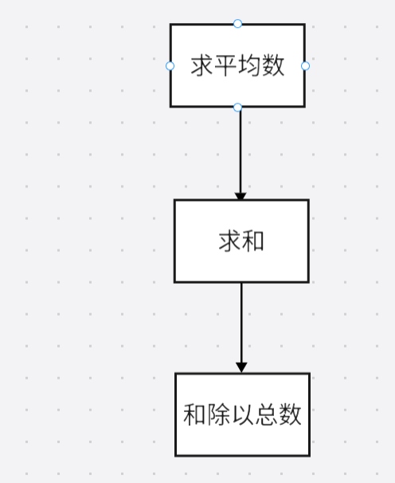

针对这么一个需求，显然设计两个函数`sum()`和`division()`，让它们按照顺序执行就可以实现

但是，随着业务流程更加复杂，结构化编程的缺点会愈发明显

假设我们设计一个控制台界面的模拟餐厅系统，用户通过键盘键入命令来进行简单的控制。效果大致如下：

我们仅从这个系统的浏览菜单、订餐、和签收三个功能进行分析，如果从纯粹的结构化编程的角度考虑，大致能得到这样的运行流程：

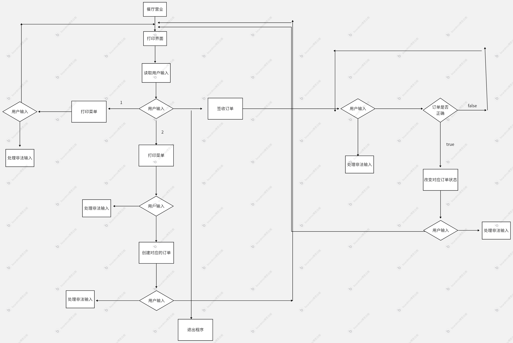

当然，我的流程图画的并不规范，但是我们也能直观的感受到，随着系统的功能愈发的增多，整个系统的复杂程度也快速加剧了，如果我们希望在这个流程上再去添加新的功能，也会显得比较麻烦

结构化程序设计的另一个比较大的缺陷是不能支持并发编程(由于操作系统我还没开始系统学习，这部份我先仅作了解)

- **面向对象程序设计 *OOP***

面向对象程序设计思想的本质是对业务的各种数据进行抽象建模，它并不优先考虑整个工作流程，而是先考虑如何组织工作中的不同数据。然后将每个对象的行为，作为方法，与相应的对象进行绑定。

所谓的对象，通俗一点理解，就是业务需求中的一切东西。对象由它的属性，也称字段，以及对象能够执行的方法组成。

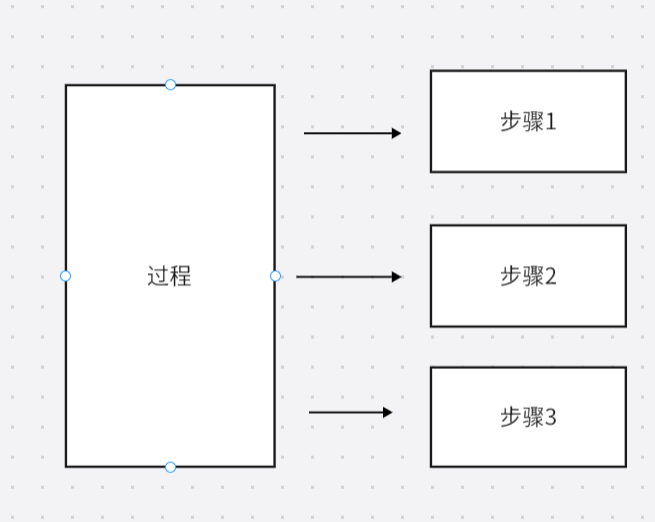

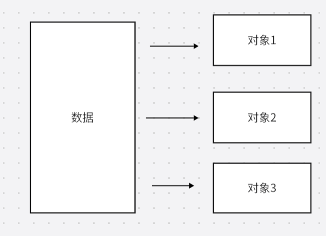

面向对象思想是一种更加接近我们思考方式的设计范型，尤其是当项目越来越大，我们很难再向面对简单任务时轻易的获得全局视野，将任务分解成一系列步骤；但是我们仍能够较为清晰的意识到一个大型项目中会出现哪些种类的数据，即哪种对象，再去分析不同对象对应的行为和与其他对象的联系，最终比较可靠的完成对项目的抽象建模

- **函数式编程 *Functional Programming***

(由于我还没有系统学习操作系统知识，对于并发、线程、流等概念并理解并不清晰，这部分内容目前仅限了解)

核心思想：基于数学函数，强调的是不可变性和无副作用。也就是说，一个函数的输出值只与传入的输入有关系，其他一切因素都不能改变输出结果

优势：

- 天然适合并发编程 ，因为无共享状态，就不需要锁机制
- 代码简洁，易于测试
- 避免隐式状态变化，更易推理和调试

局限：

- 学习曲线陡峭
- 一些场景中性能反而较低，比如需要频繁创建新数据结构
- 与硬件或系统交互时难以避免副作用

结构化编程 与 函数式编程

| 特性     | 结构化编程     | 函数式编程         |
| -------- | -------------- | ------------------ |
| 核心单元 | 过程  (函数)   | 函数               |
| 数据状态 | 可变           | 不可变             |
| 代码风格 | 命令式，如何做 | 声明式 做什么      |
| 副作用   | 允许           | 尽量避免           |
| 并发支持 | 困难           | 天然支持           |
| 典型应用 | 嵌入式开发     | 数据处理、并发系统 |

例子：

计算数组元素的平方和：

过程式设计：

~~~java
public class ProceduralExample {
    public static void main(String[] args) {
        int[] numbers = {1, 2, 3, 4, 5};
        int sum = 0;

        // 过程式：通过循环和可变状态计算平方和
        for (int number : numbers) {
            sum += number * number; // 修改 sum 的状态
        }

        System.out.println("Sum of squares: " + sum); // 输出: 55
    }
}
~~~

重点在于将目标分解成一系列的步骤，利用循环等流程控制以及科比那状态的变量来实现

函数式设计：

~~~java
import java.util.Arrays;

public class FunctionalExample {
    public static void main(String[] args) {
        int[] numbers = {1, 2, 3, 4, 5};

        // 函数式：通过流操作计算平方和
        int sum = Arrays.stream(numbers)
                .map(x -> x * x) // 映射为平方
                .sum(); // 求和

        System.out.println("Sum of squares: " + sum); // 输出: 55
    }
}
~~~

函数式编程强调使用纯函数（无副作用）和不可变数据，通常通过高阶函数（如 `map` 和 `reduce`）来完成任务。

- 总结

在实际应用中，我们并没有必要教条式的严格遵守选一种范式就一定不选另一种范式，根据实际业务的需求，完全可以实现混合范式。

即使是Java，从Java8以后，也能够良好的支持函数式编程FP

#### 4.1 面向对象程序设计概述

##### 4.1.1 类

类指定了如何构造对象

类就是对象的模板，根据一个类构造一个对象的过程称为创建一个这个类的实例

Java中的所有代码都放在了类中

###### 封装

封装是处理对象的一个重要概念。

- 封装并不是OOP独创的，即使是过程式编程也有封装，例如把复用性高的显示菜单之类的代码封装成一个函数
- 实际生活中也有很多封装的例子，也就是所谓的“黑盒技术”。比如电视机，用户只需要几个按钮或者遥控器就能控制整个电视机，用户不需要去了解电视机内部的电路结构的具体实现。
- 具体到OOP中，封装要求我们将数据和数据对应的行为，也即方法，一同放进“黑盒子”。使用者并不会去了解到这些类的具体实现。
- 总而言之，封装的核心思想就是隐藏，是提高重用性和可靠性的关键。

对象中的数据称为实例字段 *instance field*,操作数据的过程称为方法 *method*，对象的实例字段的集合就是这个对象的当前状态 *state*

OOP中实现封装的关键就在于，绝不能让其他类中的方法直接访问这个类的实例字段。程序只能通过对象的方法与对象的实例字段进行交互。

因此，即使我们改变了一个类中的存储数据的方式，或者操作数据的细节步骤，但只要使用同一个方法操作数据，其他类就不会受到改变的影响。

###### 继承

继承的含义是对一个已经有的类进行扩展，可以构建一个新的类。新的类会具有被扩展类的所有实例字段和方法，只需要为新的类添加适配的新方法和新实例字段

理论上继承可以使得代码的扩展变得更加容易，降低代码复写率。

但是继承机制也可能带来一些问题：

- 菱形继承

	- 一个类从两个或多个类继承，而这些父类又共同继承自一个基类，从而形成一个菱形的继承结构

	- 例如：

	- ~~~python
		class A:
		    def method(self):
		        print("A's method")
		
		class B(A):
		    def method(self):
		        print("B's method")
		
		class C(A):
		    def method(self):
		        print("C's method")
		
		class D(B, C):
		    pass
		
		d = D()
		d.method()  # 输出什么？
		~~~

	- 在这个例子中：

		- B和C都继承自A
		- D同时继承了B和C
		- 当调用d.method()时，就会产生歧义，到底是调用B的method还是C的method

	- 针对这个问题，不同的编程语言有不同的解决方案：

		- C++使用虚继承机制

		- python中使用了方法解析顺序来解决菱形继承

		- ~~~python
			class A:
			    def method(self):
			        print("A's method")
			
			class B(A):
			    def method(self):
			        print("B's method")
			
			class C(A):
			    def method(self):
			        print("C's method")
			
			class D(B, C):
			    pass
			
			d = D()
			d.method()  # 输出: B's method
			print(D.mro())  # 输出: [<class 'D'>, <class 'B'>, <class 'C'>, <class 'A'>, <class 'object'>]
			~~~

		- Java本身不支持多重继承，通过接口实现类似的功能，同时，接口本身也避免了菱形继承

		- ~~~java
			interface A {
			    void method();
			}
			
			class B implements A {
			    public void method() {
			        System.out.println("B's method");
			    }
			}
			
			class C implements A {
			    public void method() {
			        System.out.println("C's method");
			    }
			}
			
			class D implements A {
			    private B b = new B();
			    private C c = new C();
			
			    public void method() {
			        b.method(); // 或者 c.method()
			    }
			}
			~~~

			

- 类层次结构过深

	- 如果过度使用继承，会导致类层次结构过深，增加代码复杂性

	- ~~~java
		class Animal {
		    void eat() { System.out.println("Eating"); }
		}
		
		class Mammal extends Animal {
		    void breathe() { System.out.println("Breathing"); }
		}
		
		class Dog extends Mammal {
		    void bark() { System.out.println("Barking"); }
		}
		
		class Bulldog extends Dog {
		    void guard() { System.out.println("Guarding"); }
		}
		~~~

		

- 方法爆炸

	- 子类继承了大量不需要的方法，导致了类的方法数量膨胀

	- ~~~java
		class Vehicle {
		    void start() { System.out.println("Starting"); }
		    void stop() { System.out.println("Stopping"); }
		    void refuel() { System.out.println("Refueling"); }
		}
		
		class ElectricCar extends Vehicle {
		    void charge() { System.out.println("Charging"); }
		}
		~~~

	- 这里子类电动汽车并不需要加油，但是仍然有了`reful()`方法

- 紧耦合

	- 父类和子类之间是紧耦合的，对父类的修改可能影响所有子类

	- ~~~java
		class Bird {
		    void fly() { System.out.println("Flying"); }
		}
		
		class Penguin extends Bird {
		    // 企鹅不会飞，但继承了 fly() 方法
		}
		~~~

	- 如果父类的方法不适合子类，可能需要重写或抛出异常，增加了代码的复杂性。

为了避免代码由于继承变得过于臃肿，有以下思路：

- 优先使用组合而非继承

	- 组合指将对象作为字段来复用代码，而不是继承

	- ~~~java
		class Engine {
		    void start() { System.out.println("Engine started"); }
		}
		
		class Car {
		    private Engine engine = new Engine();
		    void start() { engine.start(); }
		}
		~~~

	- 这里Car与Engine不是继承关系，不会让Engine拥有不合适的run之类的功能

- 使用接口

	- 接口定义行为，但不约束具体实现，避免类层次结构过深

	- ~~~java
		interface Flyable {
		    void fly();
		}
		
		class Bird implements Flyable {
		    public void fly() { System.out.println("Flying"); }
		}
		
		class Airplane implements Flyable {
		    public void fly() { System.out.println("Flying"); }
		}
		~~~

- 遵循单一原则

	- 每个类只负责一个功能，避免类的方法数量膨胀

- 使用设计模式：

	- 如策略模式、装饰器模式等来替代继承

##### 4.1.2 对象

操作对象时，我们应该从对象三个特性的角度去考虑：

- 行为：可以对这个对象做哪些操作，或者可以对这个对象调用哪些方法
- 状态：调用方法时，对象会如何响应
- 标识：如何区分有相同状态和方法的不同对象

一个对象的行为是由它所能调用的方法定义的

对象会保存当前的状态信息，对象状态的改变只能是由于方法的调用，否则就是破坏了封装性

每个对象都会有唯一的标识，保证了对象的唯一性

对象的三个特性会相互影响。

- 比如说，一个订单对象的状态是“已发货”或者“已付款”，那么就应该拒绝“增加商品”的方法调用
- 反过来，如果订单的状态是“空”，就不应该允许调用“发货”

##### 4.1.3 识别类

OOP程序设计不像过程式编程，不应该从main函数开始思考。

当使用OOP思想设计程序时，首先该做的就是识别类，然后为类添加方法。

识别类的基本技巧是找出名词。

比如订单管理系统，可能出现的名词会有：

- 商品 Item
- 订单 Order
- 地址 Address
- 账户 Account
- 。。。

对于这些名词，我们就应该构建相应的类

之后去找动词

比如订单 会 *添加 add* 商品 ，可以对订单进行 *付款 apply*

这种动名词的识别是一种基本技巧，但是还是需要大量的经验才能真正的准确的从业务中识别出重要的类与方法

##### 4.1.4 类之间的关系

为了描述类与类之间的关系，或者说，在软件开发之前，对整个软件架构建立明确的认识，我们可以使用UML统一建模语言。

UML 统一建模语言，是一种由图表构成的，一种标准化语言。

UML图分为结构图和行为图，一共14种

这里简单介绍下类图：

类图：

- OOP的核心建模工具，描述系统中对象的类型和它们之间的静态关系
- 类图主要用来表示类、接口和它们之间的静态结构与关系

基本格式：每个类在类图中用一个矩形框表示，通常分为三部分

- 类名：
	- 位于矩形框的最上方，使用粗体字
	- 如果时抽象类，类名使用斜体字
	- 如果是接口，类名上方标注`<interface>`
- 属性：
	- 位于类名的下方，表示类的字段或成员变量
	- 格式 `可见性 属性名:类型 （=默认值）`
	- 例子 `- name: String`
- 方法：
	- 位于属性的下方，表示类的操作或方法
	- 格式`可见性 方法名(参数列表)：返回类型`
- 例子：
- 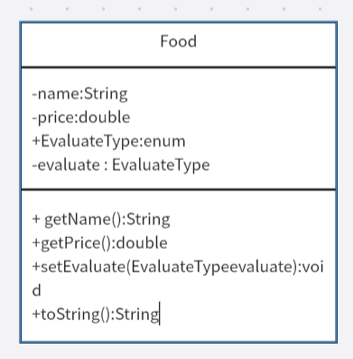

类之间的关系：类之间的关系是类图的核心，常见的有继承、实现、关联、聚合、组合和依赖

- *泛化 Generalization* ——继承

	- 表示子类继承了父类中的所有特征与行为

	- 用带三角箭头的实现，从子类指向父类
	- 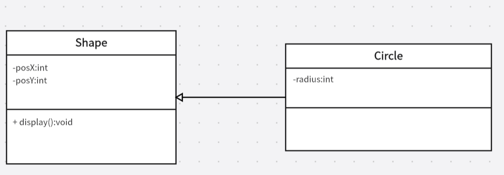

- *实现 Realization*
	- 是类与接口的关系，表示类是接口所有特征和行为的实现
	- 用带三角箭头的虚线，从类指向接口
	- 

- *关联 Association*
	- 是一种拥有关系，使得一个类知道另一个类的属性和方法
	- 代码上看就是一个类有另一个类的类型的成员变量
	- 用带普通箭头的实线从关联类指向被关联的类，关联可以是双向的
	- 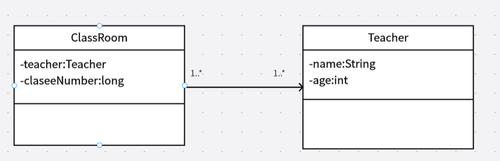
	- 在关联关系中，可以使用多重性表示对象之间的数量关系：
		- `1`：1 个
		- `0..1`：0 或 1 个
		- `*`：0 或多个
		- `1..*`：1 或多个
		- `n..m`：n 到 m 个
		- 图示中表示1个Order可以有1个或多个食物
	- 一个教室classroom可以有多个老师来上课，一个老师也可以去多个教室上课。教室和老师存在关联，但很难说教室是由老师组成的。
- *聚合 Aggregation*
	- 表示一种整体与局部的关系，且部分可以离开整体单独存在
	- 聚合关系是关联关系的一种，是一种强的关联关系
	- 代码上聚合与关联没有区别，都是用其他类做成员变量
	- 用带空心菱形的实线，从==部分指向整体==
	- 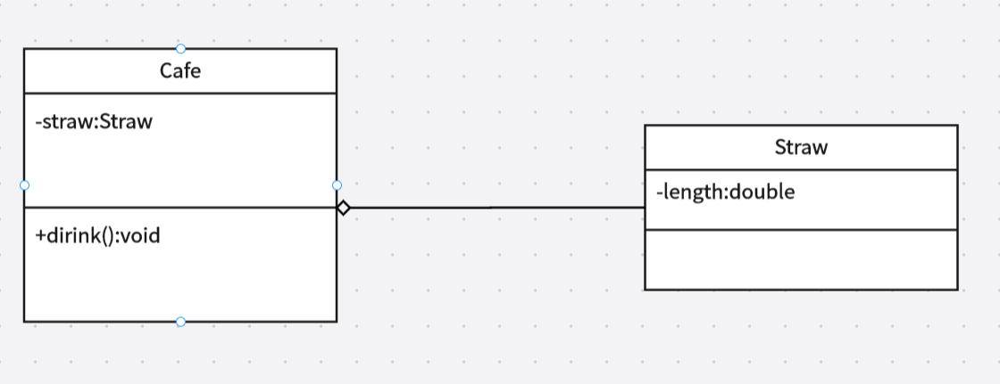
	- 一杯咖啡由吸管和杯子以及咖啡液组成，但是离开了咖啡，我们仍然可以使用吸管
- *组合 Composition*
	- 组合也是一种整体与部分的关系，但不同之处在于，组合关系中，部分离开了整体就没有意义，是最强的关联关系
	- 用实心菱形的实线，从部分指向整体
	- 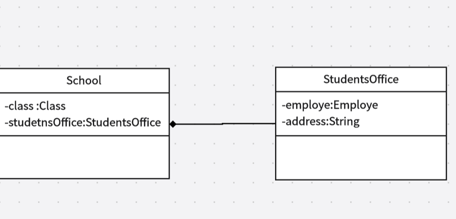
	- 学校这个行政单位由班级、教务处等组合而成，离开了学校这一概念，教务处也没有了意义
- 依赖 Dependency
	- 是一种使用的关系，表示一个类的实现需要另一个类
	- 即，从代码上看，就是一个类的参数是另一个类的类型的变量
	- 用带普通箭头的虚线，指向被使用者
	- 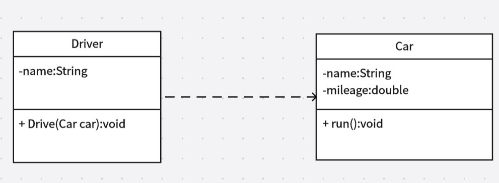
- 分析类之间的这几种关联关系时没有必要太过于钻牛角尖，因为我们的自然语言本身就是充满了歧义与模糊的
- 学习UML的目的就是为了理清楚该如何设计类和程序，没有必要本末倒置

应当尽量减少依赖关系，也就是所谓的减少耦合

#### 4.2 使用预定义类

Java中，没有类就无法做任何事情。

不是所有类都表现了面向对象特征

比如Math类，只封装了方法但没有隐藏任何数据，因为Math类的设计目的决定了不需要隐藏数据

##### 4.2.1 对象与对象变量

想使用对象，必须要先构造对象，并指定它的初始状态，然后才能对对象应用方法

Java中，需要使用构造器(Constructor,也称构造函数)构造新实例

构造器是一种特殊的方法，作用就是构造并初始化对象

构造器总是与类同名

调用构造器，需要使用`new`操作符

例如，构造Date对象用来描述时间点

`new Date();`

可以将新构造的对象传递给一个方法作为参数，或者对构造的对象应用方法

~~~java
System.out.println(new Date()); //显示当前的日期和时间，默认格式是：月日，年，时，分，秒，纪元
String s = new Date().toString();
~~~

如果需要多次使用新的对象，可以用对象变量存储新的对象

`Date rightNow = new Date();`

注意：对象变量只是对象的引用，而不是对象本身

不能对没有初始化的对象变量调用任何方法

~~~java
Date startTime;  //只是一个Date变量
String s = startTime.toString(); //程序报错
~~~

对象变量的值本质上是对象的应用，指向存储在堆中的某个对象

new操作符返回的值也是引用

可以显式的将对象变量设置为null,表示这个变量目前没有引用任何对象

如果想得到一个对象的完整副本，必须使用clone()方法

##### 4.2.2Java类库中的LocalDate类

Date类主要表示一个特定的时间点，而LocalDate类主要用于表示日期

最好将时间点与日期分开表示，因为不同地区的日期表示格式可能不一样

但是LocalDate不建议使用构造器构建，而应当使用静态的工厂方法，这个方法会代替调用构造器

`LocalDate.now()`构造表示当前日期的对象

也可以提供指定的日期来构造LocalDate对象：

`LocalDate newYearsEve = LocalDate.of(1999,12,31)`

对于一个LocalDate对象，我们可以调用getYear、getMonth、getDay等方法得到具体的年月日的int值

还可以用plusDay方法根据增加的天数来得到一个新日期

`LocalDate aThousandDaysLater = newYearsEve.plusDay(1000);//得到2002年9月26日这个日期`

类似的有minsDays方法，根据参数来减少天数得到新的日期对象

##### 4.2.3更改器与访问器

更改器就是能够修改对象状态的方法

访问器指的是只访问状态数据，但不修改状态具体值

例如：

`LocalDate aThousandDaysLater = newYearsEve.pluysDays(1000);`

这个方法并不会修改newYearsEve对象的状态，只是读取它的数据，然后创建了一个新对象，这样的方法就是典型的访问器方法

C++中带有const后缀的是访问器方法，不声明const的默认是更改器方法，但是Java中更改器和访问器没有语法上的区别。

#### 4.3 自定义类

Java定义类的简单语法：

~~~java
class ClassName{
    field1;
    field2;
    ...
    constructor1
    constructor2
    ...
    method1
    method2
    ...
}
~~~

Java中，一个源文件只能有一个公共类，也就是public访问修饰符修饰的类,main方法必须放在公共类中

但是可以有多个非公共类

习惯上，一个源文件只放一个类

例子，定义一个员工类

~~~java
class Employe{
    private String name;
    private double salary;
    private LocalDate hireDay;
    
    public Employe(String n,double s,int year,int month,int day){
        this.name = n;
        this.salary = s;
        this.hireDay = LocalDate.of(year,month,day);
    }
    
    public String getName(){
        return this.name;
    }
    public double getSalary(){
        return this.salary;
    }
    public LocalDate getHireDay(){
        return this.hireDay;
    }
    public void raiseSalary(double byPercent){
        double raise = this.salary * byPercent / 100;
        this.salary += raise;
    }
}
public class EmployeTest{
    public static void main(String[] args){
        Employe[] staff = new Employe[3];
        
        staff[0] = new Employe{"xiaoming",75000,2024,12,15};
        staff[1] = new Employe{"dingding",5000,2021,9,10};
        staff[2] = new Employe{"maomao",15000,2025,3,1};
        
        for{Employe e : staff}{
			System.out.println("员工姓名:"+e.getName()+"员工薪资"+e.getSalary())
        }
    }
}
~~~

这里声明了一个员工数组，自定义类完全可以视作一种和基本数据类型差不多的一种数据类型，一样的可以构造数组，使用foreach去遍历

如果我们把EmployeTest和Employe放在不同的源文件，理论上使用javac编译时，需要使用通配符：

`javac Employe*.java`

表示所有与通配符匹配的源文件都会编译成类文件

但是，即使我们不显式的编译Employe.java，直接编译:

`javac EmployeTest.java`

仍然可以正常编译并正常编译

因为Java编译器发现EmployTest.java中使用了Employe类后，编译器会自动的去查找Employe.class文件，如果没有这个类文件，就会自动搜索Employ.java并编译这个文件

如果Employe.java发生了相对于已有的Employe.class有了版本跟新，Java编译器也会自动重新编译

可以认为Java编译器内置了make功能

###### 对Employe类的剖析：

剖析一个类，我们可以从这个类的方法开始分析

`public Employe(String n,double s,int year,int month ,int day)`

`public String getName()`

`public double getSalary()`

`public LocalDate getHireDay()`

`public void raiseSalary(double byPercent)`

例子中的员工类一共有5个方法，全部都声明为了public

public意味着任何类的任何方法都可以调用这些方法

之后，我们看下这个类中的实例字段:

`private String name`

`private double salary`

`private LocalDate hireDay`

这三个字段的数据集合，就是一个对象的状态，关键字private代表了只有这个类的方法才能够访问这些实例字段，其他类的任何方法都不能读写这些数据

理论上也可以把实例字段声明为public,但是这完全破坏了封装性，完全不建议这样做

实例字段并不一定要是基本数据类型，就像例子中的`name`和`hireDay`都是对象的类型，但要注意的是，这些实例字段都是对对象的引用，而不是对象本身

###### 构造器

~~~java
public Employe(String name,double s,int year,int month,int day){
    name = n;
    salary = s;
    hireDay = LocalDate.of(year,month,day);
}
~~~

- 构造器必须与类名相同，当我们使用new操作符时，就是调用了类的构造器方法

- 实际上，每个类可以有一个或以上的构造器

- 构造器可以有0个或多个参数

- 构造器不能指定返回值

注意：不要引入与实例字段同名的实例字段

比如：

~~~java
public Employe(String s,double n,...){
    String name = s;  //错误的做法
    double salary = n; //错误的做法
}
~~~

这里构造器实质上神明了两个局部变量name与salary，这些变量只能在构造器内部访问，会遮盖掉同名的实例字段

虽然可以用this关键字指代，但是我们设计代码时应该注意不要在任何方法中使用与实例字段同名的局部变量

###### var声明局部变量

从Java10开始，如果可以从变量的初始值推导出它们的类型，可以用var声明局部变量，不需要指定类型

`var xiaoMing = new Employe("xiaoming",50000,1999,11,11)`

这样的好处是可以避免重复的写类型名

但是建议基本数值类型的变量仍然使用显式的类型声明，避免产生混淆

var关键字只能用于方法中的局部变量，参数和实例字段必须明确声明类型

###### null

可以这样认为，一个任意的对象变量，都能包含两种值：要么是对象的引用，要么是一个特殊值null

任何对象变量如果不初始化，默认值都是null

对null值得变量调用方法，会触发`NullPointerException`异常，如果不捕获，会终止程序

(但是可以用`System.out.println()`方法输出null值得字符串，println方法内置了对于null得处理)

当我们定义一个类时，应该考虑清楚哪些字段可能为null值

- 基本数据类型不会是null，无需担心
- 字符串、引用类型可能变成null我们需要额外处理
- 比如调用Employe的构造器时我们传递一个null作为名字，就会让name字段变成null

针对null值可能被作为参数传入的情况，我们一般有两种处理思路：

- 宽容方法：

	- 如果传入null值，我们把null参数转成一个适当的非null值

	- 例如：

	- ~~~java
		if(n == null){
		    name = "Joe Doe";
		}else{
		    name = n;
		}
		~~~

	- Objects类有一个处理这种状况的便捷方法：

	- ~~~java
		public Employe(...){
		    name = Objects.requireNonNullElse(n,"Joe Doe");
		}
		~~~

- 严格方法：

	- 使用Objects的requireNonNull()方法

	- ~~~java
		public Employe(..){
		    name = Objects.requireNonNull(n,"name字段不能为null");
		}
		~~~

	- 使用这个方法，会产生一个`NullPointerException`异常，这样设计有一个好处，能够让我们清楚的找到程序是哪一个位置出现了异常，以及什么异常，否则`NullPointerExcepton`异常可能出现在程序任意位置，让我们很难追踪到构造器

- 实际上，应当谨慎的使用宽容策略，应该认真思考是否希望接受一个可有可无的值，不然就应该使用严格方法

###### 隐式参数与显式参数

假设对于上述例子的Employe类我们使用以下调用:

~~~java
Employe number007 = new Employe(...);
number007.raiseSalary(5);
~~~

这个方法实际上执行的内容是：

~~~java
double raise = number007.salary * 5 /100;
number007.salary += raise; 
~~~

也就是说，实际上raiseSalary方法有两个参数number007和byPercent

第一个参数称为隐式参数，就是调用方法的对象

后面的参数称为显式参数

在每一个方法中，我们都可以使用关键字this指示隐式参数，这样可以将实例字段与局部变量显著的区分开

###### 封装的优点

关注以下方法：

`public String getName()`

`public double getSalary()`

`public LocalDate getHireDay()`

这些都是典型的访问器方法，这些方法只返回实例字段的值，因此也称为字段访问器

如果我们将实例字段设置为公共的，那么首先对于name这样的只读类型进行修改就可能发生错误

其次像salary这样的字段，由于我们只能通过更改器修改，所以即使出错，我们也可以只用调试修改器，而不用到处去调试找问题

根据封装这一特性，如果我们希望获取或者更改一个实例字段的值，那么我们应该提供三项内容：

- 一个私有的实例字段；
- 一个公共的字段访问器方法
- 一个公共的字段修改器方法

可能有些麻烦，但是好处很明显。

比如，我们将name字段修改成了`String firstName`和`String lastName`，只要我们把访问器中的返回值改成`return firstName+lastName`那么对于其他的所有代码，都不会造成任何影响

同时，更改器可以完成错误检查，比如raiseSalary方法中我们可以检查参数是否为0，但是如果直接给字段赋值就无法做到

注意：

==不要编写返回可变对象引用的访问器方法==

比如，假设我们的例子Employe的字段改成Date类型，就可能出现一些问题(LocalDate没有更改器方法)

~~~java
class Employe{
    private Date hireDay;
    ...
    public Date getHireDay(){
        return this,hireDay;
    }
    ...
}
~~~

此时，假设我们这样编辑主函数：

~~~java
Employe xiaoMing = ...;
Date day = xiaoming.getHireDay();
~~~

此时，我们声明的局部变量day和xiaoMing中的hireDay实际上都会指向同一个对象

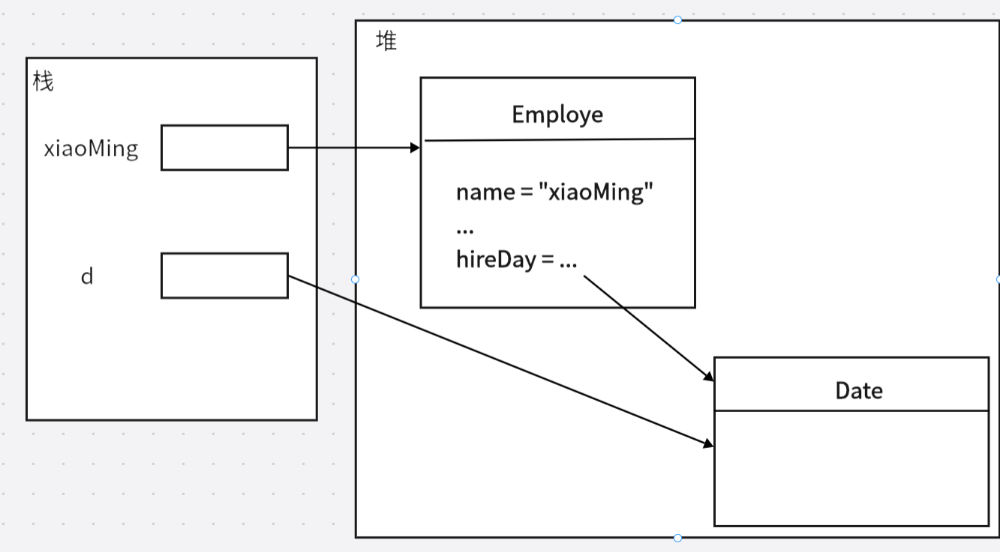

此时，虽然hireDay被声明为了私有类型，但是如果我们调用d的修改器方法，我们仍然会修改xiaoMing的hireDay字段，封装就被破坏了！

因此，如果我们希望返回一个可变对象的引用，就应该对它进行克隆

对象克隆是指存放在另一个新位置上的对象副本

~~~java
class Employe{
    ...
    Date hireDay;
    ...
    public getHireDay(){
        return (Date)hireday.clone();
    }
}
~~~

###### 基于类的访问权限

根据私有private的定义，我们知道，一个类的方法可以访问内部的私有实例字段

其实，更准确的说法是，同一个类的方法可以访问这个类的==所有==对象的私有数据

比如说，我们在Employe中增加一个equals方法用于比较不同的员工名字是否相同

~~~java
class Employe{
    ...
    public boolean equals(Employe otherEmploye){
        return this.name.equals(other.name);
    }
}
public class EmployeTest{
    public static void main(String[] args){
        ...
        if(xiaoMing.equals(xiaoHong))
            ....
    }
}
~~~

这里equals方法不仅访问了xiaoMing的私有字段name,还直接访问了xiaoHong的私有字段name

这是合法的操作

Employe类的方法看可以访问Employe类型的所有对象的私有实例字段

###### 私有方法

一般情况，我们的方法都是公共的，但是，有些时候私有方法也有意义。比如，把一个公共的方法分成几个私有的辅助小方法，那么，这些辅助性的小方法不应该称为公共接口的一部分，因为这些小方法与当前实现关系非常紧密，不应该让它们公开

在Java中，只要使用private就可以把方法声明为私有的

最关键的是方法如果是公共的，那么删除时就要保持谨慎，而私有方法，类的实现者可以随意删除，不会担心造成影响

###### final实例字段

可以将实例字段声明为final，如果这样声明，必须在构造对象时初始化

也就是说，必须确保当构造器执行后，这个final字段的值就必须设置了，而且不能再修改

如果类中所有方法都不会改变对象的状态，就称为这是一个不可变类，例如String类

如果我们用final修饰符修饰一个可变类，可能会造成混乱：

例如,假设我们在Employe设置这样一个字段：

`private final StringBulider evaluations;`

在构造器中，初始化：

`evaluations = new StringBuilder();`

这里final字段的本质含义是，evaluations变量中的对象引用不会再指示不同的StringBuilder对象

但是这个对象本身会是可以更改的

#### 4.4 静态字段与静态方法

##### 4.4.1静态字段

如果将一个字段定义为static，意味着这个字段不会出现在每个具体的对象中，而是只创建一个副本在类中

相当于所有对象共享一个静态字段

例如，为每一个员工分配一个唯一的标识码：

~~~java
class Employe{
    private static int nextId = 1;
    private int id;
    ...
    public Employe(...){
        id = nextId;
        nextId++;
    }
}
~~~

每个对象都会有一个id字段，但是这个类的所有实例都共享一个nextId字段。

即使没有任何一个对象被构建，静态字段nextId也会存在，它属于类，而不属于任何对象

(这里的静态就是表示字段属于类，是一种术语，没有实际意义)

在一个程序中，每一次构造Employe对象，我们都会让nextId+1

##### 4.4.2 静态常量

一般来说，静态字段比较少用，但是静态常量比较常见

比如，Math类中，有一个表示圆周率的近似值的静态常量PI

~~~JAVA
public class Math{
    ...
    public static final double PI = 3.14159265358979323846;
    ....
}
~~~

我们可以直接使用Math.PI访问这个常量

如果省略static字段，PI就变成了Math类的实例字段，我们必须要创建一个Math对象来访问PI

对于常量字段，设置成公共的不会破坏封装，因为它的值不能修改

##### 4.4.3 静态方法

静态方法是不操作对象的方法

可以说，静态方法没有this隐式参数

静态方法不能访问实例字段，因为它不操作对象，但是静态方法可以访问静态字段

调用静态方法时，我们需要提供类名

但是理论上可以使用对象调用静态方法，是合法的语法，但是这种写法有些混乱，建议使用类名调用静态方法

两种情况可以考虑使用静态方法：

- 方法不需要访问对象的状态，所有的参数都通过显式参数提供
- 方法只需要访问类的静态字段

##### 4.4.4工厂方法

静态方法还有一种常见用途，作为静态的工厂方法来构造对象

使用工厂方法而不是构造器有以下原因：

- 无法为构造器命名——构造器必须要与类名相同，但有时我们希望通过不同的方法构造不一样的对象，这时命名成一个构造器不太合适
- 使用构造器时，我们无法改变所构造的对象的类型，但是工厂方法可以返回不同类型对象

利用静态方法，可以更加灵活的创建对象

#### 4.5 方法参数

按值调用：表示方法接收的是调用者提供的值

按引用调用：方法接收的是调用者提供的变量位置

Java中，其实一切方法都是按值调用的。

方法会获得所有参数的一个副本，方法不能修改传递给他的任何参数变量本身的内容

但是，对于基本数据类型和引用类型参数，有一些不同：

- 基本数据类型：

	- 假设我们有这样一个程序：

	- ~~~java
		public class Test{
		    public static void main(String[] args){
		        int a=1,b=2;
		        swap(a,b);
		        System.out.println(a+","+b);  //输入仍然是1，2
		    }
		    public static void swap(int a,int b){
		        int temp = b;
		        b = a;
		        a = temp;
		    }
		}
		~~~

	- 当JVM开始执行时，会在JVM虚拟机栈中创建main方法的栈帧，在main的栈帧里面，创建连个局部变量a=1,b=2

	- 执行到调用方法`swap(a,b)`创建swap的栈帧

	- swap的栈帧中，也会创建两个局部变量a和b，根据调用传的实参，a=1,b=2

	- 继续往下执行，创建局部变量temp = b;

	- 按照方法的执行步骤，经历 b = a; ==>a = temp

	- swap执行完毕后，销毁掉swap栈帧，所有局部变量的空间也被回收

	- 而此时，mian函数中的局部变量a,b并没有受到影响

	- 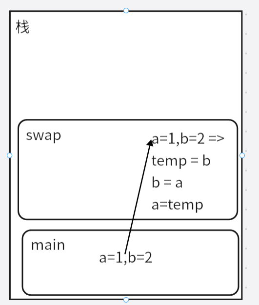

- 应用类型参数：

	- ~~~java
		class Employe{
		    ...;
		    //将一个员工薪资翻倍
		    public static void doubleSalary(Employe x){
		        x.raiseSalary(100);
		    }
		}
		public class EmployeTest{
		    public static void main(String[] args){
		        xiaoming = new Employe(...);
		        doubleSalary(xiaoming);
		    }
		}
		~~~

	- 与上述的执行过程其实是类似的，JVM仍旧会为不同的方法创建不同的栈帧，用来保存不同方法的局部变量

	- 但不同之处在于doubleSalary中的局部变量x，它也是一个应用类型变量，当它接收来自xiaoming的值以后，会让它们指向同一个变量

	- 因此，在方法中对x的操作实际上就变成了对存在于堆中的对象的操作

	- 当方法执行完毕，x被销毁后，对堆上的对象的修改已经完成了，所以在main方法里，看起来就是xiaoming变量被修改了的效果

	- 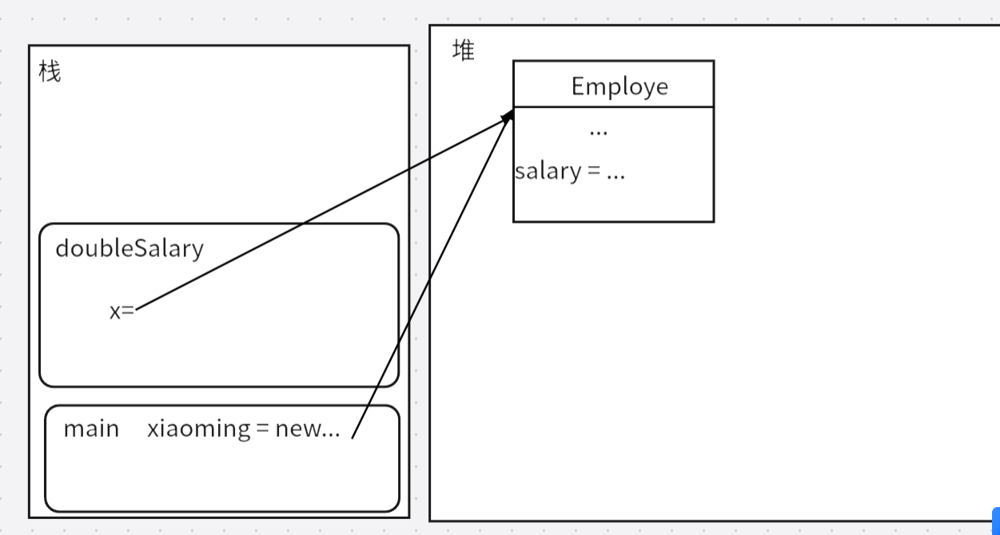

但是，我们一定要注意，虽然引用类型参数可以修改对象，这仍然是按值调用，并不是按引用调用。

可以非常容易地证明，即使是引用类型变量，也是按值调用的。

假设有这样一个方法

~~~java
class Employe{
	public static void swap(Employe x,Employe y){
    	Employe temp = y;
   	 	y = x;
    	x = temp;
	}
}
public class EmployeTest{
    public static void main(String[] args){
        var xiaoming = new Employe{"xiaoming",...};
        var xiaohong = new Employe{"xiaohong",....};
        swap(xiaoming,xiaohong);
    }
}

~~~

如果Java真是按引用调用，那么理论上这个交换方法可以达到交换的效果

但实际上，当我们在方法内交换了x与y的值以后，只是让x与y指向了不同的对象

可是，随着方法的执行结束，x变量和y变量被销毁了

main函数中，xiaoming与xiaohong的指向仍然不会改变

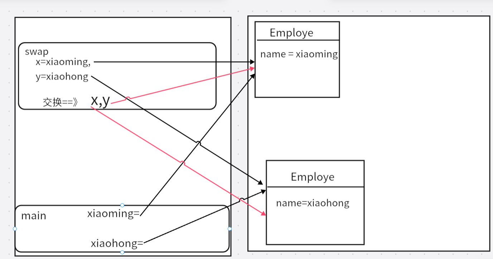

总结：

- 方法不能修改基本数据类型的参数
- 方法可以改变对象参数的状态
- ==方法不能让一个对象参数引用一个新的对象==

#### 4.6对象构造

Java提供了多种编写构造器的机制

##### 4.6.1 重载

重载：多个方法有相同的方法名但有不同的参数列表

实际上不止构造器能重载，Java允许重载任何方法

当我们对方法进行重载时，编译器会挑选出符合的方法，如果无法匹配，编译器会抛出异常

方法签名:方法名+参数类型 方法签名用来完整的描述方法

如String类中有4个名为indexOf的方法：`indexOf(int)`   `indexOf(int,int)`   `indexOf(String)`   `indexOf(String int)`

注意：方法签名不包含返回类型，因此我们不能写两个方法名和参数列表相同但返回类型不同的方法

##### 4.6.2 默认字段初始化

Java中，字段与局部变量有一个很显著的区别：

==方法中的局部变量必须明确的初始化，但是在类中，如果没有初始化类中的字段，将会自动设置为自动值==

如果我们不在构造器中显示的为一个字段设置初值，那么就会自动设置默认值：

- 数值类型默认值是0
- boolean类型默认值是false
- 引用类型默认值是null

要对默认值保持警惕，因为对于引用对象会默认为null，如果我们使用访问器返回这个字段，有可能把一个null值返回回去导致异常

##### 4.6.3 无参数的构造器

构造器可以不包含任何参数，由无参数的构造器创建对象时，对象的状态会设置为适当的默认值

例如，对于Employe类，可以设置这样一个无参数构造器：

~~~java
public Employe(){
    this.name = "";
    salary = 0;
    hireDay = LocalDate.now();
}
~~~

如果不为类设计构造器，那么Java会自动提供一个无参数构造器，这个构造器里所有字段都会设置为默认值

但是，如果我们至少提供了一个构造器(无论是怎样的构造器),Java就不会再自动添加这个无参数构造器

##### 4.6.4 显式字段初始化

通过重载类的构造器，可以采用多种形式设置类实例字段的初始状态

但是无论使用怎样的构造器，我们都应该给每一个实例字段设置一个合适的初始值

可以直接在类定义中直接为任何字段赋值：

~~~java
class Employe{
    private String name = "";
}
~~~

在执行构造器之前，就会进行这个赋值

初始值不一定是常量，比如：

~~~java
class Employe{
    private static int nextId;
    private int id = advanceId();
    ...
    private static int advanceId(){
        int r = nextId;
        nextId++;
        return r;
    }
}
~~~

每个员工都有唯一的ID，可以用这样的形式完成自动初始化

注意：静态方法只能访问静态字段nextId，不能操作实例字段id

##### 4.6.5 参数名

有的时候，为了避免在构造器中覆盖实例字段，我们可能给形参命名的比较奇怪，用单个字母n,s之类的

其实可以反过来思考，虽然同名的局部变量会覆盖掉实例字段，但我们仍然可以使用关键字this访问实例字段，

因此，完全可以这样实现构造器：

~~~java
public Employe(String name,double salary){
    this.name = name;
    this.salary = salary;
}
~~~

##### 4.6.6 调用另一个构造器

关键字this除了指示隐式参数外，还有一个比较常见的用法——可以指代另一个构造器

假设我们的Employe类有两个构造器：

~~~java
class Employe{
    ....;
    public Employe(String name,double salary){
        this.name = name;
        this.salary = salary;
    }
    public Employe(double salary){
        this("Employe#"+nextId,salary);
        nextId++;
    }
}
~~~

这里如果我们调用`new Employe(50000)`第二个构造器就会调用第一个构造器，并传递设定好的参数

这样的写法其实很有用，公共的构造器就只需要写一次

##### 4.6.7 初始化块

初始化字段除了在定义初始化或在构造器初始化，还可以使用初始化块的语法

事实上 ，在一个类的声明中，我们可以包含任意的代码块，每当构造一个对象，就会执行这些块，例如

~~~java
class Employe{
    private static int nextId;
    
    private String name;
    private double salary;
    private int id;
    
    {
        id = nextId;
        nextId++;
    }
    public Employe(String name,double salary){
        this.name = name;
        this.salary = salary;
    }
    public Employe(double salary){
        this("Employe#"+this.id,salary);
    }
    ....
    
}
~~~

无论我们调用哪一个构造器，id字段都会在初始化块里首先完成初始化，然后才运行构造器主体部分

当然，这种机制不是必须的，也不是很常见

理论上可以直接在初始化块初始化一个字段，即使字段在块后面才定义，但是，非常不推荐这种写法

总结：

一个类的初始化大致遵循这样的规则：

- 如果构造器第一行调用另一个构造器，那么基于提供的参数执行另一个构造器
- 否则：
	- 所有字段初始化为默认值
	- 按照类中声明的顺序，执行所有字段初始化方法和初始化块
- 然后，执行构造器主体部分

对于静态字段，可以在声明时提供初始值

也可以使用静态的初始化块来对静态字段初始化：

~~~java
class Employe{
    ...
    private static int nextId;
    private static Random generator = new Random();
    static
    {
        nextId = generator.nextInt(1000); //生成0~999的随机整数
    }
}
~~~

当类第一次加载时，会完成对静态字段的初始化

##### 4.6.8 对象析构与 finalize方法

有一些面向对象语言有显式的析构器方法，所谓的析构器，就是回收对象使用的资源的方法，最常见的就是对对象的内存空间回收

Java会自动完成垃圾回收，所以不支持析构器

但是，除了内存空间资源以外，如果对象使用了其他资源，如文件或其他系统资源等，如果资源不再需要，就应该立刻对其回收

- 如果资源是使用完后必须立刻关闭的资源，应该提供一个close方法来完成必要的清理工作
- 如果可以等到虚拟机退出再回收，可以使用Runtime.addShutdownHook方法来增加一个关闭钩

#### 4.7 记录

有些时候，数据就是数据，很难将其抽象成某种对象的实例字段

根据面向对象设计范式，我们需要隐藏这些数据，访问必须通过公共的方法

有可能有些不方便

比如：一个平面几何系统中，我们试图表示一个定点Point

~~~java
class Point{
    private final double x;
    private final double y;
    public Point(double x,double y){
        this.x = x;
        this.y = y;
    }
    public double getX(){
        return this.x;
    }
    public double getY(){
        return this.y;
    }
    ....
}
~~~

对于这种定点，很难说这样的严格的封装体现出了什么很显著的优势

为了更加简洁的定义这种类型的数据，JDK14引入了一个新的特性——记录。(在JDK16中实装)

##### 4.7.1 记录概念

*记录 record*：本质上也是一种类，只是这种类比较特殊，它的状态是==不可变==的，而且字段是公共可读的

定义一个记录的语法比较简单，只需要使用关键字record

~~~java
record Point(double x , double y){
    ...
}
~~~

如果我们在定义中不加入任何内容，形如`record Point(double x double y){}`的写法，会自动实现以下效果：

- 拥有实例字段：
	- `private final double x`
	- `private final double y`
	- 规范的说，Java中记录的实例字段称为 *组件 component*

- 自动拥有一个构造器`Point(double x,double y)`
- 自动拥有访问器方法：
	- `public double x()`
	- `public double y()`
	- 这里的访问器方法方法名自动和字段名相同
- 每个记录还会有3个自动定义的方法：
	- toString()
	- eaquals()
	- hashCode()

当然，和类一样，可以给记录添加自定义方法

记录也可以拥有静态字段和方法

~~~java
record Point(double x,double y){
    //自定义方法
    public double distanceFromOrigin(){
        return Math.hypot(x,y);  //返回x^2+y^2的平方根
    }
    //自定义静态字段与静态方法
    public staic Point ORIGIN = new Point(0,0);
    public static double distance(Point start,Point end){
        return Math.hypot(start.x()-end.x(),start.y()-end.y());
    }
}
~~~

注意：不能为记录添加实例字段

~~~java
record Point(double x,double y){
    ...
    private double r;//错误的写法
}
~~~

记录的字段自动是final字段，但是，正如前文分析的对可变对象使用final修饰，如果我们在记录中增加可变对象作为组件，就会让记录变成一个可变记录

如果希望严格保持记录的不可变性，就不应该使用可变的类型作为字段。

综上：

- 如果一组数据完全不可变，我们就应该使用记录而不是类，记录更易读，也比较高效，并发程序中比较安全
- 但是如果数据的状态会发生改变，就还是应该使用类

##### 4.7.2 构造器：标准、自定义和简洁

在记录中，可以这样对构造器进行分类：

- 标准构造器：自动的设置所有实例字段的构造器

- 自定义构造器：我们自己定义的构造器

比如我们希望标准构造器完成一些额外的工作，就可以自定义构造器：

~~~java
record Range(int start,int end){
    public Range(int start,int end){
        if(start < end){
            this.start = start;
            this.end = end;
        }else{
            this.start = end;
            this.end = start;
        }
    }
}
~~~

对于记录中的这样的构造器，可以用一种简洁形式：

~~~java
record Range(int start ,int end){
    public Range{//没有参数列表
        if(start>end){
            int temp = end;
            end = start;
            start = temp;
        }
    }
}
~~~

可以这样理解：简洁形式的构造器其实只是标准构造器的“前奏”，它只是完成对this.start和this.end赋值之前的操作

不能在简洁构造器中读取或修改实例字段

完整的记录演示：

~~~java
import java.util.*;

public class RecordTest {
    public static void main(String[] args) {
        var p = new Point(3,4);
        System.out.println("p点的坐标是:"+p.x()+","+p.y());
        System.out.println("到原点的距离是："+p.distanceFromOrigin());
        //使用静态字段和方法求值：
        System.out.println("到原点的距离是:"+Point.distance(Point.ORIGIN,p));

        //测试可变记录
        var pt = new PointTime(3,4,new Date());
        System.out.println("修改前:"+pt.toString());
        pt.when().setTime(0);
        System.out.println("修改后:"+pt.toString());

        //测试简便形式的构造器
        var r = new Range(4,3);
        System.out.println("r:"+r);

    }

}

//对于定点位置的记录
record Point(double x, double y) {
    //定义一个自定义构造器,它是自动设置值的，不需要传递参数，这个自定义构造器代表生成原点
    public Point() {
        this(0,0);
    }
    

    //计算点到原点的距离
    public double distanceFromOrigin(){
        return Math.hypot(x,y);
    }

    //定义表示原点的常量
    public static final Point ORIGIN = new Point();

    //计算两点之间的距离
    public static double distance(Point p1, Point p2) {
        return Math.hypot(p1.x - p2.x, p1.y - p2.y);
    }
}

record PointTime(double x, double y,Date when) {}

record Range(int start, int end) {
    //简洁形式的标准构造器
    public Range{
        if (start > end){
            int temp = start;
            start = end;
            end = temp;
        }
    }
}
~~~

#### 4.8 包

Java允许用包将类组织在一个集合中

包的主要作用是保证类的唯一性

##### 4.8.1 包名

为了保证包名的唯一性，我们通常习惯上用域名的逆序形式作为包名，比如com.horstmann，之后就可以在后面追加项目名，对于不同的项目，我们应该使用不同的子包

比如com.horstman.resaurantsysytem

最后在项目后面存放各种类文件，就可以得到一个类的完全限定名

比如com.horstman.resaurantsystem.Food

注意：从编译器的角度看，嵌套的包之间没有关系，比如java.util与java.util.jar这两两个包就没有关系，每个包都是独立的集合

##### 4.8.2类的导入

一个类可以使用所属包的所有类，以及其他包中的公共类

当我们希望使用其他包中的公共类时，有两种方式：

- 使用类的完全限定名：如：`java.time.LocalDate today = java.time.LocalDate.now();`
- 也可以使用imoprt语句，import语句的主要作用就是提供简写方式来引入包中各个类

###### import语句

可以使用import导入一个特定的类或者整个包，import语句位于源文件开头位置，但要放在package之下,import语句需要以分号结尾

可以使用通配符导入包中所有类

例如：

import java.time.\*

这样，当我们希望使用java.time包中的类时候，不再需要使用完全限定名

`LocalDate today = LocalDate.now();`

注意：无论导入一个类还是所有类，都不会对代码规模造成任何负面影响，明确导入特定类只是让代码读者更清晰的知道使用了什么类

不过通配符只能用于导入一个包中所有类，但不能用于导入所有包

比如试图`import java.*`来导入前缀为java的所有包，这样的语法是错误的

如果导入的不同包中巧合的出现了同名的类，比如说:

~~~java
import java.util.*;
import java.sql.*;
...
    Date today;//此时会产生编译错误，因为util包和Sql包中都有一个Date类
~~~

我们可以增加一条import语句专门导入我们需要使用的Date类

~~~java
import java.util.*;
import java.sql.*;
import java.util.Date;//假设我们希望使用的是util包中的Date类
~~~

如果希望分别使用两个包中的Date类，就必须使用完整包名

实际上，在包中定位类是编译器的工作，字节码中总是使用完整的包名引用其他类

import语句与c中的include看起来工作类似，但其实有非常大的区别：

- c或者c++中，编译器只会查看当前正在编译的文件和include显式引入的文件
- 但是import语句本质上只是起到简洁的作用，无论是否import，只要我们正确的指定了类名，Java编译器都会自动去寻找整个类
- 可以认为Java中的package与import类似于C++中的namespace和using指令

##### 4.8.3 静态导入

可以使用import语句导入静态方法和静态字段，而不只是类

例如：`import static java.lang.System.*;`

这样就可以使用System类的静态方法与静态字段而不需要添加前缀：`out.println("goodMoring");`

（但可能大部分人都不会习惯简写`System.out`，也不是很有意义）

另外，可以导入特定的方法或字端比如`import static java.lang.System.out;`

不过相比System.out，Math方法经常被静态导入，在代码中直接写`pow(a,b)`的形式可能看起来更加简洁一些

##### 4.8.4 在包中增加类

想要把类放入包中，就必须在源文件开头使用package语句

`package 包名;`

如果不使用package语句，那么这个源文件的类就属于无名包

无名包会自动放置到项目基目录

###### Java包结构规范

Java的包用于组织和管理类，使代码更加结构化，避免类名冲突。

**1.包命名规范**

- 全小写：主要是为了避免大小写的兼容性问题
- 使用域名反转方式，确保唯一性，例如`com.apache.commons`
- 层次结构：一般由多个层级组成，如`com.hostman.corejava`

**2.目录结构**

Java的包的物理存储结构应该与包名匹配

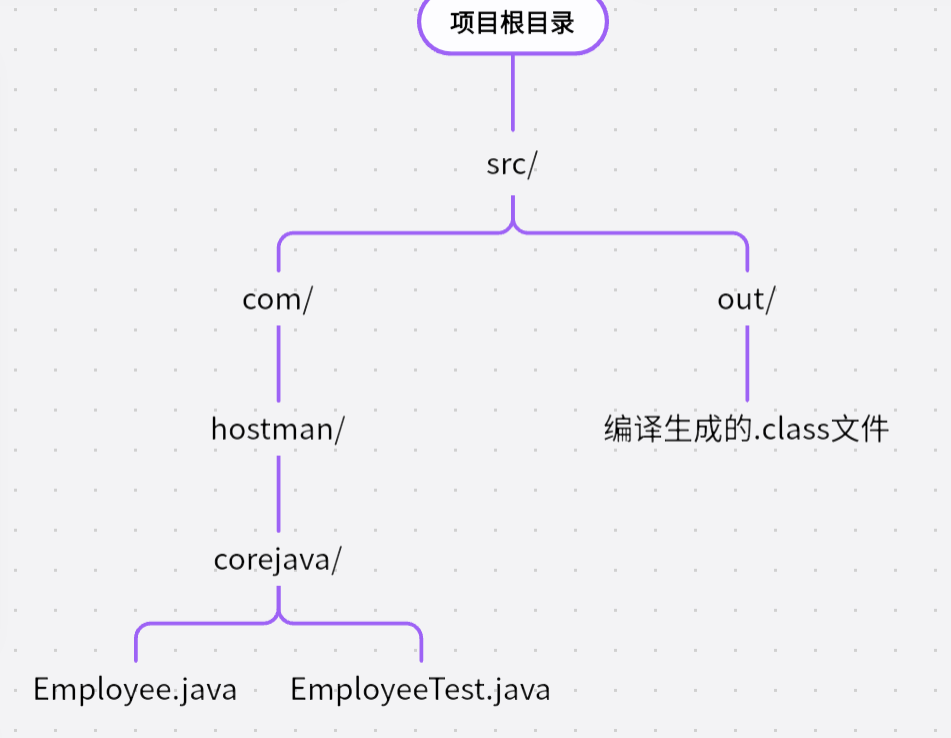

简单的说，我们应该在项目根目录之下新建一个src目录用来存储多层次的包目录结构

###### 项目与包

项目：

- 定义：项目是开发某个应用程序的整体环境，包含源代码、依赖库、配置文件、测试代码等
- 项目通常由一个或多个模块组成
- 特点：
	- 一个项目可以包含多个包
	- 包含：
		- `src/`目录用于存放源代码
		- `out/`目录存放编译后的文件
		- `pom.xml`(Maven项目)
		- 或`build.gradle`(Gradle项目)
	- 项目是一个相比包更大的概念，通常对应一个完整的软件应用

例如，一个典型的Maven项目大致有这样的目录结构：

~~~
MyJavaProject/
│── src/                (存放源代码)
│── out/                (编译后的.class文件)
│── pom.xml             (Maven 配置)
│── MyJavaProject.iml   (IntelliJ IDEA 项目配置)
│── .idea/              (IDEA 项目配置文件)
│── External Libraries/ (项目依赖库)

~~~

而包只是一种组织类的集合，主要是为了避免类名的冲突

| 对比项     | 项目 project                   | 包 package                     |
| ---------- | ------------------------------ | ------------------------------ |
| 定义       | Java应用的整体开发环境         | 用于组织Java类的逻辑结构       |
| 作用       | 组织多个包，管理整个项目       | 组织和分类类，防止类名冲突     |
| 文件结构   | 包含`src/`、 `pom.xml`、依赖等 | 物理上是`src/`目录下的子目录   |
| Java关键字 | 无需特别的关键字               | 需要`package`关键字            |
| 运行时     | 需要main方法作为入口           | 不能独立运行                   |
| 命名方式   | 没有要求                       | 建议使用域名反转格式保证唯一性 |
| 示例       | `MyJavaProject/`               | `com.mycommpany.corejava`      |

例子：

 对于一个命令行界面的模拟餐厅的Java程序，我们应该这样组织目录结构：

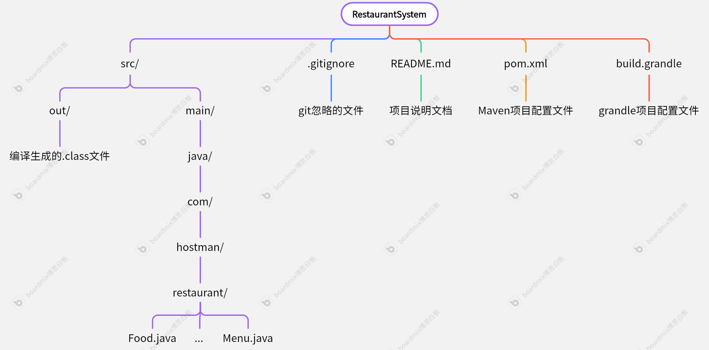

也就是说，我们的包结构应该放在`根目录/src/mian/java`之后

这样，当我们在`RestaurantSystem`目录下，使用`javac -d out src/main/java/com/mycompany/restaurant/*.java`

这里 -d out表示将.class文件输出到out目录

在运行时，应该使用命令：

`java -cp out com.hostman.restaurant.Main`

运行整个Java程序

这里我们应该清晰的认识到，编译(javac)处理的是源文件，所以文件名中使用/分隔路径；执行文件(java)是直接执行类名，表示类名时就是类的完全限定名 即包名+类名，用.作为分隔

###### IDEA中的路径

使用IDEA创建项目时，会按照Maven或Grandle标准自动生成项目目录，但是有一点小区别

主要是会多出一些IDEA的配置文件

IDEA生成的标准Java项目目录结构：

~~~csharp
RestaurantSystem/      # 项目根目录
│── .idea/             # IDEA 的项目配置文件（不需要手动修改）
│── out/               # 编译后的 .class 文件（自动生成）
│── src/               # 存放 Java 源代码
│   └── com/
│       └── mycompany/
│           └── restaurant/
│               ├── Main.java
│               ├── Restaurant.java
│               ├── Menu.java
│               ├── Order.java
│               ├── Customer.java
│               ├── Employee.java
│── RestaurantSystem.iml  # IDEA 的项目配置文件
│── External Libraries/    # 依赖库（如 JDK）

~~~

- `src/`:存放所有Java源文件，包括不同的包的目录结构

- `out/`:IDEA编译后的`.class`文件会按对应的源文件的目录结构放置

- `.idea/`:存放IDEA的配置文件

- `RestaurantSystem.iml`：IDEA的项目配置文件
- `Exrernal Libraries/`存放项目的JDK和其它依赖

IDEA生成的Maven项目目录结构：

~~~
restaurant_system/      # 项目根目录
│── .idea/             # IDEA 的项目配置文件
│── .mvn/              # Maven 相关文件（如 `.mvn/wrapper`）
│── target/            # Maven 编译后的 .class 文件
│── src/               # 主要的源代码和资源文件
│   ├── main/
│   │   ├── java/      # 存放 Java 源代码
│   │   │   └── com/
│   │   │       └── mycompany/
│   │   │           └── restaurant/
│   │   │               ├── Main.java
│   │   │               ├── Restaurant.java
│   │   │               ├── Menu.java
│   │   │               ├── Order.java
│   │   │               ├── Customer.java
│   │   │               ├── Employee.java
│   │   ├── resources/  # 存放配置文件，如 application.properties
│   ├── test/           # 单元测试代码
│── pom.xml             # Maven 配置文件（管理依赖）
│── restaurant_system.iml  # IDEA 项目配置
│── External Libraries/  # Maven 依赖库

~~~

- `src/main/java/`：存放 Java **源代码**，包路径需匹配 `package` 声明。
- `src/main/resources/`：存放 **资源文件**，如配置文件、数据库脚本等。
- `src/test/java/`：存放 **测试代码**。
- `target/`：Maven 编译生成的 `.class` 文件和 JAR 包。
- `pom.xml`：Maven 的 **核心配置文件**，用于管理依赖库。

##### 4.8.6 类路径

根据Java的标准规范，类文件应当存储在与包名匹配的文件系统的子目录中

不过，类文件也可以存储在JAR文件中,在一个JAR文件中，可以包含多个压缩格式的类文件和子目录

为了能让类被多个程序共享，我们需要做到：

1. 先设置一个项目基目录，然后把类文件放到正确的子目录结构中
	- 比如基目录为`/home/user/classdir`,而类名是`com.hostman.corejava.Employee.java`,就应该把这个文件放到`/home/user/classdir/com/hostman/corejava`子目录下
2. 将JAR文件放置在自己规定好的一个目录中，比如`/home/user/archives`
3. 设置类路径(*class path*)——类路径是所有包含类文件的路径的集合：
	- 在UNIX环境中，类路径之间用冒号:分隔，例如：
	- `/home/user/classdir:.:/home/user/archives/archive.jar`
	- 在Windows环境下，类路径之间用分号;分隔：
	- `c:\classdir;.;c:\archives\archive.jar`
	- 注意：无论是UNIX还是Windows，都用 . 代表当前路径

一个规范的类路径应该包括：

- 基目录
- 当前目录 .
- JAR文件
	- 对于JAR文件，我们可以使用通配符\*来包含所有JAR文件
	- 比如`c:\archives\*`这会包含这个目录下的所有JAR文件，但不能包含.class文件

注意：

- javac编译器总是会在当前目录下查找文件

- 但是只有类路径中包含当前目录.时Java虚拟机才会查看当前目路
- 如果不显式设置类路径，默认的类路径会包含. 不会有什么问题
- 但如果我们设置了类路径又忘记了加入当前目录，就会导致程序虽然正常编译却无法运行

具体分析：

假设我们的类路径是`/home/user/classdir:.:/home/user/archives/archive.jar`

我们试图运行`com.hostman.corejava.Employee`的类文件，那么虚拟机会经过这样的步骤去查找类文件：

1. 查找JavaAPI类
2. 如果在JavaAPI类中没有找到目标类文件，Java虚拟机就会开始从类路径中寻找，它会依次查询以下文件：
	- `/home/user/classdir/com/hostman/corejava/Employee.class`
	- `./com/hostman/corejava/Employee.class`
	- 在JAR文件中查找:`com/hostman/corejava/Employee.class`

而编译器查找类的工作会经历这样的步骤：

假设我们的源文件中使用了import语句引入了:

~~~java
import java.util.*;
import com.hostman.corejava.*;
~~~

同时，我们在类中引用了Employee类同时没有指定包名

那么编译器会：

- 首先查找java.lang.Employee(java源文件总是默认导入java.lang)
- 然后查找`java.util.Employee`和`com.hostman.corejava.Employee`和当前包中的Employee
- 编译器会在类路径上搜索以上各个类，如果找到一个以上的结果，就会报错
- 又由于完全限定名是唯一的，所以import语句的顺序并不重要

同时，编译器还会查看源文件是否比类文件新，如果跟新了的话，会自动编译源文件

##### 4.8.7 设置类路径

可以在使用Java命令时指定-classpath选项指定类路径(也可写作-cp，Java9中写为-\-class-path)

`java -classpath /home/user/classdir:.:/home/user/archives/archive.jar Example`

整个指令必须写在一行中

除了使用-classpath，也可以设置CLASSPATH环境变量来指定类路径

#### 4.9 JAR文件简介

当我们将程序打包时，我们其实只希望提供给用户一个单独的文件，而不是一个包含大量类文件的目录结构

Java归档文件——JAR文件就是为此目的设计的

##### 4.9.1创建JAR文件

可以使用jar工具制作JAR文件

默认的JDK安装中，这个工具位于jdk/bin目录下

创建JAR文件语法为:

`jar cvf jar文件1jar文件2....`

比如：

`jar cvf CalculatorClasses.jar*.class icon.gif`

jar的选项与UNIX的 tar命令选项比较类似，都有c,v,f,e等等常见选项

##### 4.9.2清单文件

JAR文件中，除了类文件、图像和其他资源外，还可以包含一个清单文件 ——manifest

用于描述归档文件的特性

清单文件被命名为MANIFEST.MF

位于JAR文件的META-INF子目录中

最简单的清单文件大致为：

`Manifest-Version: 1.0`

而复杂一些的清单文件可能包含更多的条目

清单条目被分组为多个节

第一节称为主节，作用于整个JAR文件，随后的条目可以指定命名实体的属性，如单个文件、包或者URL，这些都必须以一个Name条目开始

节与节之间用空行分开

例如：

~~~JAR
Manifest-Version: 1.0
对于整个JAR文件的描述

Name:Employee.class
对Employee.class的描述
Name: com/hostman/corejava
对这个包的描述
~~~

如果我们想编辑清单文件，应该将希望添加的行加到一个文本文件中，然后使用jar命令添加：

`jar cfm jar文件 清单文件名 ...`

比如，我们首先创建一个包含清单文件的JAR文件：

`jar cfm MyArchive.jar manifest.mf com/hostman/corejava/*.class`

当我们试图跟新JAR文件时：

`jar ufm MyArchive.jar manifest-additions.mf`

常见的jar命令选项

| 选项 | 说明                                                         |
| ---- | ------------------------------------------------------------ |
| c    | 创建一个新的存档文件并并加入文件，如果指定的文件名是目录，jar程序会对它们递归处理 |
| C    | 临时改变目录，比如`jar cvf jarFileName.jar -C classdir *.class`切换到classdir子目录来增添类文件 |
| e    | 在清单文件中创建一个入口点                                   |
| f    | 指定JAR文件名作为第二个命令行参数，如果没有这个参数，jar命令会将结果写到标准输出或从标准输入读取输入 |
| i    | 创建索引文件，主要用于大型归档文件中的查找                   |
| m    | 将一个清单文件添加到JAR文件中                                |
| M    | 不为条目创建清单文件                                         |
| t    | 显示内容表                                                   |
| u    | 更新一个已有的JAR文件                                        |
| v    | 生成详细的输出                                               |
| x    | 解压文件，如果提供一个或多个文件名，只解压这些文件，否则，解压所有文件 |
| 0    | 存储，但不进行ZIP压缩                                        |

##### 4.9.3 可执行JAR文件

可以使用jar命令的e选项指定程序的入口点，即通常调用Java执行程序时指定的类

`jar cvfe MyProgram.jar com.hostman.corejava.MainAppClass`

或者在清单文件中指定程序的主类：

`Main-Class: com.hostman.corejava.MainAppClass`

注意：不要为类名添加后缀.class

无论是那种方式添加，我们都可以使用以下命令启动程序：

`java -jar MyProgram.jar`

Windows平台中，可以使用第三方包装器工具将JAR文件转换成Windows可执行文件

#### 4.10 文档注释

JDK包中有一个工具叫做javadoc,可以由源文件生成一个HTML文档

##### 4.10.1注释的插入

javadoc从下面几项抽取信息：

- 模块
- 包
- 公共类与接口
- 公共的和受保护的字段
- 公共的和受保护的构造器以及方法

我们也应该为以上各个特性编写注释

各个注释放在所描述特性的前面

注释以`/**`开始，最后以`*/`结束

文档注释中包含标记以及标记后面的自由格式文本

标记用@开始，如@since或@param

自由格式文本的第一个句子应该是一种概要陈述

javadoc工具会自动地将这些句子抽取出来生成概要

自由文本格式文本中可以使用HTML修饰符，比如`<em>...</em>`表示强调等

##### 4.10.2 类注释

类注释必须放在import语句之下，class定义之前

类注释应当是对这个类的概要描述，比如这个类的对象代表了什么，会有什么属性

~~~java
/**
一个{@code Employee}对象代表了一名员工，
包含了员工姓名、工作id、薪资、入职日等属性

*/
class Employee{
    ....
}
~~~

##### 4.10.3 方法注释

每个方法注释必须放在所描述地方法之前。

常用地方法注释中的标记：

- `@param 参数名 对参数描述的自由格式文本`  是对参数的注释，一个方法的所有`@param`标记必须放在一起
- `@return 对返回值的描述`主要是对返回值的描述，可以跨越多行
- `@throws 异常类型 描述`这个标记表示方法可能抛出什么异常，以及对异常的描述

例子：

~~~java
/**
这个方法用于按照百分比提高员工薪资
@param byPercent 要提升的薪资的百分比 (e.g.,10代表10%)
@return 提高的薪水金额
*/
public double raiseSalary(double byPercent){
    double raise = this.salary*byPercent/100;
    this.salary += raise;
    return raise;
}
~~~

##### 4.10.4 字段注释

只需要对公共字段(通常是静态常量)添加注释

~~~java
/**
表示员工的ID
*/
public static final int nextId = 20250001;
~~~

##### 4.10.5 通用注释

标记`@since 文本`会建立一个since条目，其中的文本是对引入这个特性的版本描述

比如：`@since 1.7.1`

`@auther 文本`表示作者条目，可以有多个作者条目，不过不是必须的

`@version `表示版本，专门针对这个版本的描述

`@see 和 @link`可以使用超链接，链接到javadoc文档的相关部分或外部文档

##### 4.10.6 包注释

对于包注释，我们需要在每一个包目录中添加一个单独的文件：

- 可以提供一个名为package-info.java的文件，该文件必须包含一个javadoc注释，后面是一个package语句，除此之外不能添加任何代码
- 也可以提供一个名为package.html的HTML文件，会抽取标记`<body>..</body>`之间的所有文本

##### 4.10.7 注释提取

我们可以在命令行中使用javadoc命令来提取注释，但是更常见的其实是利用IDEA提取文档注释

IDEA中可以右键自己的类

1. **选择生成范围**：
	- 右键点击项目、包或类，选择 `Generate` -> `JavaDoc`。
2. **配置 JavaDoc 选项**：
	- **Output directory**：设置文档输出目录。
	- **Scope**：选择生成范围（如项目、模块、文件等）。
	- **Locale**：设置语言。
	- **Other command line arguments**：添加额外参数，如 `-encoding UTF-8 -charset UTF-8` 确保字符编码正确。
3. **生成文档**：
	- 点击 `OK`，IDEA 会生成 JavaDoc 文档并保存到指定目录。

#### 4.11 类设计技巧

- 一定要保证数据私有

	- 数据的形式很可能发生改变，但它们的使用方式却不会经常变化

- 一定要初始化数据

	- 虽然Java会给对象的实例字段添加默认值，但最好不要依赖系统默认值，否则很容易产生很难追踪的问题

- 不要在类中使用过多的基本类型

	- 对于过多的联系比较紧密的基本类型字段，我们应该将其组合起来组合成一个新的类，比如一个Customer类型中的Address

	- ~~~java
		class Customer{
		    private String street;
		    private String city;
		    private String state;
		    ....
		}
		~~~

	- 这样能让我们更容易地处理这些数据

- 不是所有的字段都需要访问器和修改器

	- 有些字段就应该让其保持不变，不设置修改器

- 分解有过多指责的类

	- 但其实，到底怎样算功能过多，很难阐述清楚。只能说，如果一个复杂的类明显的可以拆分成两个概念上更为简单的类，我们就应该分解
	- 反过来，我们设计10个类，每个类只有一个方法，这就属于矫枉过正了

- 类名和方法名应当见名知意

- 优先使用不可变的类

	- 对于可能变化的类存在一个大的问题：如果多个线程试图同时更新一个对象，就会发生并发更改，其结果是不可预料的
	- 尽可能地保持类是不可变地，对于表示值的类，这比较容易做到，对这个值的类进行计算，我们返回新的对象并不更新新的值
	- 但是不可能所有类都是不可变的，让员工加薪时返回一个新的Employee对象很显然不符合逻辑

## 2.实践部分

这一周我主要练习了大量的数组基本操作，以及玩具级别的OOP范式的CLI界面的模拟餐厅系统

其中大部分非常基础的练习在此没有很大的复述的意义

主要在这里总结一些练习中遇到的比较有意思的几个题的思路

### 1.数组中除去0与数组中除去重复的元素

假设我们有一个数组`int[] a = {1,3,7,0,0,8,9,0,0,4,0,8,6}`

现在，我们需要将数组中的0元素去除：

~~~java
...
    public static int[] deleteZero(int[] array){
    	int index = 0;
    	for(int i = 0;i<array.length;i++){
            if(array[i] != 0){
                array[index] = array[i];
                index++;
            }
        }
    	return Arrays.copyOf(array,index);
}
~~~

对于这个需求，我们首先思考，一个数组中，需要去除0，意味着数组的长度应该要变化，因为要去除非零元素

而数组这种数据结构本来数组长度应该是固定的

所以，首先这个方法就应该返回一个新的数组

===>凡是要增加或删除数组中元素个数的行为，我们都应该生成新数组

看具体要求，在数组中删除元素，本质上都是要把之后的元素覆盖上来

在这里，如果想清晰一点，可以开辟一个新的数组，专门来提取array中非零元素

只是使用了一个小技巧，用两个不同步的下标，使用原本的数组空间来存储需要的信息的元素

更重要的是，由于我们要去除的元素是确定的，在这里是0，因此我们只需要一层for循环，时间复杂度O(n)的代价，就能达到效果

但是，看另外一种需求：

假设一个字符串数组`String[] names = {"a","a","b","b","b","c","c","c"}`

现在我们需要删除数组中所有重复的元素，将所有不同的元素提取出来

~~~java
public static int[] deleteRepeated(int[] array){
    int[] newArr = new int[array.length];  //这里最坏情况就是所有元素都是不重复的
    int index = 0; //控制newArr的下标移动
    boolean repeated = false;
    for(int i = 0;i<array.length;i++){
        for(int j = i+1;j<array.length;i++){//从i选定的下一个元素，遍历过的就没有必要重复遍历了
            if(a[i] == a[j]){
                repeated = true;
                break; //我们的目标是找不重复的元素，既然已经重复，就没有必要继续找下去了
            }
            if(!repeated){//标志位为false，代表内层遍历中没有找到与外层循环中i下标对应的相同的元素，证明array[i]独立
                newArr[index] = array[i];
                index++;
            }
        }
    }
    return newArr;
}
~~~

在这里与上文除去0元素最大的不同之处在于，我们没有办法事先知道哪些元素是重复的，必须要遍历的方式来确定一个元素是否重复了

也即是说，我们需要两种信息：

- 一个数组元素
- 选定的元素与剩余元素是否相等

为此，我们必须付出O(n^2^)的代价来获取两种不同的信息

总结：

数组中的操作最常见的就是遍历，当我们根据业务需求设计对数组的具体需求时，如果拿不准该如何开始，也许可以从需要几种信息入手，需要的信息越多，我们必须遍历的层次就越厚，然后再理清层次之间的交互关系

### 2.选择排序与冒泡排序

选择排序：

核心思路就是对数组中的位置进行操作，我们强制让位置上的元素变成应该是的元素

~~~java
public static void sortBySelection(int[] array){
    int tempElem = 0;
    for(int i = 0;i<array.length;i++){
        for(int j =i+1;j<array.length;j++){
            if(array[i]>a[j]){
                tempElem = a[j];
                a[j] = a[i];
                a[i] = tempElem;
            }
        }
    }
}
~~~

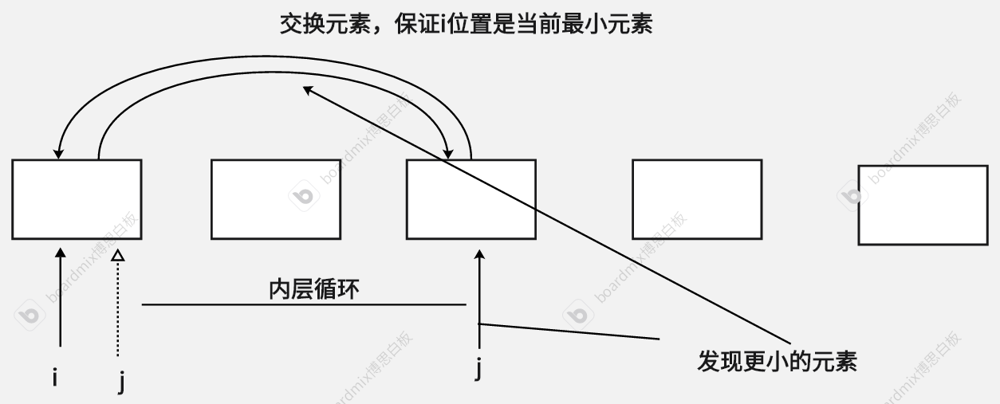

假设数组长度为n：

- 第一轮遍历：遍历剩下的n-1个元素，执行n-1次比较
- 第二轮比较：遍历剩下n-2个元素，执行n-2次比较
- …..
- 第i轮：遍历剩下的n-i个元素，执行n-i次比较
- ……
- 第n-1轮：只剩最后一个元素，不需要再比较，退出循环

总的执行次数：T(n) = (n+1)+(n-2)+….+1 = (n-1)\*n /2 

时间复杂度  O(T(n))   =  O(n^2^)

冒泡排序：

核心思想：不断比较最近的两个元素，让最大的元素交换到最后去，就像冒泡一样“冒”过去

~~~java
public void sortByBubble(int[] array){
    boolean swaped = false;
    int tempElem = 0;
    ordred:
    for(int i =0;i<array.length;i++){
        for(int j = 0;j<array.length-i-1;j++){ //只需要遍历到不是冒泡冒过去的元素为止，-1防止j+1越界
            if(array[j] > array[j+1]){
                tempElem = array[j+1];
                array[j+1] = a[j];
                a[j] = tempElem;
                swapped = true;
            }
            if(!swapped){
                //如果一整个内层循环都没有交换发生，证明数组已经有序，直接结束整个算法
                break ordred;
            }
        }
    }
    
}
~~~

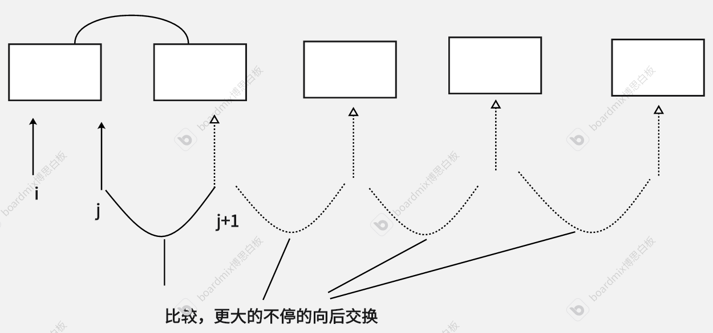

假设有n个元素：

- 第一轮，比较剩余n-1个元素，交换
- 第二轮，比较n-2个元素，交换
- 。。。
- 第n-1轮：比较最后一个元素，交换
- 总的执行次数 T(n) = (n-1)+(n-2)+…+2+1 = (n-1)\*n /2
- O(T(n)) = O(n^2^)

如果光从时间复杂度的角度考虑两个算法没有太大的差异

不过，相比选择排序，冒泡排序有这样几个优势：

- 冒泡排序是稳定的。
	- 稳定指的是相等的元素的相对顺序不会改变
	- 假设我们有4个数值对，第一个数字表示值，第二个字母表示次序
	- `(3,A),(1,B),(3，C),(2,D)`
	- 若对这几个元素的数值部分采用冒泡算法：
		- 第一轮：`3>1，(3,A)与(1,B)交换; 3=3,(3,A)与(3,C)不交换;3>2，(3,C)与(2,D)交换==>(1,B),(3,A),(2,D),(3,C) `
		- 第二轮：`1<3,(1,B)与(3,A)不交换;3>2(3,A)与(2,D)交换;3=3,(3,A)与(3,C)不交换 ==>(1,B),(2,D),(3,A),(3,C)`
		- 第三轮：数组有序，最终结果`(1,B),(2,D),(3,A),(3,C)`可以看到，相等的(3,A)与(3,C)保持了原来的相对顺序
	- 若采用选择排序:
		- 第一轮：`3>1,(3,A)与(1,B)交换;之后不再交换 ==>(1,B),(3,A),(3,C),(2,D)`
		- 第二轮：`3=3,(3,A)与(3,C)不交换;3>2,(3,A)与(2,D)交换 ==>(1,B),(2,D),(3,C),(3,A)`
		- 第三轮：`3=3,(3,C)与(3,A)不交换`，最终结果：`(1,B),(2,D),(3,C),(3,A)`
		- 可见选择排序有可能破坏想等元素之间的相对顺序，因此被称为是不稳定的
- 当数组有序时，利用标志位冒泡排序可以提前结束循环，但选择排序必须持续到n-1轮

### 3.CLI界面的餐厅模拟系统

该系统其实只是一个玩具项目，主要需求就是用户通过输入数字控制整个系统，可以浏览菜单、创建订单、查看订单、删除订单、评价食物五个功能

大致效果如下：

 

整个程序的类图如下：

整个程序中没有太过复杂的逻辑，唯一值得注意的是我还没有学习列表知识，因此几个线性表结构的实例字段用的数组结构作为属性

因此除了数组的最大长度以外，更有意义的是实际元素个数

真个程序设计中依赖关系还是比较多，需要后期更多的练习

完整实现如下：

Main.java

~~~java
import java.util.Scanner;

public class Main {
    public static void main(String[] args) {
        Scanner scanner = new Scanner(System.in);
        System.out.println("请输入您的姓名:");
        String customerName = scanner.nextLine();
        Restaurant restaurant = new Restaurant();
        Customer customer = new Customer(customerName);

        //System.out.println(restaurant.toString());

        UI ui = new UI(restaurant, customer);
        ui.process();
    }
}

~~~

 UI.java

~~~java
import java.time.format.DateTimeFormatter;
import java.util.Scanner;

public class UI {
   // private String title;
    private Restaurant restaurant;
    private final String boundary = "########";
    private Customer customer;

    public enum Operation {VIEW_MENU,ORDER,WATCH,SIGN,DELETE,LIKE,EXIT,ERROR};
    private Operation operation;

    public UI(Restaurant restaurant, Customer customer) {
        this.restaurant = restaurant;
        this.customer = customer;
    }

    /**
     * 打印程序开始界面
     */
    public void displayStartFrame() {
        System.out.println(customer.getCustomerName()
                + "同志,欢迎光临"
                + restaurant.getRestaurantAddress()
                + restaurant.getRestaurantName());
        System.out.println(boundary);

    }

    /**
     * 显示用户能够进行的所有操作
     */
    public void displayMainFrame() {
        System.out.println(boundary);
        for (Operation operation : Operation.values()) {
            displayOperation(operation);
        }
    }

    /**
     * 根据用户的操作选项，显示对应文字
     * @param operation 可能的操作选项
     */
    private void displayOperation(Operation operation) {
        switch (operation) {
            case VIEW_MENU:
                System.out.println("1.浏览菜单");
                break;
            case ORDER:
                System.out.println("2.我要订餐");
                break;
            case WATCH:
                System.out.println("3.查看餐袋");
                break;
            case SIGN:
                System.out.println("4.签收订单");
                break;
            case DELETE:
                System.out.println("5.删除订单");
                break;
            case LIKE:
                System.out.println("6.我要点赞");
                break;
            case EXIT:
                System.out.println("7.退出系统");
                break;
        }
    }

    /**
     * 获取用户输入的指令
     * @return 返回对应的枚举常量
     */
    public Operation getCode(){
        int code = handleUserInput();
        return codeToOperation(code);
    }

    /**
     * 将用户键入的数字转换成对应的枚举常量
     * @param code 用户键入的数字
     * @return 对应的表示操作的枚举超量
     */
    private Operation codeToOperation(int code) {
        return switch (code) {
            case 1 -> Operation.VIEW_MENU;
            case 2 -> Operation.ORDER;
            case 3 -> Operation.WATCH;
            case 4 -> Operation.SIGN;
            case 5 -> Operation.DELETE;
            case 6 -> Operation.LIKE;
            case 7 -> Operation.EXIT;
            default -> Operation.ERROR;
        };
    }

    /**
     * 处理用户输入
     * @param operation :用户键入的用来控制流程的输入
     */
    public void handleUserInput(Operation operation) {
        switch (operation) {
            case ORDER:
                handleOrder();
                break;
            case WATCH:
                //实现查看餐袋
                handleWatch();
                break;
            case SIGN:
                //实现签收订单
                handleSign();
                break;
            case DELETE:
                //实现删除订单
                handleDelete();
                break;
            case LIKE:
                //实现点赞
                handleLike();
                break;
            case EXIT:
                System.out.println("谢谢惠顾,再见！");
                System.exit(0);
                break;
            case VIEW_MENU:
                viewMenu();
                break;
            case ERROR:
                System.out.println("输入有误！请重新输入");
                break;
        }

    }

    /**
     * 处理用户输入，避免当需要输入整数时用户输入其他类型数据
     * @return 合法的输入
     */
    private int handleUserInput(){
        Scanner scanner = new Scanner(System.in);
        int code = 0;
        boolean validInput = false;
        while (!validInput) {
            if (scanner.hasNextInt()) {
                code = scanner.nextInt();
                validInput = true;   //输入的是整数，结束循环
            } else {
                System.out.println("无效输入，请输入整数!");
                scanner.next();
            }
        }
        return code;
    }

    /**
     * 处理浏览菜单逻辑
     */
    private void viewMenu() {
        restaurant.getMenu().displayMenu();
    }

    /**
     * 处理用户要点餐的逻辑
     */
    private void handleOrder() {
        do {
            System.out.println();
            System.out.println(boundary);
            System.out.println("\t\t本店菜品");
            restaurant.getMenu().displayMenu();

            System.out.println("请输入您要点的菜品序号:");
            int number = handleUserInput();

            if (number < 1 || number > restaurant.getMenu().getFoodNumber()) {
                System.out.println("输入有误！");
                return;
            } else {
                Order newOrder = customer.createOrder(restaurant, number);
                restaurant.setOrderList(newOrder);
                System.out.println(newOrder.toString());
                System.out.println("点菜成功!\n输入0返回上一级,输入任意数继续点餐");
                int backCode = handleUserInput();
                if (backCode == 0) {
                    break;
                }

            }
        } while (true);

    }

    /**
     * 处理用户要查看餐袋的逻辑
     */
    private void handleWatch() {
        int count = 0;
        DateTimeFormatter formatter = DateTimeFormatter.ofPattern("hh:mm:ss ");
        do {

            displayOlder();
            System.out.println("输入0返回上一级");
            int backCode = handleUserInput();
            if (backCode == 0) {
                break;
            }
        } while (true);

    }

    private void displayOlder(){
        if (restaurant.getIndexOrderList() > 0) {
            int count = 0;
            DateTimeFormatter formatter = DateTimeFormatter.ofPattern("hh:mm:ss ");

            System.out.println();
            System.out.println(boundary);
            System.out.println("订单编号\t\t订单内容\t\t订单时间\t\t订单状态");
            for (Order order : restaurant.getOrderList()) {
                String formatTime = order.getOrderTime().format(formatter);
                System.out.printf("%d\t%s\t%s\t%s\t\n",
                        order.getId(),
                        order.getOrderFood().getName(),
                        formatTime,
                        order.getOrderStatus());
                count++;
                if (count == restaurant.getIndexOrderList()) {
                    break;
                }

            }
        } else {
            System.out.println("还没有订单哦~");
        }
    }

    /**
     * 处理用户要签收的逻辑
     */
    private void handleSign() {
        if (restaurant.getIndexOrderList() > 0) {
            System.out.println();
            System.out.println(boundary);
            System.out.println("当前订单:");
            displayOlder();

            System.out.println("请输入要签收的订单编号:");
            int orderId = handleUserInput();
            Restaurant.OperationStatus status = restaurant.signOrder(orderId, customer);

            if (status == Restaurant.OperationStatus.OK) {
                System.out.println("签收成功！祝您用餐愉快");
            }
        } else {
            System.out.println("还没有订单哦~");
        }
    }

    /**
     * 处理用户删除订单的逻辑
     */
    private void handleDelete() {
        if (restaurant.getIndexOrderList() > 0) {
            System.out.println();
            System.out.println(boundary);
            System.out.println("当前订单:");
            displayOlder();

            System.out.println("请输入要删除的订单编号:");
            int orderId = handleUserInput();

            Restaurant.OperationStatus status = restaurant.deleteOrder(orderId);
            if (status == Restaurant.OperationStatus.OK) {
                System.out.println("删除成功");
            }
        } else {
            System.out.println("还没有订单哦~");

        }

    }

    /**
     * 处理用户点赞菜品的逻辑
     */
    private void handleLike() {
        int count = 1;
        int index = 0;
        Scanner scanner = new Scanner(System.in);
        String userInputFood;
        int userInputEvaluate;
        System.out.println();
        System.out.println(boundary);

        if (customer.getRealeatlength() == 0) {
            System.out.println("您还没有品尝过本店的食物哦~");
            return;
        } else {
            System.out.println("您已经品尝过的食物有:");
            for (Food food : customer.getEatList()) {
                System.out.println(food.getName());
                index++;
                if (index == customer.getRealeatlength()) {
                    break;
                }
            }

        }

        System.out.println();
        System.out.println("请输入您要评价的食物名称:");
        userInputFood = scanner.next();
        Food choiceFood = null;
        index = 0;
        for (Food food : customer.getEatList()) {
            if (food.getName().equals(userInputFood)) {
                choiceFood = food;
                break;
            }
            index++;
            if (index == customer.getRealeatlength())
                break;
       }
       if(choiceFood == null){
           System.out.println("抱歉，您暂时没吃过这种食物哦~");
           return;
       }
        System.out.println("评价标准为:");
        String standard = """
                1.恶心
                2.不好吃
                3.一般
                4.好吃
                5.人间美味
                """;
        System.out.println(standard);
        System.out.println("请选择您的评价:");
        userInputEvaluate = handleUserInput();
        customer.evaluateFood(choiceFood,userInputEvaluate);

    }

    public void process() {
        displayStartFrame();
        while (true) {
            displayMainFrame();
            System.out.println(boundary);
            System.out.println("请输入您的选择");
            Operation userOperation = getCode();
            handleUserInput(userOperation);
        }

    }
}
~~~

Restaurant.java

~~~java
import java.time.LocalTime;

public class Restaurant {

    private String restaurantName;
    private String restaurantAddress;
    private LocalTime openTime;
    private LocalTime closeTime;
    private Food[] foodList;
    private Menu menu;
    private Order[] orderList;//实际元素商都是this.indexOrder，length是最大长度
    //private int userCode;
    private int indexOrderList = 0;

    public final int MAX_ORDER = 100;
    public enum foodType {BOILED_FISH,FRIED_PIG_KIDNEY,TWICE_COOKED_PORK,MAPO_TOFU}
    public enum OperationStatus {OK,ERROR};

    public Restaurant() {
        this.restaurantName = "大大小饭店";
        this.restaurantAddress = "火星路333号";
        this.openTime = LocalTime.of(10, 0);
        this.closeTime = LocalTime.of(20, 0);

        foodType[] types = foodType.values();//获取枚举常量
        this.foodList = new Food[types.length];//初始化foodlist数组
        for (int i = 0; i < types.length; i++) {
            this.foodList[i] = creatFoodFromType(types[i]);
        }

        this.menu = new Menu(foodList);
        this.orderList = new Order[MAX_ORDER];
    }

    private Food creatFoodFromType(foodType type) {
        return  switch (type){
            case BOILED_FISH -> new Food("水煮鱼",48.00);
            case FRIED_PIG_KIDNEY -> new Food("炒腰花",40.00);
            case TWICE_COOKED_PORK -> new Food("回锅肉",35.00);
            case MAPO_TOFU -> new Food("麻婆豆腐",18.00);
        };

    }
    
    public String getRestaurantName() {
        return restaurantName;
    }
    public String getRestaurantAddress() {
        return restaurantAddress;
    }
    //LocalTime是不可变类
    public LocalTime getOpenTime() {
        return openTime;
    }
    public LocalTime getCloseTime() {
        return closeTime;
    }
    public Food[] getFoodList() {
        return (Food[]) foodList.clone();
    }
    public Menu getMenu() {
        return menu;
    }

   

    public void setOrderList(Order order) {
        orderList[indexOrderList] =order ;
        indexOrderList++;
    }
    public int getIndexOrderList() {
        return indexOrderList;
    }

    public Order[] getOrderList() {
        return (Order[]) orderList.clone();
    }

    /**
     * 从餐厅订单列表中删除订单
     * @param orderId 要删除的订单编号
     * @return 成功返回OK，否则返回ERROR
     */
    public OperationStatus deleteOrder(int orderId) {
        int indexDeleteOrder = getOrderIndexById(orderId);
        if (indexDeleteOrder != -1) {
            for (int i = indexDeleteOrder; i < indexOrderList; i++) {
                orderList[i] = orderList[i+1];
            }
            indexOrderList--;
            return OperationStatus.OK;
        }else {
            System.out.println("试图删除的订单不存在!");
            return OperationStatus.ERROR;
        }

    }

    /**
     * 通过目标订单ID获取在餐馆订单列表中的索引
     * @param orderId 想要寻找的Order的ID
     * @return 若找到返回对应索引，否则返回-1
     */
    private int getOrderIndexById(int orderId) {
        int indexDeleteOrder = -1;
        //找到对应id的order索引
        for (int i = 0; i < this.indexOrderList; i++) {
            if (orderList[i].getId() == orderId) {
                indexDeleteOrder = i;
                break;
            }
        }
        return indexDeleteOrder;
    }

    /**
     * 对订单进行签收
     * @param orderId 将要签收的订单索引
     * @return 若成功签收，返回表示操作成功的枚举常量OK，否则返回ERROR
     */
    public OperationStatus signOrder(int orderId,Customer customer) {
        int indexSignOrder = getOrderIndexById(orderId);
        if (indexSignOrder != -1) {
            if (orderList[indexSignOrder].getOrderStatus() == Order.OrderStatus.STANDING_BY) {
                orderList[indexSignOrder].setOrderStatus(Order.OrderStatus.FINISHED);
                customer.eatFood(orderList[indexSignOrder].getOrderFood());
            }else {
                System.out.println("不能签收已完成的订单！");
                return OperationStatus.ERROR;
            }
        }else {
            System.out.println("试图签收的订单不存在!");
            return OperationStatus.ERROR;
        }
        return OperationStatus.OK;
    }
   
    public String toString() {
        return "Restaurant [restaurantName=" + restaurantName + ", restaurantAddress="+restaurantAddress+"]";
    }

}
~~~

Food.java

~~~java
public class Food {
    private String name;
    private double price;
    public enum EvaluateType {DISGUSTING,BAD,NORMAL,GOOD,EXCELLENT};
    private EvaluateType evaluateType;

    public Food(String name, double price) {
        this.name = name;
        this.price = price;
        this.evaluateType = EvaluateType.NORMAL;
    }
    public String getName() {
        return name;
    }
    public double getPrice() {
        return price;
    }

    /**
     * 用户针对这一食物进行评级
     * @param evaluateType:代表用户的评价
     */
    public void setEvaluateType(EvaluateType evaluateType) {
        this.evaluateType = evaluateType;
    }
    public EvaluateType getEvaluateType() {
        return evaluateType;
    }

    public String toString() {
        return "["+name + "," + price + "," + evaluateType+"]";
    }

}
~~~

Customer.java

~~~java
public class Customer {
    private  static long customerId = 20250001;
    private String customerName;
    private Food[] eatList;
    public  final int MAX_EAT = 20;
    private int realeatlength;

    public Customer(String customerName) {
        this.customerName = customerName;
        customerId = customerId++;
        eatList = new Food[MAX_EAT];
        realeatlength = 0;
    }

    public String getCustomerName() {
        return customerName;
    }
    public int getRealeatlength() {
        return realeatlength;
    }

    /**
     * 对签收完的订单上的食物把它吃掉
     * @param food 吃掉的食物
     */
    public void eatFood(Food food) {
        eatList[realeatlength] = food;
        realeatlength++;
    }

    public Food[] getEatList() {
        return eatList;
    }

    /**
     * 顾客进行点餐
     * @return 生成一个待完成订单
     * @param restaurant 点餐的餐馆
     * @param orderCode 点餐序号
     */
    public Order createOrder(Restaurant restaurant,int orderCode) {
        Food targetFood = restaurant.getMenu().getFood(orderCode);
        //Food[] targetFoods = new Food[]{targetFood};
        return new Order(targetFood, this,restaurant);
    }

    /**
     * 对食物进行评价
     * @param food :要评价的食物
     */
    public void evaluateFood(Food food,int evaluateCode) {
        Food.EvaluateType evaluateUser = switch (evaluateCode){
            case 1 -> Food.EvaluateType.DISGUSTING;
            case 2 -> Food.EvaluateType.BAD;
            case 3 -> Food.EvaluateType.NORMAL;
            case 4 -> Food.EvaluateType.GOOD;
            case 5 -> Food.EvaluateType.EXCELLENT;
            default -> throw new IllegalStateException("Unexpected value: " + evaluateCode);
        };
        food.setEvaluateType(evaluateUser);
    }

}
~~~

Order.java

~~~java
import java.time.LocalTime;
import java.time.format.DateTimeFormatter;

public class Order {
    private Food orderFood;
    private Customer customer;
    private Restaurant targetRestaurant;
    private static long nextid = 20250001 ;
    private long id;
    private LocalTime orderTime;
    public enum OrderStatus {FINISHED, STANDING_BY};
    private OrderStatus orderStatus;

    public Order(Food orderFood, Customer customer, Restaurant targetRestaurant) {
        this.orderFood = orderFood;
        this.customer = customer;
        this.targetRestaurant = targetRestaurant;
        this.orderStatus = OrderStatus.STANDING_BY;
        id = nextid;
        nextid++;
        this.orderTime = LocalTime.now();
    }

    public Food getOrderFood() {
        return orderFood;
    }
    public Customer getCustomer() {
        return customer;
    }
    public Restaurant getTargetRestaurant() {
        return targetRestaurant;
    }
    public LocalTime getOrderTime() {
        return orderTime;
    }
    public OrderStatus getOrderStatus() {
        return orderStatus;
    }
    public void setOrderStatus(OrderStatus orderStatus) {
        this.orderStatus = orderStatus;
    }
    public long getId() {
        return id;
    }

    /**
     * 通过ID获得订单对应的食物
     * @param id 提供的订单ID
     * @return 对应的食物
     */
    public Food getOrderFoodByID(long id) {
        return orderFood;
    }

    public String toString() {
        DateTimeFormatter formatter = DateTimeFormatter.ofPattern("hh:mm:ss a");
        String formattedTime =orderTime.format(formatter);
        return "[订单编号:"+id+",订单食物:"+orderFood.toString()+",订单餐馆:"+targetRestaurant.getRestaurantName()+",订单时间"+formattedTime+"]";
    }

}
~~~

Menu.java

~~~java
public class Menu {
    private Food[] foods;
    private  String menuHead ;
    private int foodNumber;

    public enum menuHeadType {SEQUENCE,FOOD_NAME,FOOD_PRICE,};

    public Menu(Food[] foodList) {
        this.foods = foodList;
        this.foodNumber = foods.length;
        menuHeadType[] menuHeadTypeArray = menuHeadType.values();
        this.menuHead = creatMenuHeadByType(menuHeadTypeArray);

    }

    /**
     * 创建菜单表头的字符串
     * @param menuHeadTypeArray:存放菜单表头的枚举常量数组
     * @return 代表菜单表头的字符串
     */
    private String creatMenuHeadByType(menuHeadType[] menuHeadTypeArray) {
        StringBuilder headBuilder = new StringBuilder();
        for(menuHeadType headType : menuHeadTypeArray) {
            switch (headType) {
                case SEQUENCE:
                    headBuilder.append("序号\t\t");
                    break;
                case FOOD_NAME:
                    headBuilder.append("菜品名\t\t");
                    break;
                case FOOD_PRICE:
                    headBuilder.append("单价\t\t");
                    break;
            }
        }
        return headBuilder.toString();

    }

    /**
     * 在控制台输出菜单内容
     */
    public void displayMenu() {
        int count = 1;
        System.out.println(menuHead);
        for(Food food : foods) {
            String evaluate = switch (food.getEvaluateType()){
                case DISGUSTING -> "恶心";
                case BAD -> "不好吃";
                case NORMAL -> "一般";
                case GOOD -> "好吃";
                case EXCELLENT -> "人间美味";
            };
            System.out.printf("%d\t%s(%s)\t\t%.2f\n",count,food.getName(),evaluate,food.getPrice());
            count++;
        }
        //foodNumber = count;
    }

    /**
     * 计算这份菜单的总价
     * @return 菜单上所有菜品的总价
     */
    public double accountMenu(){
        double sum = 0;
        for(Food food : foods) {
            sum += food.getPrice();
        }
        return sum;
    }

    public int getFoodNumber() {
        return foodNumber;
    }

    public Food[] getFoods() {
        return foods;
    }

    /**
     * 根据食物序号获得对应的食物对象
     * @param orderCode 在菜单上的食物序号
     * @return 对应的食物对象
     */
    public Food getFood(int orderCode) {
        return foods[orderCode-1];
    }

}

~~~

## 后记

这一周理论知识学习类容不多，大部分时间用在了数组的操作上，最后根据OOP实现了一下模拟餐厅系统

但是自己对OOP开发还是非常生疏，设计的类之间依赖关系比较多

下一周不出以外应该继续OOP的基础理论学习

本周阅读书籍：

《Java核心技术卷Ⅰ》
