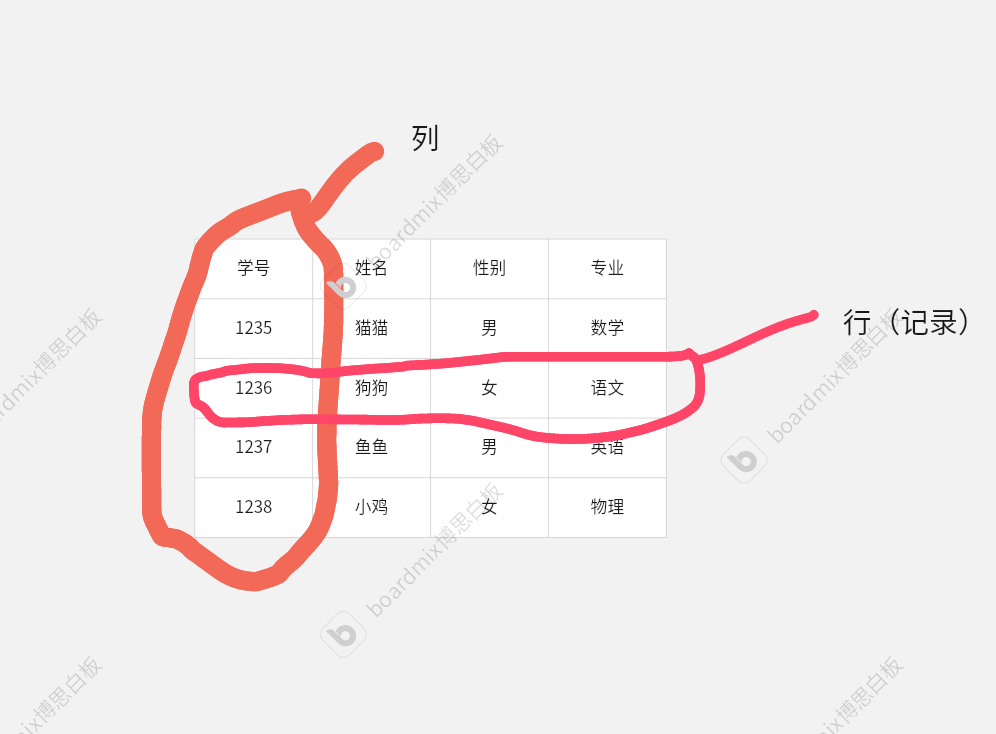
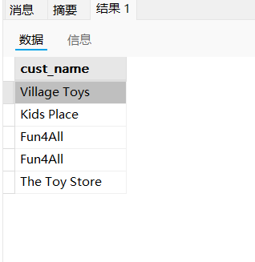
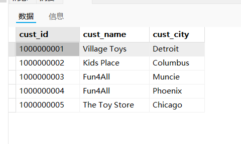
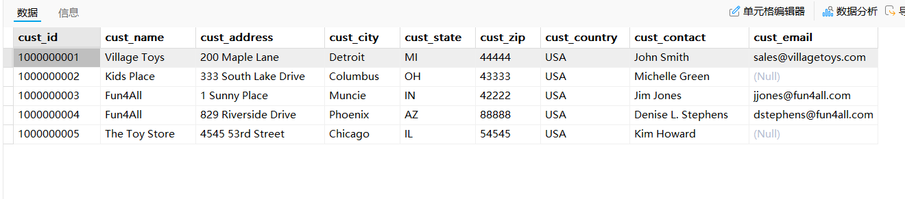
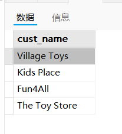
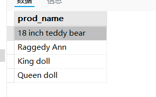
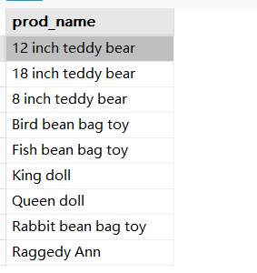
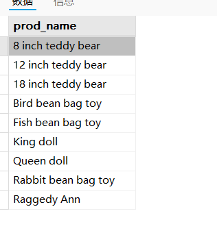
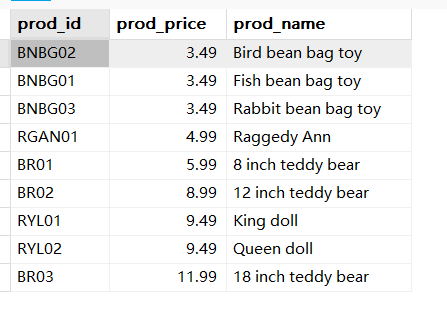
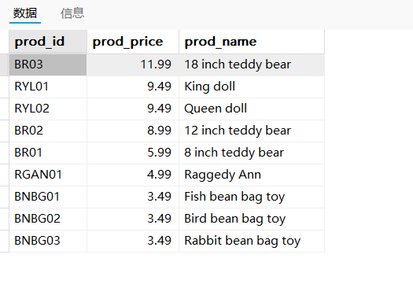

# MYSQL必知必会

## 第一课 了解SQL

### 1.1数据库基础

现代软件几乎离不开数据库，但是对数据库具体概念并不是每个人都清楚。

有时在数据库方面的同一个术语会代表不同内容

#### 1.1.1数据库

数据库：以某种有组织的方式存储的数据集合

类似于一个文件柜，数据库就是这个柜子，对于柜子装什么内容、如何装内容柜子本身并不在意。

数据库管理系统——DBMS:数据库的管理软件，通过DBMS创建和管理数据库，常见的MySQL、Oracle

#### 1.1.2表

表：

- 一种结构化的文件，存储某种特定类型的数据。
- 存储在同一张表上的数据应该是同一种类型。
- 在一个数据库中，表名应保持唯一
- 模式：关于数据库和表的布局及特性的信息，包括：
	- 如何存储数据
	- 数据如何分解
	- 各部分信息如何命名
	- …..

#### 1.1.3 列和数据类型

表由列组成。

列（column）：

- 表中的一个字段，所有表都是由一个列或多个列组成。
- 应当正确的把数据分为多个列，根据需求确定分到何种程度
- 每个列都有固定的数据类型，数据类型限制了存储在每一列的数据的种类
- 由于不同的DBMS对数据类型的定义不同，导致了不同DBMS的SQL不兼容

#### 1.1.4 行(row)

表中的数据按照行存储。

行也称为记录，一条记录代表了一个具体的数据对象。

​                         行与列示意图

#### 1.1.5 主键

 对于一张表的每一个记录，都应该有一列（或多列）用来对该记录进行唯一标识， 这一列称为主键(primary key)。

- SQL语法没有强制规定创建一张表必须有主键，但是规范设计的表都必须考虑设计主键
- 任意两行都应该有不同的主键值，也就是作为主键的列中的值都是唯一的
- 每一行都必须有一个主键值，主键值不能为NULL
- 主键列中的值不允许修改或更新
- 主键值不能重用—-即使某行被删除，它的主键值也不能赋给新行。
- 如果多个列组合作为主键，那么单个列的值可以不唯一，但多个列的组合必须唯一

### 1.2 什么是SQL

SQL:结构化查询语言，是一种专门用于沟通数据库的语言

SQL相比其他计算机语言语法更加简洁内容少，因为SQL的设计目的就是为了完成一项任务——从数据库读写数据。

## 第二课 检索数据

### 2.1 SQL语句基本介绍

SQL 结构化查询语言: 

- 是一种用于管理和操作关系型数据库的标准编程语言

关系型数据库：

- 以表table的形式存储数据。表由行(记录)和列(字段)组成
- 关系型数据库的核心是表之间的关系，SQL通过`JOIN`操作将多个表数据关联起来，来实现设计逻辑

SQL的主要功能：

- 数据查询：SQL的核心功能。使用`SELECT`语句从表中提取需要的数据，可以使用条件、排序、分组等操作过滤和组织结果

- 数据操作：SQL支持对数据进行一系列操作，主要包括:

	- 插入数据：向表中添加新记录，使用`INSERT INTO`语句

	- 更新数据：修改表中现有的记录，使用`UPDATE`语句

	- 删除数据：从表中删除记录，使用`DELETE`语句

- 数据定义：SQL允许用户定义和修改数据库结构：

	- 创建表：定义新表或添加新字段，使用`CREAT TABLE`语句
	- 修改表: 添加、删除或修改表的字段，使用`ALTRE TABLE`语句
	- 删除表：使用`DROP TABLE`语句

- 数据控制：

	- SQL支持对数据库的访问控制和权限管理
	- 使用`GRANT`和`REVOKE`语句授予或撤销用户对数据库对象的访问权限

- 聚合与分组：

	- SQL支持对数据进行聚合计算(如求和、平均值、计数等)
	- SQL也支持分组操作(`GROUP BY`)

- 事务管理：

	- SQL支持事务(Transaction),即一组要么全部成功要么全部失败的操作
	- 通过`BEGIN`、`COMIT`和`ROLLBACK`语句，用来确保数据的一致性和完整性

### 2.2 SELECT语句基本使用

SQL的语句都由关键字和数据组成

SELECT语句是最常见的SQL语句

~~~SQL
SELECT 列名
FROM 表名;
~~~

SELECT FROM 称为关键字，SQL中没有严格规定关键字的大小写，但是一般习惯SQL关键字全部大写,表名和字段名全部小写

SQL语句不会检查换行符，习惯上一个子句占一行

SQL语句以分号结尾

SQL语句不像一般的程序设计程序，一般一条语句就都能得到执行结果

SELECT语句用于从表中查询一列的数据：

~~~sql
SELECT cust_name
FROM customers;
~~~

可以利用一条SELECT语句查询多个列，列名之间用逗号隔开，最后一个列名不能加逗号。

会按照语句中输入的顺序返回列

~~~sql
SELECT cust_id,cust_name,cust_city
FROM customers;
~~~

也可以使用通配符检索表中的所有列

~~~sql
SELECT *
FROM customers;
~~~

利用DISTINCT关键字，可以限制SELECT语句的输出结果，只输出不同的值

~~~sql
SELECT DISTINCT cust_name
FROM customers;
~~~

如果希望限制输出结果，不全部输出，在MySQL中，可以使用LIMIT子句

~~~sql
SELECT prod_name
FROM products
LIMIT 5 OFFSET 5;
~~~

OFFSET指示了从哪一行开始检索的行索引，LIMIT指示了检索多少行。

行数索引从0开始

不同的DBMS中，对于限制这一子句有不同的实现

如Oralce中，需要基于ROWNUM(行计数器)来计算行

~~~sql
SELECT  prod_name
FROM products
WHERE ROWNUM <=5;
~~~

## 第三课 排序检索数据

### 排序数据

使用SELECT语句的`ORDER BY` 子句，可以实现对检索数据的排序。

- 如果直接使用SELECT检索到的数据，数据会按照在数据库表中的顺序进行输出；
- 这个顺序一开始可能是录入数据时的顺序，但如果之后有删除或更新，这个顺序会受到DBMS重用回收存储空间的方式影响。
- 因此，关系数据库设计理论认为，如果不明确规定排序顺序，则不应该假定检索出的数据的顺序有任何意义

格式：

- SELECT指定要检索的列，
- ORDER BY子句指定根据哪一列的顺序对要输出的列排序；这里可以指定与输出列不同的列。
- ORDER BY 子句必须是SELECT语句的最后一个子句

~~~sql
SELECT prod_name
FROM Products
ORDER BY prod_name;
~~~

排序结果按照字典顺序升序排列

注意：

- 输出的前三条记录的pro_name字段，`12 inch... `在第一个 ，之后是`18 inch...`，最后是`8 inch...`

- 并没有按照前面数字的大小进行排序

- 因为MySQL中默认所有数据都是字符串，这里12 18 8 三个数据，1的字符顺序比8靠前，因此这两条排到了更前面

- 如果希望按照数字大小顺序排序，可以考虑提取数字内容单独作为一列，

- 或者使用一些更复杂的关键字来满足需求

- 以下是GPT4-o给我提供的参考:

- ~~~sql
	SELECT prod_name
	FROM products
	ORDER BY 
	  CASE 
	    WHEN prod_name REGEXP '^[0-9]+' THEN 1  -- 以数字开头的设为 1
	    ELSE 2  -- 以字母开头的设为 2
	  END,
	  CAST(prod_name AS UNSIGNED),  -- 数字排序（对以数字开头的数据）
	  prod_name;  -- 字母按字典顺序排序
	
	~~~

可见，SQL语句的语法并不复杂，但是合理设计的SQL语句可以实现非常强大的功能

### 按多个列排序

可以按照不止一个列的顺序排序。

当`ORDER BY`后面出现了多个列后，会优先按照第一个列的顺序排序，之后，如果有记录的第一个字段值相同，再按照第二列的顺序排序，依次类推。

~~~sql
SELECT prod_id,prod_price,prod_name
FROM products
ORDER BY prod_price,prod_name;
~~~

### 指定排序方向

`ORDER BY`子句默认按照升序顺序排序，如果希望按照降序排序，可以指定`DESC`关键字表示降序

~~~sql
SELECT prod_id,prod_price,prod_name
FROM products
ORDER BY prod_price DESC;
~~~

注意如果按照多个列的顺序进行排序时，DESC只做用于离它最近的列，不会影响其他列

实际上还存在一个与DESC对应的关键字`ASC`用来指定按照升序顺序排列，但这个关键字意义不大，因为`ORDER BY`默认就会按照升序排列

