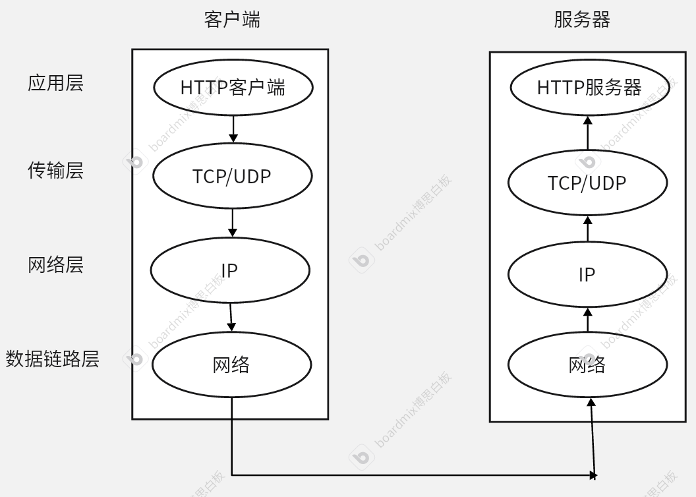
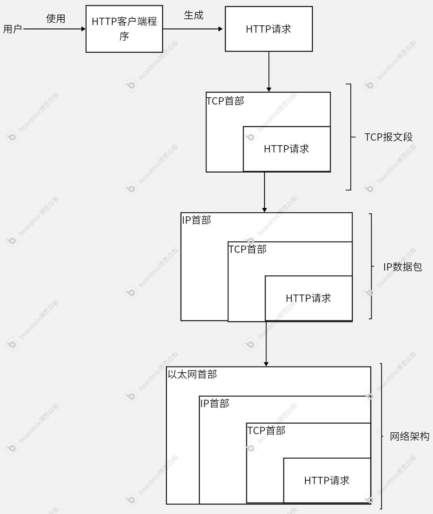
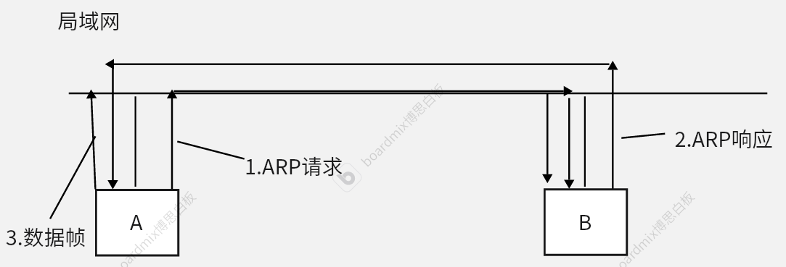
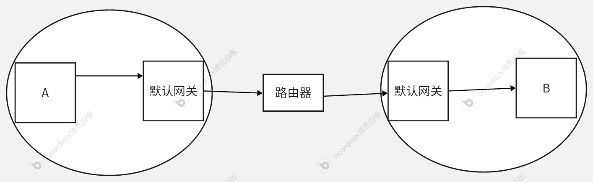
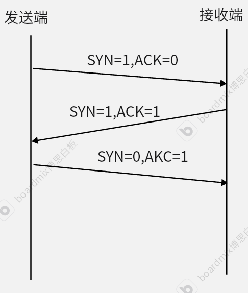
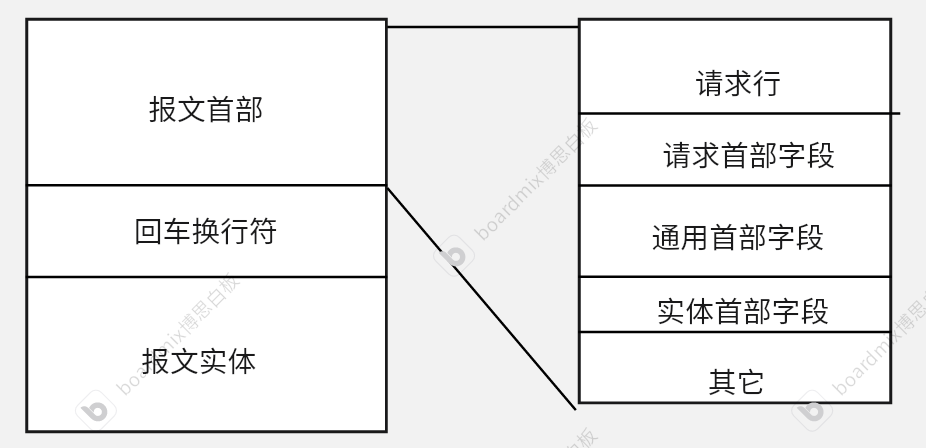

# 计算机网络学习

## 第1章 了解web网络基础

### 1.1 使用 HTTP协议访问Web

​                              请求

客户端      \<\=\=\=\=\= \=\=\=\=\=\=\=\=\=\=  >     服务器

​			      相应

​			HTTP协议

- 客户端：通过请求获取服务器资源
- 服务器：对请求进行相应并处理
- HTTP :超文本传输协议

### 1.2 HTTP的诞生

1989年3月，HTTP诞生。

CERN(欧洲核子研究组织)提姆伯纳斯李提出了远距离共享的设想

HTTP基本理念：借助多文档之间的相互关联形成的超文本，连成可以互相参阅的万维网 ——www

构建www的技术：

- HTML：一种使用标准通用标记语言（SGML）作为标记的语言
- URL：指定文档所在地
- HTTP：文档传递协议

1990年11月，CERN成功研发了第一台web服务器和web浏览器。

不同公司的浏览器对HTML支持有细微区别，设计时需要考虑HTML兼容

1996年5月，HTTP1.0发布，该协议标准仍被广泛应用，之前的HTTP协议称为HTTP0.9

1997年1月，HTTP1.1发布，是目前最主流的HTTP协议版本

新一代HTTP2.0仍在制订中，覆盖率不高。

### 1.3 网络基础HTTP

互联网是在TCP/IP协议的基础上运行的。

HTTP协议是TCP/IP协议族的一个子集。

#### 1.3.1 TCP/IP协议族

协议：为了使不同的计算机之间实现相互通信，双方必须约定一套相同的规则来用于通信，这种规则就被称为协议。

TCP/IP协议族规定的内容包括:

- 电缆的规格
- IP地址的选定方法
- 寻找异地用户的方法
- …..

目前，一切关于与互联网相关的协议集合，被称为TCP/IP协议族。

#### 1.3.2 TCP/IP的分层管理

从功能的角度，TCP/IP协议族分为了四层，包括：

- 应用层
- 传输层
- 网络层
- 数据链路层

各层之间拥有通信的接口，除此之外，各层之间不会造成影响。

分层管理简化了设计，应用层的应用程序在设计时只需考虑本来的任务，不需要去关注对方在哪里，传输是否能送达。。。

##### 应用层

决定了向用户提供应用服务时的通信活动。

应用层协议包括（就是说开发的web程序要遵循的通信规则）：

- FTP:文件传输协议
- DNS：域名系统
- HTTP:文件传输协议
- …..

主要功能：应用层是用户能看见的部分，直接处理应用程序对通信的需求。

HTTP协议的简单工作模型：

​                                 HTTP协议

 用户输入网址   \=\=\=\=\=\=\=\=\=\=>服务器接收请求（用户要访问网址对应的网页）

​          浏览器


##### 传输层

- 主要作用：确保数据完整、有序的到达目标设备
- 主要的传输层协议：
	- TCP：传输控制协议
	- UDP：用户数据报协议

##### 网络层

主要功能：找到数据从源到达目的地的路径，这种行为被称为路由。

实现路由的核心：IP地址

##### 数据链路层

主要功能：负责在物理设备之间传输数据

实现功能的核心：MAC地址

#### 1.3.3 TCP/IP通信传输流

​                                                                       各层之间数据流动示意图



1. 用户使用应用程序例如，浏览器，希望进行通信，于是浏览器发送符合规范的通信消息—请求
2. 在客户端中消息按照规定的形式一层层的向下传递
3. 到达服务器端后，服务器端从数据链路层开始接收消息
4. 服务器端中按照规则逐层向上传递客户端发来的消息，直到到达应用层的服务器程序
5. 当服务器业务逻辑处理完成，对客户端的响应按照同样的流程传输回客户端。

具体来说：



1.用户在使用HTTP客户端程序时，产生了通信需求，由HTTP客户端程序生成HTTP请求，用于传输用户对服务器的请求（要服务器做什么）

2.传输层中，为了方便传输，TCP协议将HTTP请求按照一定的大小和规则，分割成一段段的报文段并在各个报文段上添加序号与端口号，之后转发给网络层。

3.TCP报文段到达网络层后，添加IP头（源IP、目标IP）转发给数据链路层

4.数据链路层添加MAC头（源MAC,目标MAC）对实际网络传输进行控制，送至目的服务器。

这种对数据的包装称为封装。


思考：

- 虽然逻辑上整个封装过程是分层次进行的，但对于这一个流程的实现都是在本地计算机上实现的。

- 应用层上，由各种HTTP客户端程序实现生成HTTP请求报文。

- 传输层上，对请求报文数据的分割，以及之后的其他层的添加MAC地址等行为，并不是由一个独立的应用程序来进行具体操作，而是由操作系统内核中的TCP/IP==协议栈==完成。

- 以liunx操作系统中发送HTTP请求举例：

	| 层次            | 逻辑上的行为                                                 | 对应的实现                                                |
	| --------------- | ------------------------------------------------------------ | --------------------------------------------------------- |
	| 应用层          | 应用程序调用socket()创建套接字，并调用send()发送数据         | net/socket.c:实现 scocket API(socket()、bind()、listen()) |
	| TCP层（传输层） | TCP将大数据拆分成报文段；TCP计算校验和，确保数据完整性；TCP维护重传机制，保证可靠传输 | net/ipv4/tcp.c:实现TCP逻辑（重传、控流）                  |
	| IP层（网络层）  | 为TCP报文添加IP头；查找路由表，确定下一跳地址                | /net/ipv4/ip_output.c处理IP数据包的发送                   |
	| 数据链路层      | 添加MAC头；调用网卡驱动，将数据转换为电信号或无线信号发送出去 | drivers/net/:网卡驱动，发送数据到物理网络                 |

#### 1.4 与HTTP关系密切的协议：IP、TCP、DNS

##### IP协议

###### IP协议简介

IP:Inter Protocol，网际协议。几乎所有用到网络通讯的设备都会用到IP协议

IP协议的主要作用就是把各种数据包传给对方

IP协议的实现主要依靠两个重要条件:IP地址与MAC地址。

节点 Node:

- 计算机网络中，节点时连接到网络并能发送、接收或转发数据的设备或连接点。
- 包括：
	- **计算机**：如个人电脑、服务器等。
	- **网络设备**：如路由器、交换机、集线器等。
	- **打印机**：网络打印机等外围设备。
	- **移动设备**：如智能手机、平板电脑等。
	- **物联网设备**：如智能家居设备、传感器等。
- 节点的主要功能：
	- **数据发送与接收**：生成、发送或接收数据。
	- **数据转发**：如路由器、交换机等设备负责转发数据包。
	- **网络管理**：某些节点负责监控和管理网络流量。
- 总结来说，节点是网络中的基本单元，负责数据的接收、发送和转发

而IP地址与MAC地址都是对于节点的唯一标识。

两者可用于标识同一网络设备，但是二者在网络通信中扮演不同的角色，既有联系也有区别。

**联系**

1. **共同作用**：两者都用于在网络中唯一标识设备。
2. **协同工作**：在网络通信中，IP地址和MAC地址通常一起使用。IP地址用于网络层寻址，而MAC地址用于数据链路层寻址。

 **区别**

1. **层次不同**：

```
- **IP地址**：工作在网络层（OSI模型的第三层），用于在不同网络之间寻址和路由数据包。
- **MAC地址**：工作在数据链路层（OSI模型的第二层），用于在同一局域网（LAN）内寻址和传输数据帧。
```

2. **地址格式**：

```
- **IP地址**：通常为IPv4（如192.168.1.1）或IPv6（如2001:0db8:85a3::8a2e:0370:7334）格式。
- **MAC地址**：通常为48位，表示为12个十六进制字符（如00:1A:2B:3C:4D:5E）。
```

3. **分配方式**：

```
- **IP地址**：可以动态分配（如通过DHCP）或静态配置，且可以更改。
- **MAC地址**：由设备制造商固化在硬件中，通常不可更改。
```

4. **作用范围**：

- **IP地址**：用于全球范围内的网络通信，跨越不同的网络。
- **MAC地址**：主要用于局域网内的通信，不跨越不同的网络。

5. 协议依赖：

```
- IP地址：依赖于IP协议（如IPv4、IPv6）。

- MAC地址：依赖于以太网协议或其他数据链路层协议。
```

一般来讲，IP地址可以动态变化，而MAC地址保持不变

这是因为：

- IP地址是一种逻辑标识，当网络重组、迁移或重新配置时，能够该变化的IP地址能够灵活的适应新的网络拓扑
- MAC地址主要作用范围是局域网内，固定的MAC地址能保证信息在局域网内稳定准确的传输
- ARP地址解析协议依赖于固定的MAC地址的唯一性，来映射IP地址和MAC地址

###### **IP地址与MAC地址协同工作的模型**

假设两个处于同一局域网的设备:

- A(IP地址：192.168.1.2,MAC地址:00:1A:2B:3C:4D:5E)
- B(P地址：192.168.1.3，MAC地址：00:1A:2B:3C:4D:6F)
- 由A向B发送数据

大致经历以下步骤：

1. 确定目标IP：通信进入网络层之前A会获得B的目标地址
2. A确定B在同一局域网中，于是发送ARP请求广播到局域网，类似于询问“谁的IP地址是192.168.1.3，请告诉我你的MAC地址”
3. B收到ARP请求后，识别出自己的IP，于是向A发送一个ARP响应，包含自己的MAC地址
4. A收到B的响应后，开始构建数据帧，数据帧包括：

```
- 目标MAC地址：00:1A:2B:3C:4D:7F（默认网关的MAC地址）
- 源MAC地址：00:1A:2B:3C:4D:5E（设备A的MAC地址）
- ==目标IP地址：203.0.113.5（设备B的IP地址）==
- 源IP地址：192.168.1.2（设备A的IP地址）
- 数据：实际要发送的数据
```

5. A将构建好的数据帧发送到局域网中
6. B接收数据帧，检查目标MAC地址是否与自己的符合，如果符合，进行相应的处理



假设不在同一局域网中通信：

A(IP地址：192.168.1.2，MAC地址：00:1A:2B:3C:4D:5E)

B(IP地址：203.0.113.5，MAC地址：00:1A:2B:3C:4D:6F)

A位于局域网(192.168.1.0/24)

B位于局域网(203.0.113.0/24)

两个局域网通过路由器连接

步骤：

1. A获得目标IP地址 203.0.113.5
2. A通过子网掩码(如225.225.225.0)判断目标IP地址不在同一个局域网中
3. A将数据包发送到默认网关(通常是路由器的IP地址，如192.168.1.1)，而为了实现这一步，需要在局域网范围内先利用ARP请求获取默认网关的MAC地址(如如00:1A:2B:3C:4D:7F)
4. 获得默认网关MAC地址后，A会开始构建数据帧，包括:

```
- 目标MAC地址：00:1A:2B:3C:4D:7F（默认网关的MAC地址）
- 源MAC地址：00:1A:2B:3C:4D:5E（设备A的MAC地址）
- ==目标IP地址：203.0.113.5（设备B的IP地址）==
- 源IP地址：192.168.1.2（设备A的IP地址）
- 数据：实际要发送的数据
```

5. A将数据帧发送到默认网关
6. 路由器接收到数据帧后，检查目标IP地址203.0.113.5,通过路由表确定下一跳地址，将数据包转发到下一个路由器或直接转发到目标网络
7. 同时，在转发出去之前，路由器会构建新的数据帧，包括：

```
- 目标MAC地址：00:1A:2B:3C:4D:6F（设备B的MAC地址，通过ARP请求获取）
- 源MAC地址：路由器接口的MAC地址
- 目标IP地址：203.0.113.5（设备B的IP地址）
- 源IP地址：192.168.1.2（设备A的IP地址）
- 数据：实际要发送的数据
```

8. 路由器发送构建好的数据帧
9. B收到数据帧后，检查目标MAC地址和自己的是否匹配，进行进一步处理



注：不能直接将默认网关理解成路由器，而应该是路由器的一个特定接口

一个路由器可能有多个网关连接不同的网络

##### TCP协议

TCP协议提供可靠的字节流服务

字节流服务：为了传输的方便，TCP协议会将大段数据切分成一段段报文段

可靠：TPC协议能确保数据送达目的地。

TCP协议的可靠主要是通过三次握手策略实现的。

三次握手：

1. 第一次握手：

```
- 发送端发送SYN(SYN=1,ACK=0)数据包,并选择一个初始序列号
- 发送端进入SYN_SENT状态
```

2. 第二次握手：

```
- 接收端收到SYN数据包后，向发送端发送SYN/ACK数据包(SYN=1,ACK=1),确认发送端的序列号，同时选择自己的序列号
- 接收端进入SYN_RECEIVED状态
```

3. 第三次握手：

```
- 发送端收到SYN/ACK数据包后，发送一个ACK数据包(SYN=0,ACK=1)，确认接收端的序列号
- 发送端和接收端都进入ESTABLISHED状态，连接建立完成。
```




看起来，第三次握手似乎有些多余，其实也非常重要：

1. 表示确实收到了接收端的SYM/ACK数据包

```
- 当第二次握手结束后，接收端进入了SYN_RECEIVED状态，如果没有第三次握手，接收端无法调整自己的状态，让两边状态一致
```

2. 防止旧的连接请求引起混乱

```
- 在网络中，数据包可能因为延迟等原因而重复到达
- 发送端的ACK数据包包含了对于接收端序列号的确认，接收端借此判断这是一个正确的ACK数据包而不是旧的请求，避免建立错误连接
```

3. 确保双方都准备好传输数据

```
- 双向确认：三次握手确保了双方都确认了对方的序列号和窗口大小等参数。发送端通过第三次握手确认了接收端的参数，接收端也通过第二次握手确认了发送端的参数。
- 同步状态：通过三次握手，双方都进入了“已建立连接”的状态，可以开始可靠的数据传输。
```

4. 防止半开连接（Half-Open Connection）

```
- 半开连接问题：如果只有两次握手，接收端发送SYN/ACK后可能会认为连接已经建立，但发送端可能并没有收到SYN/ACK（例如由于网络问题）。这种情况下，接收端会等待数据，而发送端并不知道连接已经建立，从而导致资源浪费。
- 第三次握手的作用：发送端的ACK数据包确保了双方都确认了连接的存在，避免了半开连接的问题。
```

除了三次握手意外，TCP还有很多其他机制确保信息能够准确送达

##### DNS协议

DNS协议主要作用于应用层，它主要负责将域名解析为对应的IP地址或者反过来将IP地址解析为域名

#### 1.5 URL与URI

URI ：统一资源标识符

URL：统一资源定位符

这二者都是用来对于资源进行唯一标识，但存在一些差别。

##### URI

URI是一种通用概念，用于唯一标识资源，不一定包含访问方式(协议)或具体的资源位置

例子：

- `https://example.com/index.html`（一个 URL，也是 URI）
- `mailto:someone@example.com`（邮件地址 URI）
- `urn:isbn:0451450523`（一个书籍的唯一标识符）

##### URL

URL 是 URI 的一个子集，它不仅标识资源，还指定了如何访问该资源（包含协议、域名、端口、路径等）。

例子：

- `https://www.example.com/index.html`
- `ftp://ftp.example.com/file.txt`
- `file:///C:/Users/Admin/doc.txt`

所有URL都是URI，但并非所有的URI都是URL

区别：

| 对比项           | URI              | URL                    |
| ---------------- | ---------------- | ---------------------- |
| 定义             | 统一资源标识符   | 统一资源定位符         |
| 作用             | 唯一标识资源     | 标识资源+访问方式      |
| 是否包含访问方式 | 不一定           | 必须包含               |
| 示例             | `urn:isbn:01234` | `https://baidu.com`    |
| 关系             | URL是URI的子集   | URL是URI的一个特殊类型 |

简单理解：

URL = URI+访问方式

在web开发中，我们通常使用URL，但在更广泛的计算及领域，可能URI更常用

##### URL格式

协议名: 登录信息@~(可选)~ 服务器地址 端口号~(可选)~文件路径 查询字符串~(可选)~资源片段~(可选)~


## 第2章  简单的HTTP协议

### 2.1 HTTP协议基本概念

客户端与服务器端：

- HTTP协议通信基于CS架构，在单次的HTTP通信中，一定会明确的区分出客户端与服务端
- 请求访问文本、图像等资源的一端称为客户端，提供服务的称为服务端或服务器端
- 虽然实际情况中，可能会有双向的请求与服务，但针对每一次HTTP通信，一定是由客户端发起请求，服务端进行响应。

请求与响应：

- HTTP协议中进行信息交互的载体
- 客户端发出的称为请求
- 服务端回复的称为响应

简单的请求例子：

```http
GET /index.htm HTTP/1.1
Host:example.com
```

请求是按照一行一行进行划分的

第一行称为请求行，是必须的。

- 请求行第一个字段GET称为访问的方法，表明这一次请求属于哪种类型，一般是全部大写的英文单词
- 之后的路径称为请求URL，用来标识这次请求的资源的具体位置
- 最后的HTTP/1.1字段说明了这次请求遵顼的HTTP版本号

请求行之后是一些可选的请求首部字段，如Host,Content-type等，首部字段都以字段名:值的格式出现

请求行之后空一行作为分隔

之后的内容称为请求主体，一般是客户端需要提交给服务端的一些资源，包括JSON数据、表单、图像等资源

简单的响应例子：

```http
HTTP/1.1 200 OK
Content-Type: text/html

<html>
 ...
```

响应的格式与请求比较类似，也是按照一行一行进行划分

第一行称为状态行，是必须的

- 第一个字段HTTP/1.1 指定了响应的HTTP协议版本号
- 200是状态码，代表了这次响应的状态，成功、失败等
- OK紧跟状态码，称为原因短语，是对状态码的简单解释

状态行之后类似请求，也是一些可选的响应首部字段

空一行作为分隔

之后的内容称为响应主体，是响应真正要交给客户端的资源

### 2.2 请求的方法

请求中的方法，可以理解为用来告知服务器这次请求的意图，HTTP/1.1中，有几个比较常见的请求方法

#### GET

GET方法用来像服务器请求获得请求URL指定的资源，指定的资源经过服务器解析后返回给客户端。

- 如果是文档、图像等静态资源，服务器会保持原样的返回给客户端
- 如果是CGI等程序，服务器会将执行的输出结果返回给客户端

HTTP协议本身没有对响应的大小做出限制，理论上可以请求非常大的资源，但是实际可能收到网络限制、服务器限制等影响

例：

客户端请求一张图片

```http
GET /images/example.jpg HTTP/1.1
Host: www.example.com
```

服务器的响应：

```http
HTTP/1.1 200 OK
Content-Type: image/jpeg
Content-Length: 12345

[图像数据]
```

#### PUT与POST

在HTTP协议中，**POST** 和 **PUT** 方法都用于向服务器发送数据，但它们的语义和使用场景有显著区别。

##### 1. 语义区别

**POST**

- **用途**：用于向服务器提交数据，通常用于创建新资源或触发某些操作。
- **幂等性**：**非幂等**。多次相同的POST请求可能会导致不同的结果（例如创建多个资源）。
- **资源位置**：由服务器决定新资源的URL。客户端不需要知道资源的具体位置。

**PUT**

- **用途**：用于向服务器上传数据，通常用于更新或替换现有资源。
- **幂等性**：**幂等**。多次相同的PUT请求对资源的影响是相同的（例如多次更新同一资源）。
- **资源位置**：客户端需要知道资源的URL，并在请求中指定。

##### 2. 使用场景

 **POST**

- **创建资源**：例如提交表单数据创建一个新的用户。
- **触发操作**：例如提交一个搜索请求或执行某个操作。
- **不确定资源URL**：当客户端不知道新资源的URL时，使用POST。

 **PUT**

- **更新资源**：例如更新用户的个人资料。
- **替换资源**：例如上传一个文件到指定位置。
- **已知资源URL**：当客户端知道资源的URL时，使用PUT。

##### **3. 请求示例**

 **POST 示例**

- **请求**：

	```http
	POST /users HTTP/1.1
	Host: example.com
	Content-Type: application/json
	
	{
	  "name": "John Doe",
	  "email": "john@example.com"
	}
	```

- **响应**：

	```http
	HTTP/1.1 201 Created
	Location: /users/123
	```

	服务器创建了一个新用户，并返回新资源的URL（`/users/123`）。

 **PUT 示例**

- **请求**：

	```http
	PUT /users/123 HTTP/1.1
	Host: example.com
	Content-Type: application/json
	
	{
	  "name": "John Doe",
	  "email": "john.doe@example.com"
	}
	```

- **响应**：

	```http
	HTTP/1.1 200 OK
	```

	服务器更新了ID为123的用户信息。

##### **4. 幂等性**

- **POST**：非幂等。多次相同的POST请求可能会导致创建多个资源。
- **PUT**：幂等。多次相同的PUT请求对资源的影响是相同的。

 **示例**

- **POST**：
	- 第一次请求：创建用户A。
	- 第二次请求：创建用户B。
	- 结果是两个不同的资源。
- **PUT**：
	- 第一次请求：更新用户A的邮箱。
	- 第二次请求：再次更新用户A的邮箱。
	- 结果仍然是用户A的邮箱被更新，资源没有变化。

##### **5. 安全性**

- **POST**：通常用于提交数据，可能会修改服务器状态，因此**不安全**。
- **PUT**：用于更新或替换资源，可能会修改服务器状态，因此**不安全**。

##### **6. 缓存**

- **POST**：默认情况下，POST请求的响应不会被缓存。
- **PUT**：默认情况下，PUT请求的响应不会被缓存。

##### **7.总结**

| 特性         | POST               | PUT            |
| :----------- | :----------------- | :------------- |
| **用途**     | 创建资源或触发操作 | 更新或替换资源 |
| **幂等性**   | 非幂等             | 幂等           |
| **资源位置** | 由服务器决定       | 由客户端指定   |
| **安全性**   | 不安全             | 不安全         |
| **缓存**     | 默认不缓存         | 默认不缓存     |

- **POST** 更适合创建资源或触发操作，尤其是当客户端不知道资源URL时。
- **PUT** 更适合更新或替换资源，尤其是当客户端知道资源URL时。

#### HEAD

HEAD方法的具体原理与GET十分类似，但是服务器不会对HEAD请求返回具体的资源

HEAD方法一般用来检测URL的有效性和资源更新日期等信息

#### OPTIONS

OPTIONS用来查询对于指定资源，服务器支持的HTTP请求方法

比如：

```http
OPTIONS * HTTP/1.1
Host:example.com
```

这里\*表示URL不是特定资源，而是整个服务器

服务器响应:

```http
HTTP/1.1 200 OK
ALLOW:GET,POST,HEAD,OPTIONS
```

### 2.3 HTTP ——一种无状态协议

#### 2.3.1 无状态协议简介

HTTP协议被称为是一种无状态协议。

状态：在HTTP协议中，状态指的是客户端与服务器之间的交互信息。例如：

- 用户身份：用户是否已经登陆
- 会话数据：用户的购物车内容、浏览历史等
- 请求上下文:客户端之前的请求对当前请求的影响

HTTP协议之所以这样设计，主要是为了简化服务器的实现和提高可扩展性。

简化服务器设计：

- 服务器不需要保存客户的状态信息，每次请求都是独立的，服务器只会处理当前的请求
- 这样可以减少服务器的资源消耗

提高可扩展性：

- 由于每次请求都是独立的，不需要考虑状态同步等问题，服务器可以非常方便的水平扩展(增加服务器数量)，每个请求可以被任意服务器处理，并不依赖特定的状态信息

无状态的局限性：

虽然无状态的设计有诸多优点，但也带来了一些问题：

1. 无法保持会话：

	- 例如，用户登录后，服务器无法记住用户的身份，导致每次请求都需要重新验证身份。
2. 无法维护上下文：

	- 例如，用户在购物网站中添加商品到购物车后，服务器无法记住购物车的内容。

为了解决无状态协议的局限性同时保留无状态协议的优点，HTTP/1.1引入了Cookie技术。

#### 2.3.2 Cookie技术

服务器可以通过`Set-Cookie`头部将状态信息发送给客户端，客户端在后续请求中通过`Cookie`头部将状态信息发送回服务器。

例如：用户正在访问一个在线商店网站，网站上有一个购物车功能。用户选择了一些商品，但没有立即结账。当用户下次访问网站时，网站仍然记得用户之前选择的商品，即便用户并没有登录。这是因为网站使用了Cookie技术来保存用户的一些状态信息。

**客户端发送请求（没有购物车信息）**

首次访问网站时，浏览器会发送一个 HTTP 请求：

```http
GET /shop HTTP/1.1
Host: www.onlineshop.com
```

此时，服务器没有收到任何购物车信息，因为你还没有选择商品或没有登录。服务器会生成一个新的购物车状态（通常是一个购物车ID），并在响应中通过 `Set-Cookie` 头部将这个ID发送给浏览器：

```http
HTTP/1.1 200 OK
Set-Cookie: cart_id=123456789; Path=/; Max-Age=3600
Content-Type: text/html
```

在这个响应中，`Set-Cookie` 设置了一个名为 `cart_id` 的cookie，其值是 `123456789`，表示你的购物车ID。`Max-Age=3600` 表示这个cookie将在1小时后过期，`Path=/` 指定了这个cookie在整个网站范围内都有效。

**用户添加商品到购物车**

接下来，假设用户在这个页面上选择了一个商品，并将其添加到购物车中。此时，浏览器会将之前服务器设置的 `cart_id` cookie 自动带上，发送给服务器：

```http
GET /add_to_cart HTTP/1.1
Host: www.onlineshop.com
Cookie: cart_id=123456789
```

服务器接收到请求时，会读取到 `cart_id` 为 `123456789`，然后根据这个ID找到对应的购物车信息，并将新添加的商品加入到购物车中。之后，服务器可能会更新购物车内容（比如商品数量、总价格等），并再次通过 `Set-Cookie` 将更新后的购物车ID发送回浏览器：

```http
HTTP/1.1 200 OK
Set-Cookie: cart_id=987654321; Path=/; Max-Age=3600
Content-Type: text/html
```

这样，服务器更新了 `cart_id`，并在响应中返回给浏览器。

 **用户下次访问**

一小时后，用户关闭了浏览器，重新打开浏览器并访问网站时，浏览器会自动携带之前保存的 `cart_id` cookie，发送如下请求：

```http
GET /shop HTTP/1.1
Host: www.onlineshop.com
Cookie: cart_id=987654321
```

服务器收到请求后，读取到 `cart_id=987654321`，并根据这个ID从数据库或缓存中找到你的购物车信息。这时，服务器就知道你之前添加的商品，并能够继续为你展示购物车的内容，甚至在你登录后将购物车与账户关联起来。

**服务器如何利用 Cookie 保存状态**

- **标识用户或会话**：通过 `cart_id` 这样的唯一标识符，服务器可以识别出用户的购物车状态。
- **持久化状态信息**：即便用户关闭了浏览器或重新访问，服务器依然可以通过Cookie获取到之前的状态，从而为用户提供一致的体验


## 第3章 HTTP报文的信息

### 3.1 HTTP报文结构

用于HTTP协议交互的信息称为HTTP报文，客户端发起的报文称为请求报文，服务器端发起的报文称为响应报文

HTTP报文本身是由多行数据构成的字符串文本(HTTP报文中换行符为CR+LF，也就是所谓的回车换行符)

HTTP报文大致可以分为报文首部和报文主体(也称报文主体)两部分，两者用文本中第一次出现的空白行作为分隔；

报文主体并不是必须的



​                                                                              请求报文结构示意图

请求报文和响应首部由以下结构组成：

- 请求行：包含请求方法 请求URL HTTP版本
- 状态行(响应首部)：包含HTTP版本、状态码和原因短语
- 首部字段：表示请求和响应的各种条件与属性，一般由四种首部：
	- 通用首部
	- 请求首部
	- 响应首部
	- 实体首部
- 其他：可能包含Cookie等信息

### 3.2 HTTP报文的编码

#### 3.2.1编码中的基本概念

##### **字节流 Octet Sequence**:

- 字节流（Octet Sequence） 是指由一系列 **字节（byte）** 组成的数据流。
- 在计算机科学中，一个字节通常由 **8位（bit）** 组成，每个位可以是 0 或 1。
- 因此，"字节流" 或 "Octet Sequence" 实际上就是一串 **8位的二进制数** 的集合，每个字节对应一个 **Octet**。

HTTP通信中，以字节流作为基本单位

##### **实体主体与报文主体：**

在HTTP协议中，**报文主体（Message Body）** 和 **实体主体（Entity Body）** 是两个容易混淆但有区别的概念。

 **报文主体（Message Body）** 

**报文主体** 指的是 **HTTP 请求或响应报文中实际承载数据的部分**，它出现在 **头部（Header）之后**，用于传输数据。

- 在 **HTTP 请求中**，如果是 `POST` 或 `PUT` 请求，报文主体通常包含表单数据、JSON 数据或文件数据。
- 在 **HTTP 响应中**，报文主体通常包含 HTML、JSON、图片等返回内容。

**示例（HTTP 请求）：**

```http
POST /api/user HTTP/1.1
Host: example.com
Content-Type: application/json
Content-Length: 27

{"username": "Alice", "age": 25}
```

这里：

- **报文头部（Header）** 以 `Host`、`Content-Type`、`Content-Length` 等字段组成。
- **报文主体（Message Body）** 是 `{"username": "Alice", "age": 25}`。

 **实体主体（Entity Body）**

**实体主体** 是 **HTTP 报文中的数据内容在应用层的表示**，它是 HTTP 报文真正要传输的**有效负载（Payload）**。

在 HTTP/1.1 及以前，HTTP 采用 **实体（Entity）** 的概念，一个 HTTP 传输的单位可以分为：

- **实体头部（Entity Header）**
- **实体主体（Entity Body）**

实体主体基本上等同于报文主体，**但当启用了编码或分块传输时，二者可能不同**。

 **关键区别**

- **报文主体**：实际发送的 **数据内容**，可能包含编码后的数据或分块传输的数据。
- **实体主体**：应用层理解的数据内容，解码后可能与报文主体不同。

 **具体区别（什么时候不同？）**

**情况 1：正常传输（两者相同）**

如果服务器 **没有进行内容编码或分块传输**，那么：

实体主体 == 报文主体

例如：

```http
HTTP/1.1 200 OK
Content-Length: 13

Hello, world!
```

在这里：

- **报文主体** 是 `Hello, world!`
- **实体主体** 也是 `Hello, world!`
- 它们相同。

 **情况 2：压缩（两者不同）**

如果服务器使用 `Content-Encoding` 进行 **压缩（如 gzip、br、deflate）**，那么：

实体主体 ≠ 报文主体

例如：

```http
HTTP/1.1 200 OK
Content-Encoding: gzip
Content-Length: 25

(压缩后的二进制数据...)
```

- **报文主体** 是 `gzip` 压缩后的二进制数据。
- **实体主体** 是解压缩后的原始 HTML/JSON 等内容。

 **情况 3：分块传输（两者不同）**

当使用 **`Transfer-Encoding: chunked`** 进行 **分块传输** 时，报文主体是 **分块编码格式**，但实体主体是 **拼接后的内容**。

示例：

```http
HTTP/1.1 200 OK
Transfer-Encoding: chunked

5
Hello
6
 world
0
```

- 报文主体是 分块编码格式，数据是：

	 `5\r\nHello\r\n6\r\n world\r\n0\r\n`

- 实体主体是 去掉分块标识后拼接的内容：

	 Hello world

**总结**

| 概念                         | 作用                 | 是否受编码影响                   | 示例                          |
| ---------------------------- | -------------------- | -------------------------------- | ----------------------------- |
| **报文主体（Message Body）** | 传输的原始数据       | **是**（可以是压缩、分块等格式） | gzip 压缩后或分块数据         |
| **实体主体（Entity Body）**  | 应用层实际使用的数据 | **否**（解码后才是原始数据）     | 解压缩或去分块后的 HTML、JSON |

**简而言之：**

- 在 **普通传输** 情况下，报文主体 **=** 实体主体。
- 在 **压缩或分块传输** 情况下，报文主体 **≠** 实体主体，因为报文主体是 **编码后的数据**，实体主体是 **解码后的内容**。


3.2.2 压缩与分块
